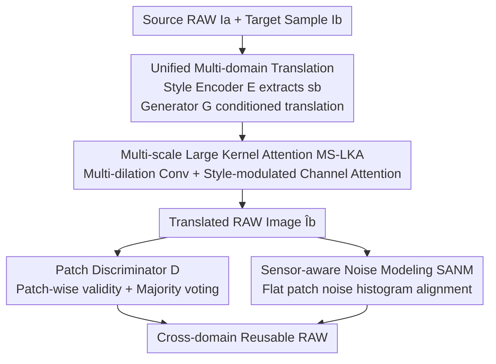

# MERIT: Multi-domain Efficient RAW Image Translation

**Conference**: CVPR 2026  
**Paper**: [CVF Open Access](https://openaccess.thecvf.com/content/CVPR2026/html/Huang_MERIT_Multi-domain_Efficient_RAW_Image_Translation_CVPR_2026_paper.html)  
**Code**: Available (Open-sourced per the paper, link to be confirmed)  
**Area**: Image Generation / RAW Image Translation / Cross-camera Domain Adaptation  
**Keywords**: RAW2RAW translation, multi-domain generation, sensor noise modeling, large-kernel attention, GAN

## TL;DR
MERIT is the first unified framework to achieve multi-camera RAW-to-RAW translation using a single model. By conditioning on style embeddings, it enables translation from any source domain to any target domain. It explicitly aligns Poisson-Gaussian noise statistics through sensor-aware noise modeling and enhances RAW feature representation with multi-scale large-kernel attention. The authors also release MDRAW, the first multi-domain RAW benchmark. MERIT outperforms previous methods in both image quality ($+5.56$ dB PSNR) and scalability (approx. 80% reduction in training iterations).

## Background & Motivation
**Background**: RAW data is increasingly adopted by downstream vision tasks (super-resolution, low-light imaging, detection, 3D reconstruction, etc.) because it preserves linear optical signals and a high dynamic range. However, spectral responses, noise characteristics, and tonal behaviors vary significantly across camera sensors. RAW images of the same scene captured by different devices exhibit different colors, dynamic ranges, and noise structures (Fig. 1a in the paper).

**Limitations of Prior Work**: To reuse a downstream model trained for a specific camera, RAW-to-RAW (RAW2RAW) translation is required to map other camera RAWs to the target domain. However, prior methods (e.g., Rawformer, Xie et al.) only learn **one-to-one** mappings. This requires training a separate model for each "source-to-target" pair. Supporting $n$ commercial cameras would require $O(n^2)$ models, leading to parameter and training cost explosions as the number of domains increases (Fig. 1e), which is not scalable.

**Key Challenge**: The root cause of cross-camera domain shift is the difference in camera spectral responses $R_c(\lambda)$ during the physical image formation process (imaging equation: $I(x)=\int_\omega R_c(\lambda)S(x,\lambda)L(\lambda)d\lambda$). A significant portion of domain-specific variation stems from **camera-dependent noise patterns**. Existing GAN methods rely on adversarial training to learn these characteristics implicitly, often failing to accurately reproduce the noise statistics of the target domain.

**Goal**: (1) Support multi-domain RAW2RAW translation for any domain pair with a single model; (2) Shift noise modeling from implicit learning to explicit modeling to improve translation fidelity; (3) Provide a standardized dataset for evaluating multi-domain RAW translation.

**Key Insight**: The authors observe the "physical modelability" of the RAW domain—noise follows a Poisson-Gaussian model and can be aligned using statistical measures. Simultaneously, since RAW signal and noise distributions vary across spatial scales and sensors, feature modeling requires both local detail preservation and long-range dependency capture.

**Core Idea**: Utilize style embedding conditioning within a single generator to achieve "one-to-many/many-to-many" translation, convert noise modeling from implicit to explicit, and use multi-scale large-kernel attention for domain-adaptive feature modulation.

## Method

### Overall Architecture
Let $X$ and $Y$ represent the sets of RAW images and RAW domains, respectively. Given an image $I_a$ from source domain $a$, the goal is to train a single generator $G$ to produce a corresponding RAW image $\hat I_b=G(I_a,s_b)$ for any target domain $b\in Y\setminus\{a\}$. The framework consists of three collaborative modules: a learnable **style encoder** $E$ extracts the domain style embedding $s_b=E(I_b)$ from target domain samples; the **generator** $G$ translates the image conditioned on the style embedding, with its upsampling path embedding Multi-Scale Large-Kernel Attention (MS-LKA); and a **patch discriminator** $D$ performs block-wise discrimination with a majority-voting mechanism for image-level conclusions. The system is constrained by a sensor-aware noise modeling loss alongside adversarial and cycle-consistency losses.

### Key Designs

**1. Unified Multi-domain Translation: Breaking the One-to-One Bottleneck**

Prior methods required training a separate model for each camera pair because the translation was tied to a fixed domain mapping. The authors use style encoder $E$ to encode "what the target domain is" into a domain-specific, content-independent style embedding $s_b=E(I_b)$ (any image from the same domain should yield a similar embedding). Generator $G$ then performs conditional generation $\hat I_b=G(I_a,s_b)$, allowing a single $G$ to convert between arbitrary pairs without requiring a reference image at inference. Discriminator $D$ uses patch-level adversarial training: the image is cropped into blocks, each judged independently, followed by **majority voting** for the final image-level decision, encouraging both global consistency and local realism. This design reduces the number of models from $O(n^2)$ to 1, providing the core scalability gain (approx. 80% fewer training iterations, 2× smaller footprint).

**2. Multi-scale Large Kernel Attention (MS-LKA): Domain-adaptive Feature Modeling**

RAW images contain spatially correlated illumination patterns, sensor-specific tones, and signal-dependent noise, requiring both global receptive fields and local structure preservation. Standard convolutions lack long-range dependencies, while Transformer self-attention is too expensive for high-resolution inputs. The authors extend large-kernel attention to a multi-scale version within the upsampling path of $G$: three parallel depth-wise convolutions with different dilation rates extract features $F_1, F_2, F_3$, which are concatenated and reduced via $1\times1$ convolution to $F_{concat}$. This is followed by **style-modulated channel attention**, where $s$ passes through a lightweight FFN to generate channel weights $A_s\in\mathbb{R}^C$, applied as $F_{out}=A_s\odot F_{concat}$. This allows $G$ to dynamically emphasize relevant channels based on the target sensor style, balancing multi-scale local details and long-range dependencies with minimal parameter overhead.

**3. Sensor-aware Noise Modeling (SANM): Explicit Statistical Alignment**

Unlike sRGB translation, RAW2RAW translation requires physical credibility; simply "looking real" is insufficient. Translated images must replicate sensor-specific noise statistics (especially at high ISO/low light). RAW data exists in the linear optical domain, where noise is approximated by the Poisson-Gaussian model: $\text{Var}(x)=\alpha\cdot z+\beta$ (where $\alpha$ represents signal-dependent shot noise and $\beta$ represents signal-independent readout noise). The goal is to align the "intensity-variance" dependency of the translated image with the target sensor. Specifically, the model extracts small non-overlapping patches and calculates the mean intensity and a robust variance estimate based on Median Absolute Deviation. To ensure the variance reflects sensor noise rather than texture, a **Sobel gradient magnitude** filter selects flat areas (only patches with gradients below a certain percentile threshold). Patches are then grouped into fixed-width intensity bins (e.g., 100 bins in $[0,1]$) to calculate the average variance per bin, forming the noise histogram $H_{fake}\in\mathbb{R}^{C\times B}$. Target domain histograms $H_{real}$ are pre-calculated and stored as look-up tables. The noise loss aligns the two: $L_{noise}=\tfrac{1}{BC}\sum_{c=1}^{C}\sum_{b=1}^{B}|H_{fake}[c,b]-H_{real}[c,b]|\cdot\mathbb{1}_{valid}[c,b]$, where $\mathbb{1}_{valid}$ masks empty bins. This differentiable loss is robust to image content and supported by physical noise models, ensuring the generator learns statistical noise behaviors.

### Loss & Training
The total loss is a weighted sum of five terms: $L_{total}=\lambda_1 L_{noise}+\lambda_2 L^D_{adv}+\lambda_3 L^G_{adv}+\lambda_4 L_{cycle\text{-}L1}+\lambda_5 L_{cycle\text{-}SSIM}$. The adversarial loss $L_{adv}$ enables $D$ to distinguish real/fake RAWs and $G$ to generate realistic target images. A style reconstruction loss $L_{style}=\mathbb{E}\|E(I_b)-E(G(I_a,E(I_b)))\|_1$ forces $G$ to utilize the style embedding. Cycle consistency $L_{cycle\text{-}L1}$ preserves content. Additionally, a **Cycle SSIM loss** $L_{cycle\text{-}SSIM}=\mathbb{E}[1-\text{SSIM}(I_a,G(G(I_a,E(I_b)),E(I_a)))]$ is introduced; the authors found that pixel-level L1 alone was insufficient to preserve texture and fine-grained sensor details in RAW. Training uses Adam ($\beta_1=0.9, \beta_2=0.99$), batch size 8, learning rate $1\times10^{-4}$, 200K iterations on a single NVIDIA H200 with $256\times256$ patches. At inference, a reference image from the training set is selected based on brightness similarity to extract the style embedding.

## Key Experimental Results

### Main Results
On public RAW-to-RAW mapping datasets (Samsung Galaxy S9 / iPhone X, 196 unpaired training + 115 paired test images), MERIT achieves SOTA under the unsupervised setting, leading in 5 out of 6 metrics.

| Direction | Metric | Ours (MERIT) | Prev. SOTA (Unsupervised) | Gain |
|------|------|------|----------|------|
| Samsung→iPhone | PSNR↑ | 35.29 | Rawformer 29.73 / Xie 29.73 ⚠️ | +5.56 dB |
| Samsung→iPhone | MAE↓ | 0.015 | Rawformer 0.023 | −0.008 |
| iPhone→Samsung | PSNR↑ | 31.90 | Rawformer 28.45 | +3.45 dB |
| iPhone→Samsung | MAE↓ | 0.021 | Rawformer 0.034 | −0.013 |

> ⚠️ Note: For the "Prev. SOTA," values for Rawformer (retrained by the authors) are used as the primary reference. While the semi-supervised method by Afifi et al. achieves 29.65/0.89 on Samsung→iPhone, it requires paired supervision; MERIT exceeds it without pairs.

### Cross-domain Scalability and the MDRAW Benchmark
The authors release **MDRAW**, the first multi-domain RAW benchmark featuring 5 different camera sensors (Samsung S23 Ultra, Huawei P30, iPhone 13 Pro, Nikon Z5, Canon EOS Rebel T6), with 519 unpaired + 285 paired (57 groups) RAW images. Evaluation uses an LoFTR-extended pipeline to extract pixel-aligned patches. Results on MDRAW (MAE / PSNR / SSIM / KL):

| Source→Target | MAE↓ | PSNR↑ | SSIM↑ | KL↓ |
|---------|------|-------|-------|-----|
| Samsung→Huawei | 0.026 | 30.77 | 0.77 | 1.53 |
| Samsung→iPhone | 0.026 | 31.15 | 0.78 | 1.46 |
| Samsung→Nikon | 0.036 | 29.11 | 0.75 | 1.64 |
| Huawei→iPhone | 0.033 | 29.20 | 0.77 | 2.38 |

Across 20 non-diagonal domain pairs, a single MERIT model covers all combinations. Compared to training per-pair models, MERIT significantly reduces parameters and training iterations as domains increase (approx. 80% iteration reduction, 2× smaller model).

### Key Findings
- **Explicit noise modeling is critical for image quality**: Replacing implicit adversarial learning with explicit SANM histogram alignment makes generated RAWs physically credible in noise-sensitive areas (high ISO/low light), contributing significantly to the +5.56 dB gain.
- **Single-model multi-domain translation enables scalability**: Reducing model count from $O(n^2)$ to 1 allows MERIT to become increasingly efficient as more camera domains are added.
- **Outperforming semi-supervised methods without paired data**: MERIT exceeds Afifi et al. (which requires paired supervision) despite being trained only on unpaired data, demonstrating the efficacy of combining style conditioning with physical noise priors.

## Highlights & Insights
- **Decoupling domain shift into explicit physical variables**: The authors identified that cross-camera shift is largely driven by noise patterns. By explicitly aligning them via Poisson-Gaussian models and histograms, they achieve more controllable results than standard adversarial losses—a strategy transferable to any low-level vision task requiring sensor fidelity.
- **Decoupling noise and texture via Sobel flat-region filtering**: Selecting low-gradient patches for variance estimation is a simple yet effective engineering trick to prevent texture from contaminating noise statistics.
- **Paradigm shift from $O(n^2)$ to a single model**: Moving from "model-as-mapping" to "model + domain condition" is a major conceptual shift with broad applicability in multi-domain translation.
- **Efficiency of MS-LKA**: Using multi-dilation large kernels with style modulation instead of self-attention provides a cost-effective way to achieve domain-adaptive feature modeling on high-resolution RAW data.

## Limitations & Future Work
- The noise modeling assumes the Poisson-Gaussian model holds; its accuracy for sensors with complex non-linear ISP preprocessing remains to be explored.
- Inference depends on finding a "brightness-matched" reference image for style extraction. If the training set lacks such samples, style embedding quality may degrade.
- Detailed ablation studies for individual components (SANM, MS-LKA, Cycle SSIM) are primarily located in the supplementary material, making independent quantitative verification higher-effort from the paper body alone.
- MDRAW's scale is still relatively small (519 unpaired + 285 paired images). Generalization across all commercial cameras remains an open challenge.
- Future Directions: Introducing more general/learnable noise models; implementing automatic reference selection or domain prototypes to replace brightness matching.

## Related Work & Insights
- **vs. Rawformer / Xie et al.**: These are one-to-one translations for specific camera pairs. MERIT is multi-domain and unified, exceeding them in 5/6 metrics while significantly reducing training and parameter overhead.
- **vs. CycleGAN / UVCGAN / CUT**: General translation methods rely on implicit adversarial/contrastive learning, failing to capture RAW sensor noise statistics. MERIT’s SANM improves fidelity through explicit alignment.
- **vs. Afifi et al. (Semi-supervised)**: Requires paired supervision. MERIT achieves higher performance without pairs, highlighting the data efficiency of physical noise priors.

## Rating
- Novelty: ⭐⭐⭐⭐ First unified multi-domain RAW2RAW + explicit noise histogram modeling.
- Experimental Thoroughness: ⭐⭐⭐⭐ Thorough evaluation on public and MDRAW sets, though full ablation tables are in the appendix.
- Writing Quality: ⭐⭐⭐⭐ Clear motivation, methodology, and benchmark loop.
- Value: ⭐⭐⭐⭐⭐ High utility for cross-camera RAW vision and significant ecological value with MDRAW.

<!-- RELATED:START -->

## Related Papers

- [\[CVPR 2026\] Decoupled Residual Denoising Diffusion Models for Unified and Data Efficient Image-to-Image Translation](decoupled_residual_denoising_diffusion_models_for_unified_and_data_efficient_ima.md)
- [\[CVPR 2026\] SynthRGB-T: Language-Vision Guided Image Translation for Diversity Synthesis](synthrgb-t_language-vision_guided_image_translation_for_diversity_synthesis.md)
- [\[CVPR 2026\] LaRP: Efficient Multi-View Inpainting with Latent Reprojection Priors](larp_efficient_multi-view_inpainting_with_latent_reprojection_priors.md)
- [\[CVPR 2026\] DBMSolver: A Training-free Diffusion Bridge Sampler for High-Quality Image-to-Image Translation](dbmsolver_a_training-free_diffusion_bridge_sampler_for_high-quality_image-to-ima.md)
- [\[CVPR 2026\] Scaling Multi-Identity Consistency for Image Customization via Multi-to-Multi Matching Paradigm](scaling_multi-identity_consistency_for_image_customization_via_multi-to-multi_ma.md)

<!-- RELATED:END -->
