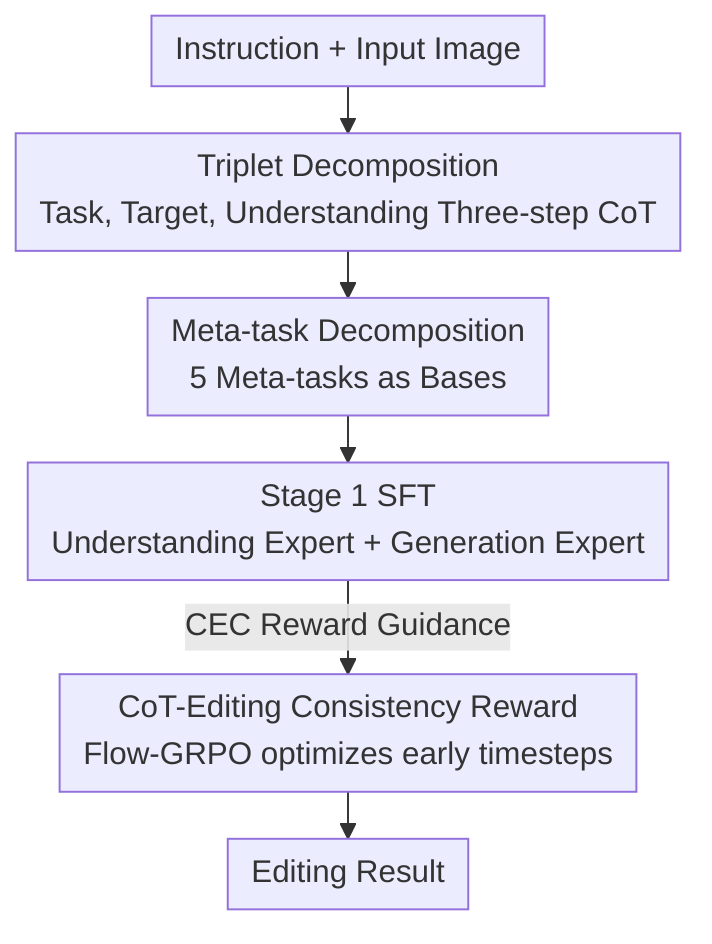

# Meta-CoT: Enhancing Granularity and Generalization in Image Editing

**Conference**: CVPR 2026  
**Paper**: [CVF Open Access](https://openaccess.thecvf.com/content/CVPR2026/html/Zhang_Meta-CoT_Enhancing_Granularity_and_Generalization_in_Image_Editing_CVPR_2026_paper.html)  
**Code**: Open-sourced (Paper states code/benchmark/model released, specific URL TBD)  
**Area**: Image Generation / Image Editing / Multimodal Reasoning  
**Keywords**: Instruct-guided Image Editing, Chain-of-Thought, Task Decomposition, Meta-task, Reinforcement Learning Alignment

## TL;DR
Addressing the dilemma where CoT in unified multimodal models for image editing is either "too vague" or "too specialized," Meta-CoT explicitly decomposes any single-image editing task into a triplet of "(Task, Target, Required Understanding)." It further breaks tasks down into 5 combinable "meta-task" bases and employs a "CoT-Editing Consistency" reward for RL alignment. This achieves a 15.8% overall improvement on a 21-category editing benchmark compared to a non-CoT baseline with the same data/parameters, generalizing to numerous unseen tasks by training on only 5 meta-tasks.

## Background & Motivation

**Background**: Unified "understanding + generation" multimodal models, such as Bagel and GoT, have started introducing Chain-of-Thought (CoT) into image editing—first reasoning about "what to change and how" through text before driving generation. This activates the model's understanding capabilities and improves instruction following.

**Limitations of Prior Work**: Existing editing CoTs lean toward two extremes. One is too general (e.g., Bagel's direct thinking), where reasoning is vague and fails to trigger fine-grained understanding. The other is too specialized (e.g., GoT inserting specific cues like bounding boxes into CoT), which performs well on specific tasks but fails on others like style transfer or perspective transformation—CoTs tailored for one form of understanding lack cross-task universality.

**Key Challenge**: There is a tension between "understanding granularity" and "cross-task generalization." The more specific the CoT (beneficial for a certain task's granularity), the less universal it becomes; the more universal it is, the less understanding granularity it evokes. The paper seeks to answer: **What CoT format and training strategy can simultaneously enhance both understanding granularity and generalization?**

**Goal**: ① Design a structured CoT for fine-grained reasoning about the task, target, and required understanding; ② Enable generalization to unseen tasks without training on all task types; ③ Resolve the discrepancy between CoT reasoning and the final editing results.

**Key Insight**: The authors observe that any single-image editing operation can be uniquely characterized by a triplet—`(Task, Target, Understanding)`. For example, "change the number of puppies to three" = Task "Quantity Modification" + Target "Puppy" + Understanding "Localization + Counting." Furthermore, all editing tasks can be composed of a few "atomic operations," much like bases in a vector space.

**Core Idea**: Use "Triplet Decomposition" to split editing instructions into task/target/understanding as independently supervised elements to enhance granularity. Then, use "Meta-task Decomposition" to represent tasks as combinations of 5 basic meta-tasks for generalization. Finally, use a consistency reward scored by a VLM to align CoT reasoning with the actual editing outcome.

## Method

### Overall Architecture
Meta-CoT does not change the model backbone (based on the unified multimodal model Bagel) but updates the "CoT format" and "training/alignment objectives." Given an input image and editing instruction, the first layer performs **Triplet Decomposition**—using a three-step CoT (task summary → task thinking → target traversal) to split the instruction into task and target, while incorporating diverse visual understanding tasks in the training data to complete the third element, understanding. The second layer performs **Meta-task Decomposition**—replacing "task summary" with "meta-task summary" and representing each task as a combination of 5 meta-tasks (Add, Remove, Replace, Camera Motion, Position Change). These decompositions are learned via Stage 1 SFT, followed by Stage 2 RL alignment using **CoT-Editing Consistency (CEC) Reward** via Flow-GRPO to align reasoning with results.

### Key Designs

**1. Triplet Decomposition: Separating Task, Target, and Understanding**

To address "insufficient CoT granularity," the paper theoretically justifies the decomposition: let the original CoT space be $T$ and the triplet space $S_{\text{triplet}} = T_1 \times T_2 \times T_3$ (task/target/understanding). Using $H = \log|\text{space}|$ for space complexity (entropy), it is proved that $H(T_1,T_2,T_3) = \log|S_{\text{triplet}}| < \log|T| = H(T)$, meaning decomposition reduces editing complexity. Furthermore, defining granularity $G = \frac{I(T; X_{\text{tgt}})}{H(T)}$ (where $X_{\text{tgt}}$ is the target image), it is proved that $G(T_1,T_2,T_3) > G(T)$, indicating that decomposed CoT has higher granularity than classic CoT.

In practice, Triplet Decomposition follows three steps: **(1) Task Summary**—summarizing the task type from the instruction; **(2) Task Thinking**—generating specialized reasoning based on the task type (e.g., visual attributes for style transfer, appearing/disappearing objects for camera motion); **(3) Target Editing Mode Traversal**—iterating through all targets in the image to decide "whether and how to change," ensuring spatial and semantic consistency. Since understanding cannot be learned directly from text, **diverse visual understanding data** (localization, counting, OCR, spatial reasoning) is mixed into training.

**2. Meta-task Decomposition: Atomic Operations for Cross-task Generalization**

While triplets handle granularity, generalization requires solving the need for exhaustive task coverage. The authors identify a set of universal atomic operations—**meta-tasks**, analogous to bases in a vector space. Formally, a set $B=\{t_1,\dots,t_n\}$ is a basis for task space $T$ if $\forall T\in\mathcal{T},\ \exists t_{i_1},\dots,t_{i_k}\in B$ such that $T = t_{i_1}\circ t_{i_2}\circ\cdots\circ t_{i_k}$. In practice, **5 meta-tasks** are defined (Add / Remove / Replace / Camera Motion / Position Change). The "Task Summary" is replaced by a "Meta-task Summary," breaking instructions into meta-task combinations. For example, "Style Transfer" = a "Replace" operation on style attributes. By **training only on these 5 meta-tasks**, the model generalizes to complex unseen tasks.

**3. CoT-Editing Consistency (CEC) Reward: Aligning "Thinking" with "Doing" via RL**

A common failure mode is the model reasoning correctly in CoT but failing to follow it in the final edit. The **CEC Reward** uses a VLM (Qwen2.5-VL) to evaluate whether the result aligns with the CoT's task and target perspectives, scoring from 0–10. Before deployment, correlation calibration is performed: 500 samples are annotated by humans, and the VLM prompt is iteratively adjusted until the Pearson correlation $r\ge 0.8$ and Mean Absolute Error $\epsilon_{\text{MAE}}\le 2.5$. **Flow-GRPO** then optimizes the model using the CEC reward, specifically targeting **early denoising timesteps** (crucial for semantic fidelity), which empirically helps suppress noise artifacts introduced by Flow-GRPO.

### Loss & Training
Two-stage training: **Stage 1 SFT** tunes both understanding and generation experts on 1.5M "Image-Instruction-CoT" data + 100k understanding data for 10k steps (48 GPUs). **Stage 2 RL** freezes the understanding encoder and tunes the generation expert on an additional 20k editing data using Flow-GRPO + CEC Reward for 500 steps (32 GPUs). This prevents divergence and preserves the reasoning capabilities learned during SFT. Data is generated using Qwen2.5/Gemini and verified for consistency.

## Key Experimental Results

### Main Results
Evaluation is conducted on a self-built 21-category benchmark (11 from GEdit-Bench, 4 logic-related from RiseBench, multi-instruction from ComplexEdit, and 5 new categories) using VIEScore's Overall Score (0–10) via GPT-4.1. ImgEdit (9 categories, 734 real samples) is also used.

| Setting | 21-Category Overall ↑ | ImgEdit Overall ↑ |
|------|-----------------------|-------------------|
| Bagel (w/o think) | 5.673 | 3.20 |
| Bagel (w/ think) | 5.307 | 3.39 |
| Train Editing Only (Same data/params, no Meta-CoT) | 5.538 | — |
| SFT (Meta-CoT) | 6.224 | — |
| **Meta-CoT + RL (Ours)** | **6.415** | **3.83** |

Compared to the Train-Editing-Only baseline, the overall improvement is **15.8%**. On ImgEdit, the gain over the base for Quantity Modification is +25.9% and Action is +17.2%.

### Ablation Study

| Configuration | Ins. (Following) | Con. (Consist.) | Nat. (Natural) | Art. (Artifact) | Note |
|------|------|------|------|------|------|
| Train Editing Only | 6.61 | 8.22 | 7.18 | 8.06 | Baseline |
| SFT (3 meta) | 6.75 | 8.33 | 7.15 | 7.86 | add/del/replace only |
| SFT (5 meta) | 7.09 | 8.48 | 7.20 | 8.10 | 5 meta-tasks only |
| SFT (5 meta, full-task) | 7.20 | 8.49 | 7.23 | 8.12 | 5 definitions + all tasks |
| SFT (Meta-CoT) | 7.23 | 8.53 | 7.26 | 8.25 | Full SFT |
| **SFT + RL (Ours)** | **7.44** | **8.53** | **7.31** | **8.34** | With CEC Reward |

### Key Findings
- **Generalization is Cost-Effective**: Training only on 5 meta-tasks (SFT(5 meta) Ins=7.09) performs nearly as well as full-task training (7.20), validating the "meta-task as basis" hypothesis.
- **CEC Reward Gains focus on Instruction Following**: RL primarily boosts the "Ins." metric (from 7.23 to 7.44), showing that alignment improves execution rather than just image quality.
- **"Task Thinking" is Essential**: Removing this step drops the Ins. score from 7.23 to 6.98.

## Highlights & Insights
- **Clean Abstractions**: The definitions of "Editing = Triplet" and "Task = Meta-task Combination" provide a structured way to supervise vague intentions, moving CoT design from heuristic prompting to principled decomposition.
- **Optimizing Early Denoising Steps**: Since semantic alignment is determined early in the diffusion process, limiting Flow-GRPO to early steps effectively targets alignment while avoiding artifacts.
- **Reward Model Calibration**: Performing human-VLM correlation calibration ($r \ge 0.8$) before RL is a rigorous practice that ensures the validity of the reward signal.

## Limitations & Future Work
- **Performance Drop in Text Editing**: This was the only task that regressed, likely because long text reasoning interfered with pinpointing the text to be modified.
- **Heavily Dependent on LLM Ecosystem**: Data construction, rewards, and evaluation rely on models like Qwen2.5-VL and GPT-4.1, potentially introducing unquantified biases.
- **Completeness of 5 Meta-tasks**: While sufficient for general single-image editing, a larger or different set of bases might be needed for specialized domains (e.g., medical imaging or CAD).

## Related Work & Insights
- **vs Bagel**: Meta-CoT improves Bagel's "generic thinking" (Overall 5.307) to 6.415 by providing structure, proving that the structure of thinking matters more than the capacity to think.
- **vs GoT**: Unlike GoT, which embeds specific cues like boxes (tailored for localization), Meta-CoT's meta-task bases ensure cross-task universality for disparate tasks like style transfer.
- **vs Direct Training**: Outperforming a non-CoT model with identical data by 15.8% proves the gains stem from the CoT structure and training strategy rather than just scale.

## Rating
- Novelty: ⭐⭐⭐⭐ The triplet/basis abstraction is elegant and theoretically grounded.
- Experimental Thoroughness: ⭐⭐⭐⭐ Comprehensive benchmarking and multi-dimensional ablation; however, it lacks human evaluation for the main results.
- Writing Quality: ⭐⭐⭐⭐ Clear logic across motivation, decomposition, and alignment.
- Value: ⭐⭐⭐⭐ The ability to generalize from few meta-tasks has high practical significance for reducing data costs.

<!-- RELATED:START -->

## Related Papers

- [\[ICML 2026\] Semantic Granularity Navigation in Image Editing](../../ICML2026/image_generation/semantic_granularity_navigation_in_image_editing.md)
- [\[CVPR 2026\] Generative Modeling of Weights: Generalization or Memorization?](generative_modeling_of_weights_generalization_or_memorization.md)
- [\[CVPR 2026\] UniGen-1.5: Enhancing Image Generation and Editing through Reward Unification in RL](unigen-15_enhancing_image_generation_and_editing_through_reward_unification_in_r.md)
- [\[AAAI 2026\] UNSEEN: Enhancing Dataset Pruning from a Generalization Perspective](../../AAAI2026/image_generation/unseen_enhancing_dataset_pruning_from_a_generalization_perspective.md)
- [\[CVPR 2026\] I2I-Bench: A Comprehensive Benchmark Suite for Image-to-Image Editing Models](i2i-bench_a_comprehensive_benchmark_suite_for_image-to-image_editing_models.md)

<!-- RELATED:END -->
