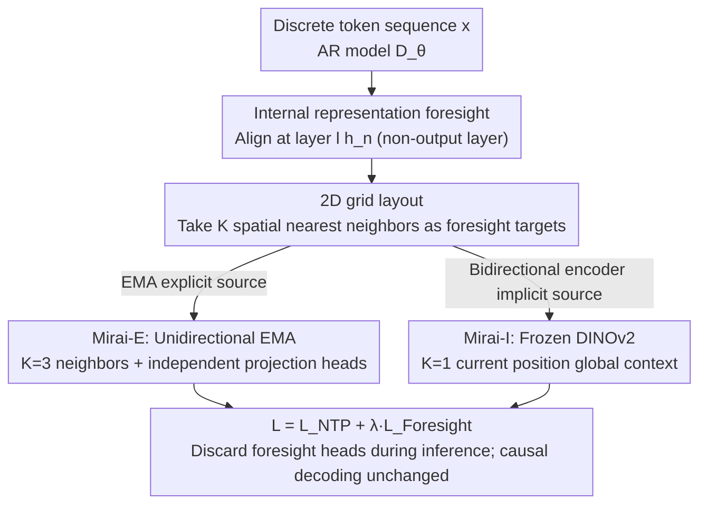

# Mirai: Autoregressive Visual Generation Needs Foresight

**Conference**: CVPR 2026  
**Paper**: [CVF Open Access](https://openaccess.thecvf.com/content/CVPR2026/html/Yu_Mirai_Autoregressive_Visual_Generation_Needs_Foresight_CVPR_2026_paper.html)  
**Code**: Available (Project page https://y0uroy.github.io/Mirai )  
**Area**: Image Generation / Autoregressive Generation / Representation Alignment  
**Keywords**: Autoregressive Visual Generation, Foresight Signals, Representation Alignment, 2D Grid, Training Acceleration

## TL;DR
Autoregressive (AR) image generators model sequences token-by-token causally, looking only at the "next token," which leads to disordered global structures and slow convergence. This paper proposes Mirai, which introduces an additional "foresight" signal during training. It aligns the intermediate layer representations of the AR model on a **2D grid** with the representations of future tokens (either explicit foresight Mirai-E from EMA or implicit foresight Mirai-I from a frozen bidirectional DINOv2 encoder). Without altering the architecture or increasing inference overhead, it accelerates the convergence of LlamaGen-B by up to 10× and reduces the FID from 5.34 to 4.34.

## Background & Motivation
**Background**: AR visual generation serializes images into discrete tokens according to raster order and generates them step-by-step using strictly causal "Next Token Prediction (NTP)." It models the joint distribution $p_\theta(x)=\prod_{n=1}^N p_\theta(x_n\mid x_{<n})$, where the training objective is the NTP loss $\mathcal{L}_{\text{NTP}}=-\mathbb{E}\big[\tfrac1N\sum_n\log p_\theta(x_n\mid x_{<n})\big]$. Works like LlamaGen have proven that pure GPT-style AR can approach or even exceed diffusion models when scaled sufficiently.

**Limitations of Prior Work**: While strictly causal "token-by-token teacher forcing" works well for language, visual tokens inherently depend on **bidirectional and long-range** contexts. Local supervision that looks only at the next token causes global cues to propagate only after many AR steps, resulting in outputs that are "locally plausible but globally misaligned"—as shown in Figure 1, the baseline generates parrots with distorted poses and disconnected heads, or rocket launch scenes with misaligned smoke.

**Key Challenge**: Causal token-by-token decoding must be maintained during inference (the foundation of the AR paradigm), but pure causal supervision during training lacks "global planning signals," leading to slow convergence and global incoherence. Multi-token prediction (MTP) in language attempts finite foresight, but directly applying it to vision introduces gradient conflicts that degrade performance.

**Goal**: Inject "future information" during training to allow hidden states to learn to plan global structures in advance, **without changing the architecture or increasing inference overhead**. This is decomposed into three sub-problems: At which layer is the foresight signal injected? Should it be placed on a 1D sequence or a 2D grid? Where does the foresight signal come from?

**Key Insight**: The authors perform controlled diagnostic experiments along three axes: injection level, foresight layout, and foresight source. They find a common pattern: **aligning foresight with the internal representations of the AR model and placing them on a 2D grid strengthens causal modeling**.

**Core Idea**: Foresight is not a violation of causality but a catalyst for learning it. This is achieved by replacing "output layer multi-token prediction" with foresight supervision using "internal representations + 2D grid alignment," providing two sources of foresight: EMA (explicit) and bidirectional encoders (implicit).

## Method

### Overall Architecture
Mirai is a **training-time auxiliary supervision framework**. It adds a "foresight alignment loss" to the original NTP loss, making the total loss $\mathcal{L}_{\text{Mirai}}=\mathcal{L}_{\text{NTP}}+\lambda\,\mathcal{L}_{\text{Foresight}}$. Given the hidden state $h_n=D_\theta^{[:l]}(x_{<n})$ at position $n$ and layer $l$ of the AR model, a foresight encoder $R$ produces several "future target representations" $f_n=\{f_n^{[k]}\}_{k=1}^K$ for that position. The alignment loss maximizes the cosine similarity between $h_n$ (after being mapped by a lightweight projection head $\rho_k$ to the same dimension) and $f_n^{[k]}$:

$$\mathcal{L}_{\text{Foresight}}=-\mathbb{E}\Big[\tfrac{1}{NK}\sum_{n=1}^{N}\sum_{k=1}^{K}\mathrm{sim}\big(f_n^{[k]},\,\rho_k(h_n)\big)\Big].$$

Three key choices are made: injecting into **intermediate layers** (not the output layer), selecting future positions based on **2D grid nearest neighbors** (not 1D scanning order), and using EMA (Mirai-E, explicit) or a frozen bidirectional encoder (Mirai-I, implicit) as foresight sources. During inference, all projection heads and foresight encoders are discarded, and decoding reverts to standard causal token-by-token processing, keeping the computational cost identical to the baseline.

### Key Designs

**1. Internal Representation Alignment: Avoiding Gradient Conflicts in Output Layer MTP**

The pain point is "how to inject future information without destroying NTP." A naive approach is to use the next $K$ tokens as foresight targets and perform multi-token cross-entropy prediction at the final layer $l=L$—essentially MTP. The authors find this **actually performs worse than the baseline**: the same hidden state must support the current next-token prediction while predicting multiple more difficult future tokens in a discrete space, creating "objective competition" and harmful gradient interference. Mirai instead uses foresight only to **supervise intermediate layer representations** ($0<l<L$): rather than forcing the model to "emit" future tokens, its hidden state $h_n$ is **aligned** with future representations $f_n$. This exposes structured future information while decoupling alignment parameters from NTP, allowing the backbone to focus on next-token prediction. Experiments (Tab.1) show that for $K=3$, 2D alignment in internal layers achieves an FID of 5.22, whereas 1D alignment in the output layer worsens it to 7.28 (baseline is 6.36).

**2. 2D Grid Layout: Respecting Image Geometry**

The difficulty lies in "how to select future tokens." Traditional methods take the next $K$ tokens in raster scan order, i.e., the 1D neighborhood $\mathcal{N}^{1D}_K(n)=\{n,n+1,\dots,n+K-1\}$. However, adjacent tokens in scanning order may be spatially unrelated in the image. The authors switch to a 2D strategy: taking $K$ spatial nearest neighbors based on image grid coordinates $q_n$, $\mathcal{N}^{2D}_K(n)=\arg\mathrm{topK}\big(-\lVert q_n-q_j\rVert_2\big)$. Tab.1 demonstrates that 2D alignment consistently outperforms 1D across various values of $K$ (e.g., for $K=3$ internal layer, 2D 5.22 vs 1D 6.20). The intuition is that the utility of foresight in visual AR depends not only on "what information is injected" but also "where it is placed on the 2D token grid"; spatial structure provides more coherent geometric supervision, encouraging consistent local neighborhoods in internal representations (confirmed by smoother t-SNE color field visualizations of layer 8 features).

**3. Mirai-E: Explicit Foresight from Unidirectional EMA**

In this branch, the foresight encoder $R_\phi$ is the Exponential Moving Average (EMA, $\phi\leftarrow\tau\phi+(1-\tau)\theta$, $\tau=0.9999$, enabled after a 15-epoch warm-up) of the first $l$ layers $D_\theta^{[:l]}$ of the AR decoder. Since the EMA is a **unidirectional** architecture, each foresight token carries clear positional meaning (explicit lookahead), compatible with causal decoding. The authors assign an independent projection head $\rho_k$ (indexed by grid distance) to each of the $K$ future positions in the 2D neighborhood to map $h_n$ to the representation space of the $j$-th future target. Independent heads "explicitly spatialized" the supervision—each hidden state maps to $K$ specific future positions rather than a pooled signal. $K=3$ performs best (online EMA and AR update jointly; too many foresight tokens cause gradient conflicts). If a static EMA from a pre-trained LlamaGen-B is used, $K=9$ becomes optimal (static supervision requires more offsets to cover spatial diversity).

**4. Mirai-I: Implicit Foresight from a Frozen Bidirectional Encoder**

This branch uses a pre-trained **bidirectional** visual encoder (default DINOv2-B) as $R_\phi$ to extract features $f_n=R_\phi(X)_n$ from the full image $X$. Because bidirectional self-attention aggregates global context, the output of each token already **implicitly** encodes future information. The AR hidden state $h_n$ is aligned via a lightweight projection head $\rho$ to the foresight feature $f_n$ at the **same position** (keeping $R_\phi$ frozen). Diagnostic tests with block-causal masks show that restricting the future context visible to the encoder (smaller block size) monotonically degrades generation quality, while full bidirectionality is best—proving that "implicit foresight" is indeed the source of quality. In this branch, $K=1$ (aligning only the current position) is optimal: each DINOv2 token already contains sufficient foresight, and extra neighbors interfere with this context.

### Loss & Training
The total loss is $\mathcal{L}_{\text{Mirai}}=\mathcal{L}_{\text{NTP}}+\lambda\mathcal{L}_{\text{Foresight}}$, using cosine similarity for alignment. The alignment layer is chosen as **layer 8/12** of LlamaGen-B (intermediate layers have the most universal semantics; relative depth is maintained for larger models). The coefficient $\lambda$ uses a **stepped schedule**: decreasing from 2 to 1 halfway through training (strong foresight regularization early on helps build global structure, while weakening it later avoids over-regularization). Optimizer: AdamW, constant learning rate $10^{-4}$, batch size 256. Inference uses CFG (guidance scale 2.0 for LlamaGen-B) and temperature 1.0.

## Key Experimental Results

### Main Results (System-Level Comparison, ImageNet 256×256, 300 epochs)

| Model | Params | FID↓ | sFID↓ | IS↑ |
|-------|--------|------|-------|-----|
| LlamaGen-B | 111M | 5.34 | 6.93 | 215.7 |
| + Mirai-I | 111M | **4.34** | 7.13 | 226.8 |
| + Mirai-E | 111M | 4.49 | 6.78 | 225.7 |
| LlamaGen-L | 343M | 3.73 | 6.68 | 256.4 |
| + Mirai-I | 343M | **3.07** | 6.72 | 263.7 |
| LlamaGen-XL | 775M | 3.16 | 6.55 | 293.6 |
| + Mirai-I | 775M | **2.59** | 6.60 | 286.9 |

Mirai-I achieves an FID of 2.59 on XL, outperforming all AR-based methods (VQGAN 15.78, ViT-VQGAN 4.17, RQ-Transformer 7.55).

### Ablation Study (Injection Level × Layout, LlamaGen-B, 80 epochs, Tab.1)

| Injection | Layout | $K$ | FID↓ | IS↑ |
|-----------|--------|-----|------|-----|
| baseline | – | – | 6.36 | 185.54 |
| Output | 1D | 3 | 7.28 | 163.31 |
| Output | 2D | 3 | 6.48 | 185.57 |
| Internal | 1D | 3 | 6.20 | 176.36 |
| Internal | 2D | 3 | **5.22** | 197.14 |

### Key Findings
- **Injection level is most critical**: 1D foresight at the output layer (naive MTP) is worse than the baseline (7.28 vs 6.36), whereas switching to 2D at internal layers drops it to 5.22—confirming the "objective competition" hypothesis; supervising representations instead of discrete tokens is key.
- **Intermediate layers are best for alignment**: Tab.2 shows layer 8 is optimal (Mirai-I 4.77, Mirai-E 5.22); shallow layers focus on visual primitives, while deep layers focus on next-token prediction.
- **Optimal $K$ depends on source**: $K=1$ is best for Mirai-I (bidirectional), $K=3$ for Mirai-E (online EMA), and $K=9$ for Mirai-E (pre-trained EMA).
- **Encoder selection**: DINOv2-B is best in Tab.4 (FID 4.77, 80 epochs), DINOv3-B 5.02, while MAE-B is only 6.34 (pixel reconstruction models are unsuitable foresight sources).
- **Significant convergence acceleration**: Mirai-I at 40 epochs or Mirai-E at 80 epochs matches the FID of the baseline at 400 epochs, roughly a **10× / 5×** speedup.

## Highlights & Insights
- **"Foresight is not a violation of causality but a catalyst for learning it"** is the most elegant insight: peeking at the future during training while remaining strictly causal during inference grants global planning capabilities with zero inference overhead.
- **Three-axis diagnostic methodology** (Injection level / 1D vs 2D / Explicit vs Implicit) cleanly deconstructs how to inject foresight, providing reusable conclusions: representation-level + 2D + appropriate source.
- **2D Grid Alignment** explicitly introduces "2D image geometry" into 1D AR sequence training. t-SNE visualizations prove that internal representations become more spatially organized, a trick applicable to any raster-order AR visual model.
- **Flexible Foresight Sources**: Self-distillation EMA (no external model needed, explicit positions) and frozen DINOv2 (strong global context, implicit) offer choices for different compute/data constraints.

## Limitations & Future Work
- **Mirai-I relies on external pre-trained encoders** (DINOv2), introducing additional training-time overhead and dependency on encoder quality; gains are minimal if the encoder does not match the target domain (e.g., MAE).
- **Validation is limited** to ImageNet class-conditional generation and LlamaGen; it hasn't yet covered text-to-image, larger vocabularies/resolutions, or non-LlamaGen architectures.
- **Hyperparameter sensitivity**: Alignment layer, $\lambda$ schedule, and $K$ must be tuned based on the source (Mirai-E is particularly sensitive to $\lambda$), requiring search for new models.
- **Future Directions**: Extending 2D foresight to video/3D tokens, exploring learnable foresight encoders, or combining with MTP inference acceleration to speed up sampling while maintaining quality.

## Related Work & Insights
- **vs MTP [13,24]**: MTP predicts multiple future tokens at the output layer, which this paper shows is harmful for visual AR; Mirai uses internal representation alignment and spatializes/indexes the foresight.
- **vs REPA [50]**: REPA distills pre-trained semantic features of the current image for diffusion/bidirectional generators; Mirai's supervision is causal in both time and position, specifically designed for strictly causal AR.
- **vs LlamaGen [38]**: Using the same AR backbone and settings, Mirai reduces FID (B: 5.34→4.34, XL: 3.16→2.59) with zero extra inference cost by adding a single foresight alignment term during training.
- **vs Diffusion/Masked AR (DiT, MaskGIT, VAR)**: Mirai maintains the pure causal AR paradigm while pushing XL FID to 2.59, narrowing the gap with diffusion models (DiT-XL 2.27).

## Rating
- Novelty: ⭐⭐⭐⭐⭐ "Training-time foresight + 2D representation alignment" is a fresh perspective with clear diagnostic conclusions.
- Experimental Thoroughness: ⭐⭐⭐⭐ Three model scales and extensive ablations, though limited to ImageNet and LlamaGen.
- Writing Quality: ⭐⭐⭐⭐ Clear chain of logic (motivation—diagnosis—method) with good formulas and visualizations.
- Value: ⭐⭐⭐⭐⭐ Highly practical for AR visual generation: 10× acceleration and quality improvement with zero inference overhead.

<!-- RELATED:START -->

## Related Papers

- [\[CVPR 2026\] DPAR: Dynamic Patchification for Efficient Autoregressive Visual Generation](dpar_dynamic_patchification_for_efficient_autoregressive_visual_generation.md)
- [\[CVPR 2026\] Markovian Scale Prediction: A New Era of Visual Autoregressive Generation](markovian_scale_prediction_a_new_era_of_visual_autoregressive_generation.md)
- [\[CVPR 2026\] FVAR: Next-Focus Prediction for Visual Autoregressive Modeling](fvar_next-focus_prediction_for_visual_autoregressive_modeling.md)
- [\[CVPR 2026\] SparVAR: Exploring Sparsity in Visual Autoregressive Modeling for Training-Free Acceleration](sparvar_exploring_sparsity_in_visual_autoregressive_modeling_for_training-free_a.md)
- [\[ICCV 2025\] Randomized Autoregressive Visual Generation](../../ICCV2025/image_generation/randomized_autoregressive_visual_generation.md)

<!-- RELATED:END -->
