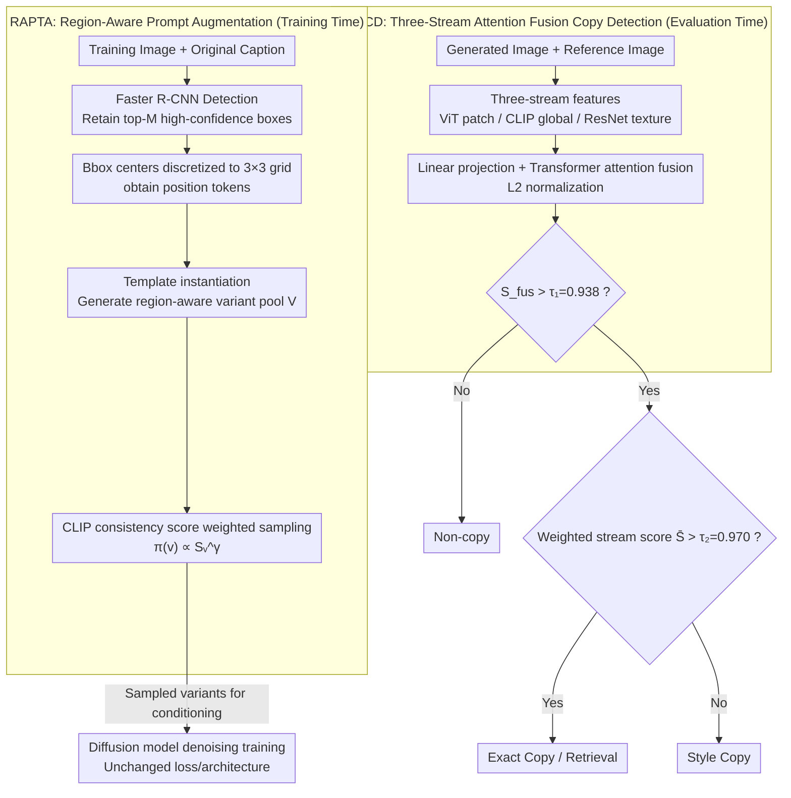

# Mitigating Memorization in Text-to-Image Diffusion via Region-Aware Prompt Augmentation and Multimodal Copy Detection

**Conference**: CVPR 2026  
**arXiv**: [2603.13070](https://arxiv.org/abs/2603.13070)  
**Code**: None  
**Area**: Image Generation  
**Keywords**: Diffusion model memorization, training-time prompt augmentation, multimodal copy detection, copyright protection, attention fusion

## TL;DR

This paper proposes two complementary modules: Region-Aware Prompt Augmentation (RAPTA) for training and Attention-Driven Multimodal Copy Detection (ADMCD). The former mitigates memorization of training data by generating semantically grounded prompt variants via object detector proposals during training. The latter achieves training-free copy detection and classification by fusing patch-level, CLIP, and texture features. On LAION-10k, these methods reduce the copy rate from 7.4% to 2.6%.

## Background & Motivation

**Background**: Text-to-image diffusion models (such as Stable Diffusion) demonstrate excellent generation quality but suffer from significant training data memorization. Models may replicate training images or imitate specific styles, leading to copyright infringement and privacy risks.

**Limitations of Prior Work**:

1. Inference-time perturbation methods (random token insertion, BLIP rewriting, CLIP embedding noise) reduce replication but degrade prompt-image alignment and do not address the root cause during training.
2. Single detection metrics (SSIM, LPIPS, CLIP cosine) are biased: LPIPS favors texture, ORB favors keypoints, and SSIM favors structure. They fail to distinguish between exact replication and style imitation.
3. There is a lack of large-scale annotated datasets targeting diffusion model replication behaviors to train detectors.

**Key Challenge**: Large model capacity + strong text-image alignment + excessive dependence on training-time caption-image pairs → Memorization is a training-time issue, yet existing mitigation strategies primarily focus on inference.

**Goal**: An end-to-end solution for mitigating memorization during training and reliably detecting/classifying replication behaviors during evaluation.

**Key Insight**: Break the one-to-one caption dependency using object detection-driven semantic prompt augmentation during training; employ multimodal attention fusion for robust copy detection during inference.

**Core Idea**: Replace fixed captions with region-aware prompt variants for training and utilize three-stream attention fusion instead of single metrics for detection.

## Method

### Overall Architecture

The authors treat diffusion model memorization as a complete chain from "training-time cause" to "evaluation-time effect," proposing two independent modules. RAPTA operates during the training phase: for each training image, a Faster R-CNN detects salient regions and generates a pool of prompt variants with positional information. After weighted sampling via CLIP consistency scores, these variants are used for conditioning, breaking the rigid binding where "one image always pairs with the same caption." ADMCD operates during the inference/evaluation phase: it extracts three-stream features (ViT patches, CLIP global, and ResNet textures), fuses them using Transformer attention after linear projection, and uses dual thresholds to determine if an image is a copy and whether it is an exact replication or style imitation.

### Key Designs

**1. RAPTA: Breaking one-to-one caption-image dependency via region-aware variants**

The root cause of memorization is that the model repeatedly sees the same image paired with a fixed caption, memorizing the mapping. RAPTA runs a pre-trained Faster R-CNN on each training image, retains top-M high-confidence ($S_i > \tau_b$) boxes, and discretizes centers into a $3\times3$ grid to obtain position tokens (e.g., top-left, center, bottom-right). This avoids combinatorial explosion from continuous coordinates. Templates like "p, with a ⟨c⟩ in the ⟨pos⟩" generate variants. The pool $V = \{original\_prompt\} \cup \{template\_instantiations\}$ is normalized into a sampling distribution $\pi(v)$ based on CLIP consistency scores $S_v = \cos(f_I, f_v)$ weighted by $w_v = S_v^\gamma$. In each iteration, a variant $\tilde p \sim \pi(\cdot)$ is sampled for conditioning. The descriptions vary but remain semantically consistent. The loss function remains $\mathcal{L}_{\text{diff}} = \mathbb{E}[\|\epsilon - \epsilon_\theta(x_t, t, e)\|^2]$, with $e$ derived from the sampled variant, requiring no architectural changes or extra loss.

**2. ADMCD: Three-stream attention fusion for robust copy detection**

Single metrics are biased (LPIPS toward texture, ORB toward keypoints, SSIM toward structure), failing to distinguish exact copies from style imitations or resist image perturbations. ADMCD extracts three features: $f_{\text{vis}}$ (ViT patch-level), $f_{\text{clip}}$ (CLIP global semantic), and $f_{\text{tex}}$ (ResNet texture). After linear projection and Transformer encoder attention fusion, L2 normalization yields $\hat{f}_{\text{fus}}$. Detection involves two stages: first, fusion similarity $S_{\text{fus}} = \cos(\hat{f}_{\text{fus}}(G), \hat{f}_{\text{fus}}(R)) > \tau_1 = 0.938$ identifies a Copy. If it is a copy, a weighted score $\bar{S} = 0.24 \cdot S_{\text{vis}} + 0.38 \cdot S_{\text{clip}} + 0.38 \cdot S_{\text{tex}} > \tau_2 = 0.970$ classifies it as an Exact Copy; otherwise, it is a Style Copy. Thresholds and weights are determined via validation set scanning, allowing training-free deployment.

Due to the complementarity of the streams, ADMCD serves as a general robust similarity measure. Under 10 common attacks (Gaussian noise, blur, salt-and-pepper, occlusion, rotation, flipping, cropping), its fusion similarity remains stable at 0.748–0.974, whereas LPIPS/ORB/SSIM fluctuate severely. The three streams compensate for each other: when LPIPS fails due to brightness sensitivity, CLIP and texture compensate; if ORB keypoints are sparse, patch features provide support.

### Loss & Training

RAPTA introduces no additional loss, using the standard diffusion denoising objective where conditioning comes from sampled variants. ADMCD parameters—$\tau_1=0.938$ (F1 peak), $\tau_2=0.970$ (validated by 5 annotators), and weights $(0.24, 0.38, 0.38)$—are all fixed from the validation set without training downstream modules.

## Key Experimental Results

### Main Results

| Method | Copy Rate↓ | FID↓ | CLIP Score↑ | KID↓ |
|------|-----------|------|------------|------|
| DCR | 3.2 | 7.9 | 30.5 | 2.9 |
| LDM-T2I | 5.3 | 10.4 | 33.2 | 3.1 |
| SD2.1-base | 7.4 | 8.3 | 27.8 | 3.3 |
| **RAPTA (Ours)** | **2.6** | 8.1 | 23.1 | **1.6** |

### Robustness Results (Similarity Stability under Attack)

| Method | Original | Gaussian Noise | Gaussian Blur | Poisson | Salt & Pepper | Speckle |
|------|------|---------|---------|------|------|------|
| LPIPS↓ | 0.233 | 0.444 | 0.335 | 0.375 | 0.612 | 0.569 |
| SSCD | 0.680 | 0.594 | 0.443 | 0.429 | 0.485 | 0.407 |
| DreamSim | 0.857 | 0.781 | 0.714 | 0.691 | 0.689 | 0.707 |
| **ADMCD** | **0.974** | **0.923** | **0.940** | **0.929** | **0.871** | **0.894** |

### Key Findings

- RAPTA reduces the Copy Rate from 7.4 (SD2.1) to 2.6 (-64.9%), while KID drops from 3.3 to 1.6 (-51.5%).
- CLIP Score decreases from 27.8 to 23.1, indicating a trade-off between mitigating memorization and text alignment.
- ADMCD achieves the highest similarity and lowest fluctuation across all attack types (0.871-0.974 vs. DreamSim's 0.689-0.857).
- In Top-5 retrieval, ADMCD provides the most stable ranking; the score of the nearest neighbor (0.959) is significantly higher than the second-nearest (0.859), unlike DreamSim.

## Highlights & Insights

- The training-time augmentation strategy is efficient: it requires no changes to architecture or loss, only replacing conditioning embeddings per iteration.
- The three-stream attention fusion detector is versatile and can be adapted for any task requiring robust image similarity metrics.
- The detector is training-free, relying on pre-trained features and calculated thresholds rather than annotated training data.
- Discrete 3×3 grid positioning is a practical trick to avoid coordinate explosion while providing sufficient spatial information.

## Limitations & Future Work

- The evaluation set is small (1200 pairs) and imbalanced (only ~25 retrieve/exact copies).
- The copy rate on LAION-10k may underestimate real-world memorization levels (admitted by the authors).
- RAPTA depends on the quality of the pre-trained detector; it fails to generate meaningful variants if the detector fails on certain image types.
- The significant drop in CLIP Score (27.8→23.1) highlights an inherent conflict between reducing memorization and maintaining text alignment.
- The impact of different detectors (DINO, GroundingDINO) or LLM-generated templates has not been explored.

## Related Work & Insights

- **vs. Inference-time perturbations**: Methods like random token insertion or BLIP rewriting only act during inference and may degrade quality. RAPTA reduces memorization at the training source while maintaining semantic consistency via CLIP scores.
- **vs. DreamSim/SSCD**: DreamSim optimizes for general perceptual similarity rather than copy detection; SSCD's single-stream global embedding is insensitive to local differences. ADMCD outperforms both in robustness and discriminative power.
- **vs. GLIGEN/ControlNet grounding**: While these use objects/layouts for control, templates can cause semantic drift. RAPTA anchors variants strictly to actual detected image content.
- **Insight**: The three-stream fusion approach can be transferred to fields like deepfake detection and image watermarking verification.

## Rating

- **Novelty**: ⭐⭐⭐⭐ The combination of training-time augmentation and three-stream fusion is novel, though individual techniques have precedent.
- **Experimental Thoroughness**: ⭐⭐⭐ Robustness validation is strong, but the evaluation set is limited in scale, and comparison with other mitigation methods is sparse.
- **Writing Quality**: ⭐⭐⭐⭐ Clear structure, detailed methodology, and professional visual aids.
- **Value**: ⭐⭐⭐⭐ Memorization is a critical issue; ADMCD serves as a valuable general-purpose similarity measure.

<!-- RELATED:START -->

## Related Papers

- [\[CVPR 2026\] Compositional Text-to-Image Generation Via Region-aware Bimodal Direct Preference Optimization](compositional_text-to-image_generation_via_region-aware_bimodal_direct_preferenc.md)
- [\[CVPR 2026\] Diffusion-Based Makeup Transfer with Facial Region-Aware Makeup Features](diffusion-based_makeup_transfer_with_facial_region-aware_makeup_features.md)
- [\[CVPR 2026\] DiverseGRPO: Mitigating Mode Collapse in Image Generation via Diversity-Aware GRPO](diversegrpo_mitigating_mode_collapse_in_image_generation_via_diversity-aware_grp.md)
- [\[CVPR 2026\] AutoDebias: An Automated Framework for Detecting and Mitigating Backdoor Biases in Text-to-Image Models](autodebias_automated_framework_for_debiasing_text-to-image_models.md)
- [\[CVPR 2026\] Region-Adaptive Sampling for Diffusion Transformers](region-adaptive_sampling_for_diffusion_transformers.md)

<!-- RELATED:END -->
