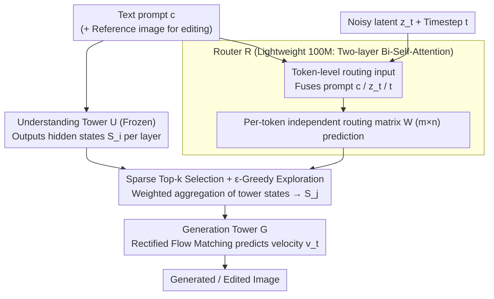

# Mixture of States: Routing Token-Level Dynamics for Multimodal Generation

**Conference**: CVPR2026  
**arXiv**: [2511.12207](https://arxiv.org/abs/2511.12207)  
**Code**: TBD  
**Area**: Image Generation  
**Keywords**: Multimodal Diffusion Models, Dynamic Routing, Mixture of States, Text-to-Image Generation, Image Editing, Sparse Interaction

## TL;DR

Proposes Mixture of States (MoS)—a multimodal fusion paradigm based on learnable token-level sparse routing, enabling visual tokens to adaptively select hidden states from any layer of the text encoder at each denoising step. This allows 3-5B parameter models to match or exceed the performance of 20B-class models.

## Background & Motivation

**Modality Representation Gap**: Training objectives for text models (contrastive learning/masked prediction/next-token prediction) and visual models (diffusion/flow matching) are fundamentally different. Aligning these heterogeneous representations is a core challenge.

**Limitations of Prior Work**: Cross-Attention utilizes only the final layer features of the text encoder, providing limited information; Self-Attention concatenates text and visual tokens, but its computational complexity grows quadratically with sequence length, leading to excessive overhead.

**Key Challenge of MoT**: Mixture-of-Transformers requires text and visual branches to share the same depth and hidden dimensions for strict layer-to-layer correspondence, failing to support asymmetric architectures.

**Mismatch between Static Conditions and Dynamic Denoising**: Existing methods encode text embeddings once and keep them fixed, but noise levels and visual features change dynamically across different timesteps in the diffusion process, causing an "information mismatch."

**Inadequacy of Single-Layer Representation**: Experiments indicate that using a global embedding from a single fixed layer for all tokens is suboptimal; different tokens should adaptively acquire representations from different layers.

**Parameter Efficiency**: While current SOTA models (e.g., Qwen-Image 20B) are powerful, their massive parameter counts necessitate more efficient solutions that achieve comparable performance at a smaller scale.

## Method

### Overall Architecture

MoS addresses the fusion of text encoders and visual generators with heterogeneous representations and asymmetric architectures. It employs a **dual-tower architecture**: an understanding tower $\mathcal{U}$ processes multimodal context (text, or text+image), and a generation tower $\mathcal{G}$ handles visual synthesis, connected by a learnable router $\mathcal{R}$. During training, the understanding tower is frozen while the generation tower and router are optimized end-to-end using Rectified Flow Matching:

$$\mathbb{E}_{c,t,z_0,z_1}\Big[\big\|\mathcal{G}(z_t, t, \mathcal{R}(t, c, z_t, \mathcal{U}(c))) - v_t\big\|_2^2\Big]$$

The framework supports both text-to-image generation (MoS-Image: router-aggregated features are projected and concatenated with visual features as in-context tokens) and image editing (MoS-Edit: the understanding tower processes both reference images and instructions, while the generation tower refines from Gaussian noise and clean reference images). The Core Idea is to let each visual token adaptively extract its most needed representation from any layer of the understanding tower at each denoising step.

### Key Designs

**1. Token-level routing input: Feeding prompt, noisy latents, and timesteps to the router**

Previous methods used static text embeddings, but noise levels and visual features evolve during diffusion. MoS's router receives three signals—text prompt embeddings $c$ (aligned via shared projection), noisy image latents $z_t$ (via shared patchify and projection), and denoising timestep $t$ (via sinusoidal embedding)—fused into a unified hidden dimension. This ensures routing decisions evolve with the denoising stage.

**2. Independent per-token routing matrix: Replacing single-layer global conditions with layer-to-layer affinity weights**

Experiments show that a single fixed layer is suboptimal for all tokens. MoS predicts a logit matrix $\mathcal{W} \in \mathbb{R}^{m \times n}$ for each context token (where $m$ is the depth of $\mathcal{U}$ and $n$ is the depth of $\mathcal{G}$), where $w_{ij}$ represents the affinity weight for routing the state from layer $i$ of the understanding tower to layer $j$ of the generation tower. **Each token predicts its own routing matrix**, naturally generating diverse layer-selection patterns.

**3. Lightweight router architecture: 100M parameters with negligible latency**

To enable "per-token, per-step, dynamic" routing, the router must be computationally inexpensive. All input embeddings are tokenized and concatenated into a sequence, processed by two bidirectional self-attention Transformer blocks to capture context, and finally projected to output the logit matrix. The router consumes only 100M parameters and adds just 0.008s per iteration, incurring almost no inference overhead.

**4. Sparse Top-k selection and ε-Greedy exploration: Selecting relevant layers without premature convergence**

To avoid redundancy, for each layer $j$ of the generation tower, MoS applies softmax to the column $w_{:,j}$ and selects only the top-$k$ layers from the understanding tower for weighted aggregation: $\mathbf{S}_j^c = \sum_{i \in I_j} \bar{w}_{ij} \cdot \mathcal{S}_i^c$. During training, $\epsilon$-Greedy exploration is used: selecting $k$ layers randomly with probability $\epsilon$ and using top-$k$ with $1-\epsilon$ to prevent the router from being trapped in local optima. Inference uses $\epsilon=0$.

### Loss & Training

The training objective is standard Rectified Flow Matching: target velocity $v_t = z_1 - z_0$, where $z_t = (1-t)z_0 + tz_1$, $z_0$ is the VAE-encoded image latent, and $z_1 \sim \mathcal{N}(0, I)$. Training proceeds in four progressive stages: Stage 1 at 512² resolution (1400 A100-days) → Stage 2 at 1024² → Stage 3 aesthetic fine-tuning (10M samples, 100 A100-days) → Stage 4 super-resolution fine-tuning at 2048² (1M samples, 80 A100-days). Total cost is ~3000 A100-days, significantly lower than SD v1.5's 6250 A100-days.

## Key Experimental Results

### Main Results

| Model | Interaction Type | Parameters | GenEval↑ | DPG↑ | GEdit↑ | ImgEdit↑ |
|------|---------|--------|----------|------|--------|----------|
| Qwen-Image | Self-Attn | 20B | 0.87 | 88.32 | 7.56 | 4.27 |
| SANA-1.5 | Cross-Attn | 4.8B | 0.81 | 84.70 | - | - |
| FLUX.1[Dev] | Self-Attn | 12B | 0.66 | 83.84 | - | - |
| Bagel | MoT | 14B | 0.88 | - | 6.52 | 3.20 |
| **MoS-S** | **MoS** | **3B** | **0.89** | **86.33** | **7.41** | **4.17** |
| **MoS-L** | **MoS** | **5B** | **0.90** | **87.01** | **7.86** | **4.33** |

MoS-L (5B) outperforms Qwen-Image (20B) across GenEval, GEdit, and ImgEdit, despite having only 1/4 the parameter count.

### Ablation Study

| Dimension | Key Findings |
|---------|---------|
| Router Input | Fully dynamic conditions (Prompt+Latent+Timestep) are optimal (FID 20.15 vs 21.12 for Prompt-only) |
| Prediction Granularity | Token-level prediction outperforms sample-level (FID 20.17 vs 21.66) |
| Layer Selection | Adaptive routing significantly outperforms manual fixed routing (FID 17.77 vs 21.51) |
| MoS vs MoT | MoS consistently outperforms MoT throughout all training stages given equal parameters/data/compute |
| MoS vs Cross-Attn | GenEval 0.79 vs 0.74, DPG 85.61 vs 83.40 |

### Key Findings

- Timestep awareness in the router is crucial—different denoising stages require different conditional guidance.
- Token-level routing naturally produces diverse strategies without the need for explicit regularization.
- MoS router latency is minimal (0.008s/iter), providing faster overall inference than Qwen-Image or Bagel.
- Combined with Self-CoT reasoning, MoS-L improves from 0.54 to 0.65 on the WISE benchmark.

## Highlights & Insights

- **Core Innovation**: The MoS router unifies "sparse, dynamic, and token-level" design principles, breaking the rigid constraints of MoT symmetric architectures to enable flexible fusion of asymmetric dual towers.
- **High Parameter Efficiency**: A 5B model matches or exceeds 20B models, with training costs (~3000 A100-days) significantly lower than previous generations.
- **Rigorous Ablation**: Successfully validates core hypotheses regarding dynamic conditions, token-level prediction, and adaptive layer selection.
- **Task Unification**: A single framework supports both image generation and editing; the frozen understanding tower preserves pre-trained reasoning capabilities.

## Limitations & Future Work

- MoS currently supports only unidirectional (Understanding → Generation) interaction; bidirectional fusion (e.g., joint training) remains unexplored.
- Only SFT is used for post-training; alignment methods for human preferences like GRPO or RLHF have not yet been evaluated.
- Visual artifacts still occur when generating small objects.
- While freezing the understanding tower is efficient, it may limit the upper bound of representation utilization for the generation tower.

## Related Work & Insights

- **Cross-Attention Series** (SD, PixArt-α, SANA-1.5): Limited by using only final-layer features.
- **Self-Attention Series** (FLUX, Qwen-Image): Strong performance via full-sequence interaction but computationally expensive.
- **MoT Series** (LMFusion, Bagel, Mogao): Hierarchical KV sharing but restricted to symmetric architectures.
- **Dynamic Networks** (MoE, MoD, MoR): Shares the spirit of sparse adaptive computation but focuses on intra-model routing; MoS extends this to inter-model collaboration.

## Rating

- Novelty: ⭐⭐⭐⭐⭐ — MoS router introduces a fresh cross-modality fusion paradigm with unique token-level dynamic sparse routing.
- Experimental Thoroughness: ⭐⭐⭐⭐⭐ — Comprehensive ablation (input/output/selection/efficiency), multi-benchmark/multi-task evaluation, and fair comparisons with MoT/Cross-Attn/Self-Attn.
- Writing Quality: ⭐⭐⭐⭐⭐ — Logical progression of design principles, clear diagrams, and rigorous argumentation.
- Value: ⭐⭐⭐⭐⭐ — A 4× improvement in parameter efficiency offers significant practical value, providing a general fusion solution for asymmetric multimodal architectures.

<!-- RELATED:START -->

## Related Papers

- [\[CVPR 2026\] CARE-Edit: Condition-Aware Routing of Experts for Contextual Image Editing](care-edit_condition-aware_routing_of_experts_for_contextual_image_editing.md)
- [\[CVPR 2026\] BiGain: Unified Token Compression for Joint Generation and Classification](bigain_unified_token_compression_for_joint_generation_and_classification.md)
- [\[AAAI 2026\] Mixture of Ranks with Degradation-Aware Routing for One-Step Real-World Image Super-Resolution](../../AAAI2026/image_generation/mixture_of_ranks_with_degradation-aware_routing_for_one-step_real-world_image_su.md)
- [\[ICML 2025\] Discriminative Policy Optimization for Token-Level Reward Models](../../ICML2025/image_generation/discriminative_policy_optimization_for_token-level_reward_models.md)
- [\[ICLR 2026\] Routing Matters in MoE: Scaling Diffusion Transformers with Explicit Routing Guidance](../../ICLR2026/image_generation/routing_matters_in_moe_scaling_diffusion_transformers_with_explicit_routing_guid.md)

<!-- RELATED:END -->
