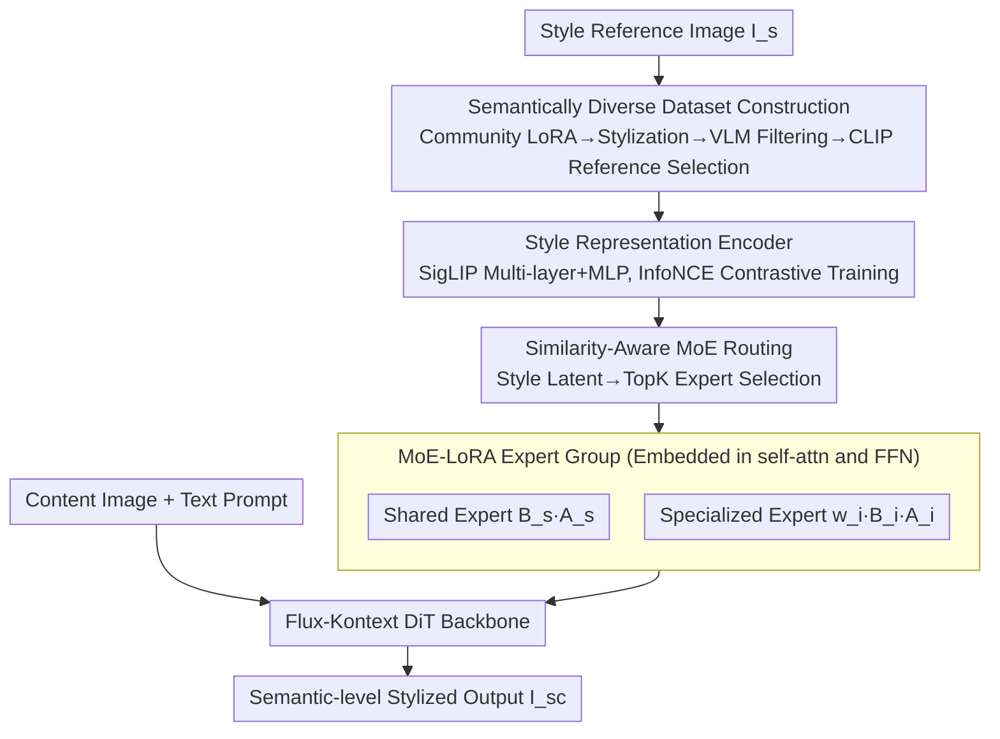

# Mixture of Style Experts for Diverse Image Stylization

**Conference**: CVPR 2026  
**Paper**: [CVF Open Access](https://openaccess.thecvf.com/content/CVPR2026/html/Zhu_Mixture_of_Style_Experts_for_Diverse_Image_Stylization_CVPR_2026_paper.html)  
**Code**: https://hh-lg.github.io/StyleExpert-Page/ (Project Page)  
**Area**: Image Generation / Style Transfer  
**Keywords**: Style Transfer, Mixture of Experts (MoE), Style Encoder, Diffusion Transformer, LoRA

## TL;DR
StyleExpert reformulates the Diffusion Transformer using a "contrastive-learning pre-trained style encoder + similarity-aware routed MoE-LoRA adapters." This prevents style transfer from degenerating into simple color copy-pasting, enabling genuine transfer of semantic-level styles such as textures, brushstrokes, and materials. Additionally, the authors construct a dataset of 500k content-style-stylized triplets with a more balanced semantic-to-color ratio, which significantly outperforms existing methods on metrics such as the Qwen semantic score.

## Background & Motivation
**Background**: The quality of style transfer based on Diffusion Transformers (DiTs, e.g., FLUX, Flux-Kontext) has experienced explosive growth in recent years. This task is typically divided into two categories: **color transfer** (copying the color distribution of the reference image to the content image while maintaining the spatial structure) and **semantic transfer** (transferring textures, lines, and materials, sometimes allowing minor spatial adjustments to conform to the style). An ideal style transfer should balance both aspects.

**Limitations of Prior Work**: The authors observe that popular contemporaneous methods such as OmniStyle, USO, CSGO, OmniGen2, and DreamO **universally degenerate into "only transferring the dominant color hue."** If the reference image is green, they simply paint the content image green; if it is yellow, they paint it yellow. However, they fail to capture the semantic elements like brushstrokes, lines, and materials that truly define "style" (see Fig. 1 in the original paper).

**Key Challenge**: There are two fundamental causes behind this issue. First is **data imbalance**—existing style datasets (such as OmniStyle-150K) are heavily biased towards color styles, with scarce semantic/material style samples. Even when texture-rich style libraries (like Style30K) are available, samples generated by training-free methods are often corrupted by irrelevant textures, noise, and artifacts, resulting in poor quality. Second is **too coarse a style injection mechanism**—methods like OmniStyle/DreamO directly concatenate the VAE latents of the style image. However, VAE latents have limited semantic representation capabilities and cannot capture high-level semantics. CSGO/USO inject style via cross-attention or prompts but treat all styles "identically," ignoring the semantic characteristic differences between different styles.

**Goal**: (1) Build a style dataset that is more balanced in terms of color and semantics, with higher quality; (2) Design an injection mechanism that can "treat different styles differently," allowing the model to route different styles through distinct processing paths.

**Key Insight**: Styles of different semantic levels (shallow textures vs. deep semantics) inherently require different processing capabilities—a single LoRA trying to handle all styles is bound to compromise. Consequently, it is better to **prepare different "experts" for different styles and use a style-aware router to assign styles to the correct experts**. This is a natural use case for Mixture of Experts (MoE).

**Core Idea**: Pre-train a highly discriminative style encoder using InfoNCE, and plug it into the MoE router as a "style prior." This transforms the task of "selecting different LoRA experts for different styles" into a stable, generalizable, and scalable MoE fine-tuning problem.

## Method

### Overall Architecture
StyleExpert uses the Flux-Kontext image editing model as its backbone (which supports three-way inputs: `Z' = [c, z_t, z_c]`, containing text tokens, noisy image tokens, and image control tokens, inherently suitable for accommodating style controls). The entire method consists of **two training stages**:

- **Stage 1: Training the Style Encoder**. This extracts style representations from SigLIP multi-layer features and an MLP, trained with an InfoNCE contrastive loss to pull images of the same style closer and push different styles apart in the latent space. It provides the "style prior" for Stage 2.
- **Stage 2: Training the MoE Adapter**. Several LoRA experts are embedded within the self-attention and FFN linear layers of the DiT. The latent extracted from the style image by the Stage 1 encoder serves as the conditional input to the router. Based on this, the router dynamically selects top-k experts to weightedly combine for each style and layer, injecting them into the original forward pass.

To support training, the authors also **constructed an offline dataset curation pipeline** (which does not participate in inference): they use community style LoRAs combined with OmniConsistency LoRA to stylize content images, filter out low-quality samples using a VLM, and then select style references using CLIP similarity to assemble (content image, style image, stylized image) triplets.

### Key Designs

**1. InfoNCE Style Representation Encoder: Providing the Router with a "Style-Aware" Prior**

MoE training is inherently unstable in the early stages—the router is initially clueless, easily dispatching styles to incorrect or suboptimal experts, leading to slow convergence or even choosing the wrong experts (Fig. 6 in the original paper). The authors' solution is to first pre-train a highly discriminative style encoder separately, decoupling the challenging task of "identifying style" from MoE training. Specifically, given a style image $I_i$ (with style label $s_i$), the goal is to learn a representation $e_i$ that minimizes the distance between images with the same label. The distance is defined as the temperature-scaled cosine similarity $d(e_i, e_j) = \frac{e_i \cdot e_j^T}{\tau \|e_i\|\|e_j\|}$. The representation is obtained by concatenating the hidden states from $L$ different layers of SigLIP and passing them through an MLP $\Phi$: $e_i = \Phi(\text{concat}(h_i^{(1)}, \dots, h_i^{(L)}))$. Multi-layer concatenation is adopted to simultaneously capture both shallow textures and deep semantics.

The training employs the InfoNCE contrastive loss (similar to CLIP): computing the loss between two independently sampled batches $B$ and $B'$ yields a $B\times B$ log probability matrix $\ell_{ij} = \log\frac{\exp(d(e_i, e'_j))}{\sum_k \exp(d(e_i, e'_k))}$. This is then weighted by a positive-sample mask $M_{ij}=\mathbb{1}[s_i = s'_j]$—only pairs with the same style label are treated as positive. The single-sample loss is the mask-weighted sum over all $j$: $L_i = -\frac{1}{\sum_j M_{ij}}\sum_{j=1}^{B} M_{ij}\cdot\ell_{ij}$. The overall loss is averaged across the batch: $L_{\text{InfoNCE}} = \frac{1}{B}\sum_i L_i$. Once trained, this encoder maps visually similar styles to neighboring locations in the latent space (as verified by the t-SNE plot in Fig. 8 in the original paper), thereby generalizing to unseen styles—playing a critical role as the stable routing signal.

**2. Similarity-Aware MoE-LoRA Adapter: Routing Different Styles through Different Experts**

Since a single LoRA cannot handle diverse styles of different granularities simultaneously, the authors embed $N_e$ LoRA experts within the self-attention and FFN linear layers of the DiT, using a router to choose the most suitable experts for each layer and style. Crucially, the router's conditioning **is not the hidden states** (like in ICEdit or MultiCrafter) but **the latent $e_s$ extracted from the style image by the Stage 1 style encoder**—which is where "similarity-awareness" comes from: because the style encoder clusters similar styles, the router can accordingly dispatch similar styles to similar experts. The weight for the $i$-th expert is defined as $w_i = \text{softmax}(\text{TopK}(g(e_s), k))_i$, where $g(e_s)$ represents the routing function output, and TopK selects the top $k$ experts while setting the rest to $-\infty$ (achieving sparse activation to save computation).

The output of a specific layer is the original transformation coupled with the experts' contributions:

$$h' = l(h) + \frac{\alpha}{r}\Big(B_s \cdot A_s + \sum_{i=1}^{N_e} w_i \cdot B_i \cdot A_i\Big)\cdot h$$

where $l(h)$ is the original output, $B_s, A_s$ represent the weights of the **shared expert** (shared across all styles to learn general stylization capabilities), $B_i, A_i$ represent the weights of the $i$-th **specialized expert** (responsible for a specific class of styles), $\alpha$ is a scaling coefficient, and $r$ is the LoRA rank. The combination of "shared expert + weighted specialized experts" preserves the general capacities of the backbone while covering style diversity via specialized experts. Practically, they default to 16 experts with rank=8 each, selecting top-2 per layer.

**3. Semantically Balanced Dataset StyleExpert-500K/40K: Solving "Only Color Copying" at the Source**

Models fail to learn semantic styles largely because existing datasets lack sufficient semantic style examples. The authors first quantify existing datasets using their custom **Qwen Semantic Score** (a VLM-based judgment of whether stylization favors semantic features like textures/materials over superficial colors) and find that out of 889 styles in OmniStyle-150K, 841 overwhelmingly only perform color transfer. Hence, they rebuild the dataset: collecting approximately 650 style LoRAs from the community and manually filtering them down to 209 high-quality LoRAs (covering pixel-level to semantic-level); preparing approximately 2,700 multi-category content photos and using Qwen to rewrite the captions to "only describe the objective content, removing styling/mood elements" to prevent style descriptive cues in the caption from interfering with the LoRAs; and then using OmniConsistency LoRA to stylize the content images, resulting in approximately 500,000 images for StyleExpert-500K. Subsequently, they perform a second-round filtering with Qwen-VL to remove poor stylizations, broken layouts, incorrect character attributes (age/gender), and inconsistent objects, refining it to approximately 40,000 highly faithful images in StyleExpert-40K. Finally, when composing triplets, for each stylized image $I_{sc}^{(i)}$ of a particular style, they pick another image with the highest CLIP similarity from the same style set as the style reference: $I_s^* = \arg\max_{I_{sc}^{(k)}\neq I_{sc}^{(i)}} \text{CLIPSim}(I_{sc}^{(i)}, I_{sc}^{(k)})$—which means the style reference itself is also a generated sample of that style, ensuring style cohesion within triplets.

### Loss & Training
- **Stage 1 (Style Encoder)**: AdaBelief optimizer, learning rate 1e-5, batch size 128, trained for 3500 steps, optimizing the aforementioned $L_{\text{InfoNCE}}$.
- **Stage 2 (MoE-LoRA Adapter)**: Backbone is Flux-Kontext, 16 experts with rank=8 each, top-2 selected per layer, batch size of 1 per GPU (total 4 for 4 GPUs), learning rate 1e-4, trained for 10,000 steps.

## Key Experimental Results

### Main Results
Testing protocol: 188 styles for training / 21 styles for testing, with 50 randomly selected content-style image pairs per style and 2 seeds per pair, totaling 2100 images per method. Evaluation dimensions: content fidelity (CLIP, DINO), style similarity (CSD, DreamSim↓), aesthetics (LAION Aesthetic), alongside the custom Qwen Semantic Score.

| Method | CLIP↑ | DINO↑ | CSD↑ | Aesthetic↑ | Qwen Semantic↑ | DreamSim↓ |
|------|-------|-------|------|-----------|----------|-----------|
| CSGO | 63.41 | 65.50 | 61.07 | 6.28 | 28.93 | 42.39 |
| DreamO | 64.14 | 62.68 | 47.91 | 6.20 | 19.29 | 44.95 |
| OmniGen2 | 67.07 | 63.06 | 55.61 | 6.13 | 23.69 | 41.55 |
| OmniStyle | 65.39 | 72.27 | 59.65 | 6.07 | 40.00 | 41.83 |
| Qwen-Image-Edit | 67.47 | 55.86 | 56.74 | 6.20 | 42.74 | 34.47 |
| USO | 69.39 | **84.03** | 53.60 | 6.30 | 19.88 | 48.62 |
| **StyleExpert (Ours)** | **70.19** | 64.72 | **73.18** | **6.48** | **75.12** | **28.18** |

Ours achieves SOTA results across five metrics: CLIP, CSD, Aesthetic, Qwen Semantic, and DreamSim, with the Qwen Semantic Score (75.12) vastly outstripping the second best (Qwen-Image-Edit 42.74). The lower DINO score is because DINO penalizes "semantic styling that alters materials." Competing methods degenerate into color transfer and retain the original material, artificially boosting their DINO scores, which the authors interpret as a side effect of the metric rather than a true deficiency.

### Ablation Study

| Configuration | CLIP↑ | CSD↑ | Qwen Semantic↑ | DreamSim↓ | Description |
|------|-------|------|----------|-----------|------|
| LoRA Training | 67.33 | 70.88 | 70.71 | 36.77 | Single LoRA; fails to capture the semantics of complex styles |
| MoE Training (No Style Encoder) | 67.83 | 66.70 | 71.43 | 38.54 | MoE without router prior; training is unstable, and CSD/DreamSim are even worse than single LoRA |
| **StyleExpert (Full)** | **70.19** | **73.18** | **75.12** | **28.18** | Full framework; achieves comprehensive optimal results in content fidelity and style similarity |

| Item | Computation (G) | Trainable Parameters (M) |
|------|-----------|---------------|
| Base Model | 10.92 | - |
| + LoRA | +0.67 | 751.48 |
| + MoE Experts | +0.12 | 818.71 |

### Key Findings
- **The style encoder is the lifeline for stable MoE convergence**: Removing it causes MoE performance to degrade significantly on CSD and DreamSim, performing even worse than a single LoRA (attributed to the inherent instability of early MoE training). Adding briefcase stabilizes optimization and accelerates convergence (Fig. 6).
- **Routing indeed achieves "similar styles $\rightarrow$ similar experts"**: By fixing the content of the reference image and routing using style latents, the expert selection overlap (IoU) between similar styles is approximately 33.18%, which is about 3 times that of dissimilar styles (10.60%). This directly verifies that the structured latent space of the style encoder guides the routing.
- **Efficiency gains are counterintuitively painless**: Compared to a single LoRA, MoE adds very little computational overhead to the backbone (+0.12G vs. +0.67G) but brings more trainable parameters (818.71M vs. 751.48M), translating into higher storage capacity for style knowledge without incurring inference burdens.

## Highlights & Insights
- **Decoupling "Style Recognition" from "Style Application"**: First, pre-train a style encoder using contrastive learning to solve the "recognize styles" problem. Then, use it as a prior for the MoE router to solve the "apply styles" problem. This avoids the instability of end-to-end MoE routing starting from scratch, offering a clean, transferable paradigm for other conditional MoE scenarios.
- **Differentiating from Prior Work via "Routing Conditioning Source"**: ICEdit and MultiCrafter feed hidden states to the router, whereas this work feeds pre-trained style latents. Despite both being MoE-LoRA, altering the conditioning to better fit the task significantly enhances routing quality and generalization.
- **Critical Evaluation of Metrics**: The authors proactively analyze why the DINO score is lower—it is precisely because the material is altered. This reminds readers of the inherent conflict between "content similarity metrics" and "semantic stylization goals" in style transfer, warning against over-reliance on DINO.
- **The "Self-Consistent Triplet" Trick in the Data Pipeline**: Style reference images are chosen as another generated sample of the same style (via highest CLIP similarity). This guarantees style cohesion and avoids noise stemming from "mismatches between reference images and target styles."

## Limitations & Future Work
- **Heavy reliance on community style LoRAs**: All 209 styles originate from Hugging Face community LoRAs, capping style diversity and quality by community resource limitations; rare/niche artistic styles might still be missing.
- **Self-generated data by generative models**: StyleExpert-500K is generated using OmniConsistency LoRA, leading to potential distributional biases of "training generative models on generated data." The complex nuances of real-world artwork might not be fully covered.
- **Qwen Semantic Score is a custom metric**: Many conclusions are built upon this metric, but its exact definition is omitted in the main text (only mentioned as being in the supplementary material), limiting cross-paper comparability.  *Note: specific calculations are subject to the original supplementary material.*
- **Fixed hyperparameters for expert count and top-k**: Parameters such as 16 experts, top-2, and rank 8 lack comprehensive sensitivity analysis. Whether they remain optimal when changing backbones or style scales remains unknown.

## Related Work & Insights
- **vs OmniStyle / DreamO**: These methods inject styles by concatenating VAE latents, which are bounded by the limited semantic representation of the VAE and fail to capture high-level semantics. This work uses multi-layer SigLIP features combined with a specially trained style encoder, offering stronger semantic expressiveness.
- **vs CSGO / USO**: These methods inject styles via cross-attention or prompts but treat all styles identically. This work uses MoE to route different styles through different expert paths, achieving style-specific treatment.
- **vs ICEdit / MultiCrafter (MoE-LoRA Image Generation)**: While they also utilize LoRA-as-expert, they use hidden states as the routing condition. This work leverages pre-trained style latents, resulting in more stable routing and better generalization.
- **vs Training-Free Style Transfer (B-LoRA / K-LoRA / Attention Distillation)**: Training-free methods bear high inference costs, require multiple style images, or exhibit unstable performance. This work is a training-based method requiring only a single style image while offering stable inference.

## Rating
- Novelty: ⭐⭐⭐⭐ The combination of "style encoder as an MoE routing prior" is clever and solves the actual problem of unstable MoE training, although MoE-LoRA and contrastive style encoders are not individually pioneering.
- Experimental Thoroughness: ⭐⭐⭐⭐ Complete chain of evidence with 6 baselines, 6 evaluation metrics, ablations, routing overlap, t-SNE, and convergence curves. Points are deducted because the core evaluation metric (Qwen Semantic Score) is not mathematically formulated in the main text.
- Writing Quality: ⭐⭐⭐⭐ Clear motivation, well-described two-stage framework and formulas. The critical analysis of the lower DINO score is a notable positive.
- Value: ⭐⭐⭐⭐ Both semantic-level style transfer and the balanced 500k dataset carry practical value, directly facilitating subsequent research in semantic stylization and customization.

<!-- RELATED:START -->

## Related Papers

- [\[CVPR 2026\] TAG-MoE: Task-Aware Gating for Unified Generative Mixture-of-Experts](tag-moe_task-aware_gating_for_unified_generative_mixture-of-experts.md)
- [\[ICCV 2025\] Balanced Image Stylization with Style Matching Score](../../ICCV2025/image_generation/balanced_image_stylization_with_style_matching_score.md)
- [\[AAAI 2026\] Aggregating Diverse Cue Experts for AI-Generated Image Detection](../../AAAI2026/image_generation/aggregating_diverse_cue_experts_for_ai-generated_image_detec.md)
- [\[CVPR 2026\] EmoStyle: Emotion-Driven Image Stylization](emostyle_emotion-driven_image_stylization.md)
- [\[CVPR 2026\] Style-GRPO: Semantic-Aware Preference Optimization for Image Style Transfer Guided by Reward Modeling](style-grpo_semantic-aware_preference_optimization_for_image_style_transfer_guide.md)

<!-- RELATED:END -->
