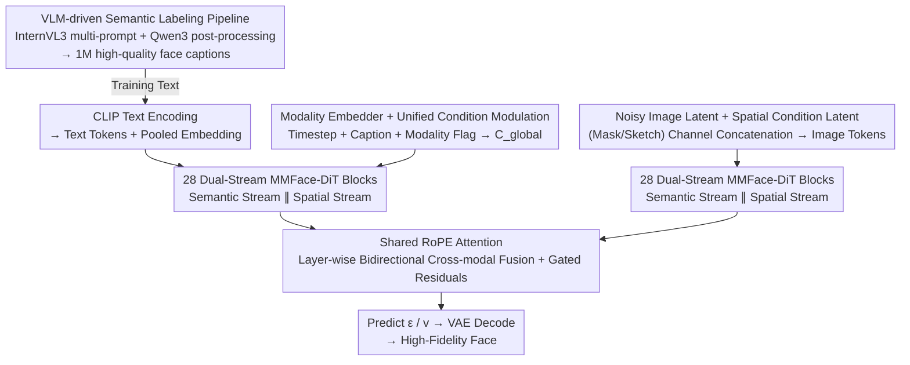

# MMFace-DiT: A Dual-Stream Diffusion Transformer for High-Fidelity Multimodal Face Generation

**Conference**: CVPR 2026  
**Paper**: [CVF Open Access](https://openaccess.thecvf.com/content/CVPR2026/html/Krishnamurthy_MMFace-DiT_A_Dual-Stream_Diffusion_Transformer_for_High-Fidelity_Multimodal_Face_Generation_CVPR_2026_paper.html)  
**Code**: Project Page vcbsl/MMFace-DiT (The paper states that the code and dataset are open-sourced)  
**Area**: Diffusion Models / Multimodal Controllable Face Generation  
**Keywords**: Diffusion Transformer, Dual-stream fusion, RoPE Attention, Multimodal controllable generation, Face synthesis

## TL;DR
MMFace-DiT utilizes a dual-stream DiT that **parallelly and equally processes** a "text semantic stream" and a "mask/sketch spatial stream" within the same Transformer. Through layer-wise deep fusion using shared RoPE attention and a Modality Embedder that allows switching between mask/sketch conditions without retraining, the model improves FID and other metrics by approximately 40% compared to 6 SOTA methods in both text+mask and text+sketch controllable face generation.

## Background & Motivation
**Background**: Controllable face generation aims to follow both "high-level semantic intent (text)" and "low-level structural layout (segmentation mask, sketch, edge map)." Current mainstream approaches involve **adding external** spatial controls to pre-trained text-to-image diffusion models: either by adding a trainable bypass to a frozen backbone (e.g., ControlNet) or by combining multiple single-modal generators through inference-time composition frameworks.

**Limitations of Prior Work**: These "patch-style" designs suffer from specific drawbacks. In ControlNet, the backbone is frozen, preventing **bidirectional deep interaction** between text and spatial features. Inference-time composition frameworks (e.g., Unite-and-Conquer, Collaborative Diffusion) are limited by the weakest sub-model and strictly require latent space alignment; they fail when modality conflicts occur (e.g., "long hair" prompt on a male mask). GAN-based approaches (TediGAN, MM2Latent) suffer from latent space entanglement, struggling with fine-grained accessories like earrings or hats.

**Key Challenge**: These paradigms are stuck in a **trade-off between spatial fidelity and semantic consistency**—once structural alignment is achieved, text/attribute alignment suffers, and vice versa. One modality often "dominates" and suppresses the other (modal dominance). Furthermore, the scarcity of face data with rich semantic labels (shallow text in CelebA-HQ, no labels in FFHQ) hinders multimodal face generation.

**Goal**: To build a **natively** unified, end-to-end Diffusion Transformer where semantic and spatial conditions are treated as equals rather than in a master-slave relationship, while addressing the data bottleneck.

**Key Insight**: Instead of using external control modules, treat spatial tokens and text tokens as two equal streams, allowing them to "see" each other deeply through a shared set of attention mechanisms in **every layer** of the DiT.

**Core Idea**: Use "dual streams + shared RoPE attention" for symmetric deep fusion within each block to avoid modal dominance; use a lightweight Modality Embedder to encode "whether the current input is a mask or a sketch" into the global condition, allowing a single set of weights to dynamically adapt to different spatial modalities.

## Method

### Overall Architecture
MMFace-DiT operates in the VAE latent space. During the forward pass, the noisy image latent $z_t$ and the spatial condition latent $z_c=E_{vae}(c_{sp})$ (mask or sketch) are **concatenated along the channel dimension** and patch-embedded to form image tokens $T_i$. Natural language prompts are encoded by CLIP into sequence tokens (projected as $T_t$) and a pooled embedding $c_{pooled}$. A global conditioning vector $C_{global}$ sums the timestep, pooled text embedding, and the Modality Embedder's output as a modulation signal for all blocks. Tokens pass through 28 dual-stream MMFace-DiT blocks (each containing AdaLN modulation → shared RoPE attention fusion → gated residuals) to predict noise $\epsilon$ (DDPM) or velocity $v$ (Rectified Flow). Finally, the face is reconstructed via the VAE decoder after the unpatchify operation.

### Key Designs

**1. Equal Dual-Stream MMFace-DiT Block: Preventing Modality Dominance**

To address "modal dominance" caused by external controls or inference-time combinations, this work abandons the master-slave setup. Instead, the image stream $T_i$ and text stream $T_t$ pass through the same block in **parallel** and fuse continuously. The block is driven by a triplet: AdaLN for fine-grained conditioning, shared RoPE attention for central fusion, and gated residuals for dynamic information balancing. AdaLN uses $C_{global}$ through linear layers to generate independent modulation parameters $\{\gamma, \beta, \alpha\}$ for each stream, allowing text, timestep, and the active modality to exert per-layer, bifurcated control. The MLP is a two-layer feedforward network with 4x hidden dimension expansion and GeLU activation. Consequently, semantics and structure are shaped equally at each layer.

**2. Shared RoPE Attention: Bidirectional Interaction between Image Patches and Text Tokens**

This is the core mechanism of fusion. Tokens from both streams are projected into query/key/value and **concatenated into unified tensors** $Q=[Q_i;Q_t]$, $K=[K_i;K_t]$, and $V=[V_i;V_t]$. Rotary Positional Embeddings are then applied to the concatenated $Q$ and $K$: **2D axial RoPE** for image tokens (encoding height/width spatial relations) and **1D sequence RoPE** for text tokens. This naturally handles the heterogeneous structure of "2D image patches + 1D text sequences" in one operation:

$$\mathrm{Attention}(Q,K,V)=\mathrm{softmax}\!\left(\frac{\mathrm{RoPE}(Q)\,\mathrm{RoPE}(K)^{\top}}{\sqrt{d_k}}\right)V$$

Because $Q$ and $K$ are concatenated, each image patch can attend to all text tokens and vice versa after the softmax, creating a dense bidirectional flow—this achieves deep alignment that fixed-backbone methods cannot.

**3. Modality Embedder + Gated Residuals: Dynamic Switching and Signal Protection**

To avoid training separate models for each spatial modality, the global condition is formulated as:

$$C_{global}=E_{time}(t)+E_{caption}(c_{pooled})+E_{modality}(m)$$

$E_{modality}$ is a Modality Embedder that maps discrete modality flags $m$ (e.g., 0=mask, 1=sketch) to a dense vector in $\mathbb{R}^D$ injected into the global context. This allows the **same set of weights** to reconfigure its processing based on the input type. Gated residuals act as information valves: for an input stream $T_{in}$ and block operation $F(\cdot)$, the update is $T_{out}=T_{in}+\alpha\odot F(\mathrm{AdaLN}(T_{in},\gamma,\beta))$, where the gating scalar $\alpha$ is also derived from $C_{global}$. This learnable dynamic filter prevents strong geometric priors like "dense sketches" from suppressing subtle semantic clues in the text.

**4. VLM-driven Semantic Labeling Pipeline: Bridging the Face-Text Data Gap**

To solve the lack of semantic labels, this work uses the InternVL3 VLM to generate large-scale captions for FFHQ and CelebA-HQ. Ten engineered prompts (covering natural descriptions and demographic cues) are used for each image, followed by two refinement stages: rule-based filtering to remove artifacts and Qwen3 post-processing to suppress VLM hallucinations and improve factual consistency. Each caption is limited to 77 tokens, resulting in 1M high-quality captions (100k images × 10 captions) which are open-sourced.

### Loss & Training
The model supports two complementary diffusion training paradigms. The first is **DDPM + Min-SNR Weighting**: predicting the noise added to latent $z_0$, using $w(t)=\min(\mathrm{SNR}(t),\lambda)/\mathrm{SNR}(t)$ with $\lambda=5.0$ to balance MSE across noise levels, accelerating convergence and improving perceptual quality. The second is **Rectified Flow Matching (RFM)**: treating diffusion as learning a velocity field between noise and data, sampling $t\sim U[0,1]$, constructing $z_t=(1-t)x_0+tx_1$, and predicting a constant velocity $v=x_1-x_0$. This eliminates variance scheduling and results in faster, more stable inference. The model features 1.345B parameters, 28 layers, a hidden dimension of 1152, and 16 heads, using 32-channel latent inputs from a 16-channel FLUX VAE. It was trained at $256^2$ for 300 epochs and fine-tuned at $512^2$ for 50 epochs on **only two RTX 5000 Ada GPUs** using bfloat16, 8-bit AdamW, and gradient checkpointing.

## Key Experimental Results

### Main Results
Trained on CelebA-HQ + FFHQ, using Segformer for masks and U2Net for sketches. Metrics include FID, LPIPS, SSIM, mask pixel accuracy (ACC), mIoU, CLIP Score, CLIP Distance, and **LLM Score (semantic consistency evaluated by an LLM)**. Ours (D) refers to the DDPM variant, and Ours (F) refers to the Flow Matching variant.

Text + Mask (Key Metrics):

| Method | FID ↓ | SSIM ↑ | mIoU ↑ | CLIP ↑ | LLM Sc. ↑ |
|------|-------|--------|--------|--------|-----------|
| TediGAN | 62.55 | 0.48 | 39.02 | 25.26 | 0.41 |
| ControlNet | 49.39 | 0.41 | 43.95 | 25.39 | 0.31 |
| UAC | 48.88 | 0.48 | 38.82 | 23.75 | 0.35 |
| DDGI | 50.88 | 0.49 | 36.02 | 24.29 | 0.39 |
| MM2Latent | 49.78 | 0.45 | 38.19 | 26.78 | 0.36 |
| **Ours (D)** | 27.95 | 0.51 | 49.16 | 31.69 | 0.60 |
| **Ours (F)** | **16.63** | **0.53** | **50.12** | 31.34 | **0.64** |

Text + Sketch (Key Metrics):

| Method | FID ↓ | LPIPS ↓ | SSIM ↑ | CLIP ↑ | LLM Sc. ↑ |
|------|-------|---------|--------|--------|-----------|
| MM2Latent | 40.91 | 0.58 | 0.46 | 27.04 | 0.39 |
| ControlNet | 67.13 | 0.54 | 0.56 | 26.17 | 0.44 |
| DDGI | 56.57 | 0.43 | 0.51 | 23.95 | 0.43 |
| **Ours (D)** | 27.67 | 0.24 | 0.72 | 31.56 | 0.69 |
| **Ours (F)** | **9.14** | **0.20** | 0.70 | 31.30 | **0.72** |

In the mask scenario, the Flow Matching variant reduces FID by 40.5% compared to the strongest baseline to 16.63. In the sketch scenario, the improvement is more significant, with Ours (F) reaching an FID of 9.14 (a 66.9% reduction compared to Ours (D)). Under both conditions, CLIP and LLM Scores lead significantly, indicating that semantic alignment was not sacrificed for spatial structure.

### Ablation Study
Step-wise addition of components (Text + Mask, SD2 as base VAE, last step switched to Flux):

| Configuration | FID ↓ | CLIP ↑ | mIoU ↑ | Note |
|------|-------|--------|--------|------|
| Model-1 Baseline DiT | 44.52 | 24.53 | 44.86 | Modalities trained separately |
| + Modality Embedder | 40.49 | 24.31 | 46.34 | Shared spatial learning, FID −9.1% |
| + Dual-Stream (DS) | 35.61 | 29.69 | 48.91 | CLIP +22.1%, Semantic/Spatial improved simultaneously |
| + RoPE Attention | 33.77 | 31.42 | 50.05 | Highest mIoU, stronger fusion |
| + Flux VAE | 27.95 | 31.69 | 49.16 | FID drops another 17.2%, best overall |

Regarding VAE selection, five frozen VAEs (SD2/SDXL/Qwen/SD3/Flux) were compared: SD3 reached the lowest FID but suffered from overexposure and reduced realism; Flux achieved the lowest LPIPS (0.239) on sketches with the most natural skin texture and color, and was thus chosen as the backbone.

### Key Findings
- The Dual-Stream (DS) design is the primary contributor to semantic alignment: adding it alone increased CLIP from 24.53 to 29.69 (+22.1%), confirming that the "equal dual-stream" setup effectively mitigates modality dominance.
- Spatial metrics (SSIM/ACC/mIoU) and semantic metrics (CLIP/LLM Sc.) **rose simultaneously** in every ablation step, suggesting the model improves both without trade-offs.
- Rectified Flow Matching (RFM) consistently outperformed the DDPM variant, especially in the sketch scenario (FID 9.14 vs. 27.67), where RFM's stability advantage in high-resolution face synthesis is magnified.

## Highlights & Insights
- **The "Equal Dual-Stream + Shared Attention" is an anti-ControlNet approach**: Instead of freezing the backbone or adding bypasses, it allows both modalities to share an attention mechanism in every layer. Concatenating $Q/K/V$ enables full patch-to-token bidirectional fusion efficiently.
- **Heterogeneous RoPE Positioning**: Using 2D axial RoPE for images and 1D sequence RoPE for text explicitly acknowledges their structural differences while still processing them in a single attention pass. This trick is transferable to any unified Transformer handling mixed image-text tokens.
- **Modality Switch**: Encoding the "mask vs. sketch" state as a flag in the global condition allows a single model to switch modalities dynamically, a paradigm easily extendable to other conditions (edges, depth, normals, etc.).
- **VLM + LLM Data Pipeline**: Using VLM for multi-prompt generation and LLM for hallucination refinement is a practical, low-cost paradigm for enriching semantic labels in niche datasets.

## Limitations & Future Work
- The paper relies heavily on the supplementary material for hyper-parameter details, architecture specifics, and data collection procedures, making the main text difficult to replicate independently. ⚠️
- Evaluations are concentrated on frontal portraits from FFHQ/CelebA-HQ; generalization to extreme poses, occlusions, group shots, or non-face domains has not been verified.
- While the training claims to use "only two RTX 5000 Ada GPUs," the total duration and carbon cost for the 1.345B parameter model are not provided; "resource efficiency" is reflected more in memory usage than in compute time.
- LLM Score as a metric depends on the scoring model itself and may introduce evaluation bias.

## Related Work & Insights
- **vs. ControlNet**: ControlNet uses a frozen backbone and a trainable bypass, preventing bidirectional deep fusion. MMFace-DiT uses a dual-stream backbone with shared attention at every layer, resulting in deeper fusion and superior CLIP/mIoU.
- **vs. Inference-time Combinations (UAC / Collaborative Diffusion)**: These methods are constrained by the weakest sub-model and latent alignment; MMFace-DiT is an end-to-end single model that resolves modality conflicts via gated residuals.
- **vs. GAN-based Approaches (TediGAN / MM2Latent)**: StyleGAN latent space entanglement makes it difficult to render accessories; diffusion with dual-stream fusion shows significantly better fidelity for fine-grained attributes like earrings and hairstyles.

## Rating
- Novelty: ⭐⭐⭐⭐ The dual-stream + shared RoPE DiT design is clear, though the components (DS/RoPE/Modality Embedder) are clever assemblies of existing concepts.
- Experimental Thoroughness: ⭐⭐⭐⭐ Solid results across two conditions, 6 baselines, and ablation of components/VAEs, though lacking pose/generalization and time-cost analysis.
- Writing Quality: ⭐⭐⭐⭐ Motivations and mechanisms are well-explained, but critical details are moved to the supplement.
- Value: ⭐⭐⭐⭐ Provides a clean end-to-end unified paradigm for controllable face generation and open-sources a 1M caption dataset.

<!-- RELATED:START -->

## Related Papers

- [\[CVPR 2026\] High-Fidelity Diffusion Face Swapping with ID-Constrained Facial Conditioning](high-fidelity_diffusion_face_swapping_with_id-constrained_facial_conditioning.md)
- [\[CVPR 2026\] DiT-IC: Aligned Diffusion Transformer for Efficient Image Compression](ditic_aligned_diffusion_transformer_for_efficient.md)
- [\[CVPR 2026\] Preserving Source Video Realism: High-Fidelity Face Swapping for Cinematic Quality](preserving_source_video_realism_high-fidelity_face_swapping_for_cinematic_qualit.md)
- [\[CVPR 2026\] DUO-VSR: Dual-Stream Distillation for One-Step Video Super-Resolution](duo-vsr_dual-stream_distillation_for_one-step_video_super-resolution.md)
- [\[CVPR 2026\] DiT360: High-Fidelity Panoramic Image Generation via Hybrid Training](dit360_high-fidelity_panoramic_image_generation_via_hybrid_training.md)

<!-- RELATED:END -->
