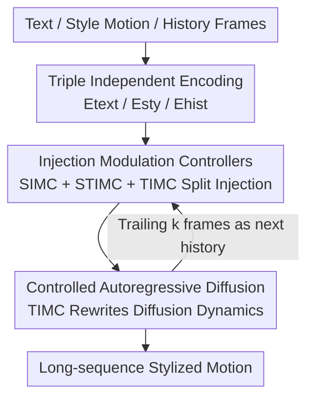

# MoCoDiff: A Controllable Autoregressive Diffusion Model for Expressive Motion Generation

**Conference**: CVPR 2026  
**Paper**: [CVF Open Access](https://openaccess.thecvf.com/content/CVPR2026/html/Song_MoCoDiff_A_Controllable_Autoregressive_Diffusion_Model_for_Expressive_Motion_Generation_CVPR_2026_paper.html)  
**Code**: https://github.com/Xuehan0530/MoCoDiff-code  
**Area**: Image Generation / Human Motion Generation / Diffusion Models  
**Keywords**: Motion generation, stylization, autoregressive diffusion, multi-condition decoupling, long-sequence consistency

## TL;DR
To address the issue in diffusion-based human motion generation where "semantics, style, and history are entangled in a single conditional pathway, leading to long-sequence drift and loss of style control," MoCoDiff uses three lightweight "Injection Modulation Controllers (IMC)" to separately inject text, style, and history into a frozen backbone. By treating history as a "time-varying correction signal that directly rewrites diffusion transition dynamics," a Temporal IMC drives controlled autoregressive diffusion. This achieves the highest style accuracy, lowest jitter, and approximately 4.8× to an order of magnitude inference acceleration for long-sequence stylized motions.

## Background & Motivation

**Background**: Generating human motions from high-level conditions such as text, style, or scenes is a core problem in character animation, embodied intelligence, and virtual humans. Recently, diffusion-based methods have leveraged strong generative capabilities to improve motion realism and diversity, leading to two main paths for long sequences: single-pass generation (e.g., MDM) and autoregressive segment-based generation.

**Limitations of Prior Work**: ① **Fused-conditioning**—Most methods cram semantic, stylistic, physical, and temporal information into the same conditional pathway. While easy to implement, heterogeneous signals inevitably entangle, resulting in decreased controllability, long-sequence style drift, and behavioral inconsistency when satisfying multiple conditions. ② **Poor long-term stability**—Single-pass models struggle to maintain global consistency; autoregressive frameworks accumulate errors between segments. Even recent autoregressive diffusion models treat past motions as context via fused-conditioning, lacking explicit control over "how history influences denoising," leading to weak temporal consistency. In short: non-autoregressive models cannot scale to long sequences, while fused-conditional autoregressive models fail to govern denoising dynamics, with both suffering from error accumulation and long-term drift.

**Key Challenge**: The root cause lies in **conflating "how to modulate denoising" with "what conditional features to input."** Fused-conditioning only perturbs feature statistics and never explicitly controls how history, style, and semantics respectively act on the diffusion transition process, making true feedback-based control during sampling impossible.

**Goal**: Achieve long-term consistency, fine-grained style control, and flexible multi-condition guidance within a single model without needing to retrain the backbone for new conditions.

**Key Insight**: Reformulate multi-condition motion generation as a **"temporal modulation problem via condition-specific injection mechanisms."** This involves decoupling semantics, style, and temporal information into independent modulation pathways rather than merging them into a single control flow. Specifically, "history" is upgraded from a standard input condition to a control term that directly rewrites the diffusion transition dynamics.

**Core Idea**: Use three independent lightweight IMCs to decouple the injection of semantics, style, and history (plug-and-play, frozen backbone). Use the Temporal IMC to modify the diffusion transition function itself, transforming autoregressive diffusion into a "controlled Markov process" with finite history, thereby actively suppressing drift and forcing inter-segment smoothness.

## Method

### Overall Architecture
MoCoDiff encodes three types of conditions—content text, style motion, and historical information—separately, then injects them into a frozen diffusion backbone through **Injection Modulation Controllers (IMC)**. To generate long sequences, **Controlled Autoregressive Diffusion** partitions the entire motion into overlapping chunks for segment-wise generation. Each segment uses the trailing $k$ frames of the previous segment as history, which the Temporal IMC uses to align denoising trajectories for temporal continuity. The three IMCs have distinct roles: Semantic IMC (SIMC) modulates low-frequency, content-aligned global trajectories; Style IMC (STIMC) injects high-frequency, pose-level style residuals (rhythm, body curvature, expressiveness); and Temporal IMC (TIMC) injects history-related correction signals to rewrite the denoising transition. The backbone remains frozen throughout, and all controllers are lightweight and pluggable.

### Key Designs

**1. Injection Modulation Controller (IMC): Decouple semantics, style, and history into three independent injection pathways instead of concatenating them into a single conditional vector.**

This directly addresses the core pain point of "fused-conditioning entanglement." The three types of conditions are first encoded independently: the CLIP text encoder $E_{\text{text}}$ yields semantic features $F_T$; the MotionCLIP-based $E_{\text{sty}}$ derives style features $F_S$ from reference motions; and a learnable history encoder $E_{\text{hist}}$ aggregates the last $k$ frames of the previous segment into a compact temporal state $F_H = \phi(W_h\, P(H_{1:k}) + b_h)$ (where $P(\cdot)$ is temporal pooling and $\phi$ is non-linear activation). The IMC is implemented as a lightweight linear cross-attention (query–key–value structure): motion features provide $Q$, while conditional features provide $K,V$. A learnable **LayerNorm** is applied before projection—the authors emphasize that "pre-projection normalization" rather than "post-attention normalization" is key to stable multi-condition fusion. Additionally, $Q$ is normalized along the temporal dimension and $K$ along the conditional dimension to stabilize linear attention. The three IMCs manage different frequency bands/roles: **SIMC** for low-frequency global trajectories, **STIMC** for high-frequency pose-level style residuals, and **TIMC** for historical correction. Unlike conventional conditions (e.g., FiLM/AdaLN/ControlNet) that only perturb feature statistics, IMC modifies the diffusion transition function itself, thus reshaping denoising trajectories across timesteps. The final residual integration is:

$$\hat{X}_t = X_t + O^{(t)}_{\text{sem}} + O^{(t)}_{\text{sty}} + M_{\text{hist}}\odot O^{(t)}_{\text{hist}},$$

where the mask $M_{\text{hist}}$ suppresses outdated features, allowing only recent frames to participate in temporal correction, thereby simultaneously enforcing semantic alignment, style stability, and history-based temporal consistency.

**2. Controlled Autoregressive Diffusion: Treating history as a control term rewriting the diffusion transition to turn autoregression into a "controlled Markov process."**

Targeting "autoregressive inter-segment error accumulation and long-term drift." Instead of simply appending history to the input, TIMC injects a history-dependent control term that directly rewrites the step-wise diffusion transition:

$$x_{t-1} = f_\theta(x_t, t) + C_t(h_{t-1}),$$

where $f_\theta$ is the standard denoising operator and $C_t$ is a time-varying modulation derived from the previous segment's end state $h_{t-1}$ (implemented as the TIMC output $O^{(t)}_{\text{hist}}$). This transforms the originally "memoryless Markov chain" into a "controlled Markov process with finite history," enabling genuine feedback control during sampling. For long-sequence generation, the motion is divided into overlapping chunks $\{C_i\}$ for segment-wise diffusion: the first segment $C_1 = D(T_1,S_1)$, followed by $C_i = D(T_i,S_i,F_H)$. History $h_i = \text{Tail}_k(C_{i-1})$ takes the last $k$ frames of the previous segment, which, after encoding, is injected via TIMC to align the motion dynamics of the current segment with the previous one, suppressing drift and forcing inter-segment smoothness.

**3. Progressive Rollout Curriculum + EMA History: Closing the gap between "teacher forcing training" and "autoregressive inference."**

If an autoregressive model is trained entirely with ground-truth history (teacher forcing) but must consume its own predictions during inference, the distribution discrepancy will amplify errors. Borrowing from DART's scheduled rollout, the training is divided into three stages based on progress $\tau/T$: Early stage ($\tau\le 0.3T$) uses ground-truth history to learn stable single-segment prediction; Mid stage ($0.3T<\tau\le 0.8T$) progressively replaces ground-truth with model-generated history with probability $p_{\text{rollout}}(\tau)=\frac{\tau-0.3T}{0.5T}\in[0,1]$; Late stage ($\tau>0.8T$) uses full rollout ($p_{\text{rollout}}=1$), making training faithfully simulate autoregressive inference. When model predictions serve as history, the history buffer is updated using an **EMA model**: $h^{(i+1)}=[\,h^{(i)},\hat{m}^{(i)}_{\text{EMA}}\,]_{-k:}$, decoupling the conditional history from rapidly changing parameters to further suppress error accumulation between chunks.

### Loss & Training
The composite objective is $L = L_{\text{rec}} + \alpha L_{\text{smooth}} + \beta L_{\Delta}$, where $L_{\text{rec}}$ supervises the reconstruction of diffusion predictions, $L_{\text{smooth}}$ penalizes temporal jitter, and $L_{\Delta}$ encourages realistic motion dynamics, with $\alpha,\beta$ as weights. Training data uses HumanML3D + BABEL (text-motion pairs from AMASS/HumanAct12), with 100Style introduced as a style-only reference corpus (style embeddings extracted without supervised labels). Using a single RTX 3090, batch size 64, the model is trained for 8k iterations (~2 hours). Evaluation involves randomly pairing HumanML3D text with 100Style motions to generate stylized sequences, using a 60-frame transition segment to evaluate smoothness.

## Key Experimental Results

### Main Results
Long-sequence stylization is evaluated using 5 metrics: Style Recognition Accuracy **SRA** (higher is better), content fidelity (FID / R-Top-3 / Diversity), and transition smoothness (**PJ - Peak Jerk** for local discontinuity and **AUJ - Area Under the Jerk** for overall smoothness, lower is better). Baselines were retrained with history/style features for fairness.

| Method | SRA ↑ | FID ↓ | R-Top-3 ↑ | PJ → | AUJ ↓ |
|------|------|------|-----------|------|-------|
| Real Motions | 100.00 | 0.00 | 0.768 | 0.04 | 0.08 |
| AutoMLD+SMooDi | 19.28 | **2.24** | 0.537 | 0.33 | 2.04 |
| ControlNet+FlowMDM | 9.01 | 3.93 | 0.552 | 0.45 | 1.89 |
| CAMDM | 11.82 | 5.48 | 0.315 | 0.71 | 1.99 |
| **MoCoDiff (Ours)** | **26.37** | 5.95 | **0.564** | **0.27** | **1.58** |

MoCoDiff outperforms in SRA, R-Top-3, PJ, and AUJ: style accuracy (26.37) leads significantly, and jitter metrics are the lowest, proving that controlled autoregression + TIMC effectively suppress long-term drift. While FID (5.95) is higher than SMooDi's 2.24, the latter's style accuracy is only 19.28, indicating it sacrifices style for content fidelity. Other tables show: single-segment motion SRA 27.21 vs SMooDi 20.65; efficiency at **136.89 FPS**, ~4.8× faster than the strongest baseline (AutoMLD+MCM LDM) and over an order of magnitude faster than standard diffusion pipelines (7.31ms per frame, 0.72s per segment). Long-term stability fluctuations for MoCoDiff are <5%, compared to >20% for SMooDi+AutoMLD.

### Ablation Study

| Configuration | FID ↓ | R-Top-3 ↑ | SRA ↑ | AUJ ↓ | Description |
|------|------|-----------|------|------|------|
| **Ours (Full)** | **5.95** | **0.564** | 26.37 | **1.58** | — |
| w/o ARDiffusion | 6.48 | 0.507 | 25.69 | 2.96 | No autoregressive diffusion: Smoothness drops sharply (AUJ 1.58→2.96). |
| w/o IMC | 7.50 | 0.431 | 15.38 | 2.48 | Using concatenated conditions: Style accuracy collapses to 15.38. |
| w/o freezeUnet | 18.42 | 0.281 | 27.15 | 1.85 | Unfrozen backbone: FID surges to 18.42. |
| w/o Encoder-only | 16.56 | 0.273 | 29.46 | 1.79 | Injecting IMC outside the encoder: Realism severely degraded. |

Style strength $\lambda$ (CFG) ablation: at $\lambda=0.5$, FID is lowest (1.99) but SRA is only 7.82 (style barely appears); at $\lambda=1.5$, SRA rises to 32.15 but FID worsens to 12.84. Final choice $\lambda=1.0$ balances both. History window length shows a U-shaped trade-off: longer windows lower SRA (redundant/noisy temporal info weakens style control); AUJ improves from 5→10 frames but worsens again thereafter. **10 frames is optimal.**

### Key Findings
- **IMC is vital for style controllability**: Removing IMC in favor of concatenated conditions caused SRA to collapse from 26.37 to 15.38 and FID to rise to 7.50, confirming the "fused-conditioning entanglement → style loss" motivation.
- **ARDiffusion primarily governs smoothness rather than style**: Removing it only slightly reduced SRA (26.37→25.69) but nearly doubled AUJ (1.58→2.96), with visualizations showing unnatural transitions—proving controlled autoregression's value lies in inter-segment coherence.
- **Frozen backbone + Encoder-only injection are essential**: Unfreezing the backbone caused FID to surge to 18.42 (ControlNet-style U-Net replication introduces excessively strong conditions, forcing early pose retention and breaking transitions). Injecting outside the encoder reduced both realism and semantics; intra-encoder modulation is the best compromise for controllability and stability.

## Highlights & Insights
- **"History = A control term rewriting transition dynamics" is the most core perspective shift**: Upgrading autoregressive diffusion from a "memoryless Markov chain" to a "controlled Markov process with finite history" ($x_{t-1}=f_\theta(x_t,t)+C_t(h_{t-1})$) applies control at the transition function level rather than just perturbing feature statistics. This is the fundamental reason it suppresses long-term drift better than FiLM/AdaLN/ControlNet-style conditions.
- **Triple-pathway IMC split by frequency/role** is a clean decoupling design: Low-frequency semantic trajectories (SIMC) + High-frequency style residuals (STIMC) + Historical correction (TIMC). This is plug-and-play, keeps the backbone frozen, and allows intensity adjustment during inference, making it transferable to any diffusion task with "entangled heterogeneous conditions."
- **Remarkable efficiency**: 136.89 FPS (0.72s per segment) results from the combination of a frozen backbone, lightweight linear attention IMC, and segment-wise autoregression, proving strong controllability does not require retraining or slow inference.
- **Training stability tricks**: Pre-projection LayerNorm (instead of post-attention) is critical for multi-condition fusion; using an EMA model for rollout history decouples historical context from rapid parameter updates, further suppressing accumulated error.

## Limitations & Future Work
- **Inter-segment error still accumulates in ultra-long sequences**: The authors admit errors still build up over very long rollouts; the fixed history window (10 frames) limits global long-range dependency modeling.
- **Frozen backbone trade-offs**: While providing stability and convenience (no retraining), it can restrict the expression of generative quality under rare or noisy conditions.
- **Dependency on reference motions and lack of physical constraints**: Style comes from the 100Style reference corpus; without explicit contact or physical priors, long sequences may exhibit foot sliding or interpenetration. (Future work includes physical priors, hierarchical/global planning, non-linear adaptive IMC, and scene-aware synthesis). ⚠️ Note: For PJ, "→" means "closer to ground truth is better"; the gap between 0.27 and 0.04 remains.

## Related Work & Insights
- **vs SMooDi**: SMooDi is a strong style transfer baseline (single-segment SRA 20.65). MoCoDiff achieves 27.21 (single) and 26.37 (long-sequence) with much lower jitter. The difference is SMooDi's fused/single-segment paradigm, which often results in long-term discontinuities, whereas MoCoDiff uses controlled autoregression + history correction for long-range consistency.
- **vs ControlNet-style injection**: Replacing IMC with ControlNet (copying U-Net to inject conditions) resulted in a decline across all metrics, especially SRA and AUJ—likely because ControlNet's conditions are too strong, forcing the model to retain early segment poses and breaking natural transitions. IMC’s lightweight split injection + intra-encoder modulation is more stable.
- **vs DART-style stream autoregression**: This work adopts DART’s scheduled rollout to mitigate error accumulation but goes further by upgrading history to a control term that rewrites dynamics (rather than a simple input) and pairs it with an EMA history buffer. It emphasizes "control" over simple "streaming."

## Rating
- Novelty: ⭐⭐⭐⭐ The "history-rewriting transition dynamics + triple decoupled IMC" perspective is novel and self-consistent, though individual ideas like condition decoupling and segment-wise autoregression have existed.
- Experimental Thoroughness: ⭐⭐⭐⭐ Extensive coverage of long-sequence/single-segment/efficiency/hyperparameters. Multiple baselines were fairly retrained. Lacks large-scale human evaluation and has limited style corpora.
- Writing Quality: ⭐⭐⭐⭐ Clear mapping between motivation, mechanism, and ablation. Good formulas and figures. (Note on PJ's "→" semantics/interpretation).
- Value: ⭐⭐⭐⭐⭐ Simultaneously achieves style fidelity, long-term smoothness, and an order-of-magnitude speedup without retraining. High practical value for real-time character animation and virtual humans.

<!-- RELATED:START -->

## Related Papers

- [\[CVPR 2026\] PhyCo: Learning Controllable Physical Priors for Generative Motion](phyco_learning_controllable_physical_priors_for_generative_motion.md)
- [\[CVPR 2026\] ExpPortrait: Expressive Portrait Generation via Personalized Representation](expportrait_expressive_portrait_generation_via_personalized_representation.md)
- [\[ECCV 2024\] MotionLCM: Real-time Controllable Motion Generation via Latent Consistency Model](../../ECCV2024/image_generation/motionlcm_real-time_controllable_motion_generation_via_latent_consistency_model.md)
- [\[ICCV 2025\] MotionStreamer: Streaming Motion Generation via Diffusion-based Autoregressive Model in Causal Latent Space](../../ICCV2025/image_generation/motionstreamer_streaming_motion_generation_via_diffusion-based_autoregressive_mo.md)
- [\[CVPR 2026\] ShapeAR: Generating Editable Shape Layers via Autoregressive Diffusion](shapear_generating_editable_shape_layers_via_autoregressive_diffusion.md)

<!-- RELATED:END -->
