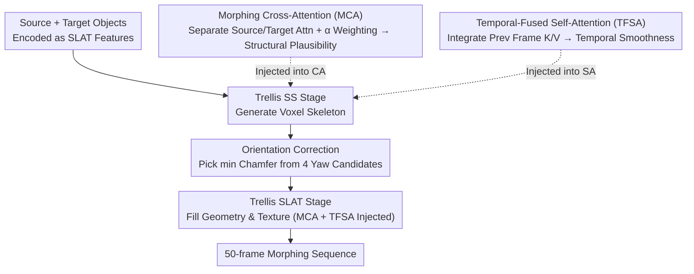

# MorphAny3D: Unleashing the Power of Structured Latent in 3D Morphing

**Conference**: CVPR 2026  
**arXiv**: [2601.00204](https://arxiv.org/abs/2601.00204)  
**Code**: [https://xiaokunsun.github.io/MorphAny3D.github.io/](https://xiaokunsun.github.io/MorphAny3D.github.io/)  
**Area**: Image Generation / 3D Vision  
**Keywords**: 3D Morphing, SLAT, Attention Mechanism, Training-free, Trellis

## TL;DR
MorphAny3D is proposed as the first training-free 3D morphing framework based on Structured Latent (SLAT) representation. It achieves SOTA quality in cross-category 3D morphing by integrating source/target information via Morphing Cross-Attention (MCA) to ensure structural plausibility, enhancing temporal consistency with Temporal-Fused Self-Attention (TFSA), and eliminating abrupt transitions through an orientation correction strategy.

## Background & Motivation

**Background**: 3D morphing is a fundamental technology in animation, film, and gaming. Traditional methods rely on dense correspondence matching and interpolation to generate intermediate shapes. While 2D morphing has made significant progress using diffusion models, 3D morphing remains challenging.

**Limitations of Prior Work**: (a) Matching-based methods focus on geometric deformation while ignoring textures, and cross-category correspondence is unreliable; (b) combining 2D morphing with frame-by-frame 3D reconstruction destroys temporal consistency; (c) direct interpolation in noise or condition space lacks structural plausibility constraints.

**Key Challenge**: Achieving smooth, high-fidelity, and temporally consistent cross-category morphing within a 3D generator framework is an open problem.

**Goal**: How to leverage the structural advantages of SLAT representation to achieve high-quality 3D morphing?

**Key Insight**: A key observation is that directly fusing source/target SLAT features within the attention mechanism of Trellis produces more plausible deformations than interpolating at the noise or condition level. However, naive KV fusion interferes with itself when used simultaneously in Cross-Attention (CA) and Self-Attention (SA).

**Core Idea**: Separately calculate source/target attention in CA followed by weighted fusion (MCA), integrate features from the previous frame in SA (TFSA), and apply orientation correction based on statistics.

## Method

### Overall Architecture
The objective of MorphAny3D is straightforward: given a source object $x^{src}$ and a target object $x^{tgt}$, generate a smooth sequence of $N=50$ morphing frames $\{x^n\}_{n=0}^{N}$, with the transition progress linearly controlled by $\alpha^n = n/N$. The framework is built entirely on the pretrained Trellis Image-to-3D generator without any retraining—all "morphing" occurs within the attention layers during Trellis inference. Trellis encodes a 3D object into Structured Latent (SLAT) and proceeds through two stages: the Sparse Structure (SS) stage defines the voxel skeleton, and the SLAT stage fills in geometric and texture details. MorphAny3D injects both source and target features into the attention computations of both stages, allowing the generator to "interpolate" structurally plausible intermediate forms. Finally, an orientation correction step eliminates occasional sudden pose jumps. The core mechanism involves decoupling fusion strategies: Morphing Cross-Attention (MCA) in CA ensures structural plausibility, while Temporal-Fused Self-Attention (TFSA) in SA ensures temporal smoothness.

### Key Designs

**1. Placement of Fusion: Decoupling CA and SA**

Directly blending source/target SLAT features for the generator is ineffective because CA and SA react oppositely to fusion. Diagnostic tests show that fusing source/target K and V in CA (KV-Fused CA) significantly improves structural plausibility (lower FID) but leaves local distortions. Conversely, fusing in SA (KV-Fused SA) makes the sequence smoother (lower PPL). However, using both simultaneously destroys plausibility. This observation leads to the design: CA and SA must use distinct fusion strategies.

**2. Morphing Cross-Attention (MCA): Compute Separately, Then Fuse**

KV-Fused CA causes local distortions because it mixes two sets of DINOv2 condition features at the patch level, where the same spatial position often corresponds to different semantic parts. MCA resolves this by not mixing K/V. Instead, the query computes full attention against source and target conditions separately, then weights the results by $\alpha^n$:

$$\text{MCA}(Q^n, K^{src/tgt}, V^{src/tgt}) = (1-\alpha^n)\,\text{Attn}(Q^n, K^{src}, V^{src}) + \alpha^n\,\text{Attn}(Q^n, K^{tgt}, V^{tgt})$$

This ensures semantic consistency within each attention map. t-SNE visualizations of intermediate frame feature trajectories show that MCA results in a stable, smooth glide from source to target, whereas KV-Fused CA trajectories are chaotic and fractured.

**3. Temporal-Fused Self-Attention (TFSA): Fusing Neighbors, Not Endpoints**

Smoothness is handled by SA, but simple source/target feature mixing (KV-Fused SA) forces endpoints into every frame, damaging fidelity. TFSA instead fuses the K and V features of the **previous frame** into the current self-attention:

$$\text{TFSA} = (1-\beta)\,\text{Attn}(Q^n, K^n, V^n) + \beta\,\text{Attn}(Q^n, K^{n-1}, V^{n-1}), \quad \beta=0.2$$

Unlike KV-Fused SA which mixes fixed endpoints, TFSA integrates the immediately preceding frame, which is already validated as plausible. This naturally inherits continuity from adjacent frames without introducing irrelevant endpoint information.

**4. Orientation Correction Strategy: Addressing Discrete Pose Priors**

Occasional sudden "posture flips" occur during morphing. Statistical analysis of sequences reveals that these jumps: (a) cluster around the midpoint $\alpha\approx 0.5$; (b) occur at specific yaw angles (90°, 180°, 270°); and (c) correspond to the discrete pose priors learned by Trellis. Correction involves generating four yaw rotation candidates $\{P^n, P_{90°}^n, P_{180°}^n, P_{270°}^n\}$ for voxels $P^n$ at the SS stage and selecting the one with the minimum Chamfer Distance to the previous frame $P^{n-1}$. This non-intrusive step only affects frames where a jump is detected.

## Key Experimental Results

### Main Results

| Method | FID↓ | PPL↓ | PDV↓ | AS(%)↑ | UP(%)↑ |
|------|------|------|------|--------|--------|
| 3DInterp | 409.1 | 2.55 | 0.0006 | 1.0 | 0.6 |
| DiffMorpher→3D | 208.1 | 6.65 | 0.0021 | 5.0 | 0.8 |
| DirectInterp | 150.9 | 3.72 | 0.0039 | 2.0 | 5.5 |
| MorphFlow | 285.0 | 2.41 | 0.0009 | 0.0 | 1.6 |
| **Ours** | **112.0** | 2.47 | **0.0006** | **81.0** | **86.7** |

### Ablation Study

| Method | FID↓ | PPL↓ | PDV↓ |
|------|------|------|------|
| KV-Fused CA | 125.5 | 3.82 | 0.0013 |
| MCA | 112.2 | 3.66 | 0.0010 |
| MCA + TFSA | 113.2 | 2.87 | 0.0007 |
| MCA + TFSA + OC | **112.0** | **2.47** | **0.0006** |

### Key Findings
- MorphAny3D achieved an 86.7% user preference rate, significantly outperforming all methods.
- MCA is critical for plausibility (FID reduced from 125.5 to 112.2).
- TFSA is critical for smoothness (PPL reduced from 3.66 to 2.87).
- Orientation correction further reduces PPL to 2.47 (approaching the 2.41 lower bound of matching-based methods).
- Extends directly to Hi3DGen and Text-to-3D Trellis, demonstrating versatility.

## Highlights & Insights
- **Post-Attention Fusion vs. KV Fusion**: A core insight is that the former maintains semantic correctness. This design pattern can migrate to any attention-based generative model requiring multi-source condition fusion.
- **Statistics-Driven Orientation Correction**: Deriving a correction strategy from data statistics is simple, effective, and free of side effects.
- **Decoupled Morphing**: Selectively applying MCA to SS/SLAT stages allows decoupling of global structure and local detail morphing, supporting dual-target morphing and style transfer.

## Limitations & Future Work
- Inherits the fine-structure generation limitations of Trellis.
- Orientation correction may fail for objects with yaw symmetry.
- High runtime with 30s per frame and 24GB VRAM requirement.

## Related Work & Insights
- **vs. 3DMorpher**: Based on 3DGS, it cannot handle complex geometry and is incompatible with commercial 3D software; MorphAny3D is more general due to SLAT.
- **vs. DiffMorpher/FreeMorph**: These perform 2D morphing before frame-by-frame 3D lifting, causing temporal inconsistency; MorphAny3D operates directly within the 3D generative framework.

## Rating
- Novelty: ⭐⭐⭐⭐⭐ First SLAT-based training-free 3D morphing with profound attention fusion analysis.
- Experimental Thoroughness: ⭐⭐⭐⭐ Comprehensive quantitative, user study, ablation, application, and transfer experiments.
- Writing Quality: ⭐⭐⭐⭐⭐ Complete logical chain from observation to validation to design.
- Value: ⭐⭐⭐⭐ Directly applicable to 3D content creation.

<!-- RELATED:START -->

## Related Papers

- [\[ECCV 2024\] TextDiffuser-2: Unleashing the Power of Language Models for Text Rendering](../../ECCV2024/image_generation/textdiffuser-2_unleashing_the_power_of_language_models_for_text_rendering.md)
- [\[CVPR 2026\] Vinedresser3D: Agentic Text-guided 3D Editing](vinedresser3d_agentic_text-guided_3d_editing.md)
- [\[CVPR 2026\] LumiX: Structured and Coherent Text-to-Intrinsic Generation](lumix_structured_and_coherent_text-to-intrinsic_generation.md)
- [\[CVPR 2026\] EditMGT: Unleashing Potentials of Masked Generative Transformers in Image Editing](editmgt_unleashing_potentials_of_masked_generative_transformers_in_image_editing.md)
- [\[CVPR 2026\] SketchDeco: Training-Free Latent Composition for Precise Sketch Colourisation](sketchdeco_training-free_latent_composition_for_precise_sketch_colourisation.md)

<!-- RELATED:END -->
