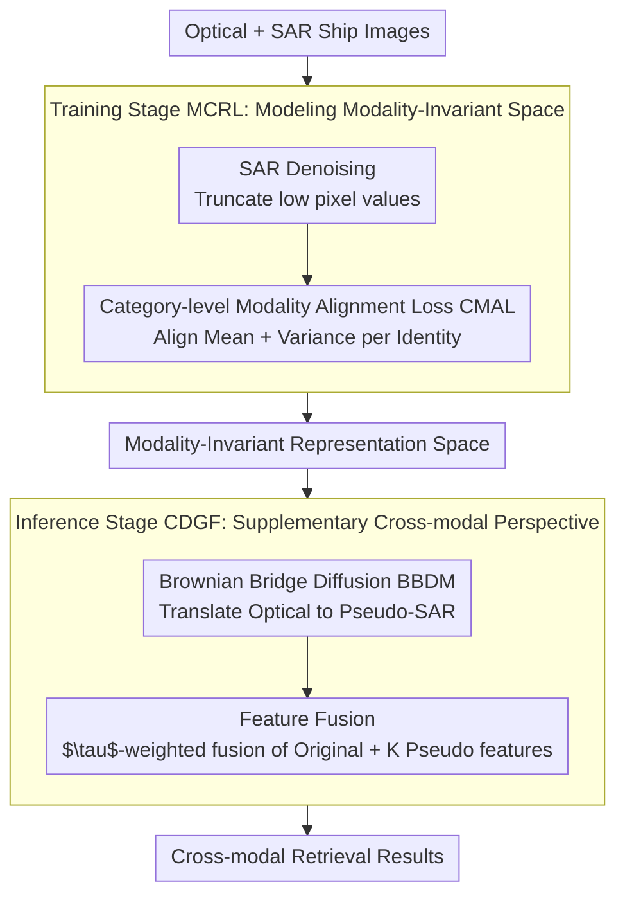

# MOS: Mitigating Optical-SAR Modality Gap for Cross-Modal Ship Re-Identification

**Conference**: CVPR 2026  
**arXiv**: [2512.03404](https://arxiv.org/abs/2512.03404)  
**Code**: Coming soon  
**Area**: Image Generation / Cross-Modal Retrieval  
**Keywords**: Cross-modal ReID, Optical-SAR, Ship Identification, Diffusion Bridge Model, Modality Alignment

## TL;DR
The MOS framework is proposed to address the Optical-SAR modality gap in ship re-identification via two core modules: (1) MCRL, which narrows the gap during training through SAR denoising and category-level modality alignment loss; (2) CDGF, which utilizes a Brownian Bridge Diffusion Model during inference to generate pseudo-SAR samples from optical images for feature fusion. On the HOSS ReID dataset, it achieves a +16.4% R1 improvement in the SAR→Optical task.

## Background & Motivation

**Background**: Ship ReID is critical for maritime surveillance and management. SAR sensors enable all-weather, all-day imaging but contain severe speckle noise. Optical-SAR cross-modal ReID is highly challenging due to the significant modality gap. Only two pioneering works (TransOSS, SMART-Ship) exist in this domain.

**Limitations of Prior Work**: (a) Fundamental differences in imaging physics between optical and SAR sensors lead to misaligned features; (b) inherent SAR speckle noise severely interferes with feature extraction; (c) models tend to focus on intra-modality matching while ignoring correct cross-modal matches—modality variance dominates identity variance.

**Key Challenge**: The conflict between the modality gap and identity discriminative power—reducing the modality gap while maintaining identity separation.

**Goal**: Narrow the Optical-SAR modality gap during both the training and inference stages.

**Key Insight**: It is observed that SAR noise is concentrated in low-pixel value regions, and modality distribution alignment can be decomposed into two independent components: mean and variance.

**Core Idea**: Training stage performs SAR denoising + category-level Wasserstein alignment; inference stage performs cross-modal generation via diffusion bridge + feature fusion.

## Method

### Overall Architecture
MOS addresses a specific problem: when optical cameras and SAR radars capture the same ship, the imaging mechanisms are vastly different, causing models to be misled by modality differences during retrieval. The authors strategy involves splitting the task of "mitigating the modality gap" into training and inference phases. Given a dataset $\mathcal{D} = \{(I_i, y_i, m_i)\}$, where each image has an identity label $y_i$ and modality marker $m_i \in \{opt, sar\}$. During training, the MCRL branch removes speckle noise from SAR images and uses a category-level alignment loss to pull optical and SAR features of the same identity together, learning a modality-invariant representation. During inference, the CDGF branch uses a diffusion bridge model to "translate" optical features into pseudo-SAR features, which are then fused with the original features, effectively providing a "cross-modal perspective" for each query. These two branches complement each other by establishing a shared space at the source and supplementing cross-modal views at the end.

### Key Designs

**1. SAR Denoising: Filtering speckle noise at the source**

SAR speckle noise directly interferes with feature extraction. The authors observe that this noise is not uniformly distributed but concentrated in low-pixel value regions. The processing involves sorting all pixel values and truncating the lowest $\alpha\%$, then linearly re-normalizing the remaining pixels to $[0, 255]$:

$$\hat{p}_k = \frac{255(p_k - p_{min})}{p_{max} - p_{min} + \epsilon}$$

Despite its simplicity and lack of learnable parameters, this targeted approach consistently yields performance gains by addressing noise distribution.

**2. Category-level Modality Alignment Loss (CMAL): Aligning per-identity distributions**

CMAL avoids coarse global domain alignment and instead computes alignment for each identity $c$ individually. It calculates the class centers $\mu_{opt}^c, \mu_{sar}^c$ and variances $\text{var}_{opt}^c, \text{var}_{sar}^c$ for optical and SAR features of that identity, then minimizes both the mean and variance differences:

$$\mathcal{L}_{CMAL} = \frac{1}{|C|}\sum_{c\in C}\left(\|\mu_{opt}^c - \mu_{sar}^c\|_2^2 + \|\text{var}_{opt}^c - \text{var}_{sar}^c\|_2^2\right)$$

Under diagonal covariance approximation, this formulation serves as a computable approximation of the Wasserstein-2 distance. The mean term pulls class centers together, while the variance term aligns intra-class dispersion. This is combined with identity and triplet losses for the total training objective:

$$\mathcal{L} = \lambda_{id}\mathcal{L}_{ID} + \lambda_{tri}\mathcal{L}_{Triplet} + \lambda_{cmal}\mathcal{L}_{CMAL}$$

**3. Cross-modal Generation and Feature Fusion (CDGF): Generating the "other modality" at inference**

Aligning the feature space during training is insufficient when queries and the gallery contain only a single modality. CDGF addresses this by generating the missing modality during inference. A Brownian Bridge Diffusion Model (BBDM) is trained for this translation, with a forward process defined as:

$$q(x_t|x_0,y) = \mathcal{N}\!\left(x_t;\, (1-m_t)x_0 + m_t y,\; \delta_t I\right)$$

where $x_0$ is the SAR latent feature and $y$ is the optical feature. BBDM's endpoints are fixed ($t=0$ for SAR, $t=1$ for optical), making it inherently suited for cross-modal mapping compared to unconstrained models like CycleGAN. At inference, $K$ pseudo-SAR features are generated for an optical query and fused with the original feature using weight $\tau$:

$$f_{fused}^i = \frac{(1-\tau)f_{opt}^i + \tau\left(\frac{1}{K}\sum_{k=1}^K f_{pseudo}^{i,k}\right)}{\left\|(1-\tau)f_{opt}^i + \tau\left(\frac{1}{K}\sum_{k=1}^K f_{pseudo}^{i,k}\right)\right\|_2}$$

### Loss & Training
- Backbone uses ViT, following the TransOSS baseline; loss weights $\lambda_{id} = \lambda_{tri} = 1$.
- BBDM is trained separately as an inference-time generator and is not jointly optimized with the backbone.

## Key Experimental Results

### Main Results on HOSS ReID

| Method | Type | ALL2ALL mAP/R1 | O→SAR mAP/R1 | SAR→O mAP/R1 |
|------|------|---------------|--------------|--------------|
| TransReID | Single-modal ReID | 48.1/60.8 | 27.3/18.5 | 20.9/11.9 |
| DEEN | Cross-modal ReID | 43.8/58.5 | 31.3/21.5 | 27.4/22.4 |
| VersReID | Cross-modal ReID | 49.3/59.7 | 25.7/13.8 | 27.7/17.9 |
| TransOSS | Optical-SAR | 57.4/65.9 | 48.9/33.8 | 38.7/29.9 |
| **MOS (Ours)** | Optical-SAR | **60.4/68.8** | **51.4/40.0** | **48.7/46.3** |

### Ablation Study

| Config | ALL R1 | O→SAR R1 | SAR→O R1 | Description |
|------|--------|----------|----------|------|
| Baseline TransOSS | 65.9 | 33.8 | 29.9 | No enhancement |
| + SAR Denoising | 66.5 | 35.4 | 32.8 | Effective denoising |
| + CMAL | 67.6 | 38.5 | 40.3 | Core modality alignment |
| + CDGF | **68.8** | **40.0** | **46.3** | Further Gain from generation |

### Key Findings
- The largest improvement is seen in the SAR→Optical direction (+16.4% R1) as CDGF creates pseudo-SAR matches for optical queries.
- CMAL is the training-stage core: SAR→O R1 increases from 29.9 to 40.3.
- CDGF inference enhancement contributes an additional +6.0 points.
- SAR denoising via low-pixel truncation is effective against speckle noise despite its simplicity.

## Highlights & Insights
- **Diagonal Approximation of Wasserstein Alignment**: Simplifying the matrix square root calculation of the $W_2$ distance into element-wise mean and variance alignment is computationally efficient and effective.
- **Synergy between Training and Inference**: MCRL establishes a shared space during training, while CDGF bridges the gap further during inference.
- **BBDM for Cross-Modal Translation**: Utilizing the endpoint properties of BBDM naturally fits the cross-modality mapping task.

## Limitations & Future Work
- The HOSS dataset is relatively small; scalability to larger datasets requires validation.
- The denoising strategy is very simple; advanced SAR denoising techniques might yield better results.
- CDGF inference overhead: multiple diffusion sampling steps are required for each query.
- Multi-scale feature fusion and hard sample mining were not discussed.

## Related Work & Insights
- **vs TransOSS**: MOS adds specialized modality alignment and cross-modal generation modules to the TransOSS baseline.
- **vs Face/Pedestrian ReID**: General cross-modal methods underperform in the Optical-SAR domain, necessitating domain-specific designs.
- **vs GAN-based Translation**: BBDM is more stable than CycleGAN and generates more diverse samples.

## Rating
- Novelty: ⭐⭐⭐ Creative use of Wasserstein approximation and BBDM fusion.
- Experimental Thoroughness: ⭐⭐⭐⭐ Multi-protocol evaluation and detailed ablation.
- Writing Quality: ⭐⭐⭐⭐ Clear theoretical derivation and experimental design.
- Value: ⭐⭐⭐ Specific but solid contribution to Optical-SAR ReID.

<!-- RELATED:START -->

## Related Papers

- [\[CVPR 2026\] Cross-Modal Emotion Transfer for Emotion Editing in Talking Face Video](cross-modal_emotion_transfer_for_emotion_editing_in_talking_face_video.md)
- [\[AAAI 2026\] Multi-Aspect Cross-modal Quantization for Generative Recommendation](../../AAAI2026/image_generation/multi-aspect_cross-modal_quantization_for_generative_recommendation.md)
- [\[ICLR 2026\] Uni-X: Mitigating Modality Conflict with a Two-End-Separated Architecture for Unified Multimodal Models](../../ICLR2026/image_generation/uni-x_mitigating_modality_conflict_with_a_two-end-separated_architecture_for_uni.md)
- [\[CVPR 2025\] Modeling Thousands of Human Annotators for Generalizable Text-to-Image Person Re-identification](../../CVPR2025/image_generation/modeling_thousands_of_human_annotators_for_generalizable_text-to-image_person_re.md)
- [\[ICCV 2025\] Rethinking Cross-Modal Interaction in Multimodal Diffusion Transformers](../../ICCV2025/image_generation/rethinking_cross-modal_interaction_in_multimodal_diffusion_transformers.md)

<!-- RELATED:END -->
