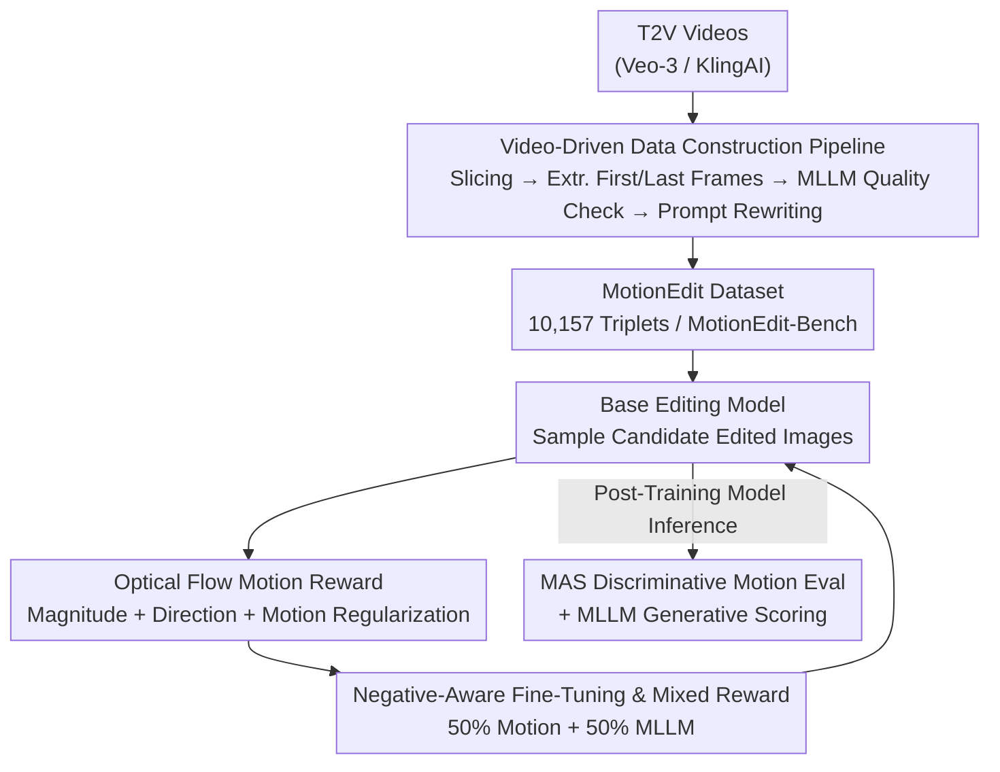

# MotionEdit: Benchmarking and Learning Motion-Centric Image Editing

**Conference**: CVPR 2026  
**Paper**: [CVF Open Access](https://openaccess.thecvf.com/content/CVPR2026/html/Wan_MotionEdit_Benchmarking_and_Learning_Motion-Centric_Image_Editing_CVPR_2026_paper.html)  
**Code**: https://github.com/elainew728/motion-edit  
**Area**: Image Generation / Instruction-based Image Editing  
**Keywords**: Motion Editing, Image Editing Benchmark, Optical Flow Reward, Negative-Aware Fine-Tuning, Diffusion Post-Training

## TL;DR
This paper formally establishes **motion-centric image editing**—modifying the subject's action, pose, or interaction while retaining its appearance—as an independent task. By mining 10,157 high-quality "before-and-after" frame triplets from real videos, the authors construct the MotionEdit dataset and benchmark. They propose MotionNFT, a post-training framework that utilizes optical flow motion alignment scores as rewards to extend DiffusionNFT, significantly improving motion editing fidelity for FLUX.1 Kontext and Qwen-Image-Edit without compromising general editing capabilities.

## Background & Motivation

**Background**: Instruction-based image editing (InstructPix2Pix, MagicBrush, UltraEdit, OmniEdit, FLUX.1 Kontext, Qwen-Image-Edit, etc.) has advanced rapidly, performing exceptionally well on **static appearance editing** like color alteration, texture replacement, and object addition/removal.

**Limitations of Prior Work**: However, when instructions involve **motion, pose, or interaction editing**—such as "make the cow lift one leg," "make the woman look down to drink coffee," or "make the two characters turn to face each other"—existing models often fail. They either remain static with minor color changes, execute incorrect movements, or introduce severe artifacts and identity drift in faces and bodies. The authors attribute the root cause to data, identifying two bottlenecks: ① Mainstream editing datasets almost exclusively cover static editing, completely lacking motion editing data. ② The few datasets containing motion editing (InstructP2P, MagicBrush) are small and noisy, with unfaithful target images (e.g., the instruction says to lift a leg, but the ground-truth leg remains down, or it says to hold a rifle, but the hand is empty), accompanied by appearance drift and viewpoint shifts. Both training supervision and evaluation are distracted by such noisy data.

**Key Challenge**: High-quality ground-truth for motion editing is extremely difficult to obtain. Synthesizing target images using generative models, as in prior work, introduces hallucinations and inconsistencies. Meanwhile, motion editing requires "changing the action while keeping identity, background, and viewpoint unchanged," a paired supervision that is virtually impossible to obtain stably via manual effort or synthesis.

**Goal**: (1) Provide a clear task definition and taxonomy for motion-centric image editing; (2) Create a truly clean dataset and evaluation benchmark with large-magnitude motions; (3) Design a training methodology that directly supervises the correctness of the motion.

**Key Insight**: Real videos naturally contain coherent and physically plausible motion transitions. Between two frames in the same video segment, the subject moves while identity, background, and style remain naturally consistent. Therefore, rather than synthesizing target images, it is better to **mine frame pairs from videos**. Combined with the classic concept that "motion equals optical flow" (where optical flow pixel-wise describes the magnitude and direction of motion), optical flow can serve as both an **evaluation metric** and a **training reward**.

**Core Idea**: Build high-quality motion editing triplets using a "video mining + MLLM quality checks" pipeline, and then drive negative-aware fine-tuning (DiffusionNFT) via "optical flow alignment awards" to steer model outputs toward matching the ground-truth motion magnitude and direction.

## Method

### Overall Architecture

The work consists of two main parts: **the first half focuses on data and benchmarking** (how to build reliable motion editing supervision), and **the second half focuses on the learning method** (how to feed this supervision into models). On the data side, the authors slice and extract the first and last frames from high-definition videos generated by T2V models (Veo-3, KlingAI), use MLLMs as Quality Inspectors to filter out camera shake, disappearing subjects, and artifacts, and rewrite "motion transition summaries" into a user-like editing prompt style via MLLMs. This yields triplets of (original image $I_{orig}$, edit instruction, target image $I_{gt}$). On the learning side, given an image to edit, the base editing model (FLUX.1 Kontext / Qwen-Image-Edit) samples candidate edited images $I_{edited}$. A pre-trained optical flow network (UniMatch) estimates two flows ("input to edited" and "input to ground-truth"), compares their magnitude, direction, and whether motion actually occurred, aggregates them into a MotionNFT reward, and updates the model following the positive/negative velocity objectives of DiffusionNFT. On the evaluation side, a deterministic metric called MAS is introduced, coupled with MLLM generative scoring.

### Key Designs

**1. Video-Driven Data Construction Pipeline: Replacing synthetic targets with real video frames and leveraging MLLMs for quality control**

Addressing the issue that synthetic target images inevitably contain hallucinations and paired supervision is hard to obtain, the authors **mine natural motion transitions from dynamic videos** instead of synthesizing them. The pipeline is: First, retrieve candidate videos from two public T2V video datasets, ShareVeo3 and KlingAI (the reason for not using human action datasets like HAA500 or K400 is their low resolution, motion blur, and view jumps, which make extracting frames with consistent identity/background impossible). Slice each video into 3-second windows, taking the first and last frames as candidate motion pairs. Then, use Gemini as an **automated quality inspector** to score each pair along three dimensions: **Setting Consistency** (stability of background, viewpoint, and lighting), **Motion and Interaction Change** (presence of significant and meaningful action/interaction changes, summarized into transitions like "not holding a cup → drinking"), and **Subject Integrity and Quality** (completeness, recognizability of the subject, and absence of occlusion, zooming, hallucination, or distortion). Only pairs meeting all four criteria (stable scene, non-trivial change, subject consistency, high image quality) are retained. The retained pairs pass through an **MLLM rewriting module** to clean the summarized motion into imperative, user-like instructions (e.g., "Make the woman turn her head toward the dog."), ensuring instructions strictly align with the actual motion in the images. The greatest value of this pipeline is its **scalability**: expanding data requires only larger video corpora without manual labeling. The final dataset consists of 10,157 pairs (6,006 from Veo-3, 4,151 from KlingAI), split 90/10 into 9,142 training and 1,015 test samples (MotionEdit-Bench), categorized into six motion types: pose/body shape, translation/distance, object state/deformation, orientation/viewpoint, subject-object interaction, and subject-subject interaction.

**2. Optical Flow Motion Reward: Quantifying "whether motion is correct" into a differentiable scalar reward**

Addressing the limitation that existing RL post-training methods are motion-agnostic, focusing only on semantic alignment and details without supervising how the subject moves, the authors design a **motion-centric reward based on optical flow**. Given a triplet $X=(I_{orig}, I_{edited}, I_{gt})$, the pre-trained UniMatch is used to estimate two flows: predicted motion $V_{pred}=F(I_{orig}, I_{edited})$ and ground-truth motion $V_{gt}=F(I_{orig}, I_{gt})$, each $\in \mathbb{R}^{H\times W\times 2}$, normalized by the image's diagonal to eliminate scale discrepancies. The reward consists of three items: **Motion Magnitude Consistency** uses a robust $\ell_1$ distance $D_{mag}=\frac{1}{HW}\sum_{i,j}(\|\tilde V_{pred}(i,j)-\tilde V_{gt}(i,j)\|_1+\varepsilon)^q$ ($q\in(0,1)$ to suppress outliers); **Motion Direction Consistency** uses pixel-wise cosine error $e_{dir}(i,j)=\frac{1}{2}(1-\hat v_{pred}(i,j)^\top \hat v_{gt}(i,j))$ weighted by the ground-truth motion magnitude $w(i,j)$, making large-motion regions more critical: $D_{dir}=\frac{\sum_{i,j} w(i,j)e_{dir}(i,j)}{\sum_{i,j} w(i,j)+\varepsilon}$; **Motion Regularization** penalizes lazy edits that barely move: $M_{move}=\max\{0,\ \tau+\frac{1}{2}\bar m_{gt}-\bar m_{pred}\}$, which inflicts a penalty when the average predicted motion is significantly smaller than the ground truth. These three items aggregate into a composite distance:

$$D_{comb}=\alpha D_{mag}+\beta D_{dir}+\lambda_{move}M_{move}$$

Then, normalized and clipped: $\tilde D=\text{clip}((D_{comb}-D^*_{min})/(D_{max}-D^*_{min}),0,1)$, converted to a continuous reward $r_{cont}=1-\tilde D$, and finally quantized into 6 discrete bins $r_{motion}=\frac{1}{5}\text{round}(5\,r_{cont})\in\{0.0,0.2,0.4,0.6,0.8,1.0\}$. Compared with rewards from MLLM scoring alone, this reward is **deterministic, interpretable, and directly aligned with motion geometry**—it explicitly informs the model if the "direction is off" or "magnitude is insufficient" rather than offering a vague preference.

**3. Negative-Aware Fine-Tuning & Mixed Rewards: Injecting motion rewards into DiffusionNFT while preserving general editing capabilities**

After obtaining the scalar motion reward, a post-training framework is required to translate it into parameter updates. The authors build on **DiffusionNFT**, which trains a rectified Flow Matching Model (FMM) by simultaneously learning a positive velocity $v^+_\theta$ to approach and a negative velocity $v^-_\theta$ to avoid, using the objective:

$$L(\theta)=\mathbb{E}_{c,\pi_{old},t}\big[r\,\|v^+_\theta(x_t,c,t)-v\|_2^2+(1-r)\,\|v^-_\theta(x_t,c,t)-v\|_2^2\big]$$

where $v^+_\theta=(1-\beta)v_{old}+\beta v_\theta$, $v^-_\theta=(1+\beta)v_{old}-\beta v_\theta$, and $r$ is the "optimality reward" obtained by normalizing the raw reward per prompt: $r=\frac{1}{2}+\frac{1}{2}\text{clip}(\frac{r_{raw}-\mathbb{E}_{\pi_{old}}[r_{raw}]}{Z_c},-1,1)$, stabilizing the classification of positive and negative samples. The key in MotionNFT is feeding $r_{motion}$ from Section 2 as the reward signal. However, solely using motion rewards can have side effects—the model might sacrifice general editing quality for the sake of "moving more." Thus, the authors adopt a **mixed reward**: 50% optical flow motion reward $r_{motion}$ and 50% online MLLM scoring from UniWorld-V2 (using Qwen2.5-VL-32B-Instruct deployed via vLLM to score prompt adherence, style fidelity, etc., in real-time during training). The optical flow portion runs locally on the training node with the lightweight UniMatch (335.6M parameters), keeping overhead minimal. This division of labor—where flow reward handles motion and MLLM reward handles semantics and appearance—allows the model to acquire motion editing capabilities without deteriorating its pre-trained general editing performance.

**4. MAS Discriminative Motion Evaluation: Equipping the benchmark with a deterministic motion metric free of MLLM dependency**

To avoid the subjectivity and variance associated with generative MLLM scoring, the authors introduce a deterministic **Motion Alignment Score (MAS)** for evaluation. It reuses the motion magnitude term $D_{mag}$ and direction term $D_{dir}$ from Section 2, combining them as $D_{ovl}=\alpha D_{mag}+(1-\alpha)D_{dir}$, which is then normalized into a 0–100 scale: $\text{MAS}=100\cdot(1-\text{clip}((D_{ovl}-d_{min})/(d_{max}-d_{min}),0,1))$. A higher score indicates closer alignment with ground-truth motion. Importantly, a safeguard is employed: if the predicted motion is nearly static compared to the ground truth ($\mathbb{E}[m_{pred}]/\mathbb{E}[m_{gt}]<\rho_{min}$), the MAS score is directly set to 0 to penalize the degenerate behavior of "not editing." Alongside MAS, the benchmark uses Gemini as an MLLM evaluator to score Fidelity, Preservation, Coherence, and Overall (0–5 scale) and compute a head-to-head **Pairwise Win Rate** ($(wins + 0.5 \cdot draws)/total$). This combination of generative (for visual quality), discriminative (for motion geometry), and preference (for relative comparison) metrics ensures a robust and comprehensive evaluation.

### Loss & Training
The training objective is the positive/negative velocity regression loss of DiffusionNFT (eq. $L(\theta)$ above), where the reward $r$ is normalized from the mixed reward (50% $r_{motion}$ + 50% MLLM score). The base models are FLUX.1 Kontext [Dev] and Qwen-Image-Edit. FSDP is used to shard text encoders and gradient checkpointing is enabled to save GPU memory. The MLLM scoring relies on Qwen2.5-VL-32B-Instruct deployed online via vLLM, while optical flow is inferred locally on training nodes using UniMatch.

## Key Experimental Results

### Main Results

Evaluation of 9 open-source editing models on MotionEdit-Bench (Generative metrics on a 0–5 scale, MAS on 0–100, Win Rate as percentage). Enhancing the two strong baselines with MotionNFT consistently improves all metrics:

| Model | Overall↑ | Fidelity↑ | Preservation↑ | Coherence↑ | MAS↑ | Win Rate↑ |
|------|---------|----------|--------------|-----------|------|----------|
| Instruct-P2P | 1.30 | 1.32 | 1.29 | 1.29 | 34.15 | 16.09 |
| AnyEdit | 1.31 | 1.32 | 1.32 | 1.30 | 35.11 | 16.88 |
| MagicBrush | 1.50 | 1.58 | 1.47 | 1.44 | 44.24 | 19.51 |
| UltraEdit | 2.42 | 1.88 | 2.09 | 2.13 | 47.18 | 28.33 |
| UniWorld-V1 | 2.87 | 2.96 | 2.76 | 2.88 | 55.37 | 41.14 |
| Step1X-Edit | 4.02 | 4.04 | 3.99 | 4.02 | 52.98 | 61.14 |
| BAGEL | 4.10 | 4.24 | 4.01 | 4.06 | 51.83 | 61.46 |
| FLUX.1 Kontext [Dev] | 3.84 | 3.89 | 3.79 | 3.83 | 53.73 | 57.71 |
| **+MotionNFT (Ours)** | **4.25** | **4.33** | **4.16** | **4.25** | **55.45** | **64.95** |
| Qwen-Image-Edit | 4.65 | 4.70 | 4.59 | 4.66 | 56.46 | 72.80 |
| **+MotionNFT (Ours)** | **4.72** | **4.79** | **4.63** | **4.74** | **57.23** | **73.67** |

For FLUX.1 Kontext, Overall improves from 3.84 to 4.25 (+10.68%), Fidelity increases by +0.44, Coherence by +0.42, MAS from 53.73 to 55.45, and Win Rate rises by approximately +12.40% (reported as 57.97% to 65.16% in the main text; the table lists base 57.71 and ours 64.95 ⚠️ please refer to the original paper, as there are slight discrepancy margins between the text and the table). For the stronger Qwen-Image-Edit, gains are smaller but consistently positive (Overall 4.65→4.72, MAS 56.46→57.23). Another notable observation: early models such as Instruct-P2P, AnyEdit, and MagicBrush perform poorly on both generative and discriminative metrics (Overall ~1.3), highlighting that motion editing remains a significant challenge for most open-source models.

### Ablation Study

**General editing performance (ImgEdit-Bench, 8 sub-tasks, 0–5 scale)** — verifying that MotionNFT does not compromise pre-existing general editing capabilities, but often enhances them:

| Model | Add | Adj. | Rpl. | Rem. | Bck. | Stl. | Hyb. | Act. | Ovl.↑ |
|------|-----|------|------|------|------|------|------|------|-------|
| FLUX.1 Kontext | 3.54 | 2.90 | 3.73 | 2.89 | 3.59 | 3.96 | 2.90 | 2.56 | 3.26 |
| + MotionNFT | 3.71 | 3.28 | 3.93 | 3.05 | 3.72 | 4.41 | 2.99 | 2.85 | **3.50** |
| Qwen-Image-Edit | 4.20 | 3.70 | 4.22 | 4.20 | 4.17 | 4.60 | 3.55 | 4.03 | 4.08 |
| + MotionNFT | 4.31 | 3.72 | 4.46 | 4.30 | 4.21 | 4.67 | 3.96 | 3.87 | **4.20** |

**Comparison with MLLM-only reward (UniWorld-V2)** — demonstrating that the optical flow motion reward is more targeted than "scoring with MLLM alone":

| Model | Overall↑ | MAS↑ | Win Rate↑ |
|------|---------|------|----------|
| FLUX.1 Kontext | 3.84 | 53.73 | 57.97 |
| + UniWorld-V2 (MLLM-only) | 4.20 | 54.58 | 64.02 |
| **+MotionNFT (Ours)** | **4.25** | **55.45** | **65.16** |
| Qwen-Image-Edit | 4.65 | 56.46 | 73.01 |
| + UniWorld-V2 (MLLM-only) | 4.70 | 56.46 | 72.77 |
| **+MotionNFT (Ours)** | **4.72** | **57.23** | **73.87** |

### Key Findings
- **The optical flow component in the mixed reward is the key contributor**: Table 3 shows that while the MLLM-only reward (UniWorld-V2) yields minor improvements, adding the optical flow motion reward leads to higher MAS and Win Rate. Specifically, on Qwen-Image-Edit, the MLLM-only reward achieves no absolute gain in MAS (56.46→56.46), whereas MotionNFT boosts it to 57.23, proving that only supervision targeted at motion geometry truly improves "whether the movement is correct."
- **Dataset motion magnitude far exceeds prior works**: The average input-to-target motion magnitude difference for MotionEdit is 0.19, compared to ~0.03 for MagicBrush/OmniEdit and ~0.07 for UltraEdit. This makes this dataset roughly 5.8× larger in motion than MagicBrush/OmniEdit and 3× larger than UltraEdit, establishing its high difficulty for motion-centric editing.
- **No compromise on general capabilities**: On ImgEdit-Bench, the Overall score of both baselines with MotionNFT increases from 3.26 to 3.50 and 4.08 to 4.20, indicating that fine-tuning with motion-centric data does not degrade the original editing distribution (except for minor drops in specific subcategories, like Qwen's Act. dropping from 4.03 to 3.87 ⚠️ refer to the original paper).
- **Diminishing returns on stronger baselines**: Since Qwen-Image-Edit is inherently stronger, the improvement brought by MotionNFT is visibly smaller than that on FLUX.1 Kontext, aligning with the intuition that a higher baseline leaves less headroom for improvement.

## Highlights & Insights
- **"Optical flow as both evaluation and reward" is the cleverest design choice**: The same optical flow alignment formulation supports the deterministic MAS metrics and acts as a differentiable training reward. Unifying evaluation and optimization with the same "motion geometry" language avoids misalignment between objectives.
- **Mining video frames bypasses the target synthesis hurdle**: The hardest part of motion editing is obtaining paired supervision where only motion changes while everything else remains static. The authors directly exploit the temporal continuity of real videos to obtain naturally aligned before-after frames, a paradigm transferable to other paired tasks where targets are hard to synthesize (e.g., expression editing, camera motion editing).
- **Motion regularization + setting MAS to zero for static edits are strong guardrails against laziness**: The easiest shortcut for a model to learn is "do nothing." These two designs explicitly minimize rewards/scores for stagnant predictions—a useful trick to reuse in any motion-related task.
- **Clear division of labor in the hybrid reward**: Leaving the "correctness of action" to deterministic optical flow and the "quality of semantics/appearance" to MLLMs ensures both tasks are managed effectively, allowing models to acquire new capabilities without degrading old ones.

## Limitations & Future Work
- **Data source relies completely on T2V generated videos**: While video outputs from Veo-3/KlingAI are clear and stable, they may deviate from real-world videos in physical plausibility and long-tail motion distributions, making the "realness" of the dataset essentially "the realism of high-quality generative videos."
- **Dependency on MLLMs for quality control and evaluation**: Gemini's keep/discard judgments and Fidelity/Coherence scores inherit the inherent bias and variance of MLLMs. Additionally, slight discrepancy margins exist in Win Rate reports between the main text and tables (⚠️ please refer to the original paper).
- **Questionable reliability of optical flow on large deformations and occlusions**: Motion editing frequently involves large displacements and self-occlusions, where UniMatch estimation errors can contaminate rewards. The paper leaves an in-depth analysis of these failure modes for future work.
- **Limited gains on strong baselines**: The improvement on Qwen-Image-Edit is relatively small, suggesting the method's ceiling may be bottlenecked by the base model's intrinsic motion understanding capabilities.
- **Potential improvements**: Upgrading rewards from 2D optical flow to 3D or depth-aware motion representations, or incorporating physical/articulatory constraints, could lead to more stable large-magnitude and highly-occluded motion editing.

## Related Work & Insights
- **vs. Static Appearance Editing Datasets (OmniEdit / UltraEdit / AnyEdit)**: These focus on color/texture/object replacement and barely contain motion editing. This work specifically supplements the motion dimension, with a motion magnitude 3–5.8× larger.
- **vs. Legacy Motion-containing Datasets (InstructP2P / MagicBrush)**: Their motion targets are mostly synthetic, often unfaithful, and prone to artifacts. In contrast, this work utilizes real video frames combined with MLLM quality checks to guarantee fidelity and consistency.
- **vs. DiffusionNFT / UniWorld-V2**: DiffusionNFT provides a negative-aware fine-tuning framework but lacks motion-aware rewards. UniWorld-V2 extends it with online MLLM scoring, which still only manages semantics and appearance. MotionNFT introduces optical flow motion rewards on top, achieving explicit post-training supervision of "how the subject should move" for the first time.
- **vs. Optical Flow Methods (UniMatch, etc.)**: Instead of improving optical flow estimation itself, this paper repurposes established optical flow estimation capabilities, transforming optical flow from an "analysis tool" into a "reward signal."

## Rating
- Novelty: ⭐⭐⭐⭐⭐ Formally establishes motion editing as an independent task and pioneers post-training driven by optical flow motion rewards, presenting novel problems and methods.
- Experimental Thoroughness: ⭐⭐⭐⭐ Covers 9 baselines, two strong backbones, and two ablation groups (general capabilities and MLLM-only rewards), leading to a solid study; however, a component-wise ablation of the three reward terms is missing.
- Writing Quality: ⭐⭐⭐⭐ The motivation-data-method-evaluation logical thread is clear with complete formulations; minor discrepancies in metric margins exist between the text and tables.
- Value: ⭐⭐⭐⭐⭐ Delivers both a dataset/benchmark and a plug-and-play post-training framework, offering direct utility for downstream tasks such as frame-controlled video generation and character animation.

<!-- RELATED:START -->

## Related Papers

- [\[CVPR 2026\] WiseEdit: Benchmarking Cognition- and Creativity-Informed Image Editing](wiseedit_benchmarking_cognition-_and_creativity-informed_image_editing.md)
- [\[CVPR 2026\] CompBench: Benchmarking Complex Instruction-guided Image Editing](compbench_benchmarking_complex_instruction-guided_image_editing.md)
- [\[CVPR 2026\] Omni IIE Bench: Benchmarking the Practical Capabilities of Image Editing Models](omni_iie_bench_benchmarking_the_practical_capabilities_of_image_editing_models.md)
- [\[CVPR 2026\] Leveraging Verifier-Based Reinforcement Learning in Image Editing](leveraging_verifier-based_reinforcement_learning_in_image_editing.md)
- [\[CVPR 2025\] GRADE: Benchmarking Discipline-Informed Reasoning in Image Editing](../../CVPR2025/image_generation/grade_benchmarking_discipline-informed_reasoning_in_image_editing.md)

<!-- RELATED:END -->
