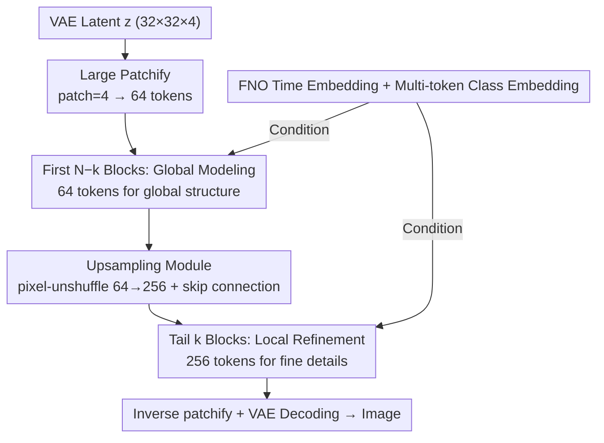

# MPDiT: Multi-Patch Global-to-Local Transformer Architecture for Efficient Flow Matching

**Conference**: CVPR 2026  
**arXiv**: [2603.26357](https://arxiv.org/abs/2603.26357)  
**Code**: [https://github.com/quandao10/MPDiT](https://github.com/quandao10/MPDiT)  
**Area**: Diffusion Models  
**Keywords**: Diffusion Transformer, Flow Matching, Multi-scale patch, Efficient architecture, Image generation

## TL;DR

MPDiT is proposed as a multi-scale patch global-to-local Diffusion Transformer architecture. It utilizes large patches ($4 \times 4$) in the early stages to process global context with only 64 tokens, followed by upsampling to small patches ($2 \times 2$) with 256 tokens in the later stages to refine local details. This design reduces GFLOPs by up to 50%, with the XL model achieving an FID of 2.05 (cfg) within 240 epochs.

## Background & Motivation

1. **Background**: Diffusion/Flow Matching models have become the mainstream paradigm for visual generation. Transformer architectures (DiT/SiT) are gradually replacing UNet as the backbone due to their superior scalability. However, the isometric design of DiT processes the same number of patch tokens in every layer, incurring high computational costs.

2. **Limitations of Prior Work**: Training efficiency remains a core bottleneck. Linear attention (e.g., SANA, LIT) reduces computation but leads to significant performance degradation. Mamba/SSM show negligible advantages for the token magnitudes typical of diffusion models ($< 1\text{K}$). MaskDiT performance deteriorates sharply at high mask ratios (FID $\approx 100$ at 75% mask ratio).

3. **Key Challenge**: The failure of MaskDiT versus the relative success of DiT-XL/4 offers a critical observation—a small number of tokens from large patches can effectively capture global structural information despite lacking local details. In contrast, random masking in MaskDiT forces models to learn relationships between fragmented tokens, failing to model both global and local information effectively.

4. **Goal**: How to significantly reduce the computational and training costs of Diffusion Transformers while maintaining generation quality?

5. **Key Insight**: Inspired by global-local attention, the authors implement this at the architectural level rather than the layer level (which often yields negligible gains). The initial layers handle "coarse-grained" global information, while the final layers focus on "fine-grained" local details.

6. **Core Idea**: Transform the isometric DiT into a "coarse-to-fine" hierarchical structure. Most Transformer blocks operate on large patches (64 tokens) to efficiently acquire global semantics, while a few tail blocks operate on small patches (256 tokens) to refine local details.

## Method

### Overall Architecture

MPDiT addresses the high computational cost of standard DiT, where every layer processes an identical number of patch tokens, even when such fine granularity is unnecessary. The approach modifies the isometric DiT into a "coarse-to-fine" hierarchical structure. The input consists of latent variables $z \in \mathbb{R}^{32 \times 32 \times 4}$ (ImageNet $256 \times 256$) encoded by VAE. While a standard DiT uses patch size=2 to create 256 tokens, MPDiT employs patch size=4 for the first $N-k$ Transformer blocks, processing only 64 tokens to model global structures at low resolution. Subsequently, an upsampling module expands the 64 tokens into 256 tokens, which are passed to the final $k$ blocks for refining local details. The output is processed through an inverse patchify operation and VAE decoding. In essence, most blocks run on "thumbnails," with only a few tail blocks finalizing the "full image." Conditional signals (time step, class) are injected into all blocks via FNO time embeddings and multi-token class embeddings.

### Key Designs

**1. Multi-scale Patch Architecture: Large patches for global, small patches for details**

The method stems from the observation that while MaskDiT fails at 75% mask ratio (FID $\approx 100$), DiT-XL/4 (with a similar token count) reaches FID $\approx 40$. Random masking provides fragmented local relationships, whereas large patches represent a **structured** downsampling that maintains full image coverage for solid global semantic modeling. MPDiT leverages this: for $N$ total blocks, the first $N-k$ blocks receive 64 tokens (patch size=4). Since self-attention complexity is quadratic to token count, this portion's overhead is only $1/16$ of standard DiT. The missing local details are compensated by the tail refinement blocks (experimentally, $k=4 \sim 6$ is sufficient). This reduces MPDiT-XL GFLOPs from 118.66 to 59.30, a 50% reduction. This hierarchy can scale to higher resolutions like $512^2$ using three-level patches $\{8, 4, 2\}$.

**2. Upsampling Module: Clean expansion from 64 coarse to 256 fine tokens**

To transition from 64 to 256 tokens without destroying established conditional relationships, the module separates image and class tokens. Image tokens undergo linear projection and pixel-unshuffle for $4\times$ spatial expansion (64 to 256), followed by GELU and re-concatenation with class tokens. A LayerNorm + linear layer realigns the class-image relationships. A critical skip connection adds the original patch size=2 embeddings directly to the upsampled result, reintroducing fine-grained spatial information lost during the large-patch stage. Ablations show this design is sensitive: using a linear projection (default) yields FID=24.74, while ConvTranspose drops performance to 29.45.

**3. FNO Time Embedding + Multi-Token Class Embedding: Enhancing conditional signals**

To address the limited representation of traditional sinusoidal + MLP embeddings, the FNO time embedding maps the scalar timestep $t$ onto a 32-point 1D uniform grid. This 1D signal is projected to 32 channels and processed by 3 MixedFNO blocks (SpectralConv1D mixed with Conv1D) to learn smooth temporal structures, followed by global average pooling. This design, inspired by Neural Operators, aligns with the continuous dynamics of flow matching, yielding a $\sim 4$ point FID improvement. For class conditioning, the single class token is replaced by $m=16$ learnable tokens used as a prefix to the image tokens, replacing AdaIN modulation. This distributed semantic representation accelerates convergence by $\sim 7$ FID points.

### Loss & Training

- Standard Flow Matching objective: $L_{FM} = \|f_\theta(z_t, t, c) - (n - z)\|_2^2$
- AdaIN parameters are shared across all Transformer blocks (reducing parameters from 130M to $\sim 90\text{M}$ with only a 0.4 FID increase).
- Hardware: 8×A100-40GB; Learning rate $2 \times 10^{-4}$; Batch size 1024; EMA 0.9999.
- Sampling: 250-step Euler solver.

## Key Experimental Results

### Main Results

| Model | Epochs | GFLOPs | FID$\downarrow$ (non-cfg) | FID$\downarrow$ (cfg) | IS$\uparrow$ (cfg) |
|------|--------|--------|----------------|------------|-----------|
| DiT-XL/2 | 1400 | 118.66 | 9.62 | 2.27 | 278.24 |
| SiT-XL/2 | 1400 | 118.66 | 9.35 | 2.15 | 258.09 |
| DiG-XL/2 | 240 | 89.40 | 8.60 | 2.07 | 278.95 |
| DiCo-XL | 80 | 87.30 | 11.67 | - | - |
| **Ours (MPDiT-XL)** | **240** | **59.30** | **7.36** | **2.05** | **278.73** |

### Ablation Study

| Component | Params(M) | GFLOPs | FID$\downarrow$ |
|------|-----------|--------|------|
| DiT-B/2 baseline | 130.0 | 23.0 | 34.84 |
| + Shared AdaIN | 90.3 | 22.9 | 35.31 |
| + Multi-token Class (m=16) | 101.9 | 24.3 | 28.56 |
| + FNO Time Embedding | 101.2 | 24.3 | 24.52 |
| + Ours (MPDiT, k=6) | 104.8 | 16.6 | **24.74** |

| k value (XL) | GFLOPs | FID$\downarrow$ |
|-----------|--------|------|
| k=4 | 53.2 | 11.11 |
| k=6 (Default) | 59.3 | 9.92 |
| k=8 | 65.4 | 9.73 |

| Class Token count m | FID$\downarrow$ |
|-------------------|------|
| m=1 | 32.31 |
| m=4 | 30.91 |
| m=8 | 28.12 |
| m=16 (Default) | 24.74 |
| m=32 | 24.47 |

### Key Findings

- **k=6 is the optimal balance**: Only 6 refinement blocks are needed for the best trade-off between efficiency and quality. Setting $k=4$ causes an FID spike (11.11 vs 9.92), while $k=8$ offers marginal gains for 10% more GFLOPs.
- **Multi-token class embeddings provide massive gains**: Increasing $m=1$ to $m=16$ reduces FID from 32.31 to 24.74. No significant gain is observed beyond $m=16$.
- **FNO time embedding improves FID by 4 points**: 3 MixedFNO blocks are optimal; 4 blocks lead to instability.
- **Upsampling module design is critical**: Linear+Linear (default) yields FID=24.74 vs 29.45 for ConvTranspose.
- **Doubled training throughput**: MPDiT-XL sampling speed is over $2\times$ faster than DiT-XL/2.

## Highlights & Insights

- The **"coarse-to-fine" architecture** is simple yet effective. The comparison with MaskDiT is particularly convincing—structured downsampling (large patches) is far superior to random downsampling (masking). This insight is transferable to any Transformer architecture requiring token reduction.
- **FNO time embedding** is a novel attempt to model continuous time dynamics in diffusion processes using Neural Operators, providing intuitive alignment with the ODE/SDE nature of Flow Matching.
- **Shared AdaIN** discovery has practical value: sharing modulation layers reduces parameters by 30% with negligible quality loss (0.4 FID), ideal for resource-constrained scenarios.

## Limitations & Future Work

- Validated only on ImageNet $256 \times 256$; lacks experiments on text-to-image or higher resolutions.
- Three-level patch hierarchy for $512^2$ is proposed but not experimentally verified.
- The upsampling module remains relatively simple; more complex designs might yield further improvements.
- Instability in FNO time embedding at dimension 128 remains unanalyzed.
- Integration with representation alignment methods like REPA has not been explored.

## Related Work & Insights

- **vs DiT/SiT**: Standard isometric design with 256 tokens per layer. MPDiT compresses most computation to 64 tokens, halving GFLOPs while improving FID.
- **vs MaskDiT**: Both aim to reduce token count, but random masking fails at high ratios (75% mask $\rightarrow$ FID $\approx 100$), whereas MPDiT’s structured approach remains robust.
- **vs DiCo/DiC**: While GFLOPs are similar, MPDiT achieves better FID within the same training epochs, demonstrating Transformer advantages in global modeling.
- **vs SANA/LIT**: Linear attention schemes often require initialization from pre-trained full-attention models, while MPDiT can be trained from scratch.

## Rating

- Novelty: ⭐⭐⭐⭐ The multi-scale patch idea is not entirely new but its application and validation in Diffusion Transformers are valuable.
- Experimental Thoroughness: ⭐⭐⭐⭐ Detailed ablations on ImageNet, though lacking multi-domain validation.
- Writing Quality: ⭐⭐⭐⭐ Clear motivation and convincing comparative analysis with MaskDiT.
- Value: ⭐⭐⭐⭐ 50% GFLOP reduction without quality loss is a significant contribution to diffusion training efficiency.

<!-- RELATED:START -->

## Related Papers

- [\[CVPR 2026\] DDiT: Dynamic Patch Scheduling for Efficient Diffusion Transformers](ddit_dynamic_patch_scheduling_for_efficient_diffusion_transformers.md)
- [\[CVPR 2026\] Flow Matching for Multimodal Distributions](flow_matching_for_multimodal_distributions.md)
- [\[CVPR 2026\] Memory-Efficient Fine-Tuning Diffusion Transformers via Dynamic Patch Sampling and Block Skipping](memory-efficient_fine-tuning_diffusion_transformers_via_dynamic_patch_sampling_a.md)
- [\[CVPR 2026\] Spatiotemporal Pyramid Flow Matching for Climate Emulation](spatiotemporal_pyramid_flow_matching_for_climate_emulation.md)
- [\[CVPR 2026\] When Local Rules Create Global Order: Self-Organized Representation Learning for Latent Diffusion Models](when_local_rules_create_global_order_self-organized_representation_learning_for_.md)

<!-- RELATED:END -->
