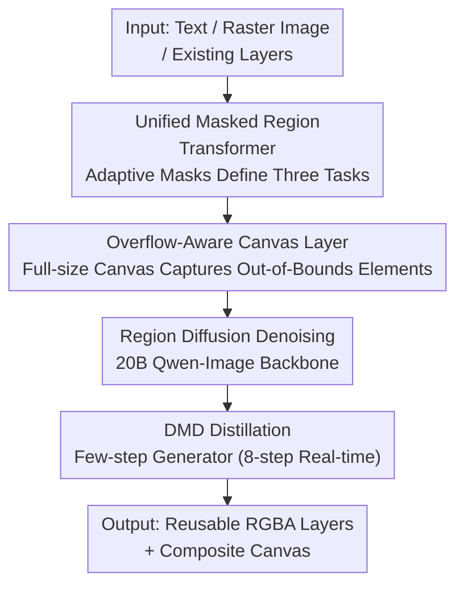

# MRT: Masked Region Transformer for Layered Image Generation and Editing at Scale

**Conference**: CVPR 2026  
**arXiv**: [2605.27235](https://arxiv.org/abs/2605.27235)  
**Code**: None (Canva Research, closed source)  
**Area**: Diffusion Models / Image Generation / Layered Image Editing  
**Keywords**: Layered Image Generation, Transparent Layers, Masked Region Diffusion, Overflow Layer, Diffusion Distillation

## TL;DR
MRT unifies three layered image tasks—Text-to-Layer (T2L), Image-to-Layer (I2L), and Layer-to-Layer (L2L)—into a single 20B masked region diffusion Transformer. It utilizes "adaptive masking" to determine whether each layer originates from clean latents or noise, and incorporates an "overflow-aware canvas layer" to generate full, reusable RGBA layers that extend beyond canvas boundaries. Trained on 10M design samples, its layering quality surpasses ART and the concurrent Qwen-Image-Layered, with $10\sim100\times$ faster inference and $50\%\sim90\%$ lower activation memory.

## Background & Motivation
**Background**: Text-to-image (T2I) generation has achieved significant progress through large-scale diffusion Transformers, rectified flow matching, and distribution matching distillation. however, "layered image generation"—decomposing visual content into separate, reusable, and editable transparent RGBA layers (analogous to word-level editing in NLP)—has lagged significantly, with large-scale exploration remains almost blank.

**Limitations of Prior Work**: The authors attribute this lag to two factors: a lack of large-scale, high-quality layered datasets comparable to LAION-5B, and the fact that prior methods (e.g., ART, PrismLayer) mostly fine-tune on LoRAs, failing to leverage the priors of the strongest open-source T2I models. Crucially, existing methods only generate foreground layers "within the visible canvas range"; any element exceeding background boundaries is truncated into unusable fragments—a problem affecting **over 60%** of samples in their training set.

**Key Challenge**: The three sub-capabilities of layered generation (generating layers from text, decomposing a raster image into layers, and adding/restyling layers) were previously handled by disjoint frameworks. Practical layered editing requires each layer to be "complete and reusable," which directly conflicts with the "generate-only-in-visible-regions" approach.

**Goal**: (1) To unify T2L, I2L, and L2L tasks into a single framework; (2) To ensure generated layers remain complete even when they exceed canvas boundaries; (3) To compress multi-step diffusion into real-time few-step generation.

**Key Insight**: The fundamental difference between the three tasks lies in which layers are known conditions and which are to be generated. The authors propose a "masking" mechanism—treating known parts as clean tokens (conditions) and only adding noise and diffusion supervision to the target layers—to cover all three tasks within a single region diffusion Transformer by switching masks.

**Core Idea**: Unify layered generation and editing into a masked region diffusion Transformer using "selective token masking + full-size overflow canvas layers," distilled into an 8-step real-time generator.

## Method

### Overall Architecture
MRT uses the open-source Qwen-Image (approx. 20B, 60 layers, hidden size 3584, 24 heads) as the backbone with full-parameter fine-tuning. A multi-layer transparent image is represented as $\{\mathbf{I}_{\text{canvas}}, \mathbf{I}_{\text{bg}}, \{\mathbf{I}_{\text{fg}}^{i}\}_{i=1}^{K}\}$, containing a fully transparent full-size canvas layer, a semi-transparent RGBA background layer, and $K$ foreground layers. All layers are composed onto the canvas according to a predefined layout. The WAN-2.1-VAE encoder then encodes regional representations of foreground layers, the background, and the composite image. A 20B region diffusion Transformer performs joint full attention on these tokens.

Task unification is achieved via "masking": known conditions are set as clean mask tokens $\mathbf{z}_{\text{mask}}$ without noise, while noise is added to the target layers $\mathbf{z}_0$ under flow matching supervision. Full attention between mask tokens and noise tokens allows the model to adaptively learn their relationships. The model is subsequently distilled into an 8-step real-time generator using DMD. The overall flow is as follows:

### Key Designs

**1. Unified Masked Region Transformer: Task Unification via Mask Switching**

Previous T2L, I2L, and L2L tasks required separate models, which wasted resources and failed to share priors. MRT observes that the only difference is "which layers are known." By introducing selective masking, known content is set as clean tokens $\mathbf{z}_{\text{mask}}$, and only target layers $\mathbf{z}_0$ are injected with noise. Flow matching interpolates $t\in[0,1]$ linearly as $\mathbf{z}_t=(1-t)\mathbf{z}_0+t\epsilon$. The model predicts the velocity field $\hat{\mathbf{v}}=f_\theta(\mathbf{z}_t,t,\mathbf{c})$ against the target $\mathbf{z}_0-\epsilon$, with loss $\mathcal{L}_{\text{flow}}=\mathbb{E}\big[\|\mathbf{v}_t-f_\theta(\mathbf{z}_t,t,\mathbf{c})\|^2\big]$. Tasks are switched via masks:

- **T2L**: No prior layers; $\mathbf{z}_{\text{mask}}=\varnothing$. Noise is added to $[\mathbf{z}_{\text{composed}};\mathbf{z}_{\text{bg}};\{\mathbf{z}_{\text{fg}}^i\}]$ (including the composite image $\mathbf{z}_{\text{composed}}$ to ensure consistency).
- **I2L**: The raster image to be decomposed is encoded as $\mathbf{z}_{\text{composed}}$ and set as clean mask tokens. Noise is added to $[\mathbf{z}_{\text{bg}};\{\mathbf{z}_{\text{fg}}^i\}]$. Combined with layout detectors or manual bounding boxes, the model performs both alpha segmentation and occluded region completion. **Layer Grouping Augmentation** is used: adjacent/overlapping layers are randomly merged during training to mitigate granularity ambiguity and improve robustness.
- **L2L**: Existing layer latents are kept as mask tokens, while only new or restyled layers receive noise. For restyling, reference appearance latents $\mathbf{z}_{\text{cond}}^i$ are added as additional mask tokens (not predicted). A learnable "condition token embedding" and RoPE position codes are used to share spatial cues between condition tokens and target layers.

This is effective because masking decouples "conditioning vs. generation" into a pure attention visibility problem, allowing a single weight set to handle multiple tasks while leveraging cross-task training benefits.

**2. Overflow-Aware Canvas Layer: Completeness for Out-of-Bound Elements**

Prior methods generated foregrounds only within the visible canvas, resulting in truncated layers. MRT explicitly introduces a **full-size canvas layer** $\mathbf{I}_{\text{canvas}}$, which is fully transparent by default and defines the maximum dimensions of the design. Region diffusion occurs on this full-size canvas, treating the background as a "special transparent foreground layer."

This ensures each foreground layer obtains "complete" pixels (supervised by ground-truth full layers in the dataset), allowing them to be repositioned or reused without being cropped by background boundaries. Note: Since users typically cannot provide overflow layers for I2L inference, this task degrades to using pixels within the visible canvas—overflow capability primarily serves T2L and editing.

**3. DMD Distillation for Real-Time Generation: From Multi-step to 8-step**

Direct inference with a 20B multi-step diffusion model is too slow for real-time interaction. MRT utilizes an improved Distribution Matching Distillation (DMD) to compress the multi-step teacher $f_{\theta_T}$ into a few-step student $f_{\theta_S}$, minimizing the KL divergence: $\mathcal{L}_{\mathrm{DMD}}=\mathbb{E}\big[D_{\mathrm{KL}}(f_{\theta_T}(\mathbf{z}_{t-1}|\mathbf{z}_t)\,\|\,f_{\theta_S}(\mathbf{z}_{t-1}|\mathbf{z}_t))\big]$. During inference, the student approximates the trajectory in $T_S\ll T_T$ steps. Combined with CacheDiT, low-precision, and multi-GPU sequence parallelism, decomposition of a 1K image with $\sim$20 layers is reduced to $\sim$3s on 4×H100 or $\sim$6s on a single H100 with negligible quality loss.

### Loss & Training
The primary objective is the flow matching MSE loss $\mathcal{L}_{\text{flow}}$, replaced by the DMD KL target $\mathcal{L}_{\mathrm{DMD}}$ during distillation. System-level training involves two phases: first on 10M samples at $512\times512$ ($\sim$70k steps) to build decomposition capabilities, then at $1024\times1024$ ($\sim$20k steps) to increase resolution. Training uses 64×H200, global batch 1024, AdamW, learning rate $1\times10^{-4}$, and FSDP2. Ablations use a 0.5M subset at 512 resolution for 4000 steps on 8×H200.

## Key Experimental Results

### Main Results
I2L vs. concurrent Qwen-Image-Layered (on 100 out-of-domain creative designs, grouped by layer count, higher is better):

| Metric | Layer Count | MRT (Ours) | Qwen-Image-Layered |
|------|--------|------------|--------------------|
| PSNR$_\text{merged}$ ↑ | [4,8) | **27.34** | 25.81 |
| PSNR$_\text{merged}$ ↑ | [8,16) | **25.91** | 23.06 |
| PSNR$_\text{merged}$ ↑ | [16,32) | **25.72** | 22.18 |
| SSIM$_\text{merged}$ ↑ | [4,8) | **0.9034** | 0.8706 |
| SSIM$_\text{merged}$ ↑ | [8,16) | **0.8762** | 0.8319 |
| SSIM$_\text{merged}$ ↑ | [16,32) | **0.8485** | 0.8065 |

Human blind evaluation (I2L) win rates: Layer quality **79.5%**, Content integrity **68.9%**, Decomposition granularity **82.6%**. For T2L, user studies also consistently favored MRT over ART in instruction following, overall aesthetics, and layer quality.

Efficiency comparison (Fig. 18, single GPU, 100 samples): At $\sim$20 layers, MRT maintains near-constant latency ($\sim$5s), while Qwen-Image-Layered increases linearly, reaching up to **108.5×** speedup. Peak memory usage dropped by **10.5× to 23.6×** as layers increased. I2L activation memory is reduced by **50%$\sim$90%**, with overall inference **10$\sim$100×** faster.

### Ablation Study

Model & Data Scale (T2L FID, 0.5M subset):

| Configuration | FID$_\text{merged}$ ↓ | Description |
|------|----------------------|------|
| FLUX.1 [dev] (13B) | 17.79 | Small model |
| Qwen-Image (20B) | 16.15 | Model scaling only -1.64 |
| Qwen-Image (20B) + 10M Data | **15.63** | Data scaling -0.52 |

Multi-task Joint Training (Table 3, task ratios):

| Configuration | Task Ratio | FID$_\text{merged}$ ↓ | PSNR$_\text{merged}$ ↑ | SSIM$_\text{merged}$ ↑ |
|------|----------|----------------------|------------------------|------------------------|
| T2L | 100/0/0 | 16.15 | 22.75 | 0.8711 |
| T2L+I2L | 80/20/0 | **15.68** | **23.06** | **0.8924** |
| T2L+I2L+L2L | 70/15/15 | 17.06 | 21.97 | 0.8606 |

Textual conditions (Table 4, I2L): Adding text improved PSNR$_\text{merged}$ 21.27→21.65 and PSNR$_\text{layer}$ 26.03→27.24. Layer merging augmentation (Table 5): Improved PSNR$_\text{merged}$ 21.65→21.97 and SSIM$_\text{merged}$ 0.8805→0.8864. Overflow data ablation (Table 2): Improved PSNR$_\text{merged}$ 21.81→22.75 and SSIM 0.8543→0.8711, though FID slightly increased 15.68→16.15 ⚠️.

### Key Findings
- **Both Model Capacity and Data Scale Matter**: Moving from FLUX 13B to Qwen 20B reduced FID by 1.64, then scaling data to 10M reduced it by another 0.52.
- **I2L Tasks Improve Overall Performance**: T2L+I2L outperformed pure T2L in FID and SSIM, suggesting decomposition tasks aid generation. However, adding L2L caused some degradation; it is retained to enable editing capabilities.
- **Superiority in Multi-layer Scenarios**: The performance gap between MRT and Qwen-Image-Layered widened as the number of layers increased ([16,32)), demonstrating the scalability of region diffusion.

## Highlights & Insights
- **"Masking as Task" Simplicity**: Reducing three distinct layered tasks to a switch for "which tokens to noise" is an elegant design. A single set of 20B weights covers generation, decomposition, and editing simply by switching masks, avoiding multi-model maintenance.
- **Engineering Reality as Innovation**: The observation that over 60% of samples contain overflow elements led to the "full-size transparent canvas layer." Treating the background as a special foreground layer is a practical architectural decision driven by product usability (layer reusability).
- **Efficiency via Regional Cropping**: Each layer only utilizes tokens for its actual region rather than full-resolution tokens (unlike Qwen-Image-Layered). This "allocate compute by area" approach yields massive efficiency Gains (up to 108.5× speedup) and is applicable to any multi-region generation.

## Limitations & Future Work
- The authors admit I2L still faces challenges: (i) limited generalization on real photographs; (ii) ill-posed layer granularity without unique ground-truth; (iii) difficulty in completing occluded layers (especially semi-transparent ones); (iv) background inpainting under heavy occlusion. Failures are often due to inaccurate amodal bounding boxes from layout detectors.
- Overflow capability is effectively disabled for I2L inference since users cannot provide overflow inputs, meaning "complete reusable layers" are primarily realized in T2L and editing. The FID increase in the overflow ablation suggests a tension between "complete layers" and "compositional distribution" that requires further study.
- Neither code nor data is public (commercial platform), and 20B full-parameter fine-tuning on 64×H200 is not academic-friendly.

## Related Work & Insights
- **vs ART**: MRT adopts the region diffusion skeleton from ART but extends it to a three-task unified framework with native overflow support and few-step distillation, using an order of magnitude more data (10M).
- **vs Qwen-Image-Layered (Concurrent)**: The latter models each layer with full-resolution tokens, causing latency to explode with layer count. MRT uses regional cropping tokens for higher quality (leading PSNR/SSIM) and $10\sim100\times$ faster inference.
- **vs LayerDiffuse / COLE**: These use sequential generation, whereas MRT employs "simultaneous generation + full attention" to output multiple layers at once, better preserving cross-layer consistency.
- **vs GPT-Image-1**: GPT-Image-1 is an iterative insertion baseline; MRT predicts multiple layers in parallel, naturally modeling inter-layer relationships.

## Rating
- Novelty: ⭐⭐⭐⭐⭐ "Masking as task" for three tasks + overflow-aware canvas layer fills critical gaps.
- Experimental Thoroughness: ⭐⭐⭐⭐ Extensive task comparisons, ablations, and efficiency curves, though it relies heavily on user studies and some metrics (FID) show unexplained regression.
- Writing Quality: ⭐⭐⭐⭐ Clear explanation of the framework and masking mechanism; comprehensive formulas.
- Value: ⭐⭐⭐⭐⭐ Pushing layered generation/editing to the 20B + 10M scale with significant gains over commercial systems has immediate practical impact.

<!-- RELATED:START -->

## Related Papers

- [\[CVPR 2026\] EditMGT: Unleashing Potentials of Masked Generative Transformers in Image Editing](editmgt_unleashing_potentials_of_masked_generative_transformers_in_image_editing.md)
- [\[CVPR 2026\] SpotEdit: Selective Region Editing in Diffusion Transformers](spotedit_selective_region_editing_in_diffusion_transformers.md)
- [\[CVPR 2026\] From Scale to Speed: Adaptive Test-Time Scaling for Image Editing](from_scale_to_speed_adaptive_test-time_scaling_for_image_editing.md)
- [\[CVPR 2026\] Cycle-Consistent Tuning for Layered Image Decomposition](cycle-consistent_tuning_for_layered_image_decomposition.md)
- [\[CVPR 2026\] Qwen-Image-Layered: Towards Inherent Editability via Layer Decomposition](qwen-image-layered_towards_inherent_editability_via_layer_decomposition.md)

<!-- RELATED:END -->
