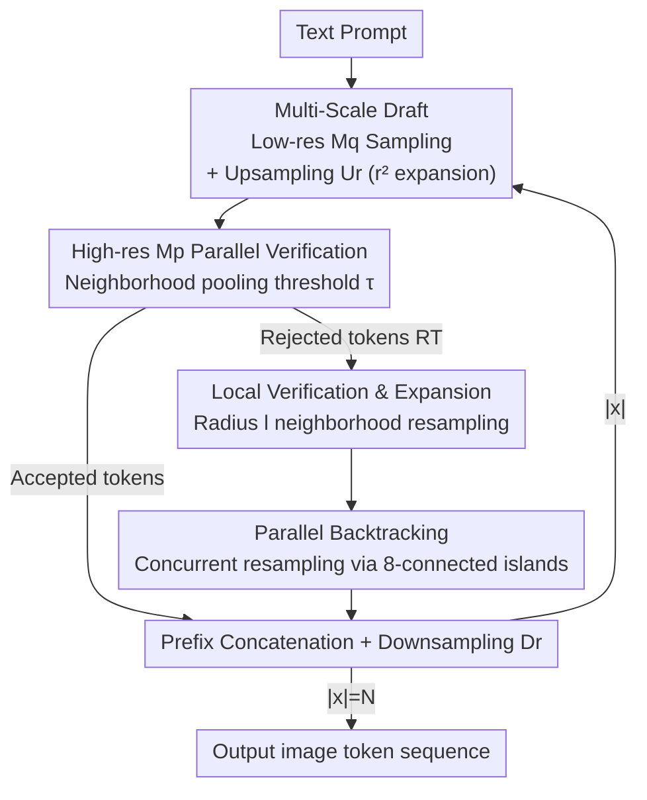

# Multi-Scale Local Speculative Decoding for Image Generation

**Conference**: CVPR2026  
**arXiv**: [2601.05149](https://arxiv.org/abs/2601.05149)  
**Code**: https://qualcomm-ai-research.github.io/mulo-sd-webpage/ (Project Page)  
**Area**: Image Generation  
**Keywords**: Autoregressive image generation, speculative decoding, multi-scale, spatial locality, parallel decoding  

## TL;DR
MuLo-SD introduces a multi-scale approach—"low-resolution draft + upsampling + high-resolution parallel verification"—into speculative decoding. By replacing traditional raster-scan full-sequence backtracking with "local neighborhood resampling of rejected tokens" combined with parallel decoding, it achieves up to $5.33\times$ end-to-end acceleration for autoregressive image generation on Tar-1.5B/7B while maintaining semantic alignment and perceptual quality.

## Background & Motivation
**Background**: Unified multi-modal large models (MLLMs) integrate language and vision understanding/generation into an autoregressive (AR, next-token prediction) framework, demonstrating stronger text-to-image alignment than diffusion models. However, AR decoding is inherently serial; at high resolutions, the token count grows quadratically (often exceeding thousands for 1024p), making latency a critical bottleneck.

**Limitations of Prior Work**: Existing acceleration methods for AR image generation have drawbacks. ① Speculative Decoding (SD), successful in text (2–3× speedup), largely fails for images due to "flat" next-token distributions and low acceptance rates; EAGLE-2 even yields negative speedup (<1×) on images. LANTERN relaxes acceptance criteria using "codebook neighbor probability pooling + TVD constraints" (approx. 1.6–1.8× speedup), but it still operates **strictly at the token level in raster-scan order**: once a token is rejected, the entire subsequent sequence is discarded, failing to exploit 2D spatial structures or multi-scale priors. ② Next-scale prediction (VAR family) is fast but uses custom sampling schedules incompatible with the next-token framework and unified MLLMs (cannot utilize KV-cache).

**Key Challenge**: Images are inherently 2D, multi-scale, and spatially local, yet current image speculative decoding treats them as 1D token streams. This ignores natural "coarse-to-fine" hierarchies and spatial correlations where nearby tokens are strongly related. A single rejection currently invalidates the entire suffix.

**Goal**: Inject multi-scale structure and spatial locality into speculative decoding to improve acceptance rates and reduce serial steps without abandoning the next-token prediction objective (preserving compatibility with unified MLLMs).

**Key Insight**: AR image models often release checkpoints for multiple resolutions (256p/512p/1024p). A low-resolution model can serve as a drafter (cheap, short sequences), while the high-resolution model acts as the verifier. Building on the fact that visual AR attention is local (as shown in ZipAR/LPD), resampling is performed only within a small neighborhood of the rejected token.

**Core Idea**: Replace "same-resolution token-by-token drafting + raster-scan backtracking" with "low-resolution drafting → upsampling → high-resolution parallel verification → local neighborhood resampling" to fully exploit multi-scale and spatial locality.

## Method

### Overall Architecture
MuLo-SD takes a text prompt and produces a target resolution $s_p$ (512p or 1024p) image sequence of length $N$. It works in a **loop** using a "draft–upsample–verify–local backtrack" cycle until $|x|=N$.

Let the target model $M_p$ operate at high resolution $s_p$ and the drafter $M_q$ at low resolution $s_q$, with ratio $r=s_p/s_q$ (e.g., $r=2$ for 512p, $r=4$ for 1024p). In one cycle: ① $M_q$ serially samples a batch of low-res draft tokens $\tilde{y}$ (by full rows for consistency); ② An upsampler $U_r$ magnifies $\tilde{y}$ into high-res draft $\tilde{x}=U_r(\tilde{y})$, expanding sequence length by $r^2$; ③ $M_p$ **parallely** verifies $\tilde{x}$ using neighborhood pooled thresholding; ④ Rejected tokens undergo local expansion and are **parallely** resampled by $M_p$ in "rejection island" groups; ⑤ Accepted tokens are concatenated to the prefix $x$, then downsampled $y=D_r(x)$ to serve as the next low-res prefix.

The pipeline contains two serial bottlenecks—low-res drafting (Step ①) and high-res resampling (Step ④)—both squashed by parallel decoding (ZipAR-style). Notably, drafter and verifier **have equal capacity**; speedup comes from NFE reduction and the quadratic gap in sequence length between resolutions.

### Key Designs

**1. Multi-Scale Drafting: Coarse-to-fine priors via low-res drafter + upsampler**
Unlike traditional SD where the drafter is just a smaller model at the same resolution, $M_q$ runs at a significantly lower resolution $s_q$. Low-res sequences are shorter and cheaper to sample. The upsampler $U_r$ maps $\tilde{y}$ to $\tilde{x}=U_r(\tilde{y})$, expanding length by $r^2$. Drafting is performed by **full rows** to ensure spatial coherence for the upsampler. Two upsampler versions are provided: latent-space (masked row-causal conv + pixel-shuffle, requires training) and pixel-space (decode to pixels → off-the-shelf SR → re-encode, **training-free**, default).

**2. Local Verification and Neighborhood Expansion: Confining rejection impact**
This is the core innovation. Raster-scan rules discard everything after the first rejection, yielding near-zero speedup under this scheme. MuLo-SD uses a relaxed threshold: a draft token is accepted if its pooled probability over a codebook neighborhood $B_k(\tilde{x}_i)$ exceeds $\tau$:
$$\text{Accept if } \sum_{x\in B_k(\tilde{x}_i)} p_i(x) \ge \tau$$
For the set of rejected tokens $R_T$, resampling only the token itself is insufficient as context is affected. **Local expansion** is introduced: for each $t\in R_T$, a 2D neighborhood of radius $l$ is defined as $N(t,l)=\{u \mid |i_u-i_t|\le l,\ |j_u-j_t|\le l,\ u\ge t_0\}$. The union $R_X=\bigcup_{t\in R_T}N(t,l)$ is resampled. This exploits the spatial locality of vision AR attention, maintaining high quality without a full suffix flush.

**3. Parallel Decoding Integration: Flattening bottlenecks with Rejection Islands**
Remaining serial steps are addressed. For low-res drafting, ZipAR is used to parallelize the process. For high-res resampling, the set $R_X$ is partitioned into **8-connected components** ("rejection islands") $\{\mathcal{I}_m\}_{m=1}^{M}=\mathrm{CC}_8(R_X)$. Since accepted tokens provide sufficient context, disjoint islands are resampled **concurrently**.

### Loss & Training
Only the latent-space upsampler/downsampler requires training (on LAION-COCO-Aesthetic). Perceptual quality improves significantly when shifting from token classification loss to **pixel-space reconstruction loss** (MSE + LPIPS). High-frequency details are further enhanced using a lightweight PatchGAN discriminator. The default pixel-space upsampler remains training-free and model-agnostic.

## Key Experimental Results

Tests were conducted on Tar-1.5B/7B (unified MLLM) and LlamaGen-XL. Efficiency is measured by speedup (serial latency / MuLo-SD latency) on A100 (batch=1). Metrics include GenEval/DPG-Bench (alignment) and FID/HPSv2 (quality).

### Main Results

| Base (Res) | Method | Speedup↑ | GenEval↑ | DPG-Bench↑ | FID↓ | HPSv2↑ |
|---|---|---|---|---|---|---|
| LlamaGen-XL (512p) | EAGLE-2 | 0.96× | 37.1 | 65.1 | 56.2 | 23.1 |
| | LANTERN | 1.59× | 36.3 | 64.5 | 55.4 | 22.2 |
| | **MuLo-SD (2×)** | **1.40×** | 36.1 | 64.0 | 54.3 | 23.1 |
| Tar-7B (512p) | LANTERN | 1.20× | 84.9 | 80.5 | 36.9 | 28.7 |
| | **MuLo-SD (2×)** | **2.03×** | 85.1 | 80.8 | 38.2 | 29.5 |
| Tar-7B (1024p) | LANTERN | 1.45× | 82.9 | 80.5 | 34.6 | 29.4 |
| | **MuLo-SD (4×)** | **5.33×** | 85.4 | 80.8 | 34.8 | 29.5 |

**Key Finding**: EAGLE-2 (exact SD) consistently produces negative speedup (<1×), confirming standard SD's mismatch for visual tokens. MuLo-SD achieves the highest speedup across settings, particularly at higher resolutions—Tar-7B 1024p reaches $5.33\times$ with improved GenEval scores.

### Ablation Study

| Dimension | Comparison | Conclusion |
|---|---|---|
| Upsampler Loss | Token loss → Pixel MSE+LPIPS → +PatchGAN → SR | Pixel-space loss is vital for quality; GAN loss adds detail; SR is competitive and training-free. |
| Pooling | Draft token only vs. codebook k-nearest pooling | Pooling improves acceptance stability but gains are capped due to overlap with $\tau$. |
| Local Backtrack | Raster-scan vs. naive local vs. local+expansion | Raster-scan requires low $\tau$ (poor quality); naive local is worse; **local+expansion** preserves quality and speed. |
| Parallel Decoding| Serial vs. Parallel resampling | Parallel decoding reduces end-to-end latency without affecting quality metrics. |

## Highlights & Insights
- **Merging split paths**: MuLo-SD reconciles the "multi-scale" (fast but incompatible) and "speculative decoding" (compatible but slow) trajectories. It treats low-res drafts as "coarse" and high-res verification as "fine."
- **Rejection Islands**: Utilizing 8-connectivity to enable concurrent resampling of disjoint regions is a clever way to exploit spatial locality beyond simple ZipAR.
- **Resolution as the speedup driver**: In an unconventional move, the drafter and verifier use the **same capacity**. Speedup is derived from resolution-induced sequence length reduction rather than model size disparity.
- **Training-free path**: The pixel-space SR path offers a model-agnostic, zero-cost engineering solution.

## Limitations & Future Work
- **Memory Overhead**: Requires loading both low-res and high-res checkpoints plus dual KV-caches, which is demanding for memory-constrained devices.
- **Distribution Alignment**: Effectiveness drops if drafter/verifier are not well-aligned (e.g., LlamaGen's 1.40x). Self-speculative decoding (drafting from internal layers) is a proposed future solution.
- **Metrics Caveat**: FID comparisons across different $\tau$ thresholds should be interpreted alongside speedup gains.

## Related Work & Insights
- **vs LANTERN**: Both relax acceptance criteria, but MuLo-SD adds multi-scale drafting and local neighborhood expansion, yielding significantly higher speedups at equal quality.
- **vs VAR/M-VAR**: Shares "coarse-to-fine" philosophy but maintains next-token compatibility for unified MLLMs.
- **vs ZipAR/LPD**: MuLo-SD uses ZigAR/LPD as building blocks for parallelization during drafting and resampling phases.

## Rating
- **Novelty**: ⭐⭐⭐⭐⭐ First to combine multi-scale priors with local SD; rejection island mechanism is highly original.
- **Experimental Thoroughness**: ⭐⭐⭐⭐ Solid across multiple bases and resolutions; however, limited to images (missing video).
- **Writing Quality**: ⭐⭐⭐⭐ Clear motivation, well-illustrated, and mathematically sound.
- **Value**: ⭐⭐⭐⭐⭐ High practical value for unified MLLM deployment with up to 5.3x gains.

<!-- RELATED:START -->

## Related Papers

- [\[CVPR 2026\] Parallel Jacobi Decoding for Fast Autoregressive Image Generation](parallel_jacobi_decoding_for_fast_autoregressive_image_generation.md)
- [\[ICML 2026\] Speculative Coupled Decoding for Training-Free Lossless Acceleration of Autoregressive Visual Generation](../../ICML2026/image_generation/speculative_coupled_decoding_for_training-free_lossless_acceleration_of_autoregr.md)
- [\[AAAI 2026\] Annealed Relaxation of Speculative Decoding for Faster Autoregressive Image Generation](../../AAAI2026/image_generation/annealed_relaxation_of_speculative_decoding_for_faster_autor.md)
- [\[ICCV 2025\] Grouped Speculative Decoding for Autoregressive Image Generation](../../ICCV2025/image_generation/grouped_speculative_decoding_for_autoregressive_image_generation.md)
- [\[CVPR 2026\] SJD-PAC: Accelerating Speculative Jacobi Decoding via Proactive Drafting and Adaptive Continuation](sjd-pac_accelerating_speculative_jacobi_decoding_via_proactive_drafting_and_adap.md)

<!-- RELATED:END -->
