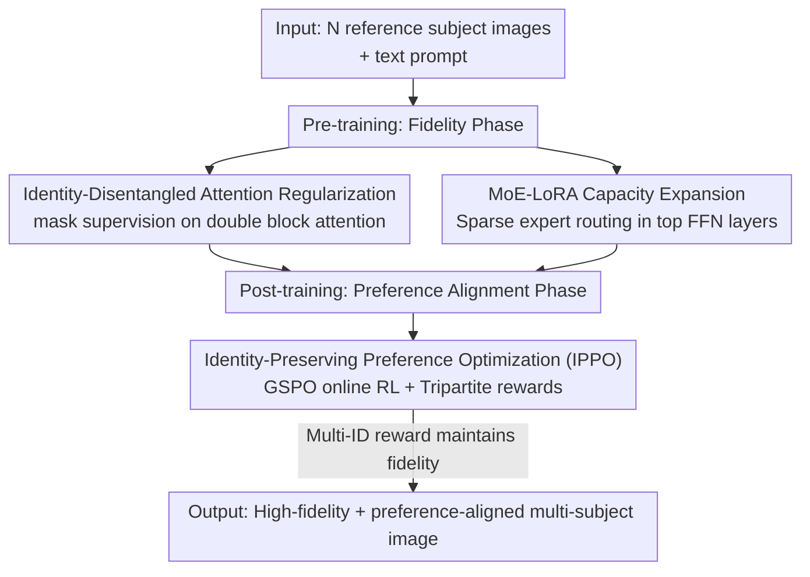

# MultiCrafter: High-Fidelity Multi-Subject Generation via Disentangled Attention and Identity-Aware Preference Alignment

**Conference**: CVPR 2026  
**Paper**: [CVF Open Access](https://openaccess.thecvf.com/content/CVPR2026/html/Wu_MultiCrafter_High-Fidelity_Multi-Subject_Generation_via_Disentangled_Attention_and_Identity-Aware_Preference_CVPR_2026_paper.html)  
**Area**: Image Generation / Multi-Subject Customization  
**Keywords**: Multi-subject generation, attention disentanglement, identity preservation, preference alignment, MoE-LoRA

## TL;DR
MultiCrafter decomposes "multi-subject customized generation" into two non-conflicting training phases: pre-training uses explicit positional supervision to constrain each subject's attention to correct spatial regions to eliminate attribute crosstalk and employs MoE-LoRA for complex layout capacity; post-training utilizes an online reinforcement learning framework with Hungarian matching for scoring to maximize aesthetic and text alignment, significantly outperforming current In-Context-Learning (ICL) methods in subject fidelity.

## Background & Motivation

**Background**: As text-to-image models like DiT (Diffusion Transformer) and Flux mature, the demand for personalized generation has surged. "Multi-subject generation"—reconstructing multiple given reference subjects (multiple people or objects) within a single image—is the most valuable yet difficult subtask. The current mainstream approach follows the In-Context-Learning (ICL) route, represented by UNO and OmniGen, which encodes each reference subject into latent tokens and concatenates them into the sequence, relying on DiT's attention mechanism for customization.

**Limitations of Prior Work**: ICL methods frequently fail, most typically through "attribute leakage"—when two subjects have similar attributes (e.g., two people of the same gender), the generated faces blend or result in "average faces," collapsing subject fidelity. The authors localized the root cause via attention map visualization, naming it "attention bleeding": in DiT double blocks, the attention response regions for different subjects are entangled and fail to separate.

**Key Challenge**: The authors argue the issue stems from a "highly coupled training paradigm." Multi-subject generation essentially needs to satisfy two distinct objectives: (i) high fidelity for multiple subjects, and (ii) alignment with human preferences (aesthetic quality, semantic/text alignment). Current methods use a single indirect reconstruction loss to force both goals in a single phase. Reconstruction loss fails to disentangle subject features from spatial positions (hurting fidelity) and suffers from "proxy-objective mismatch" with multi-dimensional human preferences (reconstruction loss does not directly align with aesthetics or text). One loss is forced to compromise between two goals, resulting in sub-optimal performance for both.

**Goal**: Decouple this composite task, allowing the model to focus separately on "subject fidelity" and "human preference alignment" in different stages.

**Key Insight**: Through visualization, the authors derived a key criterion: for high fidelity, the peak attention response for a subject in the double blocks must consistently fall within that subject's spatial region in the generated image. Therefore, rather than hoping the reconstruction loss implicitly learns this, it is better to directly and explicitly supervise the spatial distribution of attention during training.

**Core Idea**: Divide-and-conquer. The pre-training phase uses explicit positional supervision to "align" attention to correct regions for fidelity; the post-training phase uses an identity-preserving online RL to align human preferences directly without destroying the fidelity achieved in the first stage.

## Method

### Overall Architecture
MultiCrafter is built on Flux (Flow Matching + DiT). The input consists of $N$ reference images of different subjects + a text prompt, and the output is the result of combining these subjects into one image according to the prompt. The pipeline is divided into two parts:

- **Pre-training (Fidelity Phase)**: In addition to the standard Flow Matching reconstruction loss, an **Identity-Disentangled Attention Regularization** is added. Pre-annotated subject masks explicitly supervise the attention maps of each subject in the double blocks to force separation; meanwhile, since a single LoRA lacks the capacity to cover diverse spatial layouts, the FFN layers are replaced with **MoE-LoRA**. This positional supervision is only active during training; no layout input is required from the user during inference.
- **Post-training (Preference Alignment Phase)**: **Identity-Preserving Preference Optimization (IPPO)** is performed on the high-fidelity model. This is an online reinforcement learning framework based on MixGRPO sliding windows using the stable GSPO (sequence-level policy ratio). The reward consists of three components: aesthetics, text alignment, and subject fidelity. Subject fidelity is precisely calculated using a **Hungarian matching** based Multi-ID Alignment Reward to prevent the model from gaming the score via attribute leakage.

### Key Designs

**1. Identity-Disentangled Attention Regularization: Pinning attention to its designated location via masks**

This item addresses "attention bleeding/attribute leakage." The authors observed two points: double blocks determine the spatial layout of reference subjects more than single blocks; training solely with reconstruction loss entangles attention fields. They proposed that subject's peak attention must align with its spatial region. The latent features of the $i$-th reference subject are patched and position-encoded into a 1D token sequence $z_{r'}^{i} \in \mathbb{R}^{l \times c}$. In the $k$-th double block, the attention map is calculated as $m_k^i = \mathrm{Softmax}(Q_{k,i} K_k^{\top} / \sqrt{d})$. The attention maps for a subject across all $N$ double blocks are aggregated, averaged, and normalized to obtain $\hat{M}_i$, which is then aligned with the ground truth mask $M_i$ using Dice loss:

$$L_{attn} = \sum_{i=1}^{N}\left(1 - \frac{2\sum_j (\hat{M}_{i,j}\cdot M_{i,j}) + \epsilon}{\sum_j \hat{M}_{i,j} + \sum_j M_{i,j} + \epsilon}\right)$$

The final pre-training loss is $L = L_{diff} + \lambda \cdot L_{attn}$. It is effective because it **directly and explicitly** injects the "subject ↔ spatial region" correspondence as a supervision signal into the attention, rather than relying on indirect learning.

**2. MoE-LoRA: Supplementing model capacity for "infinitely varied spatial layouts"**

While attention regularization is effective, it requires the model to master extremely diverse spatial layouts from various prompt × subject combinations. The authors found single LoRA capacity insufficient, leading to failures in certain layouts (e.g., complex "teddy bear riding a motorcycle" scenes). Borrowing from MoE-LoRA's success in multi-task fine-tuning, the FFN layers at the Flux output side are replaced with MoE-LoRA. For an FFN input $h$, a lightweight gating network computes $p = \mathrm{Softmax}(\mathrm{TopK}(W_g \cdot h, k))$, keeping only the top-$k$ expert logits and setting others to $-\infty$ for sparse activation (e.g., $k=1$ for 4 experts). Each expert is an independent LoRA $W_A^i, W_B^i$, with output:

$$h_{out} = \mathrm{FFN}(h) + \sum_{i=1}^{N_e} p_i \cdot \frac{\alpha}{r} W_B^i W_A^i h$$

**3. Identity-Preserving Preference Optimization (IPPO): Online RL with Hungarian matching to align preferences without losing fidelity**

The post-training stage compensates for aesthetics and text alignment. The challenge is not damaging the fidelity gained in the first stage. The authors use a MixGRPO sliding window framework but found that standard GRPO's token-level policy ratio is unstable for MoE models due to routing jitter. They switch to GSPO, which uses a **sequence-level** ratio across denoising steps within window $S$:

$$s_i(\theta) = \exp\left(\frac{1}{|S|}\sum_{t\in S}\log\frac{\pi_\theta(x_{t+1}\mid x_t, c, Z)}{\pi_{\theta_{old}}(x_{t+1}\mid x_t, c, Z)}\right)$$

The objective is $J(\theta) = \mathbb{E}\big[\frac{1}{N}\sum_i \min(s_i(\theta)A_i,\ \mathrm{clip}(s_i(\theta), 1-\beta, 1+\beta)A_i)\big]$. The composite reward is $R = w_{text}R_{text} + w_{aes}R_{aes} + w_{id}R_{id}$. $R_{id}$ is the core innovation—**Multi-ID Alignment Reward**: for faces, a detector extracts embeddings for reference and generated images to build a cosine similarity matrix $C$. The Hungarian algorithm then solves for optimal assignment $\max_X \sum_{i,j} C_{ij}X_{ij}$ with the constraint that each face matches at most once ($\sum_j X_{ij}\le 1,\ \sum_i X_{ij}\le 1$). This "match at most once" constraint is critical to preventing reward hacking via "average faces" from attribute leakage.

### Loss & Training
Pre-training objective: $L = L_{diff} + \lambda L_{attn}$; Post-training uses GSPO objective (Eq. 10), with advantages $A_i$ normalized within groups and composite reward (Eq. 11). Implementation: output 512×512, reference 320×320, LoRA rank $r=512$, MoE-LoRA with 4 experts activating 1, RL sampling steps of 16, window $w=2$, and step size $s=1$.

## Key Experimental Results

### Main Results
SOTA comparisons on multi-human and multi-object benchmarks. Metrics include CLIP-T, Face-Sim, DINO-I, CLIP-I, and AES.

| Setting | Method | CLIP-T | Face-Sim | DINO-I | CLIP-I |
|------|------|--------|----------|--------|--------|
| Multi-Human | UNO | 0.2645 | 0.1474 | 0.5972 | 0.6489 |
| Multi-Human | XVerse | 0.2591 | 0.4117 | 0.7665 | 0.8027 |
| Multi-Human | **Ours** | **0.2753** | **0.5284** | **0.8294** | **0.8524** |

| Setting | Method | CLIP-T | DINO-I | CLIP-I | AVG |
|------|------|--------|--------|--------|-----|
| Multi-Object | UNO | 0.3259 | 0.7374 | 0.8392 | 0.4582 |
| Multi-Object | XVerse | 0.2981 | 0.7449 | 0.8456 | 0.5153 |
| Multi-Object | **Ours** | **0.3380** | **0.7824** | **0.8608** | **0.5592** |

Subject fidelity (Face-Sim, DINO-I) shows significant leads: Multi-human Face-Sim jumps from 0.4117 (XVerse) to 0.5284.

### Ablation Study
Baseline is UNO (Flux + highly coupled objectives) on the multi-human benchmark:

| $L_{attn}$ | MoE-LoRA | IPPO | CLIP-T | Face-Sim | DINO-I | CLIP-I | AES | Overall |
|:---:|:---:|:---:|--------|----------|--------|--------|-----|---------|
| ✗ | ✗ | ✗ | 0.2645 | 0.1474 | 0.5972 | 0.6489 | 0.2954 | 0.3907 |
| ✓ | ✗ | ✗ | 0.2637 | 0.4983 | 0.7953 | 0.8032 | 0.2653 | 0.5252 |
| ✓ | ✓ | ✗ | 0.2674 | 0.5154 | 0.8107 | 0.8480 | 0.2661 | 0.5415 |
| ✓ | ✓ | ✓ | 0.2753 | 0.5284 | 0.8294 | 0.8524 | 0.2915 | 0.5554 |

### Key Findings
- **Attention Regularization is the primary contributor**: Adding $L_{attn}$ alone increases Face-Sim from 0.1474 to 0.4983, proving "attribute leakage = attention entanglement" was the correct diagnosis.
- **MoE-LoRA adds capacity**: It pushes CLIP-I further while recovering text alignment (CLIP-T) and fixing failed composition scenes.
- **IPPO balances aesthetics and fidelity**: It improves aesthetics (AES) and CLIP-T without sacrificing Face-Sim/DINO-I, proving Hungarian matching prevents hacking.

## Highlights & Insights
- **Turning "Diagnosis" into "Supervision"**: The authors didn't just complain about ICL failures; they localized "attention bleeding" and converted it into a differentiable Dice loss—a clean causal loop from phenomenon to mechanism to loss.
- **"Match-at-most-once" is crucial**: The Hungarian matching constraint is the key to preventing reward hacking where the model would otherwise generate multiple "average faces" to maximize similarity scores.
- **"Decoupled Training Objectives" as a Methodology**: When objectives in a task conflict (fidelity vs. aesthetics), separating them into stages with targeted supervision/rewards is often more effective than tuning weights.

## Limitations & Future Work
- **Dependency on toolchains**: Attention regularization requires subject masks; rewards rely on Florence-2, SAM2, and face detectors—increasing engineering cost and capping performance by tool accuracy.
- **Data Quality Limits Aesthetics**: Lower AES in multi-human scenarios is attributed to training data quality, indicating data remains a bottleneck.
- **Heavy Pipeline**: The MoE-LoRA + sliding window RL pipeline is complex with many hyperparameters.

## Related Work & Insights
- **vs UNO / OmniGen (ICL)**: They couple goals in one reconstruction loss, leading to "attention bleeding." Ours decouples and uses explicit supervision, drastically improving Face-Sim (0.1474 → 0.5284).
- **vs MixGRPO variants**: While those introduce RL to T2I, IPPO is the first to apply online RL to multi-subject customization with a hacking-resistant multi-ID reward.

## Rating
- Novelty: ⭐⭐⭐⭐ Combination of attention diagnosis and Hungarian RL reward is novel and well-motivated.
- Experimental Thoroughness: ⭐⭐⭐⭐ Dual benchmarks and clear ablations, though some details are in supplements.
- Writing Quality: ⭐⭐⭐⭐ Clear logical chain from phenomenon to mechanism.
- Value: ⭐⭐⭐⭐ High utility in improving subject fidelity for multi-instance generation.

<!-- RELATED:START -->

## Related Papers

- [\[ICLR 2026\] SIGMA-GEN: Structure and Identity Guided Multi-Subject Assembly for Image Generation](../../ICLR2026/image_generation/sigma-gen_structure_and_identity_guided_multi-subject_assembly_for_image_generat.md)
- [\[ICLR 2026\] MOSAIC: Multi-Subject Personalized Generation via Correspondence-Aware Alignment and Disentanglement](../../ICLR2026/image_generation/mosaic_multi-subject_personalized_generation_via_correspondence-aware_alignment_.md)
- [\[CVPR 2026\] Semantic Alignment for Pose-Invariant Identity Preserving Diffusion](semantic_alignment_for_pose-invariant_identity_preserving_diffusion.md)
- [\[CVPR 2026\] Correspondence-Attention Alignment for Multi-View Diffusion Models](correspondence-attention_alignment_for_multi-view_diffusion_models.md)
- [\[CVPR 2026\] Towards High-resolution and Disentangled Reference-based Sketch Colorization](towards_high-resolution_and_disentangled_reference-based_sketch_colorization.md)

<!-- RELATED:END -->
