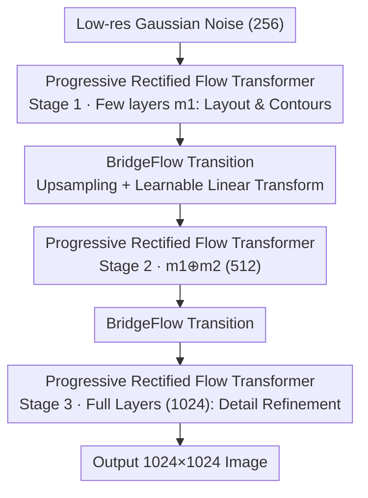

# NAMI: Efficient Image Generation via Bridged Progressive Rectified Flow Transformers

**Conference**: CVPR 2026  
**Paper**: [CVF Open Access](https://openaccess.thecvf.com/content/CVPR2026/html/Ma_NAMI_Efficient_Image_Generation_via_Bridged_Progressive_Rectified_Flow_Transformers_CVPR_2026_paper.html)  
**Code**: Not mentioned  
**Area**: Diffusion Models / Image Generation  
**Keywords**: Rectified Flow, Progressive Generation, Multi-resolution Training, Inference Acceleration, DiT

## TL;DR
NAMI partitions the rectified flow of text-to-image generation into multiple time windows based on resolution. Low-resolution stages utilize fewer Transformer layers to rapidly construct layouts, while high-resolution stages gradually stack layers for detail refinement. A learnable BridgeFlow module aligns distributions between adjacent stages. At a 2B parameter scale, it reduces inference time for $1024 \times 1024$ images by 64% while maintaining quality comparable to state-of-the-art models.

## Background & Motivation

**Background**: Text-to-image models represented by SD3 and FLUX achieve leading generation quality using rectified flow and MM-DiT architectures. Rectified flow connects noise and data via linear trajectories, offering higher efficiency in training and inference than traditional diffusion. MM-DiT concatenates text and image tokens for joint attention.

**Limitations of Prior Work**: While quality has improved, parameter counts and computational overhead have surged. For instance, FLUX reaches 12B parameters, requiring full-load computation across all denoising steps, tokens, and model layers to generate a high-resolution image, leading to prohibitive inference latency and cost. Existing acceleration strategies (e.g., high-ratio VAE downsampling, token reduction, linear attention) often sacrifice generation quality.

**Key Challenge**: Current methods apply **uniform** denoising across all sampling stages, failing to exploit the inherent "coarse-to-fine" structure of image generation. The authors observe that early diffusion stages primarily establish rough conceptual layouts and object contours, which can be accomplished quickly at **low resolutions** using only a **subset of model parameters**. Computationally intensive detail enhancement occurs later. Forcing maximum resolution and model capacity throughout the process creates significant redundancy.

**Goal**: To decompose the generation process across temporal, spatial, and architectural dimensions simultaneously, making early layout stages faster and more efficient without compromising quality.

**Key Insight**: Segment the rectified flow by resolution (pyramid-style), assigning fewer layers to low-resolution segments and more layers to high-resolution ones, forming a "time-segmented + spatial-cascaded" progressive structure. The difficulty lies in smoothing the probability distribution transitions between adjacent segments to avoid quality loss from jumps.

**Core Idea**: Replace the non-learnable re-noising transition used in pyramid flows with a learnable BridgeFlow module, combining "Progressive Rectified Flow Transformers + Multi-resolution Joint Training" into an end-to-end efficient framework.

## Method

### Overall Architecture
NAMI splits a text-to-image denoising trajectory into $K$ resolution stages (typically $K=3$, with resolutions 256→512→1024). The rectified flow is partitioned into $K$ corresponding time windows $[t_{k-1}, t_k]$. Each stage is assigned a module $m_k$ composed of MM-DiT blocks, where the network for stage $k$ is **nested and cumulative**: $\theta_k = \{m_1 \oplus \cdots \oplus m_k\}$. As resolution increases, more layers participate in the computation. Inference starts from low-resolution noise; between stages, upsampling and the BridgeFlow module align the endpoint of one segment with the starting point of the next. The training phase employs a multi-resolution joint strategy to accelerate convergence.

### Key Designs

**1. Progressive Rectified Flow Transformer: Aligning "Coarse-to-Fine" across Temporal, Spatial, and Capacity Axes**

This design eliminates uniform denoising redundancy. The flow is split into $K$ windows via a pyramid approach. Within the $k$-th window, the starting point $\hat{x}_{s_k} = \text{BridgeFlow}(\text{Up}(\text{Down}(x_{t_{k-1}}, 2^{k+1})))$ is derived from the previous stage's endpoint, while the endpoint $\hat{x}_{e_k} = \text{Down}(x_{t_k}, 2^{k})$ is obtained by downsampling data. Intrawindow interpolation follows $\hat{x}_t = t'\hat{x}_{e_k} + (1-t')\hat{x}_{s_k}$, where $t' = (t - t_{k-1})/(t_k - t_{k-1})$. "Spatial cascading" is reflected in the model: stage $k$ only uses blocks $\theta_k = m_1 \oplus \cdots \oplus m_k$. Low-resolution stages use fewer layers and tokens, resulting in high speed. The total optimization objective is summed across time windows:

$$\min_{\theta_k} \sum_{k=1}^{K} \mathbb{E}\Big[\int_{t_{k-1}}^{t_k} \big\|(\hat{x}_{s_k} - \hat{x}_{e_k}) - v_{\theta_k}(\hat{x}_t, t)\big\|^2 \, dt\Big]$$

**2. BridgeFlow: Learnable Linear Transformation for Smooth Transitions**

When stages are segmented, probability paths can break at jump points. Unlike Pyramid Flow, which uses non-learnable rescaling and re-noising for Gaussian distribution matching—a process that lacks robustness and scales poorly with token length—BridgeFlow uses data-driven alignment. Each stage's endpoint is upsampled and passed through a linear transformation $\hat{x}_{s_k} = W \cdot \text{Up}(\hat{x}_{e_{k-1}}) + B$ to align it with the next stage's distribution. These modules are pre-trained independently using MSE loss.

**3. Multi-resolution Joint Training: Concurrent Processing to Prevent Forgetting**

Instead of sequential fine-tuning (low to high), NAMI trains on multiple resolutions **simultaneously within a single batch**. Data for each time window is downsampled via $\text{Down}(\cdot)$ to calculate losses. Loss weights for different stages are dynamically adjusted during training. This encourages knowledge sharing and prevents catastrophic forgetting of semantic information learned at lower resolutions.

**4. NAMI-1K Benchmark: A Diverse Human Preference Evaluation Set**

To address bias in existing benchmarks like GenEval or DPG, the authors constructed NAMI-1K: 1000 prompts including 360 short prompts from GenEval/LumiereSet, 320 community-sourced prompts, and 320 long prompts (up to 120 words) generated by Cogvlm2. Evaluations cover relevance, coherence, aesthetics, and authenticity.

### Loss & Training
The core training objective is the windowed rectified flow loss mentioned above. NAMI-2B consists of 22 layers (2048 width, 16 heads) with a 3-stage layer ratio of 9:7:6. NAMI-0.6B has 12 layers with a ratio of 5:4:3. The training set includes approximately 100 million images (LAION + GRIT-20M + high-quality internal data).

## Key Experimental Results

### Main Results
On GenEval (short prompt text-to-image alignment), NAMI-2B leads its parameter class:

| Model (Params) | Overall | Single | Two | Count | Color | Pos | Color Attr |
|----------------|---------|--------|-----|-------|-------|-----|------------|
| SD3-medium (2B)| 0.62    | 0.98   | 0.74| 0.63  | 0.67  | 0.34| 0.36       |
| Sana (1.6B)    | 0.66    | 0.99   | 0.77| 0.62  | 0.88  | 0.21| 0.47       |
| **NAMI-2B (2B)**| **0.65**| 0.99   | 0.78| 0.64  | 0.82  | 0.20| 0.45       |
| FLUX-dev (12B) | 0.67    | 0.99   | 0.81| 0.79  | 0.74  | 0.20| 0.47       |

In human preference testing (NAMI-1K), NAMI-2B achieves the highest total score among similar-sized models:

| Model (Params) | Relevance | Coherence | Aesthetics | Authenticity | Total |
|----------------|-----------|-----------|------------|--------------|-------|
| SD3-medium (2B)| 75.74     | 65.90     | 61.64      | 75.74        | 69.97 |
| **NAMI-2B (2B)**| **76.07** | **66.89** | **62.30**  | **76.72**    | **70.69**|

Efficiency at 1024 resolution: NAMI-2B takes 2.98s compared to 8.47s for a FLUX-based baseline (30-step uniform sampling), a **64.82% reduction**.

### Ablation Study

| Configuration | Key Metrics | Note |
|---------------|-------------|------|
| Full NAMI | FID 8.93 / CLIP 25.57 | Flow segments + model blocks enabled |
| BridgeFlow vs Pyramid Flow | 0.05s / FID 8.93 vs 0.12s / FID 9.82 | BridgeFlow is faster and better |

### Key Findings
- **Source of Speedup**: At 1024 resolution, flow segmentation alone saves 53.01% of inference time. Layer nesting adds another 11.81%. The primary gain comes from reducing token processing in low-resolution stages.
- **Simplicity in Transitions**: A single learnable linear layer in BridgeFlow provides the best trade-off. More complex structures (MLP, CNN) did not yield further quality improvements.
- **Layer Allocation**: Performance saturates once a sufficient number of layers is assigned to low-resolution stages. Uniform time window partitioning (1:1:1) is generally optimal.

## Highlights & Insights
- **Triple-Axis Decomposition**: Decomposing generation across time, space, and capacity axes is highly effective. These dimensions are orthogonal and can be combined with other techniques like linear attention.
- **Linear Distribution Alignment**: BridgeFlow replaces complex re-noising with a simple linear transformation, demonstrating that distribution alignment at stage boundaries does not require heavy architectures.
- **Joint Training for Multi-Scale**: Training on multiple resolutions in the same batch is a practical trick to share knowledge across modules and mitigate forgetting during high-resolution tuning.

## Limitations & Future Work
- **Gap with Massive Models**: NAMI-2B still trails the 12B FLUX-dev in absolute quality. Gains are most visible when comparing models of the same parameter scale.
- **Manual Hyperparameters**: Layer ratios and time window boundaries are manually tuned based on experience; automated search is currently lacking.
- **BridgeFlow Pre-training**: The requirement for separate MSE pre-training for BridgeFlow adds complexity to the training pipeline.
- **Evaluation Scale**: Human preference scoring on NAMI-1K remains limited by the scale and consistency of manual annotators.

## Related Work & Insights
- **vs Pyramid Flow**: Both use temporal pyramids, but NAMI's learnable BridgeFlow is more robust than non-learnable re-noising. NAMI further introduces architectural nesting to save more computation.
- **vs MatryoshkaDM**: Matryoshka uses nested UNets in pixel space but does not address DiT parameter redundancy. NAMI addresses both spatial and capacity redundancy in latent space.
- **vs SANA**: While SANA uses high-ratio VAE downsampling, NAMI decomposes the generation process, a strategy that is orthogonal and potentially complementary.

## Rating
- Novelty: ⭐⭐⭐⭐
- Experimental Thoroughness: ⭐⭐⭐⭐
- Writing Quality: ⭐⭐⭐⭐
- Value: ⭐⭐⭐⭐

<!-- RELATED:START -->

## Related Papers

- [\[CVPR 2026\] Probabilistic Precipitation Nowcasting with Rectified Flow Transformers](probabilistic_precipitation_nowcasting_with_rectified_flow_transformers.md)
- [\[CVPR 2026\] DDiT: Dynamic Patch Scheduling for Efficient Diffusion Transformers](ddit_dynamic_patch_scheduling_for_efficient_diffusion_transformers.md)
- [\[CVPR 2026\] From Sketch to Fresco: Efficient Diffusion Transformer with Progressive Resolution](from_sketch_to_fresco_efficient_diffusion_transformer_with_progressive_resolutio.md)
- [\[CVPR 2026\] RecTok: Reconstruction Distillation along Rectified Flow](rectok_reconstruction_distillation_along_rectified_flow.md)
- [\[NeurIPS 2025\] Efficient Rectified Flow for Image Fusion](../../NeurIPS2025/image_generation/efficient_rectified_flow_for_image_fusion.md)

<!-- RELATED:END -->
