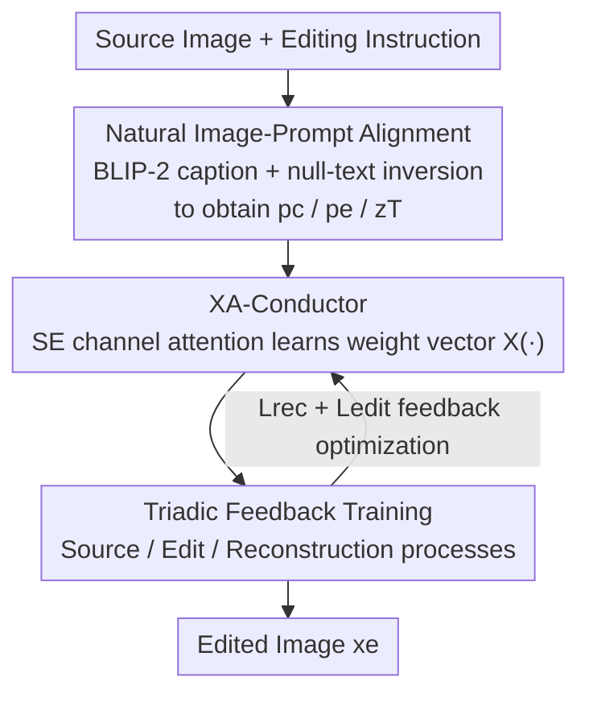

# NEAF: Natural Image Editing with Attention Fusion for Generalizable Test-time Optimization in Text-Guided Image Editing

**Conference**: CVPR 2026  
**Paper**: [CVF Open Access](https://openaccess.thecvf.com/content/CVPR2026/html/Kim_NEAF_Natural_Image_Editing_with_Attention_Fusion_for_Generalizable_Test-time_CVPR_2026_paper.html)  
**Code**: To be confirmed (the paper claims the inference code is in the supplementary material)  
**Area**: Diffusion Models / Image Editing  
**Keywords**: Text-guided image editing, test-time optimization, cross-attention fusion, zero-shot, non-rigid editing

## TL;DR
NEAF proposes a **zero-shot, tuning-free** test-time optimization framework. By adding a learnable XA-Conductor module of only 0.08M parameters to any pretrained T2I diffusion model, it dynamically fuses cross-attention maps through a triadic "source/edit/reconstruction" feedback loop. This achieves high-fidelity text-guided editing without retraining or dataset construction, particularly excelling at non-rigid (action/pose) editing which remains a challenge for other methods.

## Background & Motivation
**Background**: Diffusion-based text-to-image (T2I) models have demonstrated the ability to generate high-fidelity images, giving rise to the text-guided image editing task, which modifies existing images based on text instructions. Existing approaches generally fall into three categories: (a) **retraining** the entire model on large-scale paired editing datasets; (b) **fine-tuning** only specific layers or latent embeddings of the diffusion model; (c) **tuning-free** methods that directly reuse pretrained models, often employing a dual-branch "reconstruction branch + edit branch" structure to inject/replace attention maps and features between the two branches.

**Limitations of Prior Work**: Retraining approaches offer strong editing capabilities but are highly expensive, requiring the construction of large paired datasets and model retraining. Moreover, once trained, they are tied to a specific base model, **sacrificing generalization to other (especially lightweight) models**. Fine-tuning approaches eliminate the need for paired data but still incur additional training overhead, and degrade significantly on **non-rigid, highly structured** complex edits. Tuning-free approaches are lightweight but directly transfer self-/cross-attention without introducing any **learned relationships between attention maps**, which naturally limits their capability and easily leads to **text-image misalignment and identity drift** when facing arbitrary user prompts.

**Key Challenge**: The fundamental tension in editing tasks is **editability (reflecting text changes) $\leftrightarrow$ fidelity (preserving unedited regions)**. Dual-branch methods rigidly inject source attention to preserve fidelity, which in turn suppresses the expression of semantic variations, especially for non-rigid edits that require structural deformation driven by verbs (e.g., "smiling", "jumping"). The authors attribute this to two specific technical hurdles: (1) **image-text misalignment** when arbitrary instructions are applied to natural images; and (2) **excessive text bias** introduced by DDIM inversion and large classifier-free guidance in dual branches, which ironically destroys the high fidelity that multi-branch methods aim to preserve.

**Goal**: To build a "generalizable framework" that turns any T2I model into an editor at zero cost, **requiring no large datasets, no retraining, and no fine-tuning**, while remaining stable for both conventional and non-rigid editing.

**Key Insight**: The authors hypothesize that the failure of dual-branch methods in non-rigid editing stems from their purely "tuning-free" nature—simply injecting attention maps as-is without any **learning-based** optimization. Since **cross-attention naturally carries the semantic features of verbs**, lightweight learning of cross-attentions can unlock high-level verb-driven editing.

**Core Idea**: To insert a lightweight learnable module (XA-Conductor) in the editing branch to **learn a weight vector** through a "source $\rightarrow$ edit $\rightarrow$ reconstruction" triadic feedback loop, adaptively deciding whether each cross-attention map should be preserved or modified, thereby decoupling and controlling editability and fidelity at the attention level.

## Method

### Overall Architecture
The input to NEAF is a natural image $x_o$ along with an editing instruction, and the output is the edited image $x_e$. The entire pipeline does not alter the weights of the base diffusion model, optimizing only a micro-module during inference. It proceeds in two steps: first, **natural image-to-prompt alignment** maps the "arbitrary natural image + arbitrary instruction" into the aligned subspace preferred by the diffusion model; second, **XA-Conductor + triadic feedback** learn to fuse attention during the sampling process.

Specifically, the source image first generates a source caption $p_c$ highly aligned with the image content using BLIP-2, which is then used to optimize the null-text embedding $\varnothing$ and obtain the initial noise latent $z_T$ via inversion. For editing, only minimal modifications are made to $p_c$ to obtain the aligned target prompt $p_e$. Then, the framework runs three reverse diffusion processes in parallel: the **source process** (using $p_c$, recording the cross-attention $A^{(c)}_t$ at each step), the **editing process** (using $p_e$, but replacing the attention with the interpolated $\hat{A}_t$), and the **reconstruction process** (re-using $p_c$, replacing the attention with $\tilde{A}_t$). The XA-Conductor is the module that outputs the interpolation weights. The outputs of the triadic processes are fed back as training signals (reconstruction loss + editing loss) to iteratively optimize the weight vector until convergence, and finally, $x_e$ is decoded from the editing process.

### Key Designs

**1. Natural Image-to-Prompt Alignment: Pulling arbitrary image-text back to the alignment subspace of the diffusion model**

This step addresses the first hurdle—the image-text misalignment that occurs when arbitrary instructions are applied to natural images, leading to poor editing results (Paper Fig. 2(a)). The essence of misalignment is the residual semantic gap between the prompt and the image, stemming from imperfect image-text alignment during training. The authors' approach is to use the vision-language model BLIP-2 to generate a **caption $p_c$ highly aligned with the image content**, use it to optimize the null-text embedding $\varnothing$, and simultaneously find the noise latent $z_T$ via inversion. During sampling, $p_c$ along with the optimized $\varnothing$ acts as a constraint, **implicitly defining the editable space**. The editing instruction is not created from scratch but is obtained by making minimal edits to $p_c$ to get the aligned target prompt $p_e$—ensuring $p_e$ is highly similar to $p_c$, differing only at the edited elements. Because the caption itself is aligned, the optimized null embedding encodes the reconstruction trajectory of the source image, ensuring that generation conditioned on $p_e$ is consistent with the source image without severe deviation (Paper Fig. 2(b) shows that editing with aligned prompts is noticeably better). This step is a prerequisite for stable subsequent attention fusion: aligning the "input" first before discussing "how to edit."

**2. XA-Conductor: A cross-attention conductor that learns weight vectors**

This is the core module of the paper, addressing the second hurdle—the loss of verb-based non-rigid editing capabilities in dual-branch methods due to their static attention transfer and lack of learning relationships. The authors hypothesize that cross-attention carries the semantic features of verbs. Therefore, they introduce a lightweight learnable module $\mathcal{X}(\cdot)$ that takes the cross-attention maps generated by each process branch as input and outputs a vector $\mathcal{X}(A) \in \mathbb{R}^N$, where each element represents the weight assigned to the $N$-th attention map during the reverse sequence. Structurally, the module employs a **channel-wise attention architecture** consisting of squeeze-and-excitation (SE) blocks, enabling fine-grained modulation of each cross-attention channel to capture subtle, lagging changes accumulated across steps.

During sampling, it operates as follows: The source process records the cross-attention map at each step $A^{(c)}_t = \mathcal{A}(z^{(c)}_t, [\varnothing; p_c])$, updating $z^{(c)}_{t-1} = \mathcal{S}_t(z^{(c)}_t, \epsilon^{(c)}_t)$ via DDIM. The editing process then performs a **linear interpolation** between the source attention $A^{(c)}_t$ and the editing attention $A^{(e)}_t$ using the weights provided by XA-Conductor:

$$\hat{A}_t = \mathcal{X}(A^{(c)}_t) \cdot A^{(c)}_t + \bigl(1 - \mathcal{X}(A^{(c)}_t)\bigr) \cdot A^{(e)}_t$$

The interpolated $\hat{A}_t$ replaces $A^{(e)}_t$ at each step, forcing the denoiser to predict toward the "mixed image-text interaction," which both drifts toward the source image (preserving identity) and implements the edit intent of $p_e$, eventually decoding into $x_e$. In other words, the weights $\mathcal{X}(\cdot)$ learn "which attention maps should preserve the source and which should yield to the edit," turning the trade-off between fidelity and editability into a learnable, channel-wise continuous dial—precisely the "learning relationship" that tuning-free methods lack.

**3. Triadic Feedback Training: Imposing "fidelity constraints" on the weight vector through a reconstruction loop**

For XA-Conductor to learn accurately, it must receive a supervisory signal indicating "whether it has over-edited." To this end, the authors design a triadic-feedback training scheme: in addition to the source and edit branches, they introduce a **reconstruction process** that re-introduces the source prompt $p_c$ but replaces the attention with another interpolation $\tilde{A}_t = (1 - \mathcal{X}(\hat{A}_t)) \cdot A^{(c)}_t + \mathcal{X}(\hat{A}_t) \cdot \hat{A}_t$, similarly replacing $A^{(c)}_t$ at each step and decoding the reconstruction image $x_r$. The significance of this is to let XA-Conductor learn to identify which cross-attention maps are critical for editing, and **attenuate or restore** their impact when the source prompt is re-introduced—if the editing weights are set reasonably, the reconstruction process should be able to restore the content back to the source image.

This naturally leads to the training objective, combining two complementary losses:

$$\mathcal{L} = \sum_{t=0}^{T} \bigl\lVert z^{(r)}_t - z^{(o)}_t \bigr\rVert_2 - \lambda \cdot \text{sim}_\text{CLIP}(x_e, p_e)$$

The first term, the reconstruction loss $\mathcal{L}_{rec} = \sum_t \lVert z^{(r)}_t - z^{(o)}_t \rVert_2$, forces the reconstruction trajectory to approach the source image latent, enforcing content preservation. The second term, the editing loss $\mathcal{L}_{edit} = -\text{sim}_\text{CLIP}(x_e, p_e)$, uses CLIP image-text similarity to constrain the edited result to be faithful to $p_e$. The scalar $\lambda$ regulates the trade-off between "content preservation vs. edit adherence." Notably, the authors empirically find that **the contribution of $\mathcal{L}_{edit}$ is minor**—meaning that what truly sustains editing quality is the triadic feedback structure with the reconstruction constraint itself, rather than the CLIP term. The entire optimization targets only the 0.08M XA-Conductor, while the base diffusion model remains frozen throughout, which is the meaning of "zero-shot test-time optimization."

### Loss & Training
NEAF is built on Stable Diffusion v1.4. The XA-Conductor completes test-time optimization within 50 inference steps at a learning rate of 1e-2 on a single RTX 3090. The loss is as described above: $\mathcal{L} = \mathcal{L}_{rec} - \lambda \cdot \text{sim}_\text{CLIP}(x_e, p_e)$, where $\mathcal{L}_{edit}$ empirically contributes minimally, and fidelity is primarily guaranteed by the reconstruction term of the triadic feedback.

## Key Experimental Results

### Main Results
The evaluation is conducted on 25 images from TEdBench (with some portrait extensions for applicability), comparing with 6 representative baselines (Text2Live, InstructPix2Pix, Imagic, SDEdit, PnP, LEDITs++, plus Swiftedit). Quantitative metrics follow OmniEdit's VIE Score (evaluated by GPT-4o / Gemini), including Semantic Consistency SC, Perceptual Quality PQ, and Overall Score O.

| Method (Category) | PQ (GPT4o) | SC (GPT4o) | O (GPT4o) | PQ (Gemini) | SC (Gemini) | O (Gemini) |
|--------|------|------|------|------|------|------|
| InstructPix2Pix (Large-scale retraining) | 6.28 | 6.14 | 6.07 | 7.00 | 5.85 | 6.23 |
| Text2Live (Fine-tuning) | 5.14 | 3.14 | 3.74 | 7.71 | 6.28 | 6.79 |
| Imagic (SD) (Fine-tuning) | 7.00 | 5.42 | 5.95 | 8.00 | 7.14 | 7.26 |
| SDEdit (Tuning-free) | 7.14 | 7.14 | 7.09 | 7.57 | 7.42 | 7.26 |
| PnP (Tuning-free) | 7.00 | 6.14 | 6.36 | 8.00 | 5.57 | 6.39 |
| LEDITs++ (Tuning-free) | 7.71 | 7.00 | 7.26 | 7.85 | 6.42 | 6.85 |
| Swiftedit (Network training) | 8.14 | 6.42 | 7.15 | 7.28 | 6.42 | 5.92 |
| **NEAF (SD) (Test-time TTO)** | 7.00 | **8.00** | **7.36** | 7.42 | **9.42** | **8.34** |

NEAF achieves the highest Overall Score O and Semantic Consistency SC under both evaluators, with a particularly prominent advantage in SC (GPT4o 8.00 / Gemini 9.42), indicating its significantly leading capability in "completing edits correctly" while maintaining a comparable Perceptual Quality PQ. The paper emphasizes that only Imagic and NEAF successfully complete non-rigid edits, with NEAF offering better fidelity to the source image; it also exhibits strong performance on fine-grained edits like "changing a house door number to 17".

### Computational Overhead Comparison
Comparison under the same settings with Imagic, which also supports non-rigid editing and is based on the SD1 series (retraining-based and tuning-free methods are excluded due to incomparable/unfair settings):

| Method | Parameter Count | GPU VRAM | GFLOPs | Total Training Time |
|------|--------|----------|--------|-----------|
| Imagic | 859.46M | 13.78 GB | 338.75 | 571.95±2.03 s |
| **NEAF** | **0.08M** | **8.63 GB** | **10.58** | **47.99±0.89 s** |

NEAF's learnable parameters are only about 1/10,000 of Imagic's (0.08M vs 859.46M), with GFLOPs more than an order of magnitude lower, and per-step training time about 1/12. Overall, NEAF takes about 3 minutes per image (on a single RTX 3090, including null-text inversion and test-time optimization), whereas Imagic takes about 7 minutes (on a single A100), demonstrating a clear efficiency advantage.

### Key Findings
- **XA-Conductor is key to success**: Ablations (Fig. 8) show that removing XA-Conductor often prevents the generated image from accurately following $p_e$—for example, the "cookie and milk" case generates an excessive amount of cookies; its presence is essential to both capture source features and accurately reflect text-driven edits.
- **Editing loss contributes minimally**: The authors empirically find that $\mathcal{L}_{edit}$ (the CLIP term) has a weak effect; what truly supports fidelity + editing quality is the reconstruction constraint structure of the triadic feedback.
- **Cross-attention visualization verification mechanism** (Fig. 7): During editing, interpolated attentions are effectively activated with stronger concentration on tokens like "smiling" and "three people", meaning minimal weights are assigned to source identity regions while edited regions are more emphasized, verifying the design intent of "fidelity + controllability."
- **Overwhelming human preference**: In 600 2AFC votes among 50 participants, NEAF's preference rate exceeded 70% over Imagic and 90% over LEDITs++ (Fig. 6). Because existing single global CLIP embedding metrics fail to capture local deformations and structural consistency of non-rigid edits, the authors supplemented the evaluation with subjective user studies.

## Highlights & Insights
- **Turning "fidelity vs. editability" into a learnable attention dial**: XA-Conductor learns channel-wise interpolation weights $\mathcal{X}(A)$, replacing the binary choice of hard injection in dual branches with a continuously adjustable one. This is fundamental to its ability to perform non-rigid edits, as verb semantics are precisely hidden in cross-attention.
- **Triadic feedback using "reconstrucibility" as a self-supervised signal**: In the absence of paired editing data, the authors constrain the weight vector based on "whether the source image can be restored when the source prompt is re-introduced," cleverly turning fidelity into a label-free loss term. This idea can be transferred to other unpaired controllable generation tasks.
- **0.08M parameters leveraging any T2I model**: Taking "generalization" to the extreme—without touching the base model or requiring datasets, optimizing only a micro SE-style module serves as an almost plug-and-play adapter layer for editing.

## Limitations & Future Work
- The authors acknowledge that failure cases and limitations are discussed in the supplementary material and not fully elaborated in the main text; it is indicated that failure still occurs in certain scenarios (⚠️ please refer to the supplementary material/original text for specific failure modes).
- Small evaluation scale: Main evaluations are on 25 images from TEdBench + a few portraits. Non-rigid editing lacks standard benchmarks, and quantitative evaluation relies heavily on VLM scoring (VIE Score) and human subjective studies, limiting thermodynamic comparability and statistical robustness.
- Test-time optimization is still required for each image (approx. 3 mins/image), which is less advantageous in inference speed compared to true feed-forward methods (e.g., Swiftedit); representing a "save training, spend inference" trade-off.
- Future work: The authors look forward to exploring more robust fidelity-preservation strategies and developing learning modules that can **independently identify key features** to further improve efficiency and performance under complex editing.

## Related Work & Insights
- **vs. Large-scale retraining (e.g., InstructPix2Pix)**: They rely on paired datasets to retrain for strong editing capabilities, but are tied to specific base models, expensive to construct/train, and generalize poorly; NEAF requires no retraining, no datasets, generalizes to any T2I model, and yields higher SC/O with lower overhead.
- **vs. Fine-tuning (e.g., Imagic)**: Imagic can similarly execute non-rigid edits, but requires fine-tuning, 859.46M parameters, and about 7 minutes/image; NEAF requires only 0.08M parameters, takes about 3 minutes/image, yields better source fidelity, and attains a higher overall score.
- **vs. Tuning-free dual-branch (e.g., PnP / LEDITs++)**: They directly inject/substitute attention to preserve structure, maintaining high source fidelity but lacking learning relationships, leading to degradation in non-rigid, verb-driven editing and susceptibility to image-text misalignment; NEAF introduces learnable attention fusion in the editing branch, bridging the gap of "learning-based attention relationships."

## Rating
- Novelty: ⭐⭐⭐⭐ Formulating "fidelity $\leftrightarrow$ editability" into test-time optimization using learnable cross-attention interpolation + triadic feedback is highly novel and directly addresses dual-branch pain points.
- Experimental Thoroughness: ⭐⭐⭐ Comprehensive VLM scoring + human studies + computational overhead + attention visualization; however, the benchmark only has 25 images and lacks standard baselines, resulting in a relatively small scale.
- Writing Quality: ⭐⭐⭐⭐ The motivation-challenge-method logic is clear, and equations are detailed; standard OCR/typesetting should be verified against the original text.
- Value: ⭐⭐⭐⭐ Leveraging any T2I model into an editor with only 0.08M parameters plug-and-play holds high practical value for non-rigid editing and low-cost deployment.

<!-- RELATED:START -->

## Related Papers

- [\[CVPR 2026\] From Scale to Speed: Adaptive Test-Time Scaling for Image Editing](from_scale_to_speed_adaptive_test-time_scaling_for_image_editing.md)
- [\[CVPR 2026\] Test-Time Alignment of Text-to-Image Diffusion Models via Null-Text Embedding Optimisation](test-time_alignment_of_text-to-image_diffusion_models_via_null-text_embedding_op.md)
- [\[CVPR 2026\] FlashIn: Fast and Accurate Image Inversion for Real-time Image Editing](flashin_fast_and_accurate_image_inversion_for_real-time_image_editing.md)
- [\[CVPR 2026\] Vinedresser3D: Agentic Text-guided 3D Editing](vinedresser3d_agentic_text-guided_3d_editing.md)
- [\[CVPR 2026\] The Devil is in Attention Sharing: Improving Complex Non-rigid Image Editing Faithfulness via Attention Synergy](the_devil_is_in_attention_sharing_improving_complex_non-rigid_image_editing_fait.md)

<!-- RELATED:END -->
