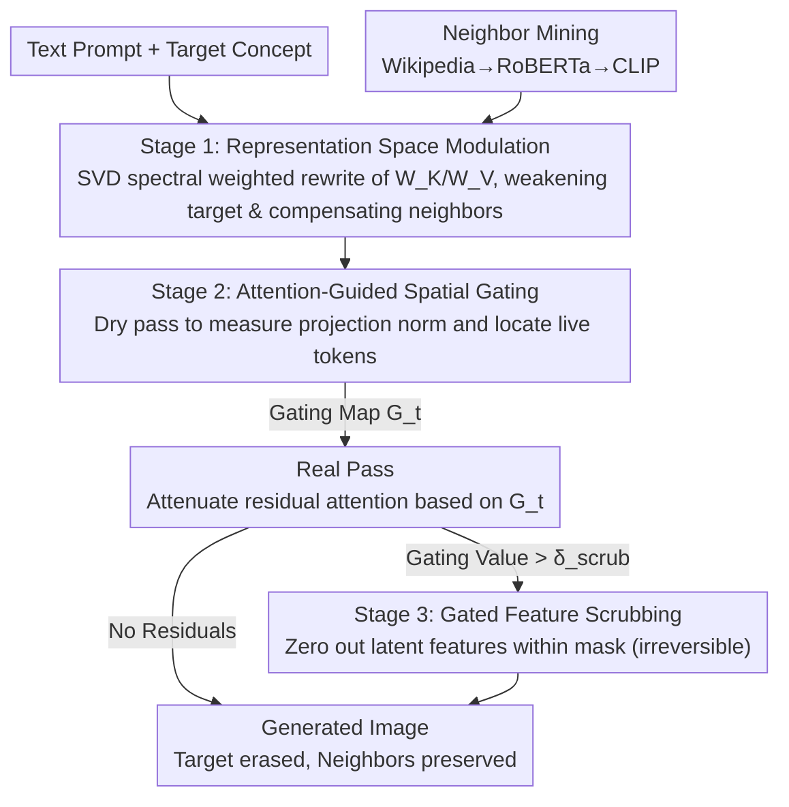

# Neighbor-Aware Localized Concept Erasure in Text-to-Image Diffusion Models

**Conference**: CVPR 2026  
**arXiv**: [2603.25994](https://arxiv.org/abs/2603.25994)  
**Code**: [https://github.com/alirezafarashah/NLCE](https://github.com/alirezafarashah/NLCE)  
**Area**: Image Generation / AI Safety  
**Keywords**: Concept Erasure, Diffusion Models, Neighbor Preservation, Training-free, Localized Erasure

## TL;DR

Ours proposes NLCE, a training-free three-stage concept erasure framework. It achieves precise localized erasure of target concepts while explicitly preserving semantically proximal concepts through spectrally weighted representation modulation, attention-guided spatial gating, and gated feature scrubbing. NLCE outperforms existing methods on Oxford Flowers, Stanford Dogs, celebrity identities, and sensitive content erasure tasks.

## Background & Motivation

1. **Background**: Concept erasure methods for T2I diffusion models are categorized into training-based (e.g., ESD, MACE, SPM requiring fine-tuning) and training-free (e.g., UCE, RECE, GLoCE modifying only during inference) approaches. Localized erasure methods (e.g., GLoCE) attempt to restrict editing to target regions only.
2. **Limitations of Prior Work**: **Neighbor Gap**—erasing a fine-grained concept inadvertently weakens semantically similar concepts. For instance, erasing a specific dog breed often degrades the generation quality of other breeds.
3. **Key Challenge**: Concept representations are highly entangled in the embedding space; simple projection or suppression operations fail to precisely distinguish between the target and its neighbors.
4. **Goal**: To precisely erase target concepts without training while maintaining the semantic integrity of neighboring concepts.
5. **Key Insight**: A three-stage progressive erasure—starting with spectrally weighted modulation in the representation space to weaken the target and enhance neighbors, followed by attention-based localization of residuals, and concluding with hard erasure/scrubbing.
6. **Core Idea**: Explicitly model and protect the "concept neighborhood" structure to achieve precise rather than crude concept removal.

## Method

### Overall Architecture

NLCE addresses the issue where "erasing one concept harms its neighbors" in fine-grained scenarios. The approach decomposes erasure into three progressive processes that intervene in the UNet cross-attention during inference without modifying model weights. The first stage operates in the embedding space by rewriting Key/Value projection matrices to weaken the target and compensate for neighbor representations. Since global projection modifications may leave residuals, the second stage uses attention at each denoising step to identify regions where "target shadows" remain. The third stage performs irreversible hard scrubbing on these identified locations. The spatial scale processed by the three stages diminishes progressively: from the entire embedding → a spatial gating map → specific pixels within a binary mask.

### Key Designs

**1. Stage 1: Representation Space Modulation – Weakening Target and Compensating Neighbors at the Embedding Level**

The first stage addresses the primary source of the "neighbor gap"—entanglement in the embedding space. NLCE performs SVD on the target concept embedding to obtain an orthogonal basis $U_{F_c}$, then assigns weights $\lambda_i$ based on singular value importance to construct a spectrally weighted projection $P_{F_c} = U_{F_c}\Lambda_{F_c}U_{F_c}^T$. Significant semantic directions are suppressed more aggressively. A similar projection $P_{\mathcal{N}_c}$ is constructed for neighbor concepts to recover inadvertently suppressed information. These are combined into a final operator:

$$P_c = (I - \beta P_{F_c}) + \gamma P_{\mathcal{N}_c} P_{F_c}$$

where $\beta$ controls target suppression and $\gamma$ governs neighbor compensation. This operator is applied globally to $W_K$ and $W_V$. Neighbors are identified by retrieving candidates from Wikipedia, filtering abstract terms using RoBERTa's "concreteness," and ranking by CLIP visual similarity. This global projection modification provides more thorough coverage than GLoCE's localized gated low-rank adapters.

**2. Stage 2: Attention-Guided Spatial Gating – Localizing Residual Shadows in the Image**

Stage 1 is a global operation and may leave traces of the target concept in certain image regions. Stage 2 precisely identifies these "shadows." It performs two forward passes per denoising step. The "dry pass" extracts attention maps from DownBlock-2 and checks the projection norm $s_j = \|P_{F_c}x_j\|_2$ for each token. Tokens exceeding the threshold $\delta_{\text{token}}$ are identified as "live tokens." Summing these live tokens spatially yields a gating map $G_t(x,y)$. The "real pass" then attenuates attention for these live tokens in gated regions:

$$A^\ell(x,y,j) \leftarrow (1-G_t)\cdot A^\ell(x,y,j)$$

This upgrades global suppression to "pointwise suppression based on spatial location," avoiding unnecessary interference in regions without the target.

**3. Stage 3: Gated Feature Scrubbing – Irreversible Zeroing in Localized Regions**

The preceding steps are "soft" suppressions (projection and attenuation) which might theoretically be recovered in subsequent computations—a risk in high-security scenarios like celebrity identity or sensitive content removal. Stage 3 upsamples the gating map from Stage 2 to the resolution of various UNet layers and binarizes it into a mask using threshold $\delta_{\text{scrub}}$. Latent features are zeroed out where mask=1:

$$h_t^\ell(x,y) \leftarrow \mathbf{0}$$

This irreversible "hard scrubbing" acts as a safety floor. Since this only operates within small regions defined in Stage 2, it minimizes visual artifacts compared to global masking.

### Loss & Training

Ours is entirely training-free; all operations occur during inference. Four key hyperparameters are used: $\beta, \gamma \in [0,1]$ for suppression and compensation strength, $\delta_{\text{token}}$ for live token detection, and $\delta_{\text{scrub}}$ for the hard scrubbing threshold. For multi-concept erasure, the operators of activated concepts identified in the prompt are composed via multiplication: $P_{\text{multi}} = \prod_{c\in\mathcal{A}} P_c$.

## Key Experimental Results

### Main Results

**Fine-grained Erasure on Oxford Flowers / Stanford Dogs**:

| Method | Alpine Sea Holly Acc_t↓/Acc_r↑/Ho↑ | Bluetick Acc_t↓/Acc_r↑/Ho↑ |
|------|-----------------------------------|---------------------------|
| GLoCE | 32.0/78.91/73.05 | 28.0/73.59/72.79 |
| RECE | 0.0/64.85/78.68 | 0.0/73.33/84.62 |
| **Ours (NLCE)** | **0.0/82.06/90.15** | **0.0/75.91/86.31** |

**Celebrity Identity Erasure**:

| Method | Anna Kendrick Acc_t↓/Ho↑ | Elon Musk Acc_t↓/Ho↑ |
|------|--------------------------|----------------------|
| SLD | 0.0/96.55 | 3.33/94.28 |
| GLoCE | 1.33/96.63 | 0.67/97.29 |
| **Ours (NLCE)** | **0.0/96.91** | **0.0/96.55** |

### Ablation Study

Effect of progressively adding stages (extracted from paper Figure 9):

| Configuration | Trend of Effect |
|------|---------|
| Stage 1 only | Basic erasure, possible residuals |
| Stage 1+2 | More thorough erasure, spatially precise |
| Stage 1+2+3 | Complete erasure, zero residuals |

Dependence on the stages varies by dataset: simple scenarios may only require Stage 1, while complex scenarios require the full pipeline.

### Key Findings

- NLCE achieves the highest Acc_r and Harmonic Mean (Ho) across fine-grained datasets, demonstrating superior neighbor preservation.
- GLoCE maintains relatively high Acc_t (e.g., 32%), indicating incomplete editing; NLCE reduces this nearly to 0%.
- In I2P sensitive content erasure, NLCE detects the least nudity while maintaining a high CLIP Score (29.70).
- During multi-concept erasure (10 breeds simultaneously), NLCE maintains high Acc_r, whereas Acc_r collapses for MACE, UCE, and RECE.
- KID values are generally the lowest, indicating the best visual quality preservation.

## Highlights & Insights

- **Formalization of the "Neighbor Gap"**: This insight explains why existing methods fail in fine-grained scenarios and has general significance for the field.
- **Three-stage Progressive Design**: Transforms concept erasure from "brute-force removal" to "precision surgery" through representation suppression, attention localization, and feature scrubbing.
- **Neighbor Mining Pipeline**: The combination of Wikipedia retrieval, RoBERTa concreteness filtering, and CLIP visual ranking provides a practical method for constructing semantic neighborhoods.

## Limitations & Future Work

- Each denoising step requires two forward passes (dry pass + real pass), doubling inference time.
- Neighbor mining relies on external resources (Wikipedia, RoBERTa), which may fail to find suitable neighbors for rare concepts.
- Hard scrubbing (zeroing) may lead to localized visual artifacts in some cases.
- $\beta$ and $\gamma$ require manual tuning based on erasure intensity requirements for different scenarios.

## Related Work & Insights

- **vs GLoCE**: Both are localized erasure methods. GLoCE uses gated low-rank adapters but does not explicitly protect neighbors. NLCE is significantly better at neighbor preservation (Acc_r Gain of 3-7%) and achieves lower Acc_t.
- **vs RECE**: While erasure is thorough, the neighbor forgetting is severe (Acc_r often 10-15% lower than NLCE) due to the lack of protection mechanisms.
- **vs AdaVD**: A spectral suppression method lacking spatial localization and neighbor enhancement, making it less robust in multi-concept scenarios.

## Rating

- Novelty: ⭐⭐⭐⭐ Neighbor-aware erasure is a strong problem abstraction; the 3-stage design is logical, though individual techniques (SVD, attention gating) are established.
- Experimental Thoroughness: ⭐⭐⭐⭐⭐ Covers fine-grained concepts, celebrities, sensitive content, and artistic styles, including multi-concept extensions and full ablations.
- Writing Quality: ⭐⭐⭐⭐ Clear problem introduction, though stage descriptions are symbol-heavy; the algorithmic flow could be more intuitive.
- Value: ⭐⭐⭐⭐ Directly relevant to the secure deployment of T2I models, particularly in fine-grained concept control.

<!-- RELATED:START -->

## Related Papers

- [\[CVPR 2026\] GenErase: Generalizable and Semantically-Aware Concept Erasure in Diffusion Models](generase_generalizable_and_semantically-aware_concept_erasure_in_diffusion_model.md)
- [\[CVPR 2026\] GrOCE: Graph-Guided Online Concept Erasure for Text-to-Image Diffusion Models](groce_graph-guided_online_concept_erasure_for_text-to-image_diffusion_models.md)
- [\[CVPR 2026\] Beyond Text Prompts: Precise Concept Erasure through Text–Image Collaboration](beyond_text_prompts_precise_concept_erasure_through_text-image_collaboration.md)
- [\[CVPR 2026\] Closed-Form Concept Erasure via Double Projections](closed-form_concept_erasure_via_double_projections.md)
- [\[CVPR 2026\] Prototype-Guided Concept Erasure in Diffusion Models](prototype-guided_concept_erasure_in_diffusion_models.md)

<!-- RELATED:END -->
