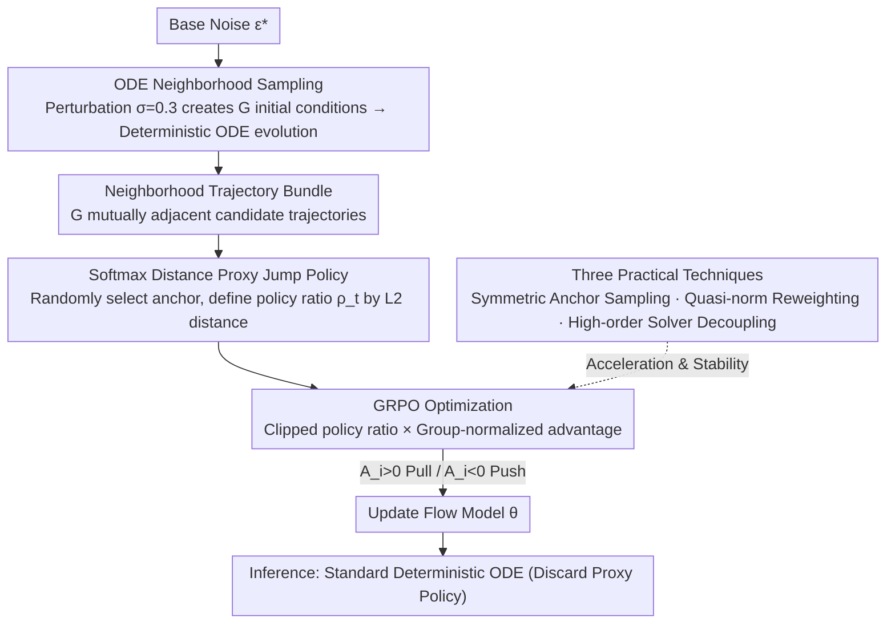

# Neighbor GRPO: Contrastive ODE Policy Optimization Aligns Flow Models

**Conference**: CVPR 2026  
**arXiv**: [2511.16955](https://arxiv.org/abs/2511.16955)  
**Code**: None  
**Area**: Image Generation  
**Keywords**: GRPO, Flow Matching, Human Preference Alignment, Contrastive Learning, ODE Sampling

## TL;DR
This paper reinterprets SDE-based GRPO as distance optimization/contrastive learning and proposes Neighbor GRPO. It completely bypasses SDE conversion by constructing neighborhood candidate trajectories through perturbed ODE initial noise and implements policy gradient optimization via a softmax distance proxy policy, thereby preserving all advantages of deterministic ODE sampling.

## Background & Motivation
GRPO excels in aligning image/video generation models with human preferences, but its application to Flow Matching models faces a fundamental conflict:

**GRPO requires stochastic exploration**: Policy gradient methods rely on randomness to explore the policy space.

**Advantages of Flow Matching lie in deterministic ODE sampling**: It is efficient and supports high-order solvers.

Existing methods (Flow-GRPO, DanceGRPO) introduce randomness by converting ODEs into equivalent SDEs but sacrifice the core benefits of ODEs:
- **SDEs are limited to first-order solvers**: They cannot utilize high-order solvers like DPM-Solver++ for acceleration.
- **Inefficient credit assignment**: Terminal rewards must be distributed across noise injections at all time steps.
- MixGRPO and BranchGRPO partially alleviate these issues but remain constrained by the SDE framework.

## Method

### Overall Architecture

This paper aims to resolve the fundamental conflict between GRPO and Flow Matching: GRPO relies on stochasticity for policy space exploration, whereas the value of Flow Matching lies in deterministic ODE sampling (efficiency, compatibility with high-order solvers). Prior approaches (Flow-GRPO, DanceGRPO) force stochasticity by converting ODEs to equivalent SDEs, which locks them into first-order solvers and inefficient credit assignment. The breakthrough of Neighbor GRPO is a reinterpretation: SDE-based GRPO is viewed as **distance optimization/contrastive learning**—where ODE samples are anchors and SDE samples are candidates, and optimization essentially pulls high-reward candidates closer while pushing low-reward ones away. Consequently, the authors bypass SDEs entirely and operate directly within the ODE neighborhood: perturbing initial noise to generate a group of candidate trajectories, selecting one as an anchor, and using a softmax distance proxy policy to strictly incorporate the "pull/push" mechanism into the GRPO framework. Standard deterministic ODE is restored during inference.

### Key Designs

**1. ODE Neighborhood Sampling: Generating comparable candidates without SDEs**

GRPO requires a group of diverse samples to compare rewards, but a pure deterministic ODE starting from fixed noise yields only one trajectory. Neighbor GRPO instead operates on the initial noise: given base noise $\epsilon^*$, it constructs $G$ perturbed initial conditions $\epsilon^{(i)} = \sqrt{1-\sigma^2}\epsilon^* + \sigma\delta^{(i)},\ \delta^{(i)} \sim \mathcal{N}(0, I)$, where $\sigma \in (0,1)$ controls the perturbation intensity (optimal $\sigma=0.3$; too small leads to insufficient exploration, too large leaves the neighborhood). These initial conditions evolve via deterministic ODEs to produce a bundle of mutually adjacent trajectories forming a local solution neighborhood—stochasticity is moved to the starting point, while the evolution remains a clean ODE.

**2. Softmax Distance Proxy Jump Policy: Making policy ratios and gradients computable on ODEs**

After bypassing SDEs, the policy ratio $\rho_t$ required by GRPO lacks a natural definition. The paper designs a training-specific proxy policy: $\pi_\theta(x_t^{(i)} \mid \{s_t\}) = \frac{\exp(-\|x_t^{(i)} - x_t^{(\theta)}\|_2^2)}{\sum_{k=1}^{G}\exp(-\|x_t^{(k)} - x_t^{(\theta)}\|_2^2)}$, where the anchor $x_t^{(\theta)}$ is randomly selected from candidates and contributes gradients. Intuitively, a sampled trajectory may "jump" to a neighbor at each step with a probability determined by the softmax distance. The optimization dynamics are clear—when advantage $A_i > 0$, the gradient reduces the distance (pull), and when $A_i < 0$, it increases the distance (push), perfectly corresponding to contrastive learning. This proxy exists only during training; it is discarded during inference in favor of standard deterministic ODEs, thus fully preserving all ODE advantages.

**3. Three Practical Techniques: Maximizing neighborhood structure and high-order solver benefits**

Neighborhood sampling provides additional exploitable structures. First is **Symmetric Anchor Sampling**: based on the Johnson-Lindenstrauss lemma, neighborhood samples are nearly equidistant, allowing any candidate to serve as an anchor. Thus, each iteration requires forward/backward passes for only $B < G$ anchors (saving approximately 12x gradient computation when $G=12$). Second is **Intra-group Quasi-norm Advantage Reweighting**: replacing standard $L_2$ normalization with $L_p$ norm ($p<2$) such that $A'_i = A_i / (\sum|A_k|^p)^{1/p}$. This automatically down-weights flat advantage signals to prevent reward hacking (optimal $p=0.8$). Third is **High-order Solver Decoupling**: using DPM++ for data collection and single-step DDIM for calculating the proxy policy during updates—an acceleration benefit unique to pure ODE frameworks that SDE frameworks cannot achieve.

### Loss & Training

The GRPO objective uses a clipped policy ratio and group-normalized advantage:

$$\mathcal{J}(\theta) = \mathbb{E}_{s,t,i}\left[\min\left(A_i\rho_t^{(i)}, A_i\lceil\rho_t^{(i)}\rfloor\right)\right]$$

- Base Model: FLUX.1-dev (Swin backbone)
- Rewards: HPSv2.1 + Pick Score + ImageReward (Equally weighted multi-reward training)
- AdamW, lr=1e-5, 300 iterations, 32×H800 GPU
- Approx. 4 hours per run; only 45s per iteration under 8-step DPM++ configuration, about 1/5 of the 237s required by DanceGRPO/MixGRPO.

## Key Experimental Results

### Main Results

| Method | Solver | NFE_old | NFE_θ ↓ | s/Iter ↓ | HPSv2.1 ↑ | Pick ↑ | ImgRwd ↑ | CLIP ↑ | Unified ↑ | Aes ↑ |
|------|--------|---------|---------|----------|-----------|--------|----------|--------|-----------|-------|
| FLUX.1-dev | - | - | - | - | 0.310 | 0.227 | 1.131 | **0.389** | 3.211 | 6.108 |
| DanceGRPO | DDIM | 25 | 14 | 237.9 | **0.371** | 0.231 | 1.306 | 0.364 | 3.156 | 6.552 |
| MixGRPO | DDIM | 25 | 14 | 237.7 | 0.366 | 0.235 | 1.604 | 0.382 | 3.257 | 6.623 |
| **Ours** | DPM++ | 8 | **1.33** | **45.1** | 0.366 | 0.234 | 1.640 | **0.391** | **3.334** | 6.621 |

Under the 8-step DPM++ configuration, training speed increases by 5.3x (45s vs 238s/iter), with out-of-domain metrics being overall superior.

### Ablation Study

| Parameter | Optimal Value | Description |
|------|--------|------|
| Perturbation Strength $\sigma$ | 0.3 | Too small lacks exploration; too large leaves the neighborhood |
| Anchor Number $B$ | 4 | $B=2$ is already competitive; $B=4$ is the best balance |
| Quasi-norm $p$ | 0.8 | $p=2$ is standard GRPO; $p=0.8$ is best for out-of-domain |

### Key Findings
- Neighbor GRPO converges faster: achieving HPSv2.1 > 0.35 in only 50 iterations (DanceGRPO requires more).
- Human Evaluation: Achieves preference rates of 72% and 61% compared to DanceGRPO and MixGRPO, respectively.
- Avoids reward hacking: No issues such as grid artifacts or uneven coloring occur.
- Long-term training stability is superior to MixGRPO.

## Highlights & Insights
1. **Deep Theoretical Insight**: Reinterpreting SDE-based GRPO as contrastive learning reveals its essence as distance optimization, providing the theoretical foundation for a pure ODE solution.
2. **Full Preservation of ODE Advantages**: No SDE conversion required, compatible with high-order solvers, and more direct credit assignment.
3. **Symmetric Anchor Sampling** leverages the geometric properties of the J-L lemma to cleverly reduce computation to $B/G$ times.
4. **Quasi-norm Reweighting** is a concise and effective solution for reward flattening, allowing control via a single hyperparameter.

## Limitations & Future Work
- Validated only on FLUX.1-dev; applicability to other Flow Matching models (e.g., SD3) remains to be confirmed.
- Multi-reward training currently uses equal weights; adaptive weighting could be explored.
- Theoretical guarantees of the proxy policy depend on the neighborhood being sufficiently tight ($\sigma$ small enough); behavior under extreme settings is not fully analyzed.
- Can be extended to video generation (currently image only).

## Related Work & Insights
- Shares roots with DanceGRPO and Flow-GRPO but represents a paradigm shift: moving from SDE dependency to pure ODE training.
- MixGRPO's hybrid sampling is a compromise; Neighbor GRPO is more thorough.
- The contrastive learning perspective may apply to other deterministic model optimization scenarios requiring stochasticity.
- Quasi-norm reweighting can be generalized to other GRPO variants.

## Rating
- Novelty: ⭐⭐⭐⭐⭐ Important contributions in both theoretical insight and methodology by completely bypassing SDE.
- Experimental Thoroughness: ⭐⭐⭐⭐ Sufficient multi-metric evaluation, ablation studies, and human assessment, though only one base model was used.
- Writing Quality: ⭐⭐⭐⭐⭐ Clear theoretical derivation, intuitive illustrations, and smooth logic from insights to methodology.
- Value: ⭐⭐⭐⭐⭐ 5x training efficiency boost with superior quality; a significant driver for RLHF in visual generation.

<!-- RELATED:START -->

## Related Papers

- [\[CVPR 2026\] GRPO-Guard: Mitigating Implicit Over-Optimization in Flow Matching via Regulated Clipping](grpo-guard_mitigating_implicit_over-optimization_in_flow_matching_via_regulated_.md)
- [\[ICLR 2026\] TempFlow-GRPO: When Timing Matters for GRPO in Flow Models](../../ICLR2026/image_generation/tempflow-grpo_when_timing_matters_for_grpo_in_flow_models.md)
- [\[CVPR 2026\] Fine-Grained GRPO for Precise Preference Alignment in Flow Models](fine-grained_grpo_for_precise_preference_alignment_in_flow_models.md)
- [\[ICML 2026\] Principled RL for Flow Matching Emerges from the Chunk-level Policy Optimization](../../ICML2026/image_generation/principled_rl_for_flow_matching_emerges_from_the_chunk-level_policy_optimization.md)
- [\[ICCV 2025\] Contrastive Flow Matching (ΔFM)](../../ICCV2025/image_generation/contrastive_flow_matching.md)

<!-- RELATED:END -->
