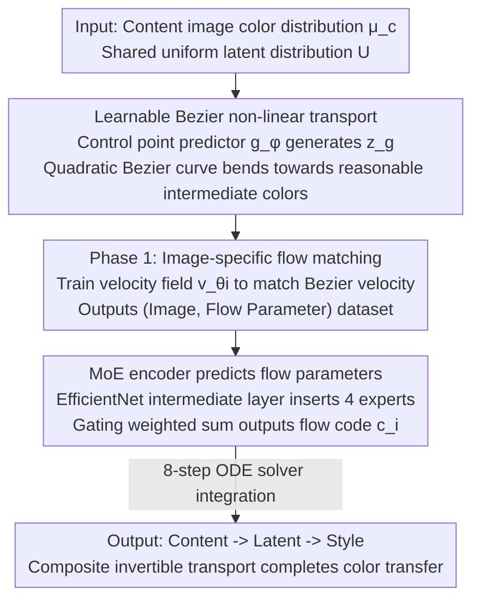

# Nonlinear Color Transfer via Learnable Bezier Flows

**Conference**: CVPR 2026  
**Paper**: [CVF Open Access](https://openaccess.thecvf.com/content/CVPR2026/html/Lee_Nonlinear_Color_Transfer_via_Learnable_Bezier_Flows_CVPR_2026_paper.html)  
**Code**: None  
**Area**: Image Generation / Color Transfer  
**Keywords**: Color Transfer, Flow Matching, Bezier Curves, Optimal Transport, Mixture of Experts

## TL;DR
NCT replaces the default "linear transmission path" in flow-based color transfer with a quadratic Bezier curve with learnable control points, allowing the transmission from source to target colors in the RGB space to follow a smooth non-linear trajectory. It then utilizes an MoE encoder to predict these Bezier flow parameters, significantly reducing artifacts and improving reconstruction accuracy (reconstruction error from 71.9 $\to$ 30.6) while maintaining content structure.

## Background & Motivation
**Background**: Color transfer aims to align the color distribution of a source content image (source) with that of a target style image (target) while preserving scene structure and visual realism—applicable in film color grading, 3D rendering recoloring, media art season/theme color changes, etc. Early statistical matching/histogram equalization methods (aligning global statistics in handcrafted color spaces like LAB/HSV) assumed normal distributions, which easily flattened contrast, caused oversaturation, and introduced cross-channel color bleeding. Recent mainstream methods reformulate color transfer as an **optimal transport (OT)** problem in the RGB space: learning a bijective mapping to minimize transport costs between content and style distributions without relying on handcrafted priors. ModFlows introduced rectified flow on top of this, approximating the OT mapping through continuous, invertible transport and training an encoder to predict flow parameters for each image pair, thereby generalizing to unseen images.

**Limitations of Prior Work**: The fundamental constraint of rectified flow is that the **path geometry is a straight line**—it forces the transport to evolve along a linear interpolation between the source and target samples. A straight line is merely a simplification for optimization, not a requirement of OT: OT only specifies the optimal endpoint mapping, not what the intermediate trajectory should look like. Recent works have pointed out that what actually works in rectified flow is the reflow (paired retraining) process, rather than the straight path itself.

**Key Challenge**: Using linear transport in RGB space to approximate complex color domains leads to "over-abstraction"—a large number of samples that should have different target velocities are squeezed into similar intermediate neighborhoods under the linear path, causing high local ambiguity. This makes reconstruction and information recovery difficult, ultimately manifesting as artifacts, color bleeding, and harsh covering of style colors over regions like human faces.

**Goal**: While retaining the invertible and generalizable advantages of the OT/flow framework, liberate the transport path from straight lines to **image-adaptive non-linear curves**, and enable an encoder to stably predict this more complex flow for unseen images.

**Key Insight**: Since OT only constrains the endpoints and not the intermediate trajectory, explicitly learn a trajectory that "bends towards reasonable intermediate color regions" for each content-style pair. The authors parameterize this path using a quadratic Bezier curve, where the intermediate control point $z_g$ is predicted by a network, allowing the trajectory to bend towards perceptually more consistent intermediate colors.

**Core Idea**: Replace "linear transport" with "Bezier curve transport with learnable control points" to solve trajectory misalignment and artifacts in color transfer, paired with an MoE encoder to handle the higher representation complexity brought by Bezier flows.

## Method

### Overall Architecture
NCT maps the color distribution $\mu_i$ of a single image (empirical distribution on RGB) to a shared uniform latent distribution $U\subset[0,1]^3$, and then performs color transfer via a composite mapping of content $\to$ latent $\to$ style through this shared latent space: $T_{c\to s}(x)=T_s^{-1}(T_c(x))$. The entire training process is divided into two phases: **Phase 1** independently learns a Bezier flow for each image in the dataset—using a control point predictor $g_\phi$ to generate the intermediate control point $z_g$, obtaining a curved transport trajectory, and training an image-specific velocity field $v_{\theta_i}$ to match the velocity induced by the Bezier curve, producing a batch of (image, flow parameter) paired data; **Phase 2** trains an encoder $\mathrm{Enc}_\psi$ with MoE to directly predict the flow code $c_i$ from the image that can reproduce the Phase 1 Bezier flow, thereby generalizing to unseen images. During inference, an 8-step ODE solver is used to integrate along the learned invertible Bezier flow to complete the color transfer.

### Key Designs

**1. Bezier Non-linear Transport with Learnable Control Points: Bending straight-line paths into image-adaptive curves**

This design directly addresses the limitation of "linear transport leading to local ambiguity and artifacts". Instead of forcing color to follow a straight line from input $z_0$ to latent space $z_1$, NCT processes it along a quadratic Bezier curve:

$$z_t = (1-t)^2 z_0 + 2t(1-t) z_g + t^2 z_1,\quad t\in[0,1]$$

where the key intermediate control point $z_g = g_\phi(z_0,z_1)$ is predicted on a per-image basis by a lightweight MLP (two layers, 1024 hidden units, tanh, only 8,195 parameters) instead of being manually configured. The corresponding Bezier-induced velocity is:

$$v_t = 2(1-t)(z_g - z_0) + 2t(z_1 - z_g)$$

The image-specific velocity field $v_{\theta_i}$ fits this curved velocity by minimizing $\int_0^1 \mathbb{E}_{z_0\sim\mu_i, z_1\sim U}\|v_t - v_{\theta_i}(z_t,t)\|_2^2\,dt$. Why it works: the curve can bend towards "reasonable intermediate color regions", preventing a linear path from pushing a vast number of samples that require different target velocities into similar neighborhoods, thereby better preserving perceptually consistent color transitions. Furthermore, the control point is **image-adaptive**—replacing it with a manual rule in ablation studies $z_{\text{fix}}=\tfrac12(z_0+z_1)+\lambda d_\perp$ (shifting a fixed distance $\lambda$ along the perpendicular direction) significantly degraded performance, proving that "letting the network learn this bend" is the true source of gain.

**2. Two-Stage MoE Encoder: Handling the higher representation complexity of Bezier flows**

The non-linear color trajectories achievable by learnable Bezier flows are far richer than linear rectified flows, and fitting this diversity with a single shared encoder easily leads to underfitting. To address this, NCT inserts a Mixture of Experts (MoE) module into the intermediate layers of the encoder—specifically in a layer that still retains spatial details and color/contextual cues. Let $f=\mathrm{Enc}^{(l)}_\psi(I)\in\mathbb{R}^{H\times W\times C}$ be the feature map at the $l$-th layer. $K$ experts $h_k=E_k(f)$ are applied to it, and a gating network produces mixture weights via global average pooling (GAP) of the same features:

$$\alpha = \mathrm{softmax}(W_g\,\mathrm{GAP}(f)),\quad y=\sum_{k=1}^K \alpha_k h_k$$

The aggregated representation $y$ is then fed into subsequent layers to parameterize the Bezier flow (control points/flow coefficients). The training objective of Phase 2 is the flow matching loss $\mathcal{L}_{\text{flow}}=\int_0^1\mathbb{E}\|v_{\theta_i}(z_{i,t},t)-v_{c_i}(z_{i,t},t)\|_2^2\,dt$, which aligns the flow velocity predicted by the encoder with the Bezier velocity saved from Phase 1. In practice, EfficientNet-B6 is used as the encoder, with the MoE embedded in the 1st MBConv layer of the 4th MBBlock (this stage is known for inverted bottlenecks and depthwise convolutions, believed to encode perceptual/style-related features). The number of experts is 4, using a weighted-sum gating. Why this layer: it selectively modulates color-related features while preserving semantic structures, enabling stable learning across heterogeneous color spaces (different lighting, materials).

## Key Experimental Results

### Main Results
On the ModFlows dataset (DIV2K + CLIC2020 natural images + LAION-Art art images total 5,034 for training, Unsplash Lite with 2,000 pairs sampled for testing, 8-step ODE), the proposed method is compared with classical methods (CT, MKL), deep methods (WCT2, PhotoNAS, DAST, PhotoWCT2), and the flow-based method ModFlows. Evaluation uses an aggregated score (squared Euclidean distance to the ideal point $p$, combining content and style scores: $\text{aggr.}=\sqrt{(p-\text{content})^2+(p-\text{style})^2}$), where the content score is represented by Grayscale/Depth(DepthFM)/Edge(HED) measured via DISTS, the style score uses the Wasserstein distance, and LPIPS/PSNR/SSIM along with the Lipschitz constant (lower is smoother and more stable) are also reported.

| Dataset | Content (Grayscale) ↓ | Content (Depth) ↓ | Content (Edge) ↓ | LPIPS ↓ | PSNR ↑ | SSIM ↑ | Lipschitz ↓ | Style ↓ |
|--------|------|------|------|------|------|------|------|------|
| ModFlows Baseline [14] | 0.3069 | 0.3175 | 0.3110 | 0.3927 | 12.79 | 0.5073 | 47.84 | 0.2214 |
| CT [5] | 0.3028 | 0.3084 | 0.3067 | 0.3408 | 13.56 | 0.6001 | 33.73 | 0.2365 |
| NCT w/o MoE | 0.3123 | 0.3079 | 0.3047 | **0.2911** | **14.79** | **0.6229** | **34.28** | 0.2507 |
| **NCT (ours)** | **0.3032** | **0.3003** | **0.2954** | 0.3067 | 14.04 | 0.5718 | 36.25 | 0.2371 |

NCT leads in content preservation (optimal in all three Depth/Edge metrics) and stability (Lipschitz is significantly lower than ModFlows' 47.84). Although the style score is slightly lower, it achieves the highest overall aggregated score due to its strong content performance. On the more challenging Media art dataset (480 3D-rendered cropped images, high texture), it also maintains the best content preservation and smooth, artifact-free transfer.

### Ablation Study

| Configuration | Key Metrics | Description |
|------|---------|------|
| Rectified Flow | Reconstruction Error 71.91 ± 54.87 | Straight-line trajectory |
| ModFlows | Reconstruction Error 52.33 ± 38.81 | Straight-line + reflow |
| Bezier Flow (Fixed $\lambda=0.2$) | Reconstruction Error 34.00 ± 25.60 | Curved but manual control point |
| **NCT (Learnable control points)** | **Reconstruction Error 30.60 ± 22.62** | Full model |
| NCT w/o MoE | Suboptimal aggregate/style scores | Style distance and aggregate score deteriorate after removing MoE |

### Key Findings
- **Curves vs. Straight Lines is the Main Source of Gain**: Nonlinear methods (Bezier Flow, NCT) yield much lower reconstruction errors than linear methods (Rectified Flow, ModFlows), indicating that curved trajectories better preserve color structure during bidirectional transport.
- **Control Points Must Be Learned**: Learnable control points (30.60) outperform the Bezier formulation with fixed $\lambda$ (34.00), and the flow matching loss in Phase 1 steadily decreases during training, proving it finds a more suitable intermediate color path for each image.
- **MoE Mainly Promotes Visual Preference**: In a user study, 33 media art experts preferred NCT over ModFlows in 72% of 30 comparison groups, with MoE contributing the majority (accounting for 46% of total preference), suggesting that MoE primarily improves perceptual coherence and structural fidelity.

## Highlights & Insights
- **Clever observation that "OT does not constrain intermediate trajectories"**: While many flow methods default to straight lines, the authors leverage the insight that "straight lines are merely for optimization convenience, not an OT requirement." Introducing a Bezier curve into the transport trajectory is a cheap yet highly effective modification—the control point predictor contains only 8,195 parameters.
- **Offloading representational complexity to MoE**: The causal chain is clear: curved flows are more complex $\to$ a single encoder underfits $\to$ MoE is used to increase capacity. Furthermore, the MoE is not placed arbitrarily but in the specific layer encoding color/style features (EfficientNet's 4th MBBlock), showing clear architectural intent.
- **Transferable logic**: "Replacing fixed linear interpolations with learnable curved interpolations in generative/transport models" can be transferred to other diffusion/flow-matching tasks (e.g., image editing, stylization) where linear trajectory assumptions of reflow-like methods cause ambiguity.

## Limitations & Future Work
- **Weaker Style Metrics**: NCT's Wasserstein style scores are often slightly lower than some baselines. It achieves the overall best score largely due to strength in content preservation—meaning it may not be optimal in scenarios where extremely drastic recoloring is desired.
- **Static Images Only**: The authors acknowledge the method is not extended to video; cross-frame temporal consistency remains an explicit area for future work.
- **Limited Expressiveness of Quadratic Bezier**: The model only uses a quadratic Bezier curve with a single intermediate control point. More complex, multi-modal color distributions might require higher-order or piecewise curves, which is not explored.
- **Perceptual/User-Query Heavy Evaluation**: Evaluation is dominated by aggregate scores and user preferences, lacking a systematic analysis of failure cases (e.g., extreme lighting, high material specularity).

## Related Work & Insights
- **vs. ModFlows [14]**: Both approximate OT using flow with encoders predicting image-specific flow parameters. The key difference is that ModFlows uses rectified flow's straight-line path, whereas NCT adopts a Bezier curve with learnable control points combined with MoE. NCT's advantages include lower reconstruction error (30.6 vs. 52.3) and fewer artifacts, while its disadvantage is that the style distance can sometimes be slightly inferior.
- **vs. Classical CT/MKL [5,21]**: Classical methods perform low-order statistical matching in perceptually uniform color spaces, aligning global tones but discarding local semantics/texture. NCT learns non-linear transport in the RGB space, showing significantly better content preservation.
- **vs. WCT2/PhotoWCT2/DAST [22,25,24]**: These deep methods perform multi-scale feature alignment but are prone to color bleeding and require paired data. NCT follows the OT/flow pipeline, generalizing to unseen image pairs without requiring paired supervision.

## Rating
- Novelty: ⭐⭐⭐⭐ The formulation of "OT doesn't constrain intermediate trajectories $\to$ use learnable Bezier curves instead of straight lines" is a clean hook that targets the genuine weakness of rectified flows.
- Experimental Thoroughness: ⭐⭐⭐⭐ Two datasets + reconstruction error + MoE ablation + 33-person user study, relatively complete; however, it lacks failure analysis and does not deep dive into scenarios with weak styling.
- Writing Quality: ⭐⭐⭐ Motivation and formulas are clear, but some mathematical expressions in the original draft are messy and certain phrasings are slightly unpolished.
- Value: ⭐⭐⭐⭐ Provides a low-cost, learnable curved alternative to the "linear interpolation assumption" in flow/diffusion transport models, which is a highly transferable concept.

<!-- RELATED:START -->

## Related Papers

- [\[CVPR 2026\] Improved Mean Flows: On the Challenges of Fastforward Generative Models](improved_mean_flows_on_the_challenges_of_fastforward_generative_models.md)
- [\[CVPR 2026\] Learning Straight Flows: Variational Flow Matching for Efficient Generation](learning_straight_flows_variational_flow_matching_for_efficient_generation.md)
- [\[CVPR 2026\] GenColorBench: A Color Evaluation Benchmark for Text-to-Image Generation](gencolorbench_a_color_evaluation_benchmark_for_text-to-image_generation.md)
- [\[CVPR 2026\] Leveraging Multispectral Sensors for Color Correction in Mobile Cameras](leveraging_multispectral_sensors_for_color_correction_in_mobile_cameras.md)
- [\[CVPR 2026\] LESA: Learnable Stage-Aware Predictors for Diffusion Model Acceleration](lesa_learnable_stage-aware_predictors_for_diffusion_model_acceleration.md)

<!-- RELATED:END -->
