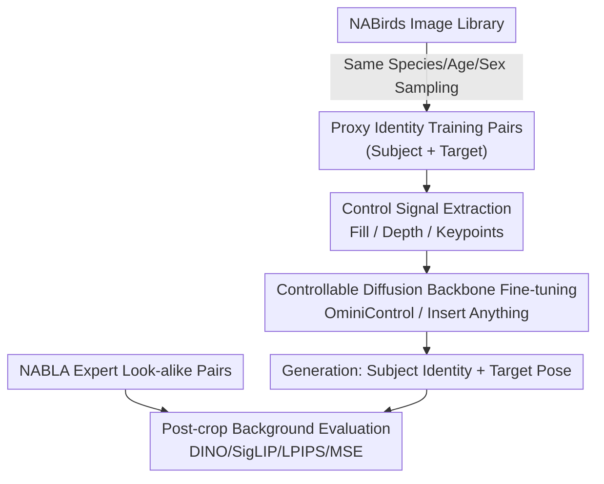

# Not All Birds Look The Same: Identity-Preserving Generation For Birds

**Conference**: CVPR 2026  
**Paper**: [CVF Open Access](https://openaccess.thecvf.com/content/CVPR2026/html/Sun_Not_All_Birds_Look_The_Same_Identity-Preserving_Generation_For_Birds_CVPR_2026_paper.html)  
**Code**: https://github.com/cvl-umass/nabla  
**Area**: Diffusion Models / Identity-Preserving Generation  
**Keywords**: Identity-Preserving Generation, Fine-grained Categories, Birds, Proxy Identity, Controllable Diffusion

## TL;DR
Addressing the lack of "multi-view images of the same individual" for fine-grained birds, this paper constructs a benchmark (NABLA) of 4,759 "look-alike" bird pairs using expert annotations from NABirds. It proposes using "same species / age / sex / breeding stage" as identity proxies to train controllable diffusion models like OminiControl and Insert Anything, achieving an approximately 41% reduction in MSE compared to baselines and demonstrating generalization to unseen species.

## Background & Motivation
**Background**: Controllable image generation has shifted from text-to-image to "identity-preserving generation"—re-rendering the same object in new poses, viewpoints, or backgrounds given a reference image. Zero-shot methods such as Insert Anything, OminiControl, and AnyDoor can perform virtual try-ons or product background swapping without needing per-object fine-tuning.

**Limitations of Prior Work**: These methods primarily serve "rigid bodies + faces"—categories like T-shirts, shoes, and faces where deformation is limited and training data (video, multi-view, or synthetic) is relatively easy to obtain. They fail when applied to **non-rigid, fine-grained** natural categories like birds. As shown in Figure 2, baselines frequently alter diagnostic features (e.g., number of cheek spots, chest patterns) or fail to align with the target pose. The fundamental bottleneck is the **unavailability of "multiple images of the same individual" for training**. Birds fly, swim, and perch across a vast range of poses, making it nearly impossible to capture high-definition multi-view photos of the same individual in the wild.

**Key Challenge**: Identity-preserving training requires paired data of the "same identity in different poses." In the avian domain, one must choose between data with true identities but low quality (iNaturalist citizen science photos with motion blur or multiple individuals) or high quality but no identity labels (NABirds is a classification dataset with significant intra-class variation). High quality and true identity are **mutually exclusive** for birds.

**Goal**: (1) Create a evaluation benchmark that reliably measures identity preservation in bird generation; (2) Train existing controllable diffusion models to truly preserve identity despite the lack of true identical-identity training data.

**Key Insight**: The authors leverage the natural **taxonomic hierarchy** of fine-grained categories. Two birds of the same species, age, sex, and seasonal plumage are highly similar in appearance and can serve as an "approximate same-identity" proxy. For evaluation, bird experts manually selected "look-alike" pairs from the same class in NABirds to approximate true identity data.

**Core Idea**: Use "taxonomic hierarchy as an identity proxy" to bypass the hard constraint of "no same-identity data." By sampling same-class pairs during training and using expert-validated look-alike pairs for evaluation, the model learns to maintain fine-grained diagnostic features.

## Method

### Overall Architecture
The work follows two tracks: **Data/Benchmark** and **Training Paradigm**. On the data side, the authors constructed three evaluation sets (NABLA expert look-alike pairs, iNat-Seen, and iNat-Unseen true identity pairs) and defined four evaluation metrics. On the training side, they used "same-class sampling" as an identity proxy to fine-tune off-the-shelf controllable diffusion backbones (OminiControl / Insert Anything), supporting three pose control modes: Fill (inpainting), Depth, and Keypoints.

The data flow for generation involves: extracting control signals (mask + background / depth map / keypoint skeleton) from a **Target Image** + optional background captions, then feeding the **Subject Image** (the bird whose identity is to be preserved) along with the control signals into the diffusion model. This generates a new image with the "Subject's Identity + Target's Pose." During evaluation, the subject mask is used to crop the background from both the generated and target images before calculating DINOv2 / SigLIP / LPIPS / MSE.

### Key Designs

**1. NABLA Benchmark: Approximating "True Identity" Eval with Expert Look-alike Pairs**

The pain point is the lack of large-scale, high-quality "multi-view individual" data for bird identity evaluation. A small group of bird experts annotated the NABirds test set: given a bird image, they picked another image from the **same class** where the "individual looks the same," selecting 5–10 non-overlapping pairs per class (some classes with high individual variation were excluded). This resulted in **NABLA: 4,759 pairs covering 401 species**. It preserves the high-quality, single-subject nature of NABirds while being closer to true identity than random same-class pairing. To validate NABLA, the authors also used **true-same-observation** pairs from iNaturalist (same observation = same individual): 677 pairs from species within NABirds (iNat-Seen) and 396 pairs from external species (iNat-Unseen), verifying if "scores on NABLA" could predict "performance on true identities."

**2. Proxy Identity Training: Taxonomy (Species/Age/Sex/Breeding) as a Substitute for True Identity**

This is the core Mechanism that improves the model. Since true same-identity training pairs are unavailable, the authors **randomly sampled two images from the same "class"** in the NABirds training set at each step. The granularity of this "class" varies by species, ranging from the species level to level of sex or breeding stage (e.g., Male/Female Mallard, Breeding/Non-breeding Snow Bunting). One image is designated as the subject and the other as the target. The model is trained using the subject image and control signals from the target. While this produces "noisy pairs," the authors argue it is a **reasonable identity proxy on average**. The intuition is that birds of the same sex/breeding stage share highly consistent **diagnostic details** used for species identification (wing bars, throat color, post-ocular stripes). The model is forced to replicate these details rather than drawing a generic "bird."

**3. Three Pose Control Modes + Background Caption Compensation**

To make the "target pose" specifiable, the system implements three controls: **Fill** treats the task as inpainting—the control is the "target image with the subject removed," with masks obtained via SAM2 (for NABirds) or Grounded-SAM-2 (for iNat). **Depth** uses Video-Depth-Anything to generate depth maps, providing stronger pose control than masks. **Keypoints** uses the 11 keypoints provided in NABirds (beak, eyes, belly, etc.) drawn as a color skeleton (not evaluated on iNat due to lack of keypoints). To mitigate ambiguity from missing background info in Depth/Keypoint modes, the authors used Qwen2.5-VL to generate **background captions** for OminiControl.

**4. Dual-Backbone Fine-tuning: Insert Anything Diptych + OminiControl Token Concatenation**

Training followed two existing architectures. **Insert Anything**: Subject and masked background images are combined into a "diptych" panel, fine-tuned on the FLUX.1-Fill backbone using LoRA with standard mask augmentation. **OminiControl**: Subject and condition latent tokens are concatenated after the noisy latent tokens and fed into the DiT. Each control mode was trained separately on two backbones: FLUX.1-Schnell (Om-S) and FLUX.1-Kontext (Om-K) for 10,000 steps with 1024×1024 resolution. Notably, the authors **did not modify the diffusion loss**, which explains some counter-intuitive results later.

## Key Experimental Results

### Main Results
Four metrics: DINOv2 and SigLIP feature similarity ↑ (measuring class-level features and pose), LPIPS ↓, and MSE ↓ (measuring overall similarity). Below are representative results for Fill (inpainting) mode ( `*` denotes un-tuned baseline):

| Control / Model | Dataset | DINO↑ | SigLIP↑ | LPIPS↓ | MSE↓ |
|------|------|------|------|------|------|
| Om-S* (Baseline) | NABLA | 0.41 | 0.84 | 0.087 | 77.1 |
| Om-S (Ours) | NABLA | 0.57 | 0.91 | 0.063 | 54.7 |
| Om-K (Best) | NABLA | 0.78 | 0.94 | 0.060 | 51.0 |
| Ins-A* (Baseline) | NABLA | 0.75 | 0.92 | 0.069 | 62.9 |
| Ins-A (Ours) | NABLA | 0.77 | 0.94 | 0.063 | 55.0 |
| Om-K (Best) | iNat-Unseen | 0.78 | 0.94 | 0.029 | 46.9 |

Fine-tuning Om-S reduced MSE on NABLA from 77.1 to 54.7 (~29%), with the best configuration (Om-K) reaching 51.0. The **41% MSE reduction** mentioned in the abstract refers to the improvement of the best configuration over the respective baseline.

### Ablation Study

| Comparison | Key Finding |
|------|---------|
| NABLA vs. iNat-Seen Correlation | DINO $R^2=0.986$, MSE $R^2=0.963$. Performance on NABLA predicted true identity performance, proving the proxy benchmark's validity. |
| Fill vs. Depth Control | Best Fill (Om-K MSE 51.0) slightly outperformed best Depth (Om-K MSE 57.0), despite masks being theoretically weaker pose constraints. |
| Seen vs. Unseen Species | Gain was similar for iNat-Seen and iNat-Unseen. |
| Om-K vs. Ins-A | Both fine-tuned Om-K and Ins-A significantly outperformed the strong Insert Anything baseline. |

### Key Findings
- **Proxy identities suffice for training but not for evaluation**: Training on same-class pairs significantly improves identity preservation, but the training pairs themselves contain mismatches. Thus, evaluation must rely on expert-validated NABLA or true identity iNat data.
- **Counter-intuitive Fill > Depth**: The authors attribute this to the **unmodified diffusion loss**—unconstrained background areas might interfere with depth control, whereas inpainting provides a fixed background.
- **Generalization is the highlight**: Models trained on NABirds species improved performance on entirely unseen iNat-Unseen species, indicating they learned the general concept of "fine-grained identity preservation."

## Highlights & Insights
- **Taxonomic Structure as Identity Proxy**: An ingenious way to bypass the "no same-identity data" constraint—species/sex/breeding levels naturally provide free supervision for "approximate identity." This idea is transferable to other fine-grained domains (fish, plants, insects).
- **Benchmark Validation**: Rather than treating NABLA as an absolute truth, the authors used regression against true identity iNat pairs ($R^2 > 0.95$) to prove its validity before drawing conclusions.
- **Generation as a "Comparison Tool"**: Re-posing birds to facilitate side-by-side comparison of similar species points toward a new application in scientific visualization and machine teaching.

## Limitations & Future Work
- **Proxy Mismatches**: Same-class sampling occasionally pairs birds that are not truly look-alikes, which may be insufficient for high-precision scientific scenarios.
- **Unmodified Diffusion Loss**: Ambiguity from unconstrained backgrounds (Fill vs. Depth) suggests room for optimization via explicit foreground/background loss constraints.
- **Limited Keypoint Coverage**: Inability to evaluate keypoint control on true identity data (iNat) leaves a gap in generalization evidence.
- **Expert Scalability**: NABLA relies on manual selection by experts, limiting its scale to ~4,800 pairs and making it difficult to extend to more species or categories.

## Related Work & Insights
- **vs. DreamBooth / Textual Inversion**: These require multiple images and per-object fine-tuning. Ours is zero-shot (inference with a single reference image) and specialized for fine-grained avian traits.
- **vs. Insert Anything / OminiControl (Base)**: Original versions trained on rigid bodies/faces lose bird identities. Ours uses the same architecture but fine-tunes with "proxy identity data + avian-specific controls."
- **vs. Class-Conditional Fine-grained Generation (e.g., DIFFusion)**: Class-conditional models have taxonomic info but lack pose control and instance identity preservation. 
- **vs. Multi-view Bird Datasets / 3D Reconstruction**: Multi-view data is often low quality; reconstruction evaluation usually relies on proxy tasks. This work provides the first reliable benchmark for avian "identity-preserving generation."

## Rating
- Novelty: ⭐⭐⭐⭐ Using taxonomic hierarchy as an identity proxy and rigorously validating the proxy benchmark is a solid approach for fine-grained generation.
- Experimental Thoroughness: ⭐⭐⭐⭐ 3 evaluation sets × 3 control modes × 2 backbones, with $R^2 > 0.95$ correlation analysis.
- Writing Quality: ⭐⭐⭐⭐ Clear motivation and data dilemma explanation; intuitive visual comparisons.
- Value: ⭐⭐⭐⭐ Fills a gap in data/benchmarks for avian identity preservation and opens doors for scientific visualization.

<!-- RELATED:START -->

## Related Papers

- [\[CVPR 2026\] Resolving the Identity Crisis in Text-to-Image Generation](resolving_the_identity_crisis_in_text-to-image_generation.md)
- [\[CVPR 2026\] FlowFixer: Towards Detail-Preserving Subject-Driven Generation](flowfixer_towards_detail-preserving_subject-driven_generation.md)
- [\[CVPR 2025\] Not All Parameters Matter: Masking Diffusion Models for Enhancing Generation Ability](../../CVPR2025/image_generation/not_all_parameters_matter_masking_diffusion_models_for_enhancing_generation_abil.md)
- [\[CVPR 2026\] Say Cheese! Detail-Preserving Portrait Collection Generation via Natural Language Edits](say_cheese_detail-preserving_portrait_collection_generation_via_natural_language.md)
- [\[CVPR 2026\] MultiCrafter: High-Fidelity Multi-Subject Generation via Disentangled Attention and Identity-Aware Preference Alignment](multicrafter_high-fidelity_multi-subject_generation_via_disentangled_attention_a.md)

<!-- RELATED:END -->
