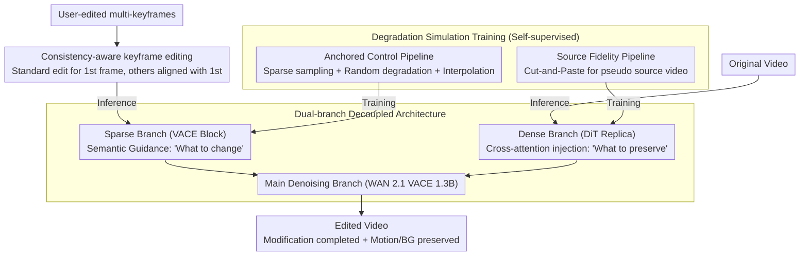

# NOVA: Sparse Control, Dense Synthesis for Pair-Free Video Editing

**Conference**: CVPR 2026  
**arXiv**: [2603.02802](https://arxiv.org/abs/2603.02802)  
**Code**: [https://github.com/WeChatCV/NovaEdit](https://github.com/WeChatCV/NovaEdit)  
**Area**: Image Generation / Video Editing  
**Keywords**: Pair-free video editing, dual-branch architecture, sparse control, degradation simulation training, multi-keyframe  

## TL;DR
NOVA is proposed, formalizing the "Sparse Control, Dense Synthesis" paradigm for video editing for the first time: the sparse branch provides semantic guidance from multiple user-edited keyframes, while the dense branch injects motion and texture information from the original video. Combined with a degradation simulation training strategy, it enables learning without paired data, significantly outperforming existing methods in editing fidelity, motion preservation, and temporal consistency.

## Background & Motivation

**Background**: Diffusion-model-driven video editing methods have advanced rapidly. Data-driven methods (Senorita-2M, VACE) require large-scale paired data; first-frame-guided methods (AnyV2V, I2VEdit) propagate edits from the first frame to the entire video, relying on motion compensation.

**Limitations of Prior Work**: (a) Paired video data is extremely difficult to obtain, and synthetic data contains artifacts affecting generalization; (b) methods relying solely on the first frame exhibit structural drift during large camera or object motions; (c) while global edits are acceptable, **local editing** (modifications in specific regions) generally fails, suffering from background inconsistency and severe artifacts in edited areas.

**Key Challenge**: Control signals (what to change) and synthesis signals (what to preserve) are coupled in the same path, making it difficult for the model to distinguish between "what to change" and "what to keep."

**Goal**: Decouple control and synthesis to achieve high-quality video editing under pair-free data conditions.

**Key Insight**: Multiple keyframes provide stronger spatio-temporal anchors, and the original video itself is the best reference for motion and texture.

**Core Idea**: A sparse branch encodes multi-edited keyframes for semantic guidance; a dense branch encodes the original video for motion/texture injection; and degradation simulation enables self-supervised training.

## Method

### Overall Architecture
NOVA addresses pair-free video editing: the user paints desired changes on a few keyframes, and the model must smoothly spread these changes throughout the video while preserving the motion trajectory and unedited regions of the original video. It splits this process into two non-interfering information flows—a "sparse control" flow telling the model what to become, and a "dense synthesis" flow telling it what to preserve. The entire network is built on WAN 2.1 VACE 1.3B: a primary denoising branch handles actual image generation, a sparse branch (VACE block) injects user-edited keyframes, and a dense branch (DiT replica) extracts motion and texture from the original video, with both streams added back to the main branch at each layer. During training, the base model is frozen, and only the newly added cross-attention modules are tuned. The inputs for the two branches differ between training and inference: during training, they are generated by a self-supervised degradation simulation pipeline, while during inference, the sparse branch uses consistency-aware keyframe edits and the dense branch uses the original video directly.

### Key Designs

**1. Dual-branch Decoupled Architecture: Separating 'What to Change' and 'What to Preserve' into independent paths**

Pain points of prior methods (e.g., VACE) lie in the coupling of control and synthesis signals in one path, making it hard for the model to distinguish what should be modified versus kept, often leading to background corruption in local edits. NOVA adds two correction terms at each layer $l$ of the main branch:

$$\boldsymbol{z}_m^{(l)} \leftarrow \boldsymbol{z}_m^{(l)} + \underbrace{\mathcal{S}^{(l)}(\boldsymbol{z}_m^{(l)}, \boldsymbol{r})}_{\text{Sparse Control}} + \underbrace{\mathcal{D}^{(l)}(\boldsymbol{z}_m^{(l)}, \boldsymbol{z}_d^{(l)})}_{\text{Dense Synthesis}}$$

The sparse branch $\mathcal{S}$ uses VACE blocks to encode the degraded keyframe sequence $\boldsymbol{r}$, providing semantic guidance on the "target appearance." The dense branch $\mathcal{D}$ does not simply add original video features but uses a trainable cross-attention mechanism—where the main branch acts as the Query and the dense branch features $\boldsymbol{z}_d^{(l)}$ act as Key/Value. This Query/KV arrangement is crucial: direct addition would cause dense features to override the edit results, but cross-attention allows the main branch to "query as needed," fetching only necessary motion and texture without interfering with the edited regions.

**2. Degradation Simulation Training: Creating pseudo-paired data without gold pairs**

Paired video data is scarce, and synthetic data often contains artifacts. NOVA uses single clean videos and generates supervision signals through two manual degradation pipelines, allowing the model to learn editing capabilities via "degradation recovery."

The Anchored Control Pipeline feeds the sparse branch: sparse keyframes are sampled from the target video, and random degradations (Gaussian blur, affine transforms, etc.) are applied to simulate real editing artifacts:

$$\hat{\boldsymbol{x}}_{k_i} = (\boldsymbol{1}-\boldsymbol{b}_{k_i})\odot\boldsymbol{x}_{k_i} + \boldsymbol{b}_{k_i}\odot\mathcal{D}_{aug}(\boldsymbol{x}_{k_i})$$

where $\boldsymbol{b}_{k_i}$ is the mask for the degraded region. The complete sequence is reconstructed via linear interpolation as input for the sparse branch. This forces the model to recover clean, consistent results from noisy anchors. The Source Fidelity Pipeline feeds the dense branch: random Cut-and-Paste is applied to the target video to insert irrelevant content $\boldsymbol{y}_t$, creating a "pseudo source video":

$$\tilde{\boldsymbol{x}}_t = \boldsymbol{m}_t\odot\boldsymbol{y}_t + (1-\boldsymbol{m}_t)\odot\boldsymbol{x}_t$$

This forces the model to extract true motion and background from the dense branch rather than blindly copying. Both pipelines support a standard denoising objective $\mathcal{L} = \mathbb{E}[\|\epsilon - \epsilon_\theta(\boldsymbol{z}_t, t, \tilde{\mathcal{X}}, \hat{\mathcal{X}})\|_2^2]$ in a completely self-supervised manner.

**3. Consistency-Aware Keyframe Editing: Ensuring keyframe alignment**

During inference, users edit multiple keyframes. If edited independently, styles, tones, and details would diverge, causing flickering. NOVA uses FLUX Kontext for keyframe editing, but only the first frame undergoes standard editing; subsequent keyframes include the first frame's result $\boldsymbol{x}_{k_0}^{edit}$ as a reference:

$$\boldsymbol{x}_{k_i}^{edit} = \text{FLUX}(\boldsymbol{x}_{k_i}, \boldsymbol{x}_{k_0}^{edit}, \boldsymbol{m}_{k_i}, \mathcal{P})$$

This aligns all keyframes to a single "template," maintaining style consistency across frames and providing harmonious anchors for the sparse branch, resulting in flicker-free video.

### A Complete Example
Consider a video of "a person walking down a street, changing their red coat to blue": The model extracts keyframes every 10 frames. FLUX Kontext edits the first frame to change the coat to blue, and subsequent keyframes are edited referencing this first result for tonal consistency. These edited keyframes are interpolated into a sequence for the sparse branch. Simultaneously, the original video (person's gait, street background) enters the dense branch. During denoising, each layer of the main branch "asks" the sparse branch for the coat color and silhouette while "asking" the dense branch for the current person pose and background texture—the former ensures the edit is applied, and the latter ensures motion and background preservation. Even if the dense branch input is blurred, cross-attention can guide the generation of a background clearer than the input (BG-SSIM remains 0.910 in ablation), indicating synthesis with understanding rather than simple pasting.

### Loss & Training
- Only newly added cross-attention modules are trained; the base model is frozen.
- 5,000 high-quality videos (Pexels), 832×480 resolution, 81 frames long.
- AdamW, lr=1e-4, 8,000 steps.
- Inference uses a keyframe interval of 10.

## Key Experimental Results

### Main Results

| Method | Params | Per-video Tuning | SR↑ | TC↑ | FC↑ | BG-SSIM↑ | MS↑ | BC↑ |
|------|------|-----------|-----|-----|-----|----------|-----|-----|
| AnyV2V | 1.3B | ✗ | 0.75 | 0.918 | 0.840 | 0.858 | 0.973 | 0.939 |
| I2VEdit | 1.3B | ✓ | 0.83 | 0.931 | 0.846 | 0.900 | 0.991 | 0.941 |
| VACE (Multi-frame) | 1.3B | ✗ | 0.90 | 0.928 | 0.840 | 0.913 | 0.989 | 0.940 |
| Senorita-2M | 5B | ✗ | 0.86 | 0.919 | 0.853 | 0.921 | 0.989 | 0.953 |
| **Ours (NOVA)** | **1.3B** | **✗** | **0.93** | **0.935** | **0.882** | 0.917 | **0.993** | 0.946 |

### Ablation Study

| Config | TC↑ | FC↑ | BG-SSIM↑ | Description |
|------|-----|-----|----------|------|
| Full NOVA | 0.935 | 0.882 | 0.917 | Full model |
| w/o Dense Branch | 0.920 | 0.841 | 0.807 | Background hallucinations |
| w/o Consistency Inf. | 0.92 | 0.85 | 0.88 | Independent edit styles inconsistent |
| Blurred Dense Input | 0.933 | 0.878 | 0.910 | Still recovers details |

### Key Findings
- NOVA achieves a success rate (SR) of 93%, 13% higher than LoRA-Edit (80%) which requires fine-tuning.
- The dense branch is crucial for background preservation: removing it drops BG-SSIM from 0.917 → 0.807.
- Even with blurred dense branch inputs, the model recovers clearer backgrounds—demonstrating guided synthesis over simple duplication.
- Robust to keyframe intervals between 8-20, without overfitting to the training interval of 10.
- Performance remains stable when switching editing models (FLUX → Qwen-Image-Edit), showing framework versatility.

## Highlights & Insights
- **Sparse/Dense Decoupling** is a key conceptual innovation: effectively separating control and synthesis into independent paths for the first time in video editing. This architectural idea could extend to image and 3D editing.
- **Degradation Simulation Training** cleverly uses unpaired data to achieve self-supervision: by simulating editing artifacts and background mismatches, the model learns to fix them.
- **Guided Synthesis in Dense Branch**: Experiments prove it is not simple copying but generation with physical understanding—providing insights into the capabilities of diffusion models.

## Limitations & Future Work
- Performance depends on the quality of edited keyframes; current image editing models still have limitations on complex edits.
- Trained on only 5,000 videos; scale is limited.
- No support for text-driven global style transfer editing yet.

## Related Work & Insights
- **vs. VACE**: Unified framework where control and synthesis are coupled; NOVA's decoupling yields better results.
- **vs. I2VEdit/LoRA-Edit**: These require per-video LoRA tuning and lack scalability; NOVA requires no tuning.
- **vs. Senorita-2M**: Uses 5B parameters and large-scale paired data; NOVA surpasses it with 1.3B parameters and no paired data.

## Rating
- Novelty: ⭐⭐⭐⭐⭐ First formalization of Sparse Control/Dense Synthesis paradigm; ingenious degradation training.
- Experimental Thoroughness: ⭐⭐⭐⭐ Multiple baselines + various metrics + user studies + ablations.
- Writing Quality: ⭐⭐⭐⭐ Clear problem decomposition and well-motivated architecture.
- Value: ⭐⭐⭐⭐⭐ Provides a scalable pair-free training framework for video editing.

<!-- RELATED:START -->

## Related Papers

- [\[CVPR 2026\] When to Lock Attention: Training-Free KV Control in Video Diffusion](when_to_lock_attention_training-free_kv_control_in_video_diffusion.md)
- [\[CVPR 2026\] FlowDirector: Training-Free Flow Steering for Precise Text-to-Video Editing](flowdirector_training-free_flow_steering_for_precise_text-to-video_editing.md)
- [\[ICML 2026\] Lightning Unified Video Editing via In-Context Sparse Attention](../../ICML2026/video_generation/lightning_unified_video_editing_via_in-context_sparse_attention.md)
- [\[CVPR 2026\] DreamShot: Personalized Storyboard Synthesis with Video Diffusion Prior](dreamshot_storyboard_synthesis.md)
- [\[CVPR 2025\] Unified Dense Prediction of Video Diffusion](../../CVPR2025/video_generation/unified_dense_prediction_of_video_diffusion.md)

<!-- RELATED:END -->
