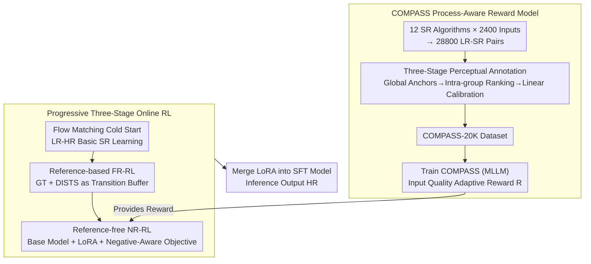

# OARS: Process-Aware Online Alignment for Generative Real-World Image Super-Resolution

**Conference**: CVPR 2026  
**arXiv**: [2603.12811](https://arxiv.org/abs/2603.12811)  
**Code**: None  
**Area**: Image Generation / Image Super-Resolution  
**Keywords**: Real-World Super-Resolution, RLHF, reward model, Online RL, Flow Matching, MLLM, Image Quality Assessment

## TL;DR

The authors propose the OARS framework, which utilizes an MLLM-based process-aware reward model named COMPASS and progressive online reinforcement learning (cold start → reference-based RL → reference-free RL). This systematically addresses the human preference alignment problem in generative real-world image super-resolution for the first time, significantly enhancing perceptual quality while maintaining fidelity.

## Background & Motivation

### Core Problem

Real-world image super-resolution (Real-ISR) aims to recover high-fidelity, high-perceptual-quality high-resolution (HR) images from low-resolution (LR) images that have undergone complex, unknown degradations. Although diffusion models have achieved leaps in perceptual quality, standard supervised fine-tuning (SFT) possesses two fundamental limitations: (1) difficulty in generalizing to unknown real-world degradations; (2) lack of a direct optimization mechanism to align generated content with human aesthetic preferences, often leading to hallucinations or over-smoothing.

### Limitations of Prior Work

Applying RLHF to Real-ISR faces two primary bottlenecks:

**Reward Design Dilemma**: Full-reference (FR) metrics require unavailable Ground Truth (GT), while no-reference (NR) metrics lack the fine-grained sensitivity needed to distinguish subtle differences in generative SR outputs. Simply combining FR and NR through static linear weighting ignores differences in degradation severity—potentially under-enhancing high-quality inputs while over-sharpening low-quality ones.

**Pseudo-diversity of Offline RL**: Offline methods like DP2O-SR construct preference pairs by sampling with different noise seeds from the same SFT model. However, under the strong spatial constraints of SR tasks, these noise variations degenerate into random texture hallucinations rather than true structural diversity. Optimization on a narrow candidate pool leads to exploration collapse.

### Key Insight

The paper proposes two key innovations: (1) a **process-aware, quality-adaptive reward model** that evaluates the LR→SR transition process rather than static outputs; (2) an **online exploration strategy** to break the pseudo-diversity bottleneck.

## Method

### Overall Architecture

OARS aims to solve a persistent challenge in generative Real-ISR: while diffusion models have improved perceptual quality, standard SFT fails to generalize to unknown degradations and lacks a mechanism for human preference alignment. To successfully implement RLHF in SR, the authors address reward design and exploration strategies.

The pipeline consists of two main components. The first is the reward model **COMPASS**: nearly 30,000 LR-SR pairs were generated using 12 SR algorithms across 2,400 inputs. These were annotated through a three-stage process to form the COMPASS-20K dataset, which was then used to train an MLLM-based reward model that evaluates "how well the LR→SR conversion was performed." The second is **Progressive Online RL**: starting with a Flow Matching cold start, followed by reference-based FR-RL as a transition, and finally reference-free NR-RL on real low-quality data using COMPASS as the reward. During inference, the learned LoRA is merged back into the SFT model.

### Key Designs

**1. COMPASS: Evaluating the LR→SR Transition Process, Not Static Outputs**

Reward design in SR is a dilemma: FR metrics need GT (unavailable in real-world scenarios), while NR metrics struggle with subtle generative differences. COMPASS shifts the perspective: instead of assigning an absolute score to an isolated SR image, it evaluates "starting from this LR, how much perceptual gain did this enhancement bring, and how much original content was preserved." It is trained on COMPASS-20K, which includes 800 synthetic LRs and 1,600 real low-quality (LQ) images, processed by 12 algorithms to yield 28,800 pairs annotated for fidelity and perceptual gain.

**2. Three-Stage Perceptual Annotation Pipeline**

To train an effective reward model, labels must be globally comparable while allowing fine-grained distinction within groups. This is achieved in three steps:
1. Use Q-Insight to assign global anchor scores to LR and SR images independently.
2. Perform exhaustive pairwise comparisons of all SR outputs for the same LR to obtain intra-group rankings.
3. Apply linear calibration to align intra-group rankings back to the global scale.

| Stage | Content | Output |
|------|------|------|
| Stage 1: Global Anchor Scoring | Independent scoring via Q-Insight for $Q_{LR}, Q_{SR} \in [1,5]$ | Globally comparable quality anchors |
| Stage 2: Intra-Group Ranking | Pairwise comparison model (based on DiffIQA) for SR outputs of same LR | Relative rank $r \in [0,1]$ |
| Stage 3: Rank-Guided Calibration | Linear calibration $\hat{Q}_{SR} = \alpha^* \cdot r + \beta^*$ | Calibrated SR quality scores |

**3. Quality-Adaptive Reward: Dynamic Fidelity-Perceptual Balancing**

With calibrated $Q_{LR}$, $Q_{SR}$, and fidelity $F$, COMPASS formulates the final reward as:

$$R = F \cdot Q_{LR} + F^{Q_{LR}/\gamma} \cdot \Delta Q,\quad \Delta Q = Q_{SR} - Q_{LR},\ \gamma = 7$$

The first term $F \cdot Q_{LR}$ measures preservation of input quality, while the second term captures perceptual gain. Crucially, the coefficient $F^{Q_{LR}/\gamma}$ is gated by input quality. When input quality is high, the exponent $Q_{LR}/\gamma$ increases, making the reward highly sensitive to fidelity drops (forcing conservative enhancement). When input quality is low, this constraint loosens, allowing for more aggressive perceptual improvements.

**4. Progressive Three-Stage Online RL: Breaking Pseudo-diversity**

Offline methods rely on noise seeds for diversity, which often results in random hallucinations. OARS employs an online approach: Stage 1 uses Flow Matching for basic SR capability; Stage 2 applies reference-based FR-RL (using DISTS) as a buffer; Stage 3 continues on real LQ data without GT, relying entirely on COMPASS. RL is performed on the base model using LoRA rather than directly on SFT weights, providing higher sampling stochasticity for exploration and robustness against reward hacking.

**5. Negative-Aware Objective: Pulling Good Samples and Pushing Bad Ones**

The RL objective explicitly constructs positive and negative policy directions:

$$v_\theta^+(x_t, t) = (1-\lambda)v_{old} + \lambda v_\theta,\qquad v_\theta^-(x_t, t) = (1+\lambda)v_{old} - \lambda v_\theta$$

Calculated via weighted Flow Matching error based on normalized intra-group reward $r$:

$$\mathcal{L}_{RL}(\theta) = \mathbb{E}\big[\, r\,\|v_\theta^+ - v\|_2^2 + (1-r)\,\|v_\theta^- - v\|_2^2 \,\big]$$

Samples with higher $r$ are pulled toward the positive policy, while lower $r$ samples are pushed toward the negative policy.

### Loss & Training

The Flow Matching SFT objective for the cold start is:

$$\mathcal{L}_{SFT}(\theta) = \mathbb{E}\big[\|v - v_\theta(x_t, t \mid x_{LR}, c)\|_2^2\big]$$

The base model is Qwen-Image-Edit-2509, using LoRA (rank=32, alpha=64). Training uses 6 sampling steps, while inference uses 40 steps. Groups are discarded if $mean > 0.9$ and $variance < 0.05$ to avoid training on non-discriminative samples.

## Key Experimental Results

### Main Results: SR Performance on Three Datasets (Table 2, RealSR subset)

| Method | PSNR↑ | SSIM↑ | LPIPS↓ | DISTS↓ | LIQE↑ | MUSIQ↑ | MANIQA↑ | Q-Insight↑ | TOPIQ↑ |
|------|-------|-------|--------|--------|-------|--------|---------|------------|--------|
| DiffBIR | 23.20 | 0.6346 | 0.3350 | 0.2162 | 3.553 | 65.25 | 0.462 | 3.530 | 0.603 |
| SeeSR | 24.34 | 0.7187 | 0.2754 | 0.2134 | 3.394 | 65.53 | 0.486 | 3.285 | 0.625 |
| OARS | **22.36** | **0.6481** | **0.3095** | **0.2244** | **4.305** | **71.41** | **0.528** | **3.701** | **0.680** |

**Key Findings**: OARS consistently achieves optimal or near-optimal results across all NR metrics, while FR metrics (PSNR/SSIM) show minimal degradation compared to Qwen-SFT. OARS outperforms perceptual-oriented methods (PURE, UARE) in FR metrics, indicating that the reward design successfully balances fidelity and enhancement.

### Ablation Study: Reward Model Components (Table 3)

| Case | Score Calibration | Explicit Fidelity | Quality-Adaptive γ | Accuracy |
|------|:-:|:-:|:-:|------|
| 1 | ✗ | ✗ | ✗ | 78.8% |
| 5 | ✓ | ✓ | **γ=7** | **83.1%** |

Three-stage calibration improves accuracy by +2.7%, while quality-adaptive γ adds another +0.8%.

### Ablation Study: RL Stage and Initialization Strategy (Table 5, RealSR)

**Key Findings**: Performing RL directly on the SFT model led to continuous degradation of FR metrics (PSNR dropping from 22.71 to 21.31). Optimization via LoRA on the base model (Case 1-2) proved more robust, yielding significant NR metric gains with only slight PSNR reduction.

## Highlights & Insights

1.  **Process-Oriented Evaluation Paradigm**: Shifts SR evaluation from "output-centric" to "process-aware," modeling fidelity and perceptual gain together.
2.  **Three-Stage Annotation Pipeline**: Effectively resolves the conflict between global comparability and intra-group fine-grained distinction.
3.  **Dual Role of Shallow LoRA**: Training LoRA on the base model provides higher stochasticity for online exploration and protects against reward hacking by avoiding direct SFT weight modification.
4.  **Input Quality Adaptive Gating**: The $F^{Q_{LR}/\gamma}$ design automates the fidelity-perceptual trade-off based on input degradation.

## Limitations & Future Work

1.  **Computational Overhead**: Requires significant GPU resources (8×H20 for RL training).
2.  **Multistage Training Complexity**: SFT→FR-RL→NR-RL increases engineering and hyperparameter tuning difficulty.
3.  **Reward Model Generalization**: While validated on SRIQA-Bench, generalization to broader distributions remains to be tested.
4.  **No Explicit Degradation Modeling**: Although $Q_{LR}$ implicitly senses quality, explicit modeling of degradation types (e.g., compression artifacts) might be more effective.

## Related Work & Insights

*   **DiffusionNFT** vs. **Flow-GRPO**: Analysis suggests forward-process RL is more efficient and stable for strong conditional generation tasks like SR.
*   **DP2O-SR**: This work elucidates the root cause of pseudo-diversity issues in offline methods for SR.
*   **Insight**: The process-aware reward concept can be generalized to other image enhancement tasks (denoising, dehazing, etc.).

## Rating

| Dimension | Score (1-5) | Explanation |
|------|:---:|------|
| Novelty | 4.5 | First systematic attempt at process-aware rewards and progressive online RL for SR. |
| Technical Depth | 4.5 | Solid motivation for calibration, adaptive formulas, and LoRA exploration. |
| Experimental Thoroughness | 4.5 | Extensive metrics, user studies, and cross-backbone validation. |
| Writing Quality | 4.0 | Clear structure; formula intuitions are well-explained. |
| Value | 3.5 | High resource requirements limit immediate accessibility for some users. |
| **Total Score** | **4.2** | A high-quality, systematic contribution to RLHF for generative SR. |

<!-- RELATED:START -->

<!-- RELATED:END -->

## Related Papers

- [\[CVPR 2026\] VOSR: A Vision-Only Generative Model for Image Super-Resolution](vosr_a_vision_only_generative_model_for_image_super_resolution.md)
- [\[CVPR 2026\] FRAMER: Frequency-Aligned Self-Distillation with Adaptive Modulation Leveraging Diffusion Priors for Real-World Image Super-Resolution](framer_frequency-aligned_self-distillation_with_adaptive_modulation_leveraging_d.md)
- [\[AAAI 2026\] Mixture of Ranks with Degradation-Aware Routing for One-Step Real-World Image Super-Resolution](../../AAAI2026/image_generation/mixture_of_ranks_with_degradation-aware_routing_for_one-step_real-world_image_su.md)
- [\[AAAI 2026\] Continuous Degradation Modeling via Latent Flow Matching for Real-World Super-Resolution](../../AAAI2026/image_generation/continuous_degradation_modeling_via_latent_flow_matching_for_real-world_super-re.md)
- [\[ICLR 2026\] DiffusionNFT: Online Diffusion Reinforcement with Forward Process](../../ICLR2026/image_generation/diffusionnft_online_diffusion_reinforcement_with_forward_process.md)

<!-- RELATED:END -->
