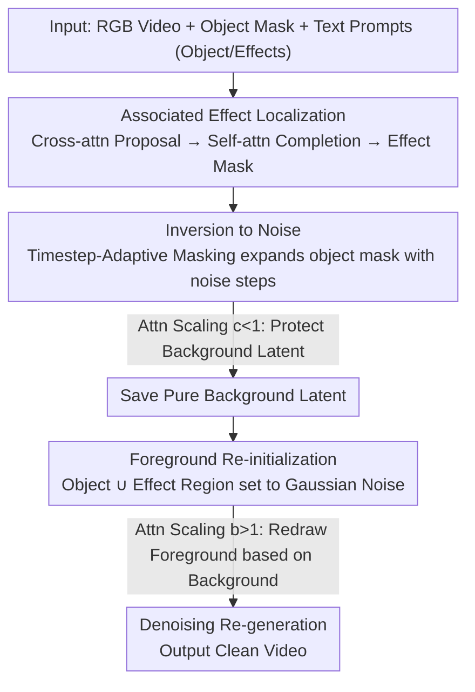

# Object-WIPER: Training-Free Object and Associated Effect Removal in Videos

**Conference**: CVPR 2026  
**arXiv**: [2601.06391](https://arxiv.org/abs/2601.06391)  
**Code**: Coming soon  
**Area**: Image Generation / Video Editing  
**Keywords**: Video Object Removal, Associated Effects, Training-Free, Attention Mechanism, Diffusion Models

## TL;DR
This paper proposes Object-WIPER, the first training-free framework for removing video objects and their associated effects (shadows, reflections, mirrors, etc.). It leverages text-visual cross-attention and visual self-attention in DiT to localize associated effect regions. Clean removal is achieved through foreground re-initialization and attention scaling. The paper also introduces the TokSim metric and the WIPER-Bench real-world benchmark.

## Background & Motivation

**Background**: Video object removal is a core technology for film production and privacy protection. Classic methods (PatchMatch/GraphCut) and learning-based methods (Propainter) focus on filling the object region but completely ignore associated effects (shadows/reflections). Recent diffusion-based methods (VACE/Videopainter) also tend to retain these effects.

**Limitations of Prior Work**: (a) Almost all existing methods retain shadows/reflections, leading to visual artifacts; (b) ROSE can handle associated effects but requires extensive training on synthetic data; (c) Omnimatte-Zero extends associated regions from user masks but depends on external point-tracking models (TAP-Net), failing under fast motion or transparent objects, with suboptimal extension strategies.

**Key Challenge**: Object removal is not merely region filling—it must simultaneously remove "visual traces" of the object (shadows, reflections, mirrors, etc.) to achieve a clean result.

**Goal**: To simultaneously remove objects and all associated visual effects in a training-free manner.

**Key Insight**: Utilize the shared text-visual embedding space in MMDiT to directly localize associated effects without depending on external models.

**Core Idea**: Use cross-attention to locate associated effect seeds $\rightarrow$ refine with self-attention $\rightarrow$ foreground re-initialization + attention scaling $\rightarrow$ adaptive temporal masking.

## Method

### Overall Architecture
Object-WIPER aims to cleanly remove an object from a video—not just the object itself, but also its "visual traces" like shadows and reflections on water or mirrors—entirely without training any parameters, using only inference-time manipulation on a pre-trained text-to-video DiT. The input consists of an RGB video $\mathcal{I}_k$, an object mask $\mathbf{M}^{obj}$, and two text prompts $\{P_s, P_T\}$ (describing the object and its effects, respectively).

The pipeline follows three steps: first, localize all associated effect positions within the DiT attention to obtain an effect mask $\mathbf{M}^{AE}$; second, invert the video back to noise while preserving background latent values; finally, replace the foreground (object + effects) region with pure noise and re-denoise, allowing the model to "fill" the area based on background context. The main challenges are localization in the first step (as effects lack ground-truth masks) and clean re-generation in the third step (removing the object without damaging the background).

### Key Designs

**1. Associated Effect Localization: Excavating shadows and reflections directly from DiT attention**

Since effects like shadows and reflections lack user annotations, the simplest approach (Omnimatte-Zero) is to expand from the object mask, but this misses weakly activated edges and requires an additional point-tracking model. Object-WIPER utilizes the natural semantic correlation of the shared text-visual embedding space in MMDiT for two-step localization. First, specific visual tokens highly correlated with object/effect text tokens are extracted from text-to-image cross-attention. After head-averaging and Otsu thresholding, a proposal mask $m^{PRO}$ is generated:

$$\bar{\mathbf{A}}^{\tilde{T}\to I} = \text{Mean}\Big(\text{Softmax}\big(\tfrac{\mathbf{Q}_{\tilde{T}}\cdot\mathbf{K}_I^\top}{\sqrt{d}}\big)\Big)$$

While cross-attention provides correct semantic localization, it often contains holes or is incomplete. Thus, the second step uses visual self-attention $\mathbf{A}^{I\to I}$ for completion: calculating the response ratio of each visual token to the $m^{PRO}$ region. The final associated effect mask $\mathbf{M}^{AE}$ is obtained via thresholding. The intuition is that self-attention between tokens belonging to the same entity (including its shadow/reflection) is naturally high, allowing it to fill holes and weak edges missed by cross-attention. 

**2. Timestep-Adaptive Masking: Letting the mask "grow" with noise diffusion**

During inversion to noise, self-attention causes the object's representation to diffuse outward. A fixed mask cannot cover the area truly affected by the object at high noise levels. Here, the object response score is re-calculated at each inversion step:

$$RS_p(j) = \frac{\sum_{y\in\mathbf{M}^{obj}(j)}A_{p,y}^{I\to I}}{\sum_{x\in\mathcal{I}(j)}A_{p,x}^{I\to I}}$$

This determines the proportion of attention for the $p$-th token falling within the object region. Thresholding results in a dynamically expanding adaptive mask $\hat{M}_t^{obj}$. This ensures that wherever the object's influence diffuses, the mask follows, preventing residual object information from leaking during re-initialization—crucial for fast-moving scenes like cars.

**3. Attention Scaling: Cutting "contamination" during inversion and introducing background semantics during denoising**

To achieve clean foreground replacement, the information flow between foreground and background must be controlled. During inversion, attention from the background to the foreground is reduced to minimize "contamination" of background latents by the object:

$$\tilde{\mathbf{A}}^{bg\to obj} = \text{Softmax}\big(\tfrac{\mathbf{Q}_I^{bg}\cdot(c\mathbf{K}_I^{obj})^\top}{\sqrt{d}}\big),\quad c<1$$

During denoising, the process is reversed: magnifying the foreground's attention to the background so that the reset foreground noise can actively "sample" from the background to fill the hole realistically:

$$\tilde{\mathbf{A}}^{obj\to bg} = \text{Softmax}\big(\tfrac{\mathbf{Q}_I^{obj}\cdot(b\mathbf{K}_I^{bg})^\top}{\sqrt{d}}\big),\quad b>1$$

**4. Foreground Re-initialization: Clearing residual priors to redraw from noise**

Attention scaling alone is insufficient, as inverted foreground latents still retain structural priors of the object and effects, which may "resurrect" the original object during denoising. Re-initialization replaces the foreground (union of object and effect masks) with pure Gaussian noise while keeping background values intact:

$$\tilde{\mathbf{Z}}_1 = \mathbf{Z}_1\odot\big(1-\mathbf{M}^{obj}\cup\mathbf{M}^{AE}\big) + \varepsilon\odot\big(\mathbf{M}^{obj}\cup\mathbf{M}^{AE}\big)$$

By erasing all residual priors, the area must be re-generated based purely on background context.

**5. TokSim Metric: An evaluation score that distinguishes "clean removal"**

Existing metrics (like BG-PSNR) have a fundamental flaw: methods that do nothing but VAE reconstruction score high without performing removal. TokSim combines three aspects into a single score:

$$\text{TokSim} = 100\cdot\frac{1}{F}\sum_z\sum_i \lambda_z^k\cdot(1-\eta_z^k)\cdot\tau_z^k$$

Where $\lambda$ rewards temporal consistency, $\eta$ penalizes object residuals, and $\tau$ rewards foreground-background fusion. 

### Loss & Training
Completely training-free. It reuses a pre-trained text-to-video DiT and performs only attention manipulation (scaling) and value copying of background latents during inference. No parameters are updated, and no synthetic data is required.

## Key Experimental Results

### Main Results

| Method | Training | DAVIS TokSim↑ | WIPER TokSim↑ | DAVIS BG-PSNR↑ | DAVIS Text-align↑ |
|------|------|--------------|---------------|----------------|-------------------|
| Propainter | ✓ | 28.24 | 20.99 | 34.01 | 26.18 |
| ROSE | ✓ | 29.36 | 30.02 | 26.97 | 26.13 |
| VACE | ✓ | 15.86 | 11.53 | 24.48 | 24.01 |
| Gen-Prop | ✓ | 30.52 | - | 24.27 | 25.89 |
| KV-Edit-Video | ✗ | 28.68 | 23.26 | 25.78 | 25.21 |
| Attentive-Eraser | ✗ | 30.82 | 25.28 | 28.07 | 26.31 |
| **Ours (Object-WIPER)** | **✗** | **32.80** | **33.09** | 23.02 | **26.63** |

### Ablation Study

| Configuration | TokSim↑ | BG-PSNR↑ | Text-align↑ |
|------|---------|----------|-------------|
| Full Object-WIPER | 32.80 | 23.02 | 26.63 |
| w/o Attn Scaling | 32.97 | 21.92 | 26.42 |
| w/o Adaptive Mask | 32.10 | 22.73 | 26.44 |
| w/o Re-initialization | 30.36 | 23.47 | 25.92 |
| w/o $\mathbf{M}^{AE}$ | 32.18 | 23.10 | 26.17 |

### Key Findings
- Object-WIPER outperforms all trained methods on TokSim without any training.
- TokSim is significantly more discriminative than BG-PSNR: VAE reconstruction (no removal) gets a BG-PSNR of 34.05 but a TokSim of only 0.32.
- Re-initialization is the most critical component (TokSim drops by 2.44 without it).
- Associated effect mask $\mathbf{M}^{AE}$ is vital for WIPER-Bench to remove shadows/reflections.
- Adaptive masking is essential in fast-motion scenarios (e.g., speeding cars).

## Highlights & Insights
- **Intrinsic MMDiT Attention for Localization**: Precisely localizes associated effects using semantic correlations in the shared text-visual space without external models. This technique can be transferred to any MMDiT-based editing task.
- **TokSim Metric Design**: Simultaneously measures removal completeness, temporal consistency, and background fusion, exposing the fundamental flaws of existing metrics.
- **WIPER-Bench**: The first object removal benchmark containing real-world scenes with mirrors, transparent objects, and multiple associated effects.

## Limitations & Future Work
- BG-PSNR is lower than results of training-based methods (as background is re-generated by the diffusion model).
- Dependent on text descriptions for objects and effect types, limiting automation.
- Video resolution is constrained by the pre-trained model.
- Only handles dynamic objects; static object removal is not discussed.

## Related Work & Insights
- **vs Omnimatte-Zero**: Does not rely on TAP-Net point tracking; possesses a more comprehensive localization strategy.
- **vs ROSE/Gen-Prop**: Trained methods require large synthetic datasets, whereas Object-WIPER has zero cost.
- **vs KV-Edit**: KV-Edit is designed for images; simple extensions to video perform poorly.

## Rating
- Novelty: ⭐⭐⭐⭐⭐ First to solve associated effect localization and removal within DiT; TokSim is an important contribution.
- Experimental Thoroughness: ⭐⭐⭐⭐ Complete results across two datasets + new benchmark + new metric + ablations.
- Writing Quality: ⭐⭐⭐⭐ Clear progression from problem definition to methodology.
- Value: ⭐⭐⭐⭐⭐ WIPER-Bench + TokSim offer lasting value to the community.

<!-- RELATED:START -->

## Related Papers

- [\[CVPR 2026\] EffectErase: Joint Video Object Removal and Insertion for High-Quality Effect Erasing](effecterase_joint_video_object_removal_and_insertion_for_high-quality_effect_era.md)
- [\[CVPR 2026\] Precise Object and Effect Removal with Adaptive Target-Aware Attention](precise_object_and_effect_removal_with_adaptive_target-aware_attention.md)
- [\[ICML 2026\] AdaEraser: Training-Free Object Removal via Adaptive Attention Suppression](../../ICML2026/image_generation/adaeraser_training-free_object_removal_via_adaptive_attention_suppression.md)
- [\[CVPR 2026\] SketchDeco: Training-Free Latent Composition for Precise Sketch Colourisation](sketchdeco_training-free_latent_composition_for_precise_sketch_colourisation.md)
- [\[CVPR 2026\] ViHOI: Human-Object Interaction Synthesis with Visual Priors](vihoi_human-object_interaction_synthesis_with_visual_priors.md)

<!-- RELATED:END -->
