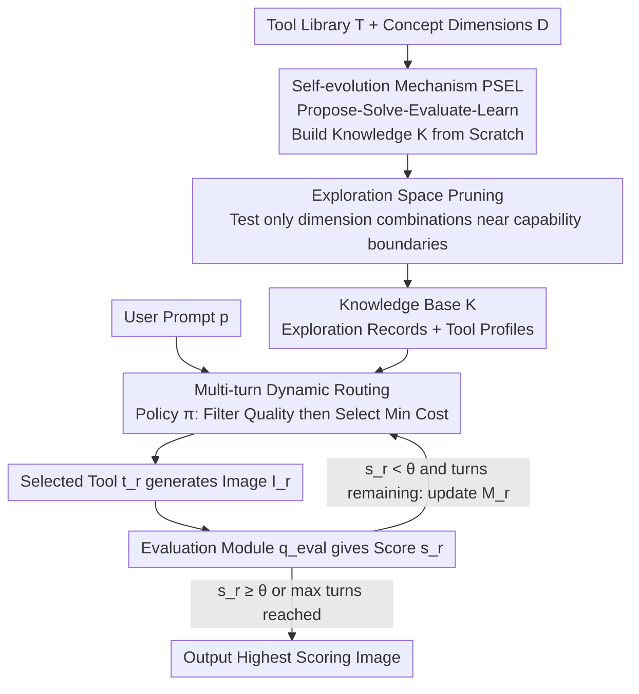

# OctoT2I: A Self-Evolving Agentic Text-to-Image Router

**Conference**: CVPR 2026  
**Paper**: [CVF Open Access](https://openaccess.thecvf.com/content/CVPR2026/html/Jiang_OctoT2I_A_Self-Evolving_Agentic_Text-to-Image_Router_CVPR_2026_paper.html)  
**Code**: https://github.com/JaxJiang2642081986/OctoT2I  
**Area**: Diffusion Models / Agents / Image Generation  
**Keywords**: Agentic Routing, Text-to-Image, Self-Evolution, Inference Efficiency, Tool Choice

## TL;DR
OctoT2I reframes the selection of text-to-image models for a given prompt as a constrained optimization problem: choosing the tool with the minimum cost while satisfying a quality threshold. By employing a multi-turn agentic router supported by a **zero-human-annotation, self-built** tool knowledge base (PSEL self-evolving loop), the method achieves an overall score of 0.96 on GenEval. Compared to the strong baseline Flow-GRPO, it achieves a 90.3% speedup and a 56.6% improvement in energy efficiency.

## Background & Motivation

**Background**: Text-to-Image (T2I) models are evolving in two directions: scaling up (e.g., SD3 8B, Playground v3 24B, and Flow-GRPO utilizing RL post-training for peak performance) and scaling down (e.g., single-step SD-Turbo and SANA for high-resolution generation on consumer GPUs). This specialized capability landscape has formed a diverse ecosystem of coexisting models.

**Limitations of Prior Work**: The marginal utility of scaling single models is diminishing, and average users lack the expertise to select the optimal model for a specific prompt. While "agentic T2I" approaches use an LLM controller to dispatch various T2I tools, they suffer from three major flaws: (1) **Expensive knowledge sources**—relying either on hand-crafted tool priors (GenArtist), which limits coverage and granularity, or on training LLMs to fit massive human annotations (DiffAgent, ChatGen), which is costly and trapped by human supervision ceilings. (2) **Rigid decision mechanisms**—most methods use a single fixed tool for one round; Idea2Img is multi-turn but uses a static generation tool. (3) **Neglect of efficiency**—inference latency and compute costs are ignored, leading to unsustainable deployment in interactive scenarios.

**Key Challenge**: T2I routing is fundamentally a trade-off between "quality" and "cost." However, existing agentic works focus solely on quality while ignoring cost, and their methods for acquiring tool capability knowledge (manual priors/labels) are both expensive and limited.

**Goal**: To redefine agentic T2I as a joint optimization of generation quality and inference efficiency, and to resolve how to acquire tool knowledge at low cost without human intervention.

**Key Insight**: The authors observe that each tool has clear "capability boundaries" (e.g., the fastest-but-fails-counting SD-Turbo vs. the slow-but-capable Flow-GRPO). By allowing an agent to **repeatedly interact with tools and quantify these boundaries**, the system can eliminate dependence on human priors.

**Core Idea**: A stateful, multi-turn routing agent (reason-act-reflect loop) is used to select the lowest-cost tool under quality constraints. Its underlying knowledge is built from scratch via a "Propose–Solve–Evaluate–Learn" loop.

## Method

### Overall Architecture
OctoT2I consists of two interlocking pipelines. The **offline self-evolving pipeline** populates an empty knowledge base $K$: the agent defines orthogonal "conceptual dimensions" (color, counting, position, etc.) and runs the PSEL loop for each tool. Guided by "exploration space pruning," it only tests tasks near capability boundaries. This results in a two-tier knowledge base: prompt exploration records and high-level tool profiles. The **online inference pipeline** executes multi-turn routing for user prompts: the decision policy $\pi$ queries knowledge $K$ and working memory $M_{r-1}$ to filter out tools unlikely to meet quality standards, then selects the one with the lowest estimated cost. After image generation, an evaluation module provides a score; if the score meets threshold $\theta$ or the max turns are reached, the best image is output.

### Key Designs

**1. Reframing Routing as Cost Minimization under Quality Constraints**

Existing agentic methods ignore cost, leading to slow inference. OctoT2I formulates the objective as a constrained optimization: given a user-acceptable quality threshold $\theta$, the ideal tool is the one with the lowest cost among those meeting the quality requirement, i.e., $t^*(p) = \arg\min_{t_i \in T} c(t_i) \ \text{s.t.}\ q(I,p) \ge \theta$. Since the absolute quality $q(\cdot)$ and cost $c(\cdot)$ are unknown beforehand, the agent estimates $\hat q$ and $\hat c$ based on historical data. This transforms model selection into a quantifiable decision process where efficiency is prioritized.

**2. Multi-turn Dynamic Routing: A Reason-Act-Reflect Loop**

The decision policy $\pi$ is implemented by an LLM using an explicit Chain-of-Thought template $p_{\text{decision}}$. At turn $r$, it checks long-term knowledge $K$ and memory $M_{r-1}$ to estimate $\hat q$ for each tool, filtering for a feasible set where $\hat q(t_i(p),p) \ge \theta$. From this set, it picks the tool with the lowest estimated cost $\hat c$, meaning $t_r = \arg\min_{t_i \in T, \hat q \ge \theta} \hat c(t_i)$. The evaluation module then yields a score $s_r = q_{\text{eval}}(I_r,p)$. The tuple $(t_r, I_r, s_r)$ along with the "best result so far" is recorded in $M_r$ for the next turn.

**3. Self-evolution Mechanism: Building Knowledge from Scratch**

To replace manual priors, the agent uses $p_{\text{define}}$ to generate $N_D$ orthogonal concept dimensions $D$ (e.g., color, position, counting, culture). The exploration space is defined as the power set $C_{\text{explore}} = 2^D \setminus \{\emptyset\}$, explored from simple to complex. For each tool, four steps occur: **Propose** instantiates dimension combinations $\tau$ into prompts $P_\tau$; **Solve** generates images; **Evaluate** calculates the Pass@1 score $\text{Pass@1}(p_\tau,t_i) = \frac{1}{N_{\text{sol}}} \sum_n \mathbb{I}(s_{\tau,n} \ge \theta)$; and **Learn** stores fine-grained records and abstract tool profiles.

**4. Exploration Space Pruning: Focusing on Capability Boundaries**

The power set $C_{\text{explore}}$ grows exponentially. OctoT2I applies the "Recursive Precondition Principle": a complex combination $\tau$ is only explored if the agent determines the tool has mastered all simpler sub-tasks ($\forall \tau' \subset \tau, \tau' \neq \emptyset$). Mastery is defined as a historical average Pass@1 exceeding $\theta$. This pruning reduced the number of explored prompts from 1270 to 370 and total self-evolution time from 6857s to 2329s without degrading final performance.

### Loss & Training
The routing controller is a Qwen2-0.5B model, obtained via **policy distillation** from GPT-4o. Hyperparameters include: max turns $R=4$, quality threshold $\theta=0.8$, $N_D=7$ dimensions, $N_p=10$ prompts per combination, and $N_{\text{sol}}=5$ repeats. The tool library comprises 5 models (Flow-GRPO, SDXL-Turbo, SD-Turbo, SANA1.5, SANA-Sprint). Evaluation used NVILA-Lite-2B-Verifier on GenEval and GPT-4o on WISE.

## Key Experimental Results

### Main Results
On GenEval, OctoT2I achieved an Overall score of 0.96. On T2I-CompBench++, it reached 0.6618, outperforming existing baselines.

| Benchmark | Metric | OctoT2I | Flow-GRPO (Non-agentic) | Top Agentic Baseline |
| :--- | :--- | :--- | :--- | :--- |
| GenEval | Overall↑ | **0.96** | 0.93 | 0.67 (Idea2Img) |
| GenEval | Position↑ | **1.00** | 0.95 | 0.29 (GenArtist) |
| T2I-CompBench++ | Average↑ | **0.6618** | 0.6332 | 0.5060 (Idea2Img) |

Efficiency gains are substantial (relative multipliers in parentheses):

| Method | Avg. Time (s)↓ | CO2e (g)↓ | kWh·PUE↓ |
| :--- | :--- | :--- | :--- |
| Idea2Img | 453.22 (45.2×) | 12033 (21.5×) | 27.79 (21.6×) |
| Flow-GRPO | 19.07 (1.90×) | 879 (1.57×) | 2.02 (1.57×) |
| **OctoT2I** | **10.02 (1.00×)** | **559.5 (1.00×)** | **1.29 (1.00×)** |

Compared to Flow-GRPO, OctoT2I is 90.3% faster and 56.6% more energy efficient.

### Ablation Study

| Configuration | Key Metric | Gain / Note |
| :--- | :--- | :--- |
| Self-evolving Knowledge (Ours) | GenEval 0.96 | Full method |
| GPT Internal Knowledge Only | 0.85 | -0.11 drop without external library |
| Hand-crafted Priors | 0.93 | -0.03 drop vs self-evolved |
| w/o Decision Strategy (Random) | 0.5379 (Avg) | -0.23 drop on T2I-CompBench++ |
| w/o Exploration Pruning | 0.96 / 6857s | Quality same, but 3x evolution time |

### Key Findings
- **Self-evolved knowledge is superior**: Scoring 0.11 higher than GPT internal knowledge and 0.03 higher than manual priors on GenEval proves that agent-tested boundaries are more reliable.
- **Decision strategy is critical**: Replacing the knowledge-driven strategy with random tool selection led to a performance collapse on T2I-CompBench++, showing that multi-turn trial-and-error alone is insufficient.
- **Pruning provides efficiency for free**: Pruning reduced evolution costs by roughly 3x without affecting final generation quality.
- **$\theta$ is a Quality-Efficiency knob**: Higher $\theta$ values correlate with better quality but increased average inference time.

## Highlights & Insights
- **Constrained Optimization Framing**: Mapping routing to $\arg\min c$ s.t. $q \ge \theta$ transforms a vague preference problem into a quantifiable objective, elevating efficiency to a primary goal.
- **Zero-Manual-Knowledge PSEL Loop**: Systematically probing capability boundaries via a power set of concept dimensions bypasses the costs and ceilings of human annotation.
- **Continuous Evaluation Signals**: Using softmax logits of yes/no tokens from MLLMs provides fine-grained feedback compared to discrete text labels.
- **Small Model as Controller**: Distilling the policy into a 0.5B model allows for the ~10s/image inference speed.

## Limitations & Future Work
- Knowledge acquisition and pruning rely heavily on the reliability of the evaluation function $q_{\text{eval}}$. Biased MLLM scores could lead to incorrect capability boundaries. ⚠️
- The tool library was limited to 5 models and 7 dimensions; scalability to larger toolsets and dimension spaces requires further discussion.
- Hyperparameters like $\theta$ and $R$ are static; they do not adapt to the difficulty of specific prompts, which may lead to wasted turns or insufficient attempts.

## Related Work & Insights
- **vs Idea2Img**: While both use multi-turn logic, OctoT2I uses dynamic tool routing and explicit efficiency optimization, resulting in ~45x faster speeds.
- **vs GenArtist / ChatGen**: OctoT2I replaces manual priors and costly human-labeled datasets with a self-evolving loop, achieving significantly higher GenEval scores (0.96 vs 0.49/0.44).
- **vs Flow-GRPO**: While Flow-GRPO optimizes a single model via RL to 0.93, OctoT2I intelligently schedules existing tools to reach 0.96 with a 90.3% speedup.

## Rating
- Novelty: ⭐⭐⭐⭐⭐ 
- Experimental Thoroughness: ⭐⭐⭐⭐ 
- Writing Quality: ⭐⭐⭐⭐ 
- Value: ⭐⭐⭐⭐⭐ 

<!-- RELATED:START -->

## Related Papers

- [\[CVPR 2026\] Agentic Retoucher for Text-To-Image Generation](agentic_retoucher_for_texttoimage_generation.md)
- [\[CVPR 2026\] Self-Evaluation Unlocks Any-Step Text-to-Image Generation](self-evaluation_unlocks_any-step_text-to-image_generation.md)
- [\[CVPR 2026\] Vinedresser3D: Agentic Text-guided 3D Editing](vinedresser3d_agentic_text-guided_3d_editing.md)
- [\[CVPR 2026\] OSPO: Object-Centric Self-Improving Preference Optimization for Text-to-Image Generation](ospo_object-centric_self-improving_preference_optimization_for_text-to-image_gen.md)
- [\[CVPR 2026\] SOLACE: Improving Text-to-Image Generation with Intrinsic Self-Confidence Rewards](solace_self_confidence_rewards_t2i.md)

<!-- RELATED:END -->
