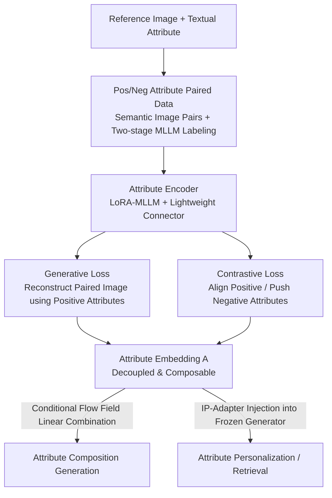

# Omni-Attribute: Open-vocabulary Attribute Encoder for Visual Concept Personalization

**Conference**: CVPR 2026  
**arXiv**: [2512.10955](https://arxiv.org/abs/2512.10955)  
**Code**: https://snap-research.github.io/omni-attribute (Project Page)  
**Area**: Diffusion Models / Image Personalization  
**Keywords**: Attribute Decoupling, Open-vocabulary Encoder, Visual Concept Personalization, Contrastive Learning, Composable Generation

## TL;DR
Addressing the issue where holistic embeddings extracted by generic image encoders (CLIP/DINOv2/VAE) in existing personalization methods are "entangled," often carrying over irrelevant information like lighting and clothing (copy-and-paste artifacts), Omni-Attribute allows the encoder to ingest both an "image + a textual attribute description." It specifically learns to encode open-vocabulary embeddings for designated attributes only (identity/expression/lighting/style, etc.). Through "positive/negative attribute paired data + a dual-objective training of generative and contrastive losses," it achieves SOTA results in attribute retrieval, personalization, and multi-attribute composition.

## Background & Motivation
**Background**: Visual concept personalization (transferring a specific attribute from a reference image to a new context, e.g., "generate my dog based on this photo") currently follows an encoder-based mainstream approach: first using a generic image encoder (CLIP, DINOv2, VAE) to compress the reference image into a holistic embedding, then using modules like IP-Adapter to inject this embedding into a frozen generator for conditional synthesis.

**Limitations of Prior Work**: Generic encoders compress all visual information (identity, expression, pose, background, lighting, camera angle, artistic style, etc.) into **one** entangled representation. When only "identity" transfer is desired, the encoder inadvertently carries over the lighting and clothing of the reference image—leading to what the paper repeatedly emphasizes as "copy-and-paste" artifacts and information leakage. Image editing models (OmniGen2, FLUX-Kontext, Qwen-Image-Edit), while resembling reference images more closely, similarly fail to isolate individual target attributes.

**Key Challenge**: The problem lies at the **encoder side** rather than the generator side—since the embedding itself lumps all attributes together, downstream adjustments struggle to control a single attribute independently. A few attempts at attribute decoupling (Token-Verse, Mod-Adapter, OADis, DeCLIP) are either restricted by simple affine modulations like AdaLN or can only handle **fixed closed-set** attributes, lacking support for open vocabularies.

**Goal**: To directly learn "attribute-level" representations at the encoder side—requiring the embedding to (i) faithfully and **exclusively** encode information of the designated attribute, (ii) **suppress** remaining irrelevant visual information, and (iii) support an **open vocabulary** (referenced by any natural language description).

**Core Idea**: Modeling attribute representation learning as a **dual-objective optimization** problem with **joint data and model design**. In terms of data, "semantically linked image pairs + positive/negative attribute annotations" are constructed to explicitly tell the encoder what to retain and what to suppress; in terms of the model, an MLLM processes both image and text attributes, trained with complementary "generative loss for fidelity + contrastive loss for decoupling" to produce decouplable and composable attribute embeddings.

## Method

### Overall Architecture
Omni-Attribute consists of an **attribute encoder $\mathcal{E}$** and an **image decoder $\mathcal{D}$**. The input is "a reference image $I_r$ + a textual attribute description," the encoder outputs a sequence of embeddings $\bm{A}=[\bm{a}_1,\ldots,\bm{a}_l]$ solely related to that attribute, and the decoder injects this sequence into a frozen generator to synthesize the result in the context specified by a new prompt $c$. The entire process is feed-forward without requiring test-time optimization.

To enable the encoder to "encode only designated attributes," supervisory signals must indicate "which information to keep and which to discard." Thus, the pipeline is divided into three parts: (1) **Data**: Using an MLLM to label semantically linked image pairs with positive/negative attributes to construct supervision; (2) **Training**: Utilizing a reference image to reconstruct its paired counterpart (generative loss) + imposing attraction/repulsion between positive/negative attribute embeddings (contrastive loss); (3) **Model**: The encoder is a LoRA-fine-tuned MLLM + lightweight connector, and the decoder is a frozen generator + trainable IP-Adapter. Once trained, attribute embeddings from multiple images can be merged into a single image via "linear combination of conditional flow fields" (attribute composition).

### Key Designs

**1. Positive/Negative Attribute Paired Labeling: Supervising "What to Keep/Discard"**

The greatest difficulty in attribute-level representation is "where the supervisory signal comes from"—looking at a single image cannot define what belongs to "identity" versus what should be excluded (e.g., lighting). This paper constructs **semantically linked image pairs** $(I_x, I_y)$ and labels each pair with two types of attributes: **positive attributes** $\{a_1^+,\ldots,a_m^+\}$ describing shared semantics (e.g., same animal) and **negative attributes** $\{a_1^-,\ldots,a_n^-\}$ describing differences (e.g., different background/pose). This paired structure explicitly tells the encoder: positive attributes are information to be preserved across images, while negative attributes are information to be inhibited.

To balance annotation quality and cost, a **two-stage labeling** approach is used: the first stage uses a 72B MLLM with detailed prompts (using Chain-of-Thought to describe fine-grained differences) to produce a high-quality subset; the second stage **fine-tunes a 32B MLLM as a specialized annotator** on this subset. This specialized model internalizes task reasoning and output formats, eliminating the need for long instructions, reducing input token length by $3.1\times$ and per-sample latency by $6.3\times$.

**2. Generative Loss: Ensuring "Information Sufficiency and Fine Detail"**

Decoupling is not enough; embeddings must carry **sufficient information** to reconstruct high-fidelity details. Given a pair, one is designated as reference $I_r$ and the other as ground truth $I_g$. The generative loss requires that embeddings extracted from $I_r$ paired with **all positive attributes** can reconstruct $I_g$ under its text prompt $c_g$:

$$\mathcal{L}_{\mathrm{gen}}=\phi(I^{*},I_g),\quad I^{*}=\mathcal{D}\big(\mathcal{E}(I_r,\{a_1^+,\ldots,a_m^+\}),c_g\big)$$

A key finding: **all** positive attributes must be fed during training—omitting any specific positive attribute causes the encoder to collapse into encoding the entire image, re-introducing copy-and-paste artifacts.

**3. Contrastive Loss: Forcing a Discriminative Attribute Space**

True decoupling requires "positive attribute embeddings to move closer and negative/different attribute embeddings to move further apart." For a positive attribute $a_i^+$ and negative attribute $a_j^-$, an InfoNCE-style contrast is applied:

$$\mathcal{L}_{\mathrm{con}}=-\log\frac{\psi(a_i^+,a_i^+)}{\psi(a_i^+,a_i^+)+\psi(a_i^+,a_j^-)+\psi(a_j^-,a_i^+)+\psi(a_j^-,a_j^-)}$$

Where $\psi(a_x,a_y)$ is the similarity of pooled embeddings. This forces clustering "by attribute" rather than "by image" even when embeddings originate from the **same pair** $(I_x,I_y)$.

**4. Mechanism: LoRA-MLLM Encoder + Composable Conditional Flow Fields**

The encoder uses MLLM as a backbone for its strong vision-language priors. **LoRA fine-tuning** is preferred over full parameter fine-tuning; the latter causes catastrophic forgetting and performance drops. For **composition**, the conditional flow field (conditional prediction minus unconditional prediction) is used:

$$\Delta_{(I_i,a_i)}=\mathcal{D}(\mathcal{E}(I_i,a_i),\varnothing)-\mathcal{D}(\varnothing,\varnothing)$$

Final velocity field: $v^{*}=\mathcal{D}(\varnothing,c)+\sum_{i=1}^{N} w_i\cdot\Delta_{(I_i,a_i)}$. Decoupled embeddings allow these fields to be linearly superimposed cleanly.

## Key Experimental Results

### Main Results
Evaluation utilized a benchmark of 15 reference attributes (concrete objects and abstract concepts). Results were validated using GPT-4o (DreamBench++ protocol) and a 10-person user study.

| Comparison Group | Representative Methods | Conclusion |
|------------------|------------------------|------------|
| Generic Encoders | CLIP / DINOv2 | Abstract concept personalization fails. |
| MLLM Encoders | Qwen-VL | Lacks contrastive learning; poor adaptation. |
| Image Editing | OmniGen2 / FLUX-Kontext | Strong copy-and-paste artifacts; weak text alignment. |
| **Ours** | **Omni-Attribute** | **Best balance** between naturalness and text/attribute alignment. |

### Ablation Study
Ablation measures the gap $\Delta_{(\mathrm{pos},\mathrm{neg})}$ and personalization scores.

| Config | Key Setting | $\Delta_{(\mathrm{pos,neg})}$↑ | Attr-F↑ | Average↑ |
|--------|-------------|-------------------------------|---------|----------|
| [c] | LoRA, w/o $\mathcal{L}_{\mathrm{con}}$ | -0.002 | 0.651 | 0.774 |
| [i] **Ours** | LoRA + $\mathcal{L}_{\mathrm{con}}$ | 0.608 | 0.641 | **0.789** |

### Key Findings
- **Contrastive loss is essential**: Without $\mathcal{L}_{\mathrm{con}}$, the model ignores attribute conditions ($\Delta \approx 0$).
- **LoRA vs. Full Tuning**: Full tuning causes knowledge forgetting; LoRA preserves pre-trained representations better.
- **Fidelity vs. Decoupling**: High $\lambda_{\mathrm{con}}$ improves discriminability but can slightly lower attribute fidelity.

## Highlights & Insights
- **Moving Decoupling to the Encoder**: Unlike prior works that adjust the generator, this method ensures the embedding itself is "clean," fundamentally eliminating copy-and-paste artifacts.
- **Supervision via Paired Labeling**: The construction of shared/different attributes for semantically linked pairs is the most crucial "Aha!" moment of the paper.
- **Two-stage Distillation**: Distilling a 72B MLLM's reasoning into a 32B specialized annotator significantly reduces inference costs for large-scale labeling.

## Limitations & Future Work
- **Not for general image editing**: Attribute embeddings are too sparse for tasks requiring global content preservation.
- **Strongly correlated attributes**: Decoupling "identity" from "haircut" remains difficult due to inherent semantic entanglement.
- **Sensitive Hyperparameters**: Contrastive learning weights and temperatures require careful tuning depending on the dataset.

## Related Work & Insights
- **vs. IP-Adapter**: Moves from holistic injection to specific, decoupled attribute injection.
- **vs. DeCLIP/OADis**: Expands from closed-set attributes to **open-vocabulary** natural language descriptions.
- **vs. Break-A-Scene**: Operates on abstract attributes (lighting/style) rather than just spatially separable masks.

## Rating
- Novelty: ⭐⭐⭐⭐⭐ 
- Experimental Thoroughness: ⭐⭐⭐⭐ 
- Writing Quality: ⭐⭐⭐⭐⭐ 
- Value: ⭐⭐⭐⭐⭐

<!-- RELATED:START -->

## Related Papers

- [\[CVPR 2026\] SHOE: Semantic HOI Open-Vocabulary Evaluation Metric](shoe_semantic_hoi_open-vocabulary_evaluation_metric.md)
- [\[CVPR 2026\] TokenLight: Precise Lighting Control in Images using Attribute Tokens](tokenlight_precise_lighting_control_in_images_using_attribute_tokens.md)
- [\[CVPR 2026\] All-in-One Slider for Attribute Manipulation in Diffusion Models](all_in_one_slider_attribute_manipulation.md)
- [\[CVPR 2026\] Attribute-Preserving Pseudo-Labeling for Diffusion-Based Face Swapping](attribute-preserving_pseudo-labeling_for_diffusion-based_face_swapping.md)
- [\[CVPR 2026\] APPLE: Attribute-Preserving Pseudo-Labeling for Diffusion-Based Face Swapping](apple_attribute-preserving_pseudo-labeling_for_diffusion-based_face_swapping.md)

<!-- RELATED:END -->
