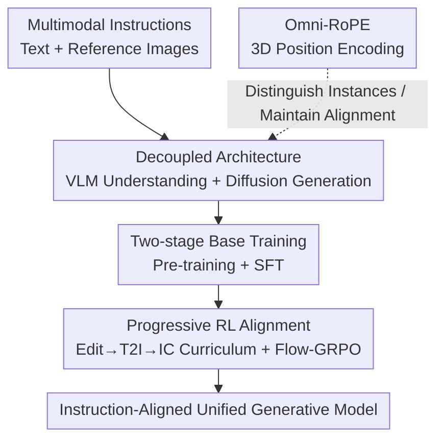

# OmniGen2: Towards Instruction-Aligned Multimodal Generation

**Conference**: CVPR 2026  
**Paper**: [CVF Open Access](https://openaccess.thecvf.com/content/CVPR2026/html/Wu_OmniGen2_Towards_Instruction-Aligned_Multimodal_Generation_CVPR_2026_paper.html)  
**Code**: https://github.com/VectorSpaceLab/OmniGen2  
**Area**: Image Generation / Unified Multimodal Generation / Instruction Alignment  
**Keywords**: Unified Multimodal Generation, Instruction Alignment, Decoupled Architecture, Omni-RoPE, Progressive Reinforcement Learning

## TL;DR
OmniGen2 adopts a unified "decoupled VLM + Diffusion" architecture (where VLM handles understanding and Diffusion handles generation, conditioned on VLM variable-length hidden states and VAE features). By combining Omni-RoPE position encoding with a two-stage training strategy—"building a strong base followed by progressive RL alignment"—the model precisely follows complex instructions across text-to-image, image editing, and in-context generation tasks, achieving a GenEval score of 0.95.

## Background & Motivation

**Background**: Multimodal image generation has progressed rapidly over the past year. Models like GPT-Image-1, Flux, Qwen-Image, Seedream, and NanoBanana can perform stylization, text rendering, in-context generation, and knowledge-driven generation, moving toward general generative intelligence. The key to leveraging these capabilities is **multimodal instruction alignment**, ensuring controllability, semantic consistency, and generation quality.

**Limitations of Prior Work**: Open-source generative models as "bases" generally have flaws—they are either specialists (failing outside their training scope) or over-optimized for specific aesthetic preferences, losing "plasticity." Instruction alignment requires the base to have a deep understanding of multimodal semantics and task intent. Data is also a bottleneck: existing editing/in-context data is either generated by inpainting models (narrow task coverage) or retrieved from the web (low volume and quality).

**Key Challenge**: There is a conflict between building a "simple, general, flexible, and non-overfitted" base and designing an alignment process with "clear reward signals and cross-task consistency." Overfitting the base compromises plasticity, while joint multi-task training during alignment often leads to interference and negative transfer.

**Goal**: ① Construct a non-overfitted, general, and strong base model; ② Design an alignment pipeline that prevents tasks from conflicting; ③ Fill the gap in standardized benchmarks for in-context generation.

**Key Insight**: Instead of modifying the VLM architecture, the diffusion decoder is **conditioned on the variable-length hidden states of the VLM** (unlike MetaQuery, which compresses information into fixed-length queries, creating bottlenecks). For alignment, instead of one-time joint training, a **progressive curriculum + online RL** is used to align tasks sequentially.

**Core Idea**: Decouple the "understanding (VLM)" and "generation (diffusion)" pathways, using variable-length hidden states as a bridge. Then, align instruction-following capabilities using a carefully orchestrated progressive GRPO curriculum.

## Method

### Overall Architecture
The core of OmniGen2 is a two-stage design: first, building a base with world knowledge using large-scale data, and then aligning it to complex instructions through a progressive reward-based process. The base consists of three components: (1) a decoupled unified generative architecture, (2) Omni-RoPE for efficient in-context position encoding, and (3) a multi-stage training and alignment curriculum ranging from broad knowledge to fine-grained instruction following.

During inference, data flows as follows: a VLM (an autoregressive Transformer initialized from Qwen2.5-VL-3B) processes the multimodal input context. When it generates the special token `<|img|>`, image generation is triggered. The corresponding VLM hidden states are extracted as **high-level semantic conditions**. Simultaneously, Flux-VAE encoded reference images provide **low-level visual details** (crucial for editing). These conditional signals (VLM hidden states, VAE features, and noisy latents) pass through a lightweight two-layer Transformer refiner for alignment before entering the Diffusion Transformer (randomly initialized, ~4B parameters, using a Lumina-Image 2.0-style shared backbone) to generate the image. Training is split into base training (pre-training → SFT) and progressive RL alignment.

### Key Designs

**1. Decoupled Architecture: VLM for Understanding, Diffusion for Generation, Bridged by Variable-length Hidden States**

Unified multimodal models must both understand and draw; forcing both into a single network often leads to mutual degradation. OmniGen2 uses two **decoupled** Transformer pathways: an autoregressive Transformer (VLM, Qwen2.5-VL-3B) for world knowledge and multimodal instruction understanding, and a Diffusion Transformer (randomly initialized) dedicated to high-fidelity synthesis. The bridging method is critical—it **directly uses the variable-length hidden states from the last layer of the VLM** as conditions, specifically selecting hidden states corresponding to text tokens (visual details are handled by the VAE). This avoids the information bottleneck caused by compressing instructions into fixed-length queries as in MetaQuery. Additionally, a Flux-VAE low-level feature path ensures fine-grained pixel consistency during editing. This design avoids structural changes to the VLM, preserving its instruction understanding; during most training, the VLM is frozen, optimizing only the generation, which is more efficient than full training approaches like Mogao or BAGEL. The diffusion backbone follows the parameter-sharing design of Lumina-Image 2.0 (language and vision share semantic representations for natural cross-modal alignment), with conditional signals aligned by a lightweight refiner before entering the core blocks.

**2. Omni-RoPE: 3D Position Encoding Decoupling "Image Identity" and "Intra-image Layout"**

In multi-image editing or in-context generation, standard position encodings fail to distinguish image sequences and struggle to maintain spatial alignment before and after editing. Omni-RoPE extends RoPE to a unified multimodal setting: a token at coordinates $(h,w)$ in the $k$-th image is assigned a 3D position identifier $\text{PosID}_k(h,w)=(\Delta_I^{(k)}, h, w)$, where $\Delta_I^{(k)}$ is the **instance identity** shared by all tokens in that image to distinguish different images or modalities, and $(h,w)$ are the **local 2D coordinates within the image** starting from $(0,0)$. The advantage of this decomposition is that because spatial coordinates are calculated locally within each image starting from $(0,0)$, **patches at corresponding positions in the input and output images receive identical embeddings**, naturally preserving spatial alignment and editing consistency. Meanwhile, $\Delta_I$ provides an explicit channel for distinguishing visual instances, which is vital for multi-image in-context generation (text tokens degrade to standard 1D indices). In toy reconstruction experiments, this approach achieved the fastest convergence and lowest final loss (see table below); adding image index embeddings further reduces final loss.

**3. Two-stage Base Training: Resolution Curriculum Pre-training + SFT for a Strong Base**

The base is built in two stages: "pre-training from scratch + supervised fine-tuning." Pre-training follows a **resolution curriculum** $256^2\to512^2\to1024^2$. At each resolution, strong text-to-image (T2I) alignment is established first, followed by the introduction of mixed-task data for editing/in-context tasks. The optimization objective is Rectified Flow, using FlashAttention2 for variable-length contexts. SFT is performed at $1024^2$ using curated data and data distilled from closed-source models to enhance high-level reasoning, composition, instruction following, and visual fidelity. On the data side, multiple scalable construction pipelines were developed—particularly using **video sources** to extract in-context/editing triplets with consistent subjects (using VLM for subject detection/segmentation/semantic filtering), and constructing interleaved and reflection data to foster temporal reasoning and self-correction. After these two stages, the model gains fundamental instruction-following and general generation capabilities, providing a foundation for subsequent alignment.

**4. Progressive RL Alignment: Sequence-based Task Alignment via Flow-GRPO to Prevent Interference**

Alignment is performed via a **progressive curriculum** using online RL rather than a single joint training session to avoid negative transfer and task interference. A task sequence $S=\langle T_1,\dots,T_N\rangle$ is defined, where each task $T=(\tau, \delta, R)$ includes a type $\tau \in \{\text{T2I}, \text{Edit}, \text{IC}\}$, instances $\delta$, and reward $R$. Rewards are mission-specific: Edit uses the learned reward EditScore, IC uses scores from Qwen2.5-VL-72B, and T2I uses the verifiable reward GenEval (which has significant overlap with Edit/IC). Aesthetic rewards (like HPSv3) and specialized tasks lacking synergy (like OCR) are intentionally excluded to prevent reward hacking. The final three-stage curriculum is $\langle T_1, T_2, T_3 \rangle = \langle \text{Edit, T2I(GenEval), IC} \rangle$, trained using Flow-GRPO. **The sequencing is crucial**: ablations show that Edit→GenEval→IC outperforms Edit→IC→GenEval (GEdit Overall 7.21 vs 7.06), and starting with "Edit" consistently outperforms starting with "T2I"—the authors hypothesize that the densely supervised editing task provides a more stable foundation for subsequent learning.

### Example: Toy Verification of Omni-RoPE
A randomly initialized model is tasked with reconstructing the $k$-th image from multiple randomly sampled input images to isolate the effect of position encoding. The table shows the steps required to reach high fidelity (loss < 0.014):

| Position Encoding | $\text{PosID}_k(h,w)$ | Steps to Target ↓ | Final Loss ↓ |
|----------|-----------------------|----------------|--------|
| Lumina-Image-2.0 | $(0, h+\Delta h, w+\Delta w)$ | ~2,500 | 0.017 |
| Qwen2-VL | $(\Delta_I, h+\Delta_I, w+\Delta_I)$ | ~1,200 | 0.005 |
| **Omni-RoPE** | $(\Delta_I, h, w)$ | **~800** | **0.003** |
| + Image Index Emb | — | ~800 | **0.002** |

Decoupling instance identity from local spatial coordinates results in stronger alignment across visual instances, faster convergence, and lower final loss.

## Key Experimental Results

OmniGen2 features 3B (understanding) + 4B (generation) parameters and is evaluated across understanding, T2I, editing, and in-context generation tasks. Visual understanding is provided by Qwen2.5-VL-3B: MMBench 79.1, MMMU 53.1, MM-Vet 61.8.

### Main Results (Unified Capability Comparison, Selected from Tables 2/3/4)

| Model | Params | GenEval ↑ | ImgEdit-Bench ↑ | GEdit-EN ↑ | OmniContext Avg ↑ |
|------|------|-----------|-----------------|-----------|---------------------|
| BAGEL | 7B+7B | 0.82/0.88† | 3.20 | 6.52 | 5.73 |
| UniWorld-V1 | 7B+12B | 0.84† | 3.26 | 4.85 | — |
| Qwen-Image-Edit-2509 | 7B+20B | — | 4.41 | 7.54 | 7.69 |
| Gemini 2.5 Flash Image | — | 0.55 | 4.28 | 7.10 | 7.84 |
| GPT-4o | — | — | — | — | **8.80** |
| **OmniGen2** | 3B+4B | **0.95** | 3.69 | 7.21 | 7.95 |

> †: Results using LLM rewriters. OmniGen2 achieves 0.95 on GenEval, surpassing BAGEL (0.88), UniWorld (0.84), and even the T2I-specialized Qwen-Image. OmniContext average of 7.95 excels among all open-source models, trailing only the closed-source GPT-4o (8.80). On Emu-Edit, OmniGen2 achieves the highest CLIP-Out 0.311 (most successful edit application) and highest DINO 0.876 (best preservation of non-edited regions).

### Ablation Study (Table 5, Task Selection and Sequencing)

| Configuration | Key Metrics | Note |
|------|---------|------|
| Full Curriculum Edit→GenEval→IC | GEdit Overall 7.21 | Final solution |
| Order change Edit→IC→GenEval | GEdit Overall 7.06 | Performance drops with reordering |
| + OCR Joint Training | GEdit 6.28→6.13 | Non-overlapping skills → negative transfer |
| Edit & GenEval Synergy | GenEval 0.95 vs single-task 0.94 | Overlapping skills → positive synergy |
| + HPSv3 Aesthetic Reward | PQ surges to 8.22 but SC/IC crash | Reward hacking |

### Key Findings
- **Task selection determines success**: Tasks with non-overlapping skills (OCR) cause negative transfer; tasks with overlapping skills (instruction following), such as Edit & GenEval, exceed their respective single-task baselines.
- **Aesthetic rewards can be toxic**: HPSv3 improves perceptual quality (PQ) to 8.22 but causes semantic consistency (SC) and in-context (IC) performance to collapse—a classic case of reward hacking.
- **Sequencing matters**: Starting with Edit followed by T2I is consistently better, as the densely supervised editing task provides a solid foundation.
- **Accuracy rewards are crucial**: The IC score for Edit-only (7.71) is actually higher than IC-only (7.38) because EditScore reinforces general instruction following.

## Highlights & Insights
- **Variable-length hidden states bridge avoids information bottlenecks**: Compared to MetaQuery's fixed queries, conditioning directly on the VLM's variable-length hidden states preserves more information. Separating text (VLM hidden states) and vision (VAE) creates a clean division of labor.
- **Ingenuity of Omni-RoPE identity/spatial decoupling**: Ensuring corresponding patches in input and output images obtain the same embedding naturally preserves editing alignment while providing an explicit channel for multi-image distinction at near-zero cost.
- **Alignment as a curriculum rather than joint training**: Using progressive RL with selected rewards transforms "multi-task conflict" into "cross-task positive transfer." Explicitly identifying the risk of reward hacking with aesthetic rewards provides a valuable lesson for generative RLHF.
- **OmniContext benchmark**: Fills the gap in standardized evaluations for in-context generation (Character/Object/Scene × SINGLE/MULTIPLE/SCENE, with GPT-4o providing PF/SC/Overall scores and rationales).

## Limitations & Future Work
- **Closed-source models still lead in in-context generation**: GPT-4o (8.80) significantly outperforms OmniGen2 (7.95) on OmniContext, with gaps remaining in subject consistency and prompt following.
- **Dependency on reward models**: The lack of verifiable rewards for Edit/IC means reliance on learned rewards like EditScore and Qwen2.5-VL-72B, creating a ceiling based on reward quality.
- **Complex data pipeline**: The construction pipeline involving video extraction and multi-model labeling is engineering-heavy and difficult to reproduce.
- **Intentional avoidance of aesthetic dimensions**: To prevent reward hacking, aesthetic rewards like HPSv3 were excluded, meaning pure aesthetic preference alignment is currently bypassed in this framework.

## Related Work & Insights
- **vs MetaQuery**: MetaQuery compresses instructions into fixed-length queries, creating a bottleneck; OmniGen2 uses variable-length hidden states to avoid this—similar concept, different execution.
- **vs BAGEL / Mogao**: These models typically train the VLM alongside generation, which is more expensive. OmniGen2 freezes the VLM most of the time, leading to higher efficiency and superior GenEval (0.95 vs 0.88) and editing performance.
- **vs OmniGen (v1)**: The first generation was a 3.8B single architecture. The second generation decouples VLM and Diffusion, adds Omni-RoPE, and uses progressive RL, resulting in a GenEval leap from 0.68 to 0.95 and across-the-board improvements.
- **vs Qwen-Image-Edit-2509**: While the latter has significantly more parameters (7B+20B) and slightly higher GEdit (7.54 vs 7.21), OmniGen2 outperforms it on GenEval and OmniContext with a smaller 3B+4B footprint, offering superior efficiency.

## Rating
- Novelty: ⭐⭐⭐⭐ The combination of decoupled architecture, Omni-RoPE, and progressive RL curriculum is clear, though individual components are evolutions of existing ideas (VLM-conditioned diffusion, RoPE, GRPO).
- Experimental Thoroughness: ⭐⭐⭐⭐⭐ Comprehensive coverage across understanding/T2I/editing/in-context tasks across multiple benchmarks, plus the new OmniContext and detailed alignment ablations.
- Writing Quality: ⭐⭐⭐⭐⭐ The logical flow from motivation to architecture, training, and alignment is smooth, and the ablations clearly explain the rationale behind design choices.
- Value: ⭐⭐⭐⭐⭐ Open-sourcing models, code, data, and benchmarks provides significant community value, demonstrating strong instruction following in a compact model size.

<!-- RELATED:START -->

## Related Papers

- [\[CVPR 2026\] DreamOmni2: Multimodal Instruction-based Generation and Editing](dreamomni2_multimodal_instruction-based_generation_and_editing.md)
- [\[ICLR 2026\] EditReward: A Human-Aligned Reward Model for Instruction-Guided Image Editing](../../ICLR2026/image_generation/editreward_a_human-aligned_reward_model_for_instruction-guided_image_editing.md)
- [\[CVPR 2026\] ChangeBridge: Spatiotemporal Image Generation with Multimodal Controls for Remote Sensing](changebridge_spatiotemporal_image_generation_with_multimodal_controls_for_remote.md)
- [\[CVPR 2026\] PhotoFramer: Multi-modal Image Composition Instruction](photoframer_multi-modal_image_composition_instruction.md)
- [\[CVPR 2026\] DiT-IC: Aligned Diffusion Transformer for Efficient Image Compression](ditic_aligned_diffusion_transformer_for_efficient.md)

<!-- RELATED:END -->
