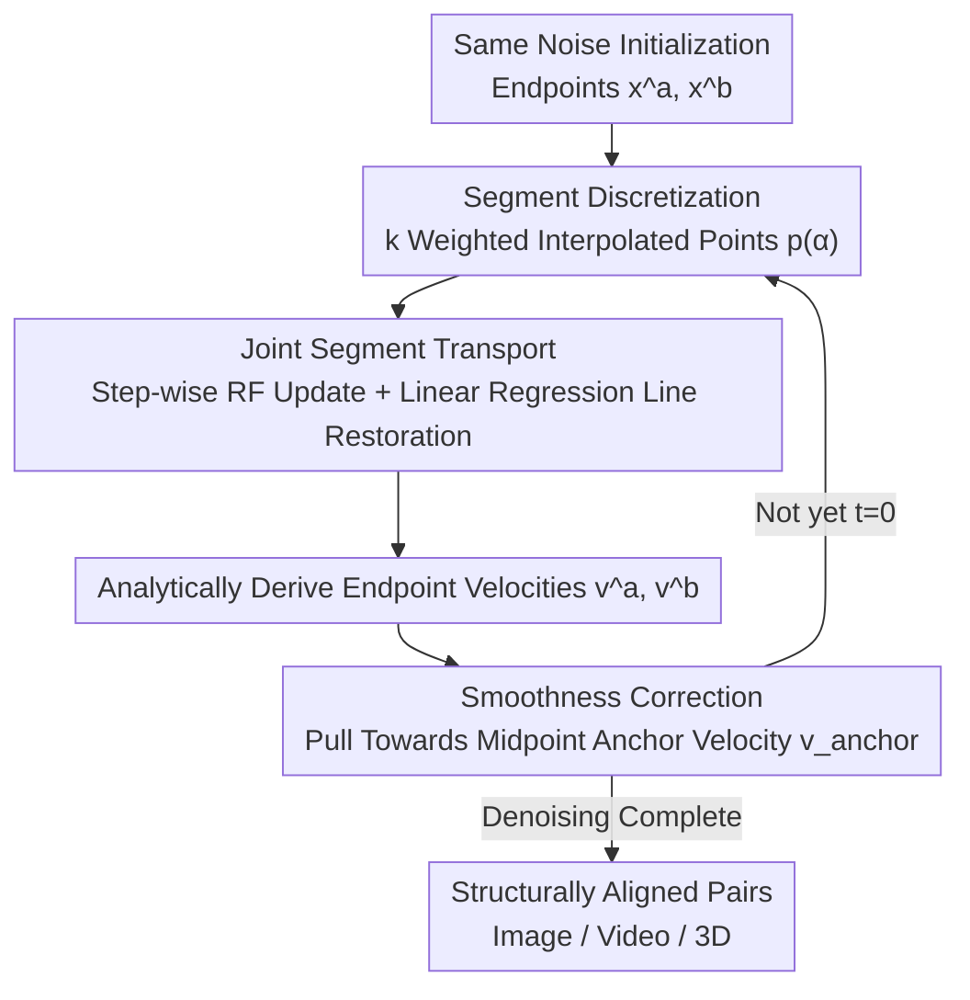

# One Algorithm to Align Them All

**Conference**: CVPR 2026  
**Paper**: [CVF Open Access](https://openaccess.thecvf.com/content/CVPR2026/html/Pang_One_Algorithm_to_Align_Them_All_CVPR_2026_paper.html)  
**Code**: [voyleg.github.io/atata](https://voyleg.github.io/atata/) (Project Page)  
**Area**: Image Generation / Diffusion & Flow Models  
**Keywords**: Structurally Aligned Generation, Rectified Flow, Joint Inference, Line Segment Transport, Cross-Modal Generation

## TL;DR
A universal algorithm is proposed that modifies only the sampling loop without altering any model weights. It enables any Rectified Flow model operating on a structured latent space to perform "paired joint generation" of two structurally aligned samples (e.g., different objects in the same pose). This approach simultaneously works across image, video, and 3D modalities, operating an order of magnitude faster than the SDS-based A3D.

## Background & Motivation

**Background**: Many applications require structurally aligned paired or grouped generation results—such as the same animal and its skeleton, Gothic and Indian versions of the same building, or different subjects performing the same action in a video. This "structurally aligned generation" requires different subject content across samples, while semantically corresponding parts must be strictly aligned in spatial/temporal dimensions. This is useful for virtual world building, CAD replaceable parts, match-cut transitions, and synthesizing paired data for training editing models.

**Limitations of Prior Work**: Current approaches fall into three categories, each with critical drawbacks. (1) **Editing-based** (RF-Inversion, VACE, Qwen-Image-Edit): These methods generate one sample according to the first prompt, then force the second sample to adapt to its structure. This biases the generation toward the first description while sacrificing the quality of the second. (2) **Zero-shot LLM/LMM** (Nanobanana, FLUX, Qwen): These can stitch semi-consistent grid maps, but the alignment remains uncontrollable. (3) **Native joint generation**: MatchDiffusion merges the two trajectories before a certain timestep and diverges afterwards. Practical tests show that this "hard cutting" is insufficient to ensure reliable structural alignment. A3D uses Score Distillation Sampling (SDS) to constrain multiple generation runs to transition smoothly, but SDS is slow, prone to mode collapse, and tends to produce cartoonish results.

**Key Challenge**: Achieving alignment requires the generation processes of two samples to constrain each other. However, existing constraint methods either destroy the realism/diversity of single-sample generation (SDS) or impose constraints too coarsely (hard-cut trajectories). The root of the problem lies in the fact that prior work does not design joint inference from the structural perspective of "what the transition trajectory between two samples should look like."

**Key Insight**: This work adopts the insight from A3D: high-quality alignment is equivalent to satisfying two requirements: (1) the transition between the two samples (the intermediate samples obtained via linear interpolation) must be realistic, and (2) the transition must be smooth (Lipschitz bounded). While A3D utilizes slow SDS optimization to satisfy these conditions, this paper asks: can these requirements be met directly within the Rectified Flow inference loop without training or optimization?

**Core Idea**: The joint generation of a pair of samples is reformulated as "jointly transporting an entire line segment in the latent space"—the endpoints of this line segment represent the two samples $x^a, x^b$, and the intermediate points represent their linear interpolations. In each inference step, the entire line segment is transported along the velocity field of the flow model, enforcing its linear structure and applying a smoothness correction. This ensures structural alignment at the endpoints. The entire modification occurs only in the inference loop and is modal-agnostic.

## Method

### Overall Architecture
The method is built upon Rectified Flow. Standard RF inference gradually denoises a noisy sample $x$ along the velocity field $v_\Theta(x_t, t, c)$ predicted by the network. The proposed approach simultaneously generates a pair of samples $a, b$ (conditioned on texts $c^a, c^b$) and aligns their structures. Both endpoints $x^a, x^b$ are initialized with the same noise. Instead of denoising them independently, the entire line segment consisting of the endpoints and intermediate interpolated points is treated as a single object to be transported. Each step consists of two operations: first, each sampling point on the line segment undergoes a standard RF update step; second, a weighted linear regression is used to pull the drifted points back onto a straight line to maintain the linear structure, analytically deriving the joint transport velocities of the two endpoints. Finally, a smoothness correction is applied, pulling the endpoint velocities toward the predicted velocity of the segment's midpoint (the anchor velocity) to prevent the norm of the segment from exploding in the early stages and causing misalignment. The entire process does not modify model weights and only alters the inference loop. Consequently, the same algorithm can be directly applied to three different structured latent space models: images (FLUX), 3D (Trellis), and video (WAN).

### Key Designs

**1. Joint Segment Transport: Turning "generating a pair of samples" into "transporting a probability distribution line segment"**

The limitation of independent denoising is the lack of structural connection, while hard-trajectory cutting is too coarse. The authors shift their focus from the "two endpoints" to the "entire line segment between endpoints" $[x^a, x^b] = \{(1-\alpha)x^a + \alpha x^b \mid \alpha \in [0,1]\}$, assigning it a density $p(\alpha)$, which is equivalent to transporting a distribution rather than two points. In practice, this segment is represented by $k$ uniformly distributed weighted sampling points $x_{t,i} = (1-\alpha_i)x^a_t + \alpha_i x^b_t$ with weights $p(\alpha_i)$. At each step, each point is updated using standard RF with the interpolated text condition $c_i = (1-\alpha_i)c^a + \alpha_i c^b$, yielding updated points $\hat{x}_{t_2,i} = x_{t_1,i} + (t_2-t_1)v_\Theta(x_{t_1,i}, t_1, c_i)$. The core issue is that collinear points are no longer collinear after one step, destroying the line segment structure.

To address this, the authors **forcefully restore the linear structure** by solving a weighted linear regression. This finds new endpoints $x^a_{t_2}, x^b_{t_2}$ such that the reconstructed collinear points $x_{t_2,i} = (1-\alpha_i)x^a_{t_2} + \alpha_i x^b_{t_2}$ are as close as possible to the independently updated points:

$$\mathcal{L}(x^a_{t_2}, x^b_{t_2}) = \sum_{i=1}^{k} p(\alpha_i) \, \lVert x_{t_2,i} - \hat{x}_{t_2,i} \rVert_2$$

This regression has a **closed-form solution** (the paper provides analytical expressions for $x^a_{t_2}, x^b_{t_2}$ in terms of weight statistics $c_{00}, c_{01}, c_{11}, d_0, d_1$). Thus, no gradient optimization is needed, making the process significantly faster—this is why it runs an order of magnitude faster than SDS-based A3D. Once the new endpoints are resolved, their velocities are directly given by $v^a_{t_1} = \frac{x^a_{t_2} - x^a_{t_1}}{t_2 - t_1}$ and $v^b_{t_1} = \frac{x^b_{t_2} - x^b_{t_1}}{t_2 - t_1}$. In practice, the authors find that concentrating $p(\alpha)$ near the midpoint during early iterations and gradually transitioning to a uniform distribution yields the best results.

**2. Smoothness Regularization: Constraining the "norm growth rate of the segment" for smooth transitions**

The second requirement is transition smoothness. The authors observe that for a linear segment, the transition "velocity" is independent of position and always equals $\frac{dx_t}{d\alpha} = x^b_t - x^a_t$. Therefore, **regularizing the transition velocity is equivalent to regularizing the segment norm** $\lVert x^b_t - x^a_t \rVert_2$. Since both ends are initialized with the same noise, the segment norm starts from 0 and diverges over time into two distinct but aligned samples. The derivative of the norm with respect to time is:

$$\frac{d\lVert x^b(t) - x^a(t)\rVert_2}{dt} = \frac{\langle v^b(t) - v^a(t), \, x^b(t) - x^a(t)\rangle}{\lVert x^b(t) - x^a(t)\rVert_2}$$

The authors discover that severe misalignment is often accompanied by an **explosion of the segment norm in early iterations**, and this derivative depends on the difference between the velocities at both ends, $v^b - v^a$. Therefore, suppressing misalignment is equivalent to bringing the endpoint velocities closer to each other.

**3. Midpoint Anchor Velocity: Aligning endpoint velocities with the "true denoising direction of the midpoint"**

Following the previous point, how can $v^a$ and $v^b$ be brought closer without disrupting denoising? The authors apply a convex combination correction using an anchor velocity $v^{anchor}_t$: $\hat{v}^a_t = w_t v^{anchor}_t + (1-w_t)v^a_t$, and similarly for $\hat{v}^b_t$. The choice of the anchor velocity is crucial—it must point in the "denoising" direction for all points on the segment, otherwise it would disrupt the sample's noise schedule. A naive choice would be the average of the two endpoint velocities $\frac{v^a_t + v^b_t}{2}$, but experiments show this is suboptimal because the directions of the two endpoint velocities often conflict. The final solution is to **feed the midpoint of the segment directly back into the flow model** to predict the velocity as the anchor:

$$v^{anchor}_t = v_\Theta \!\left(\frac{x^a_t + x^b_t}{2}, \, t, \, \frac{c^a + c^b}{2}\right)$$

This choice is naturally coupled with Design 1: under correct inference, $\frac{x^a_t + x^b_t}{2}$ itself should be a credible sample within the noise distribution at that timestep. Thus, using its predicted velocity as the anchor acts as a self-consistent correction to the "segment transport velocity field." The weight $w_t$ follows a moderate schedule that is stronger in the early stages, suppressing the early explosion of the norm without degrading the final samples compared to base RF.

### An Illustrative Example
Taking the "dog $\to$ robot" pair as an example: two latent variables $x^a, x^b$ are initialized with the same Gaussian noise, resulting in an initial segment norm of 0. In the first step, the segment is discretized into $k$ weighted points (with weights concentrated near the midpoint in the early phase). Each point performs one RF step using the interpolated text "half-dog half-robot." The drifted points are then pulled back to a straight line through closed-form linear regression, analytically solving for the new dog and robot endpoint velocities. Afterward, both endpoint velocities are slightly pulled toward the anchor velocity obtained by feeding the midpoint back into FLUX. As denoising progresses, the segment norm grows slowly and smoothly from 0, and the two endpoints gradually diverge into a dog and a robot—yet their poses, limb orientations, and outline skeletons remain aligned. Sweeping the mixing coefficient $\alpha$ from 0 to 1 also yields a sequence of smoothly transitioning intermediate frames (visualized in Figure 3 of the paper).

## Key Experimental Results

The method replaces only the inference loop of a SOTA structured latent space RF model in each of the three modalities: FLUX.1-dev for images, Trellis/Trellis.2 for 3D, and WAN 2.1 for video. Evaluation concurrently assesses **structural alignment** (DIFT Score, depth map MAE/Depth Structural Score, video inter-frame DINO similarity) and **text consistency/quality** (CLIP Score, MLLM/VLM Score, GPTEval for 3D). Baseline models are categorized into joint generation (A3D, MatchDiffusion) and editing-based approaches (RF-Inversion, VACE, Qwen-Image-Edit, MVEdit, LucyEdit, LucidDreamer).

### Main Results

| Modality | Key Baselines | Our Performance |
|------|---------|---------|
| Image (FLUX) | RF-Inversion / Qwen-Image-Edit | Structural alignment metrics significantly outperform RF-Inversion. While Qwen understands instructions better, its alignment score lags far behind, making it unsuitable for this problem. |
| 3D (Trellis/Trellis.2) | A3D / MVEdit / LucidDreamer | Achieves the best text-to-3D CLIP score. The Trellis.2-based version achieves the strongest structural alignment, consistently outperforming competitors on GPTEval, while being an order of magnitude faster than A3D and far faster than MVEdit. |
| Video (WAN 2.1) | VACE / LucyEdit / MatchDiffusion | Achieves the highest DINO self-consistency. MatchDiffusion lags behind in depth alignment and shows obvious foreground boundary errors (pose misalignment). |

> Note: The Trellis.1-based version is slightly inferior in DIFT to the "exceptionally strong" A3D and MVEdit, which the authors attribute to the generalization limitations of the backbone model; switching to Trellis.2 yields the strongest alignment. While LucyEdit shows a lower depth MAE on paper, this is because it **fails to perform any significant editing** (retaining the input almost identically), which is exposed by its extremely low VLM score—structural alignment scores cannot be evaluated in isolation from text consistency.

### Ablation Study
By sequentially removing components, the proposed method eventually degenerates into MatchDiffusion, forming a controlled comparison (A $\to$ D):

| Configuration | Modification | Meaning |
|------|------|------|
| A (Full) | Complete Method | Midpoint anchor + Intermediate line segment points + Smoothness schedule |
| B | Replace anchor velocity $v_\Theta(\text{midpoint})$ with the average of both ends $\frac{v^a + v^b}{2}$ | Validates the value of the midpoint anchor |
| C | Further remove intermediate points $x_{t,i}$ sampling | No longer enforces realistic transitions, discarding the core of the method |
| D | Replace smoothness schedule with hard-cut threshold | Degenerates to $\approx$ MatchDiffusion baseline |

Visual modalities use depth MAE to evaluate B and C, while the image modality uses DIFT distance to evaluate D (since D $\approx$ MatchDiffusion, already reported in the main text). Both quantitative and qualitative (Figure 6) results show a **step-by-step performance degradation upon removing components**.

### Key Findings
- **Intermediate Line Segment Points (Design 1) are core**: Without them (C), the method no longer guarantees realistic transitions, leading to a significant performance drop—this is the source of "alignment."
- **Midpoint anchor is superior to average anchor**: Since the velocity directions at both ends often conflict, using $\frac{v^a + v^b}{2}$ as an anchor is suboptimal. Feeding the midpoint back to let the flow model itself predict the anchor velocity is more self-consistent.
- **Speed is a major selling point**: Compared to the SDS-based A3D, the proposed method accelerates generation by about an order of magnitude because closed-form linear regression replaces gradient optimization.
- The advantage is most pronounced in video, enabling the alignment of complex dynamic scenes, while 3D achieves "comparable quality with overwhelming speed."

## Highlights & Insights
- **Reformulating "paired generation" as "transporting a line segment"**: Moving from transporting two points to transporting a distribution not only provides a geometric characterization of structural alignment but also enables a closed-form linear regression solution—elegantly replacing expensive SDS optimization with a single algebraic step.
- **Minimal modification & modality-agnostic**: Modifying only the inference loop without altering weights allows the same algorithm to be directly applied to three RF models across images, video, and 3D, making it truly "one algorithm to align them all." This "plug-and-play inference modification" concept can be transferred to any flow model in a structured latent space.
- **Self-consistency of the midpoint anchor**: The anchor velocity is not an external constraint but a natural consequence of the property that "the midpoint should be a realistic sample." It mathematically ties smoothness correction and joint transport together, preventing disruption of the noise schedule.

## Limitations & Future Work
- **Dependency on backbone generalization ability**: The alignment of the Trellis.1 version lags behind A3D/MVEdit, which the authors explicitly attribute to the generalization limitations of the backbone network—the performance upper bound is constrained by the chosen RF model.
- **Limited to structured latent spaces + Rectified Flow**: Not directly applicable to unstructured latent spaces or non-RF models (e.g., pure DDPM).
- **Only handles "pairs"**: Although distribution transport is mentioned in theory, all experiments evaluate endpoint sample pairs; scaling to three or more aligned samples remains unverified.
- **Evaluation relies heavily on VLM/GPT-based metrics** (MLLMs, VLMScore, GPTEval, GPT-5 prompt rewriting), raising concerns about reproducibility and stability; some tables (Tables 1-6) only present qualitative conclusions in the main text, requiring readers to check the raw paper for specific values.
- Future directions proposed by the authors: extending to 4D videos, keypoint motion, and other modalities.

## Related Work & Insights
- **vs A3D**: A3D also pursues smooth transitions between samples but utilizes SDS iterative optimization, which is slow, prone to mode collapse, and tends to yield cartoonish outputs. This paper presents a **purely training-free/inference-only approach**: closed-form line segment transport replaces gradient optimization, running an order of magnitude faster without artifacts while offering greater sample diversity.
- **vs MatchDiffusion**: MatchDiffusion merges two diffusion trajectories prior to a certain threshold and diverges afterward (hard cutting). This work explicitly optimizes the "realism and smoothness of linear transitions", yielding significantly better alignment; the ablation study shows that degenerating this method to hard cutting recovers MatchDiffusion.
- **vs Editing-based methods (RF-Inversion / VACE / Qwen-Image-Edit / MVEdit / LucyEdit)**: These methods generate one sample first and then edit it to produce the second. Consequently, structural alignment bias heavily favors the source sample, often leading to extreme cases of "either failing to edit or editing into a mess." The proposed method symmetrically and jointly generates both ends without biasing toward either prompt.

## Rating
- Novelty: ⭐⭐⭐⭐⭐ Reformulating paired aligned generation as "latent-space segment transport + closed-form linear regression" is a highly novel perspective and methodology.
- Experimental Thoroughness: ⭐⭐⭐⭐ Wide coverage across three modalities and multiple baselines, with a cleverly designed ablation study (stepwise degeneration to MatchDiffusion). However, it relies heavily on VLM/GPT metrics, and some numerical values are not completely presented in the main text.
- Writing Quality: ⭐⭐⭐⭐ The motivation is clear and mathematical derivations are complete, though presenting only qualitative conclusions in some tables slightly hinders quick reading.
- Value: ⭐⭐⭐⭐⭐ A plug-and-play, modality-agnostic approach that speeds up generation by an order of magnitude, making it highly practical for downstream applications like paired synthetic data generation.

<!-- RELATED:START -->

## Related Papers

- [\[CVPR 2026\] All-in-One Slider for Attribute Manipulation in Diffusion Models](all_in_one_slider_attribute_manipulation.md)
- [\[CVPR 2026\] Align Images Before You Generate](align_images_before_you_generate.md)
- [\[CVPR 2026\] Re-Align: Structured Reasoning-guided Alignment for In-Context Image Generation and Editing](re-align_structured_reasoning-guided_alignment_for_in-context_image_generation_a.md)
- [\[CVPR 2026\] Low-Resolution Editing is All You Need for High-Resolution Editing](low-resolution_editing_is_all_you_need_for_high-resolution_editing.md)
- [\[CVPR 2026\] Not All Birds Look The Same: Identity-Preserving Generation For Birds](not_all_birds_look_the_same_identity-preserving_generation_for_birds.md)

<!-- RELATED:END -->
