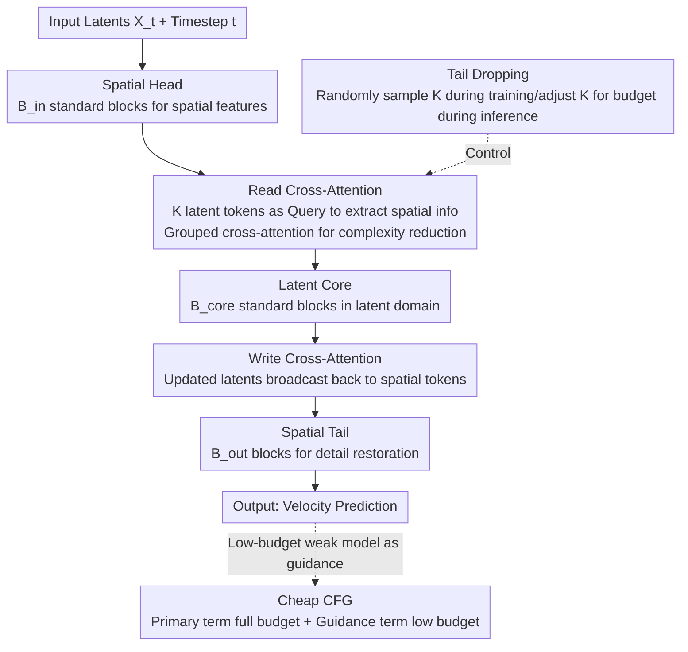

# One Model, Many Budgets: Elastic Latent Interfaces for Diffusion Transformers

**Conference**: CVPR2026  
**arXiv**: [2603.12245](https://arxiv.org/abs/2603.12245)  
**Code**: [snap-research/elit](https://snap-research.github.io/elit)  
**Area**: Image Generation  
**Keywords**: Diffusion Transformer, Elastic Inference, Latent Interface, Adaptive Computation, Multi-budget Model, Cross-attention

## TL;DR

Ours proposes ELIT (Elastic Latent Interface Transformer), which inserts a variable-length latent interface and lightweight Read/Write cross-attention layers into DiT. This enables a single model to dynamically adjust the computational budget during inference while non-uniformly allocating computation to harder regions of an image, achieving up to a 53% reduction in FID on ImageNet 512px.

## Background & Motivation

1.  **Computational Rigidity of DiT**: The FLOPs per step in a Diffusion Transformer are fixed as a function of the input resolution, preventing flexible adjustments based on latency or quality requirements.
2.  **Wasteful Uniform Computation Allocation**: DiT allocates computation uniformly across all spatial tokens, despite significant differences in generation difficulty across image regions (e.g., simple backgrounds vs. complex textures).
3.  **Zero-padding Experimental Evidence**: The authors padded images with zero-value patches to increase the token count; however, the FID of DiT-B/2-Synth did not improve. This indicates that DiT cannot transfer redundant computation to informative regions.
4.  **Limitations of Prior Work**: Masking methods (MaskDiT, MDTv2) accelerate training but still require full tokens during inference; training-free acceleration methods do not improve training efficiency; adaptive generators (FlexiDiT) still allocate computation uniformly or possess excessive complexity.
5.  **Variable-length Representations Limited to Autoencoders**: Works like FlexTok and TiTok learn variable-length representations at the encoder stage but do not extend this elasticity into the generative model itself.
6.  **RIN/FIT Deviation from DiT Architecture**: Latent token methods (RIN, FIT) can allocate computation non-uniformly but significantly alter the architecture design, hindering adoption within the mainstream DiT ecosystem.

## Method

### Overall Architecture

ELIT addresses two rigidity issues in DiT: FLOPs per step being locked by resolution and the wasteful uniform allocation of computation. The solution involves inserting a "variable-length latent interface" into a standard DiT, making the number of latent tokens $K$ an inference-time knob that determines the per-step compute. The structure consists of three stages: the input passes through a Spatial Head ($B_{\text{in}}$ blocks) to extract spatial features; the Read layer uses lightweight cross-attention to extract spatial information into $K$ latent tokens (prioritizing high-loss difficult regions); the primary computation occurs in the Latent Core ($B_{\text{core}}$ standard blocks) in the latent domain; the Write layer broadcasts updated latents back to spatial tokens; finally, the Spatial Tail ($B_{\text{out}}$ blocks) restores details and outputs velocity predictions. By adjusting $K$, the compute budget can be smoothly scaled within the same model.

### Key Designs

**1. Read/Write Cross-Attention: Bridging Spatial and Latent Domains with Symmetric Layers**

The prerequisite for elasticity is high-efficiency information exchange between spatial tokens and a variable number of latent tokens. The Read layer uses latents as Queries and spatial tokens as Keys/Values with cross-attention + MLP to "read" information into the interface; the Write layer symmetrically "writes" information back to the spatial domain. Both use pre-norm + adaLN-Zero modulation for timestep awareness and include QK normalization to stabilize training. Because only these two layers are added without changing the RF training objective or the DiT backbone, ELIT is plug-and-play for DiT/U-ViT/HDiT/MM-DiT.

**2. Grouped Cross-Attention: Reducing Complexity from $\mathcal{O}(NK)$ to $\mathcal{O}(NK/G)$**

When both the number of spatial tokens $N$ and latent tokens $K$ are large, global cross-attention becomes a bottleneck. ELIT partitions spatial tokens into $G$ non-overlapping groups (e.g., a 4×4 grid), where each group is assigned $J = K/G$ latent tokens. Cross-attention is performed only within groups, reducing complexity to $\mathcal{O}(NK/G)$. Group size matches resolution—4×4 is optimal for 256px, while 8×8 is optimal for 512px. Per-token (1×1) or full-image grouping performs worse, suggesting that appropriate locality is a useful prior.

**3. Tail Dropping: Enabling Any-Budget Elasticity via a Single Training Session**

To support multiple budgets in a single model, one cannot train for each $K$ separately. During training, ELIT samples the number of retained latent tokens $\tilde{J}$ from $\text{Uniform}\{J_{\min}, \ldots, J_{\max}\}$ per iteration and drops the tail tokens. Consequently, earlier tokens are trained more frequently, naturally forming an importance ordering—front tokens handle global structure while subsequent tokens refine details. Dropping the tail during inference allows for a smooth reduction in budget. Ablations confirm this importance ordering: tail dropping at 25% tokens yields an FID of 36.3, significantly outperforming random dropping (38.6).

**4. Cheap Classifier-Free Guidance: Leveraging Multi-Budget Capabilities for Free Guidance**

Standard CFG requires two full model passes, which is expensive. ELIT exploits its multi-budget capability by using the full budget $\tilde{J}$ for the primary term and a low budget $\tilde{J}_w$ with the null class for the guidance term. This essentially provides a "weak model" version for free, combining the benefits of AutoGuidance and CFG. This reduces inference FLOPs by approximately 33% while improving quality, without requiring additional training or handcrafted degradation models.

### Loss & Training

Ours utilizes the standard Rectified Flow loss without auxiliary losses:

$$\mathcal{L}_{\text{RF}} = \mathbb{E}_{t, \mathbf{X}_1, \mathbf{X}_0} \| \mathcal{G}(\mathbf{X}_t, t) - (\mathbf{X}_1 - \mathbf{X}_0) \|_2^2$$

where $t$ is sampled from a logit-normal distribution. To compensate for compute saved during low-budget iterations in multi-budget training, the batch size is increased from 256 to 384 to maintain comparable training FLOPs. Training lasts 500k steps (images) / 200k steps (video), with a learning rate of $10^{-4}$, 10k warmup, gradient clipping at 1.0, and EMA $\beta=0.9999$.

## Key Experimental Results

### ImageNet-1K Main Results (Table 1)

| Model | Resolution | FID↓ (–G/+G) | FDD↓ (–G/+G) | IS↑ (–G/+G) |
|------|--------|---------------|---------------|--------------|
| DiT-XL | 512px | 18.8 / 9.5 | 339.2 / 233.6 | 53.0 / 86.4 |
| ELIT-DiT MB | 512px | **10.1** / **4.5** | **164.1** / **98.2** | **88.8** / **147.0** |
| U-ViT-XL | 512px | 11.6 / 5.3 | 202.7 / 125.9 | 72.5 / 117.2 |
| ELIT-U-ViT MB | 512px | **7.7** / **3.8** | **135.8** / **83.1** | **98.0** / **159.3** |
| HDiT-XL | 512px | 13.0 / 6.0 | 260.3 / 170.5 | 69.4 / 114.2 |
| ELIT-HDiT MB | 512px | **9.6** / **4.6** | **171.2** / **106.8** | **94.7** / **154.6** |

At 512px, ELIT-MB improves FID relative to DiT/U-ViT/HDiT by **53%, 28%, and 23%** respectively.

### Main Results: Video Generation (Kinetics-700, Table 2)

| Model | FID↓ (–G/+G) | FDD↓ (–G/+G) | FVD↓ (–G/+G) |
|------|---------------|---------------|---------------|
| DiT-XL | 14.0 / 11.3 | 371.5 / 309.1 | 135.9 / 100.5 |
| ELIT-DiT | **13.3** / **10.7** | **277.4** / **222.0** | **116.5** / **90.5** |

### Ablation Study Highlights

- **Group Size**: 4×4 groups are optimal at 256px, while 8×8 is optimal at 512px; performance degrades with 1×1 (per-token) or full-image grouping.
- **Block Allocation**: For DiT-XL, the optimal configuration is 4-20-4 (head-core-tail), with ~71% of blocks in the latent core; for DiT-B, it is 3-6-3 (~67%).
- **Tail Dropping vs. Random Dropping**: Tail dropping (importance ordering) achieves an FID of 26.6, better than random dropping at 27.0; the gap widens at 25% tokens (36.3 vs 38.6).
- **Convergence Speedup**: ELIT-DiT achieves a 3.3× and 4.0× convergence speedup at 256px and 512px, respectively.
- **Large-scale Validation**: Fine-tuning Qwen-Image (MM-DiT) with 20B parameters for 120k steps, ELIT reduces FLOPs by up to 63% (~2.7× speedup), with DPG-Bench scores only dropping from 90.45 to 88.02.
- **Compatibility with TeaCache**: ELIT can be stacked with the training-free acceleration method TeaCache, obtaining extra speedup ratios comparable to DiT.
- **Model Scaling**: Superiority over DiT holds from DiT-S/4 up to DiT-XL/2; gains become more pronounced as model size increases, while overhead percentage decreases.

## Highlights

- **Minimalist Design, Plug-and-Play**: Adds only two Read/Write cross-attention layers, maintaining the RF training objective and DiT architecture; applicable across DiT, U-ViT, HDiT, and MM-DiT.
- **Inference-time Multi-budget Elasticity**: Enables a smooth quality-compute trade-off by controlling the number of latent tokens, with up to 60 budget points at 512px.
- **Adaptive Computation Allocation**: Read attention automatically focuses on high-loss regions, achieving non-uniform compute allocation as demonstrated by zero-padding experiments.
- **AutoGuidance for Free**: Multi-budget properties naturally provide a weak model version; CCFG reduces inference cost by ~33% with better quality, requiring no extra training or handcrafted degradation.
- **Significant Convergence Speedup**: ELIT-DiT increases training convergence speed by 3.3–4.0×, significantly outperforming baselines under the same training FLOPs.
- **Extensive Experimental Coverage**: Includes images (256px/512px), video (Kinetics-700), large-scale MM-DiT (20B QWEN-Image), multiple architectures, and exhaustive ablations.
- **Compelling Motivation**: Zero-padding contrast experiments elegantly demonstrate DiT's uniform compute issue, and attention map visualizations intuitively show ELIT’s compute redistribution effects.

## Limitations & Future Work

1.  **Large-scale Training from Scratch Unverified**: The Qwen-Image experiment used a fine-tuning + distillation setup; the benefits of training 20B+ models from scratch remain unclear and may face convergence challenges.
2.  **CCFG Saturation**: CCFG tends to saturate images faster than standard CFG, which might lead to over-saturation in specific scenarios.
3.  **Lack of Evaluation on Open-domain Text-to-Image**: Experiments were primarily conducted under ImageNet class-conditioning; effectiveness on text-to-image prompts requires verification.
4.  **In-step Budget Scheduling Unexplored**: Different sampling steps may require different budgets (e.g., earlier steps needing less compute), but this work uses a fixed budget per step.
5.  **Fixed Grouping Strategy**: Groups are partitioned into regular grids; content-based adaptive grouping strategies were not explored.
6.  **Parameter Overhead of Read/Write Layers**: DiT-XL parameters increased from 675M to 698M (+3.4%), which might be non-negligible for ultra-large models.
7.  **Comparison with Advanced Token Compression Missing**: Methods like Token Merging or SparseDiT may be complementary to ELIT but were not experimentally verified together.

## Related Work & Insights

| Method Category | Representative Work | Difference from ELIT |
|----------|----------|----------------|
| Adaptive Generator | FlexiDiT, Supernetwork | Uniform compute allocation / high router complexity; ELIT uses latent interfaces for non-uniform allocation |
| Token Dropping (Training) | MaskDiT, MDTv2, TREAD | Must restore full tokens at inference, no inference speedup; ELIT is variable at inference |
| Training-free Acceleration | Token Merging, SparseDiT | No improvement in training efficiency; ELIT accelerates training by 3-4× |
| Latent Interface | RIN, FIT | Deviates from DiT architecture, requires special optimizers; ELIT is plug-and-play |
| Variable-length Autoencoder | FlexTok, TiTok | Elasticity stops at the encoder; ELIT introduces elasticity into the generative model |

The core advantage of ELIT lies in its "minimal change, maximum compatibility"—no changes to the training objective, no auxiliary losses, and no special optimizers. By adding only two cross-attention layers and a tail-dropping strategy, it achieves inference elasticity and adaptive compute allocation, making it easier to integrate into the existing DiT ecosystem than previous methods.

## Rating

- Novelty: ⭐⭐⭐⭐ — Minimalist integration of variable-length latent interfaces into DiT; tail dropping for importance ordering is simple and effective.
- Experimental Thoroughness: ⭐⭐⭐⭐⭐ — Covers four architectures, two resolutions, video, 20B model, and extensive ablations.
- Writing Quality: ⭐⭐⭐⭐ — Clear motivation (convincing zero-padding experiments), clear structure, and rich visualizations.
- Value: ⭐⭐⭐⭐⭐ — Addresses core DiT inference efficiency pain points with a design simple enough for wide adoption; multi-budget inference has high practical utility.
- Overall: ⭐⭐⭐⭐⭐ — Solid work from Snap Research + Rice, combining theoretical insight (uniform compute waste) and engineering value (plug-and-play acceleration); CVPR oral level.

> **Recommended Reading**: The zero-padding experiment in Section 3.2 and the attention visualization in Figure 2 are highlights, clearly demonstrating DiT's compute waste problem and ELIT's solution.

<!-- RELATED:START -->

## Related Papers

- [\[CVPR 2026\] Just-in-Time: Training-Free Spatial Acceleration for Diffusion Transformers](just-in-time_training-free_spatial_acceleration_for_diffusion_transformers.md)
- [\[CVPR 2026\] Training-free Mixed-Resolution Latent Upsampling for Spatially Accelerated Diffusion Transformers](training-free_mixed-resolution_latent_upsampling_for_spatially_accelerated_diffu.md)
- [\[CVPR 2026\] CARE-Edit: Condition-Aware Routing of Experts for Contextual Image Editing](care-edit_condition-aware_routing_of_experts_for_contextual_image_editing.md)
- [\[CVPR 2026\] Region-Adaptive Sampling for Diffusion Transformers](region-adaptive_sampling_for_diffusion_transformers.md)
- [\[CVPR 2026\] SpotEdit: Selective Region Editing in Diffusion Transformers](spotedit_selective_region_editing_in_diffusion_transformers.md)

<!-- RELATED:END -->
