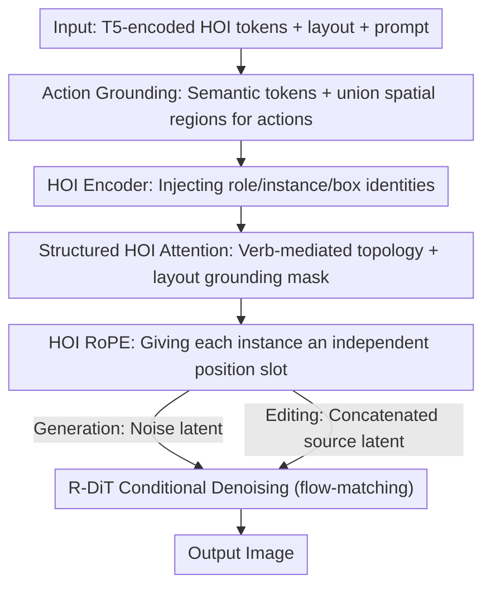

# OneHOI: Unifying Human-Object Interaction Generation and Editing

**Conference**: CVPR 2026  
**Paper**: [CVF Open Access](https://openaccess.thecvf.com/content/CVPR2026/html/Hoe_OneHOI_Unifying_Human-Object_Interaction_Generation_and_Editing_CVPR_2026_paper.html)  
**Code**: https://jiuntian.github.io/OneHOI/ (Project Page/Dataset)  
**Area**: Diffusion Models / Controllable Image Generation and Editing  
**Keywords**: Human-Object Interaction, Diffusion Transformer, Controllable Generation, Image Editing, Attention Mask

## TL;DR
OneHOI uses a Diffusion Transformer (R-DiT) to unify "HOI image generation" and "HOI image editing" into a single conditional denoising process. By explicitly modeling interaction structures through an HOI encoder, verb-mediated structured attention, and HOI-specific RoPE, it achieves SOTA results in editing, layout-controllable generation, and the newly proposed multi-HOI editing task.

## Background & Motivation
**Background**: Human-Object Interaction (HOI) is typically represented as a triplet of `<human, action, object>`. Previously, the generation side was split into two independent families: **HOI Generation** (e.g., InteractDiffusion), which synthesizes scenes from triplets and spatial layouts, and **HOI Editing** (e.g., HOIEdit, InteractEdit), which rewrites interactions in existing images using text.

**Limitations of Prior Work**: Generating models can only process "pure HOI triplets + layouts" and cannot mix HOI with entities that are "objects only, no interaction," nor do they accept arbitrary-shaped layouts. Editing models fail to decouple and recombine "pose" and "physical contact," cannot scale to scenes with multiple interactions, lack fine-grained spatial control, and rely on implicit model priors rather than explicit structural modeling.

**Key Challenge**: Although the base DiT (Diffusion Transformer) provides high image quality and strong global reasoning, it **treats scenes as a collection of independent objects**. It fails to model "how" objects interact, resulting in images with rich visual details but hollow relationships—for instance, placing a person and a skateboard correctly but failing to depict the "person riding the skateboard" relationship.

**Goal**: To bring generation and editing into a single framework while addressing full-spectrum control, including "mixed conditions, arbitrary shape masks, multi-HOI, and layout-free/layout-based" scenarios.

**Key Insight**: The authors argue that generation and editing are **two perspectives of the same conditional denoising process**. The generalized interaction semantics (pose, contact points) learned during generation can provide the structural knowledge missing in pure editing models, and joint training creates synergy. Consequently, diffusion is redefined from "arranging pixels" to "realizing relationships."

**Core Idea**: Four modules for explicit interaction structure modeling are added to a standard layout-controllable DiT baseline (Eligen) to form the Relational DiT (R-DiT). This allows the model to reason about "relationships rather than regions." A joint training strategy with modality dropout integrates generation and editing into a single denoiser.

## Method

### Overall Architecture
Given a global text prompt $P$, a set of structured interactions $\{\langle s, o, a\rangle_n\}_{n=1}^{N}$ (or just objects $\{\langle o\rangle_n\}$), and an optional layout $B=\{b^s_n, b^o_n\}$, OneHOI outputs an image realizing all specified goals. All triplets are first encoded by T5 into HOI tokens $H=\bigcup_{n}\{S_n, A_n, O_n\}$ (subject, object, and action tokens, respectively). During **Ours (Generation)**, noise $I_1$ is sampled directly in latent space for conditional denoising. During **Ours (Editing)**, the source image is encoded as latent $I_2$ and concatenated with noise $I_1$, using the same denoiser with a new interaction target. This implements "generation and editing sharing a single denoising pipeline."

The backbone is MM-DiT modified from Flux.1 Kontext, fine-tuned with LoRA. R-DiT builds on the layout-controllable baseline with four components: **Action Grounding** provides semantic and spatial anchors for actions → **HOI Encoder** injects fine-grained role/instance identities → **Structured HOI Attention** enforces interaction structure via verb-mediated attention topology and layout constraints → **HOI RoPE** separates instance identities in multi-HOI scenarios.

### Key Designs

**1. Action Grounding: Grounding the "Action," Not Just the Objects**

Standard layout-controllable models only ground the subject $S_n$ and object $O_n$ to regions $R^s_n$ and $R^o_n$, leaving the "action" without semantic or spatial awareness. OneHOI adds two action-specific cues: first, a separate T5 semantic action token $A_n$ for each action label (e.g., "feed"); second, a spatial region $R^a_n$ for the action. The **Mechanism** for defining the action region is critical: prior work like InteractDiffusion used a "between" operator (intersection of boxes, or a rectangle spanning both if they don't intersect). However, attention heatmaps revealed this strip often misses where the action token actually focuses. OneHOI uses the **union of the subject and object regions** $R^a_n = R^s_n \cup R^o_n$. The union aligns with DiT's natural attention distribution and is robust for both "overlapping" and "separated" relationships, providing a reliable grounding target for structured attention.

**2. HOI Encoder: ID Tags for "Who is Who and Which Interaction"**

In multi-HOI scenes, models often suffer from role confusion—given `<person1, chase, dog>` and `<person2, hold, cat>`, it might render "person1 holding cat" (wrong interaction) or "dog chasing person1" (swapped roles). HOI tokens $S_n, O_n, A_n$ alone are insufficient. The HOI Encoder constructs three side-signals for each role $r\in\{s,o,a\}$ and instance $n$: a learnable role embedding $e_{\text{role}}(r)\in\mathbb{R}^{64}$, a fixed sinusoidal instance embedding $e_{\text{inst}}(n)\in\mathbb{R}^{64}$, and a Fourier embedding of the box $e_{\text{box}}(b^r_n)\in\mathbb{R}^{256}$. These are concatenated with normalized tokens, passed through a small MLP, and injected via a gated residual:

$$\tilde{h}^r_n = \mathrm{MLP}\big([\mathrm{LN}(h^r_n);\, e_{\text{box}}(b^r_n);\, e_{\text{role}}(r);\, e_{\text{inst}}(n)]\big),\quad \tilde{h}^r_n = h^r_n + \tanh(\omega)\cdot \tilde{h}^r_n$$

where $\omega$ is a learnable gate. This ensures each HOI token carries fine-grained identity, preventing "leakage" between multiple interactions.

**3. Structured HOI Attention: Welding Interaction Topology into Attention via Verbs**

Standard layout conditions treat subjects and objects as independent, placing them correctly but missing the interaction structure (e.g., "correct positions, wrong relationship"). The **Core Idea** is that the action is the center of the interaction structure. OneHOI uses masks to enforce a verb-mediated topology: within a single instance, it **cuts the direct subject ↔ object link**, allowing only $S_n \to A_n$ and $O_n \to A_n$. Relationship information **must flow through the action token**. Cross-instance HOI connections ($n \neq m$) are disabled. For HOI ↔ Image grounding, when layouts are available, a mask $M^{HI}$ restricts each HOI query to its region ($S_n$ to $R^s_n$, $O_n$ to $R^o_n$, $A_n$ to $R^a_n$); all connections are open if no layout exists. The final attention aggregates these into a mask $M$:

$$\mathrm{Attn}(Q,K,V,M) = \mathrm{softmax}\!\Big(\tfrac{QK^\top}{\sqrt{d}} + M\Big)V$$

This transforms "how interactions link" from an implicit prior into an explicit attention constraint.

**4. HOI RoPE: Independent Position "Parking Spots" for Each Interaction**

Processing multiple HOIs simultaneously causes "cross-talk," where features from one instance leak into another. HOI RoPE is a position indexing scheme applied to $Q, K$ of all HOI tokens. While the image stream uses 3D RoPE, all HOI tokens belonging to instance $n$ are assigned a position index distinct from the image grid and other instances:

$$z_{\text{HOI}}(n) = (0,\, T+n,\, T+n),\quad T=\max(H,W)$$

This assigns each interaction a unique "parking spot" in RoPE space, significantly reducing interference in multi-HOI scenes.

### Loss & Training
Joint training alternates batches between generation and editing using a standard diffusion flow-matching objective. **Modality dropout** is key: during training, layouts ($p_{\text{layout}}=0.25$), HOI labels ($p_{\text{hoi}}=0.25$, triples degrade to objects only), and global text prompts ($p_{\text{txt}}=0.30$) are randomly dropped, ensuring at least one modality remains. The structured attention mask is consistently applied, reverting to unconstrained attention if the layout is dropped. This dropout allows a single model to work robustly across "layout/no-layout/arbitrary mask/mixed condition" inputs. The backbone is trained with LoRA for 10K steps, batch size 16, using AdamW (8-bit).

## Key Experimental Results

### Main Results

**Layout-free HOI Editing (IEBench, Table 1)**: OneHOI outperforms others in "Editability-Identity" and "HOI Editability," while achieving top image quality scores.

| Method | Editability-Identity | HOI Editability | PickScore | HPS | ImageReward |
|------|------|------|------|------|------|
| InteractEdit | 0.573 | 0.514 | 21.08 | 0.2640 | 0.1630 |
| Qwen Image Edit | 0.580 | 0.460 | 20.81 | 0.2585 | 0.0748 |
| **OneHOI (Ours)** | **0.638** | **0.596** | **21.26** | **0.2805** | **0.4713** |
| Gain (Relative) | +10.0% | +16.0% | +0.85% | +6.25% | +189% |
| Nano Banana (Closed) | 0.623 | 0.530 | 20.97 | 0.2544 | 0.1810 |

Note that OneHOI **surpasses the closed-source Nano Banana**. The +189% in ImageReward is due to the baseline having a negative value, making the absolute gap appear larger.

**Layout-controllable HOI Editing + HOI Generation (Tables 2, 3)**: Single HOI editing baselines combine InteractEdit+InteractDiffusion; multi-HOI editing is a new task proposed in this work. Generation is evaluated on 2000 HICO-DET targets.

| Task / Method | EI / HOI Acc. | Spatial | HOI Editability | ImageReward |
|------|------|------|------|------|
| Single HOI Edit · Baseline | 0.559 | 0.749 | 0.520 | −0.3072 |
| Single HOI Edit · **Ours** | **0.638** | **0.822** | **0.570** | **0.2897** |
| Multi HOI Edit · **Ours** (First Baseline) | 0.435 | 0.675 | 0.329 | 0.1954 |
| HOI Generation · InteractDiffusion | 0.4505 | 0.5768 | — | −0.3194 |
| HOI Generation · **Ours** | **0.4528** | **0.6104** | — | **0.5224** |

In generation, OneHOI leads in Spatial (+5.8%), HOI Accuracy (+0.5%), and ImageReward (+33.2%), showing that unification does not hurt generation but improves it.

### Ablation Study
Incremental ablation from a strong baseline BL (Eligen) by adding the four components (Table 4, HOI Gen + Multi HOI Edit):

| Configuration | HOI Acc. (Gen) | IR (Gen) | EI (Multi Edit) | IR (Multi Edit) |
|------|------|------|------|------|
| BL (Eligen) | 0.3061 | 0.3921 | — | — |
| + AG | 0.4138 | 0.3156 | 0.423 | 0.1118 |
| + Enc | 0.4254 | 0.4602 | 0.422 | 0.1306 |
| + Attn | 0.4504 | 0.4861 | 0.433 | 0.1944 |
| + HRoPE (Full) | 0.4528 | 0.5224 | 0.435 | 0.2046 |

### Key Findings
- **Action Grounding is the "0 to 1" step**: Adding AG alone jumps HOI Accuracy from 0.306 to 0.414 by providing the missing "interaction grounding" in pure object models.
- **Structured HOI Attention focuses on Correctness**: HOI Acc. and EI jump simultaneously with Attn, confirming the verb-mediated topology as the key to correct relationships.
- **HOI Encoder / HRoPE focus on Quality**: They mainly boost ImageReward (role cues improve pose plausibility; RoPE resolves multi-instance entanglement).
- **Component Complementarity**: In prompts like "holding + petting bird," only the full suite renders both actions correctly; without HRoPE, the two actions merge into one.

## Highlights & Insights
- **Generation ↔ Editing as Two Sides of One Denoising Process**: Proving synergy between the two tasks (generation priors boost editing robustness) is a stronger argument for unification than simple multi-tasking.
- **Hardcoding "Interaction Grammar" via Attention Masks**: Forcing information flow through action tokens via S ↔ O disconnection turns abstract relationship structures into executable attention constraints. This "verb-mediated" logic is transferable to any relationship-controllable generation.
- **Union Action Area > Between Operator**: This insight from heatmap analysis is a small but robust design improvement over prior work.
- **HOI-Edit-44K Dataset**: Built via a dual validation pipeline (PViC for HOI correctness + DINOv2 cosine similarity >0.75 for identity) that filtered ~90% of candidates. This "Synthesis-Detection-Identity" pipeline is reusable for other data-scarce editing tasks.
- **First Multi-HOI Editing Capability**: Established the MultiHOIEdit benchmark, setting a baseline for future work.

## Limitations & Future Work
- Multi-HOI editing scores remain significantly lower than single HOI (EI 0.435 vs 0.638), showing that editing multiple interactions simultaneously remains an unsolved "hard nut."
- Metrics (HOI correctness, spatial scores, dataset validation) rely heavily on a single HOI detector (PViC), meaning its detection ceiling limits the evaluation.
- Relative gains in ImageReward appear inflated when baselines are negative; absolute gaps are more reliable.
- The method is coupled with the Flux.1 Kontext / Eligen MM-DiT ecosystem; adapting to other backbones requires re-mapping masks and RoPE.
- Data synthesis relies on Flux.1 and InteractEdit, which may inherit distributional biases from the underlying generators.

## Related Work & Insights
- **vs InteractDiffusion**: It generates HOI from triplets but uses the "between" operator and treats generation/editing separately. OneHOI uses union regions, unifies tasks, and supports multi-HOI, outperforming it in generation.
- **vs HOIEdit / InteractEdit**: These pure editing models fail to decouple pose/contact and lack multi-interaction support. OneHOI uses generation-learned pose/contact semantics + structured attention to achieve superior results.
- **vs Eligen / GLIGEN / MIGC (Object-level Control)**: They place entities precisely but fail at "relationships" (e.g., person and phone are present but not texting). OneHOI's verb-mediated attention fixes this discrepancy.
- **vs Flux.1 Kontext / Qwen Image Edit (General Editors)**: These lack explicit HOI knowledge and often misrender poses or contacts. OneHOI outperforms them, including closed-source models.

## Rating
- Novelty: ⭐⭐⭐⭐⭐ First to unify HOI generation/editing into one denoiser and pioneer multi-HOI editing with targeted module designs.
- Experimental Thoroughness: ⭐⭐⭐⭐ Broad coverage of tasks and baselines with clear ablation; however, reliance on a single detector and negative baseline scaling are noted.
- Writing Quality: ⭐⭐⭐⭐ Motivation for unification is clear, and diagrams for masks/RoPE are helpful; some symbol noise throughout.
- Value: ⭐⭐⭐⭐⭐ Proposing a unified framework, reusable "verb-mediated attention," and providing the HOI-Edit-44K dataset significantly advances relationship-controllable generation.

<!-- RELATED:START -->

## Related Papers

- [\[CVPR 2026\] ViHOI: Human-Object Interaction Synthesis with Visual Priors](vihoi_human-object_interaction_synthesis_with_visual_priors.md)
- [\[CVPR 2026\] HP-Edit: A Human-Preference Post-Training Framework for Image Editing](hp-edit_a_human-preference_post-training_framework_for_image_editing.md)
- [\[CVPR 2026\] Refaçade: Editing Object with Given Reference Texture](refacade_editing_object_with_given_reference_texture.md)
- [\[CVPR 2026\] EgoFlow: Gradient-Guided Flow Matching for Egocentric 6DoF Object Motion Generation](egoflow_gradient-guided_flow_matching_for_egocentric_6dof_object_motion_generati.md)
- [\[CVPR 2026\] Cross-Axis Feature Fusion with Joint-Wise Motion Difference Prediction for Text-Based 3D Human Motion Editing](cross-axis_feature_fusion_with_joint-wise_motion_difference_prediction_for_text-.md)

<!-- RELATED:END -->
