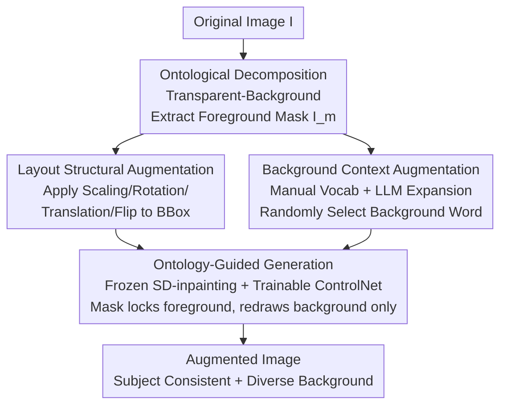

# OntoAug: Rethinking Generative Data Augmentation via Ontology Guidance

**Conference**: CVPR 2026  
**Paper**: [CVF Open Access](https://openaccess.thecvf.com/content/CVPR2026/html/Wang_OntoAug_Rethinking_Generative_Data_Augmentation_via_Ontology_Guidance_CVPR_2026_paper.html)  
**Code**: None  
**Area**: Diffusion Models / Generative Data Augmentation  
**Keywords**: Data Augmentation, Diffusion Models, Foreground-Background Decoupling, Ontological Consistency, Fine-grained Classification

## TL;DR
OntoAug explicitly decomposes an image into an "ontological foreground" and an "incidental background." It utilizes a foreground mask to constrain the diffusion model to redraw only the background, while applying layout-level geometric transformations to the foreground and pairing it with diverse background prompts. This approach significantly enhances sample diversity while maintaining semantic stability, leading across fine-grained classification, few-shot learning, WSOL, and VLM reasoning tasks.

## Background & Motivation
**Background**: Data augmentation is a standard component for improving image recognition. Early methods (Mixup, CutMix, and their variants) generated samples through pixel interpolation or region replacement. Recently, with the rise of diffusion models, generative augmentation (DiffuseMix, SaSPA, Diff-Mix, De-DA, etc.) has become mainstream, capable of synthesizing high-quality, semantically plausible new images.

**Limitations of Prior Work**: Most existing generative augmentation methods treat the image as a **whole**, failing to recognize that the distribution of discriminative information is **non-uniform**. In classification tasks, the foreground subject carries much richer category signals than the background. Holistic processing leads to three typical failures (summarized as Q1/Q2/Q3): Cross-category diffusion in Diff-Mix often alters the color and texture of the subject, producing counterfactual samples (violating **Q1 Ontological Semantic Consistency**); DiffuseMix uses fixed text prompts and SaSPA uses edge constraints, compressing the generation space and resulting in mere style variations (limiting **Q2 Background Diversity**); De-DA directly overlays foreground pixels onto cross-category backgrounds, causing incoherent boundary semantics (violating **Q3 Overall Harmony**).

**Key Challenge**: A trade-off exists between diversity and semantic fidelity—increasing contextual variation often changes the subject's identity, while conservatively preserving the original structure limits diversity. Existing methods struggle to balance Q1, Q2, and Q3.

**Key Insight**: The authors draw on ontological principles of human perception—category recognition primarily relies on the **stable essence** of the subject, with a natural tolerance for changes in background and environment, provided the overall composition is harmonious. In a "sports car" image, the car itself is the ontological part, while the road is the incidental part.

**Core Idea**: Explicitly distinguish between the **ontological foreground** and the **incidental background**. By using a foreground mask as a hard constraint, the diffusion model is forced to redraw only the background regions. Applying only layout-level geometric transformations to the foreground ensures Q1 is locked, Q2 is expanded, and Q3 is guaranteed through generative inpainting.

## Method
### Overall Architecture
The goal of OntoAug is to introduce diverse background contexts while preserving the foreground subject. The pipeline consists of two stages: **Ontological Decomposition** (splitting the image into foreground/background) and **Ontology-Guided Generation** (applying layout transformations to the foreground, replacing background words, and using a diffusion model to inpaint the final image). The input is an original image $I$, and the output is a set of augmented images that are subject-consistent, background-diverse, and globally harmonious (generating 4 images per original by default).

### Key Designs

**1. Ontological Decomposition: Physical separation of discriminative and environmental signals**

Addressing the pain point that holistic processing ignores non-uniform information distribution, OntoAug first splits image $I$ into two non-overlapping parts: $I = I_{onto} \cup I_{incid}$, where $I_{onto} \cap I_{incid} = \emptyset$. Here, $I_{onto}$ is the ontological part carrying core semantics (e.g., the car), and $I_{incid}$ is the incidental part reflecting the environment (e.g., the road). Implementation-wise, the Transparent-Background segmentation model $S(\cdot)$ extracts the foreground mask $I_m = S(I)$, marking pixels that best represent the category. This module is replaceable with saliency methods, SAM, or Grounded-SAM. This step is the prerequisite for "locking the foreground while opening the background."

**2. Layout Structural Augmentation: Changing "placement" without altering "appearance"**

Unlike other methods that modify foreground style or perform direct editing, OntoAug applies **only layout-level changes** to the ontological part. This creates spatial diversity while strictly maintaining subject identity. Specifically, it identifies the minimum bounding box $O_I, O_{I_m} = \text{MinBBox}(I_m)$ to constrain transformations and prevent structural loss. Then, the layout module $LM(\cdot)$ applies four geometric operations **synchronously** to $O_{I_m}$ and $O_I$: scaling (L1), rotation (L2), translation (L3), and horizontal flipping (L4), resulting in $O_{I_m}', O_I' = LM(O_{I_m}, O_I)$. Random combinations of these operations simulate diverse spatial layouts while keeping texture and color identical.

**3. Background Context Augmentation: Semantic diversity through structured background vocabulary**

The background is defined as the incidental part of the image, serving as the primary source of diversity. The authors construct a rich background vocabulary $V_{bg}$ by using large vision-language models to extract representative words from datasets like Stanford Cars, Aircraft, and CUB, covering natural environments, traffic scenes, and human activities. Words that might appear in the foreground (e.g., "bridge") are excluded in favor of purely descriptive background words (e.g., "sky"). LLMs (DeepSeek-V3) are then used for semantic expansion. During generation, a word is randomly sampled from $V_{bg}$ to construct a prompt: "An image of \<Class\> with the background of \<Background word\>."

**4. Ontology-Guided Generation: Using masks to "weld" the foreground**

This generation module utilizes a **frozen Stable Diffusion v2-inpainting** backbone coupled with a **trainable ControlNet**. The transformed $O_{I_m}'$, $O_I'$, and the selected background word are fed into the model. Denoising occurs **only in the background region**, as the mask acts as a strong constraint to keep foreground content unchanged throughout the process. Since the background is "filled in" naturally via diffusion inpainting rather than pixel-pasting, the boundaries are inherently harmonious (addressing Q3), avoiding the semantic breakage seen in De-DA.

## Key Experimental Results

### Main Results
Fine-grained Classification (ResNet-50 trained from scratch for 300 epochs, Top-1 Accuracy %):

| Dataset | Ours (OntoAug) | Prev. SOTA | Gain |
|---------|----------------|------------|------|
| CUB | **84.62** | Diff-Mix 81.62 | +3.00 |
| Stanford Cars | **94.29** | De-DA 93.04 | +1.25 |
| Aircraft | **87.91** | Diff-Mix 85.84 | +2.07 |

Cross-task generalization: On ViT-B/16, CUB/Cars/Aircraft reached 90.78/95.67/86.23 (avg. +1.86). CUB 10-shot few-shot averaged 67.55%, 13.88% higher than the runner-up. WSOL on IoU30/50/70 reached 92.94/60.54/12.68, outperforming CAM baselines. Waterbirds cross-distribution averaged 74.82%, 1.75% higher than De-DA. VLM Reasoning (Qwen2.5-VL-3B + GRPO, CUB 8-shot) reached 66.24%, superior to all comparison methods.

### Ablation Study
Incremental layout strategies (on top of "Background Augmentation" baseline of 81.53%, CUB):

| Configuration | CUB | Description |
|---------------|-----|-------------|
| baseline (Background Aug Only) | 81.53 | No layout transformation |
| +L1 Scaling | 83.91 | Single op +2.38 |
| +L1~L4 All | **84.62** | Full geometric ops, best |

Overall harmony strategy ablation (Figure 5, ResNet-50 / CUB):

| Exp | Layout / Background | Accuracy | Conclusion |
|-----|---------------------|----------|------------|
| A | Original / Original | 65.50 | No augmentation |
| C | Aug / Places Real BG | 77.17 | Real image background |
| E | Aug / Generated BG | **84.62** | Full Model |

### Key Findings
- **Foreground layout contributes significantly**: Comparisons of A→B and D→E show that introducing foreground layout transformations significantly boosts performance; scaling (L1, +2.38) and flipping (L4, +2.22) provide the largest gains.
- **Generated Background > Real Background**: Experiment E (84.62) significantly outperforms Experiment C (77.17), suggesting that the foreground-background harmony provided by diffusion inpainting is more valuable than "pasting real images."
- **Data scarcity increases benefit**: For 10-shot, OntoAug's gain is +35.76 (vs. Vanilla), far exceeding competitors, proving high-quality diverse samples help most in low-data regimes.
- **Richer background vocabulary enhances robustness**: OntoAug (full vocab 74.82) is superior to OntoAug* (habitat-only words 73.48), proving background prompt diversity improves robustness to background shifts.

## Highlights & Insights
- **Translating "Ontology" into executable engineering constraints**: The human intuition of "identifying subjects, tolerating backgrounds" is implemented as a hard constraint of "mask-locked foreground + diffusion-modified background," directly solving the Q1/Q2/Q3 trilemma.
- **Effective division of labor**: Foreground handles geometric changes while background handles semantic redrawing. This keeps discriminative signals stable while placing diversity where it does not affect category identity.
- **Inpainting naturally handles boundary harmony**: Using diffusion inpainting instead of pixel-pasting provides free boundary transitions, avoiding the semantic fracture issues of methods like De-DA.
- The framework is transferable to any scenario where the subject is stable but the context is variable (e.g., medical imaging preserving lesions while changing backgrounds).

## Limitations & Future Work
- **Dependency on segmentation quality**: Foreground masks are provided by Transparent-Background. Failure in segmentation (entangled foreground/background, transparency, fine structures) directly pollutes the subsequent constraints.
- **Limits of the "Ontology = Foreground" assumption**: When category semantics actually depend on context (e.g., scene classification, relationship recognition), the premise of "locking the foreground" may fail.
- **Generation Cost**: Generating 4 samples per image via diffusion denoising is computationally expensive compared to zero-cost methods like Mixup/CutMix.
- **Vocabulary dependency**: Background word construction relies on manual effort + LLMs; its appropriateness may need re-validation when migrating to entirely new domains.

## Related Work & Insights
- **vs. Diff-Mix**: Diff-Mix performs cross-category diffusion to enrich boundaries but often alters subject texture, requiring CLIP filtering; OntoAug uses masks to lock the foreground for stable semantics without post-filtering.
- **vs. DiffuseMix**: DiffuseMix relies on fixed prompts and style overlays; OntoAug uses structured background vocabularies for semantic-level background combinations.
- **vs. SaSPA**: SaSPA uses edge conditions to preserve semantics but severely compresses the generation space; OntoAug balances fidelity and diversity by locking the foreground while freeing the background.
- **vs. De-DA**: De-DA decouples foreground and background but suffers from boundary breakage; OntoAug's inpainting ensures natural transitions.

## Rating
- Novelty: ⭐⭐⭐⭐ Translates ontological perspective into a decoupled augmentation paradigm; clear but essentially an extension of foreground-background decoupling.
- Experimental Thoroughness: ⭐⭐⭐⭐⭐ Covers seven task types including fine-grained, transfer, ViT, few-shot, WSOL, cross-distribution, and VLM.
- Writing Quality: ⭐⭐⭐⭐ The Q1/Q2/Q3 framework clarifies motivation well; diagrams are intuitive.
- Value: ⭐⭐⭐⭐ Plug-and-play with stable gains across tasks, especially significant in few-shot scenarios; high practicality.

<!-- RELATED:START -->

## Related Papers

- [\[NeurIPS 2025\] UtilGen: Utility-Centric Generative Data Augmentation with Dual-Level Task Adaptation](../../NeurIPS2025/image_generation/utilgen_utility-centric_generative_data_augmentation_with_dual-level_task_adapta.md)
- [\[CVPR 2026\] Transition Models: Rethinking the Generative Learning Objective](transition_models_rethinking_the_generative_learning_objective.md)
- [\[ICLR 2026\] Pseudo-Nonlinear Data Augmentation: A Constrained Energy Minimization Viewpoint](../../ICLR2026/image_generation/pseudo-nonlinear_data_augmentation_a_constrained_energy_minimization_viewpoint.md)
- [\[CVPR 2026\] AHS: Adaptive Head Synthesis via Synthetic Data Augmentations](ahs_adaptive_head_synthesis.md)
- [\[NeurIPS 2025\] Non-Asymptotic Analysis of Data Augmentation for Precision Matrix Estimation](../../NeurIPS2025/image_generation/non-asymptotic_analysis_of_data_augmentation_for_precision_matrix_estimation.md)

<!-- RELATED:END -->
