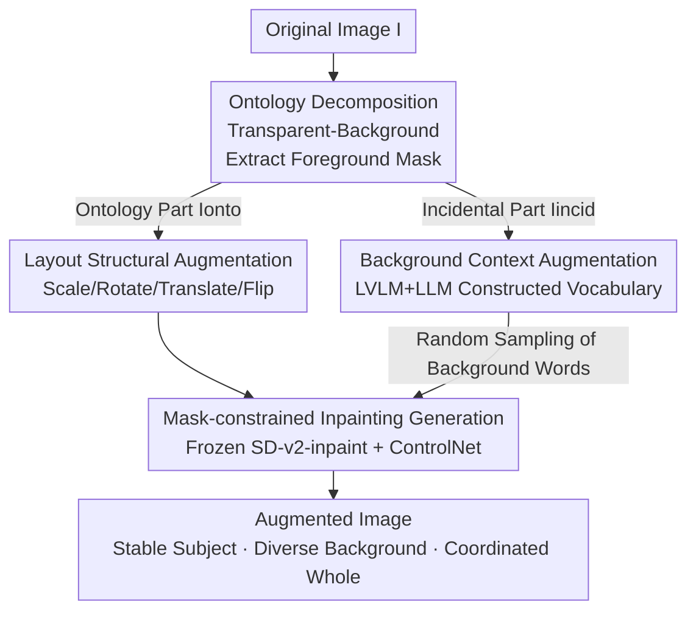

# OntoAug: Rethinking Generative Data Augmentation via Ontology Guidance

**Conference**: CVPR 2026  
**Paper**: [CVF Open Access](https://openaccess.thecvf.com/content/CVPR2026/html/Wang_OntoAug_Rethinking_Generative_Data_Augmentation_via_Ontology_Guidance_CVPR_2026_paper.html)  
**Keywords**: Generative Data Augmentation, Ontology Guidance, Diffusion Models, Foreground-Background Decoupling, Fine-grained Classification

## TL;DR
OntoAug explicitly decomposes an image into the "ontology part" (foreground subject) and the "incidental part" (background). It uses the foreground mask as a hard constraint for diffusion inpainting to modify only the background while keeping the subject unchanged. Combined with geometric layout transformations and a background vocabulary expanded by LVLM/LLMs, it simultaneously achieves "subject stability, background diversity, and overall coordination," reaching SOTA performance on fine-grained classification, few-shot learning, WSOL, and VLM reinforcement fine-tuning.

## Background & Motivation
**Background**: Data augmentation is standard for improving image recognition. Traditional methods (Mixup, CutMix, etc.) create samples via pixel interpolation or region replacement. Recently, with the maturity of diffusion models, generative augmentation (Diff-Mix, DiffuseMix, SaSPA, De-DA) has become mainstream, synthesizing samples with higher image quality and semantic plausibility.

**Limitations of Prior Work**: In classification tasks, the distribution of discriminative information is **uneven**—the foreground subject carries much richer category signals than the background. However, most generative augmentation methods treat the image as a single entity without distinguishing foreground from background. This results in "unexpected semantic drift" during synthesis: cross-class diffusion in Diff-Mix can alter the subject's texture/color, creating counterfactual samples; DiffuseMix uses fixed text prompts, limiting it to style changes; SaSPA uses edge constraints for fidelity but restricts the generation space, limiting background diversity; De-DA simply pastes foreground pixels onto other backgrounds, leading to incoherent boundary semantics.

**Key Challenge**: Increasing background diversity often compromises subject identity, while preserving subject structure limits diversity—this is the fundamental trade-off between "fidelity vs. diversity." The authors refine this into three competing demands: Q1 subject semantic consistency, Q2 background semantic diversity, and Q3 overall foreground-background coordination. No existing method satisfies all three.

**Key Insight**: Human category recognition works exactly this way—subject identity remains stable, and variations in the background environment are tolerated as long as the whole is coordinated. The authors incorporate this "ontology" intuition into generative augmentation: what truly defines a category in an image is the subject ontology, while the background is merely incidental.

**Core Idea**: First, decompose the image into ontology and incidental parts. Use the foreground mask as a hard constraint to let the diffusion model **inpaint only the background**. The ontology region only allows layout-level (scale/rotate/translate/flip) geometric changes, while the background is diversified using a universal vocabulary—satisfying Q1, Q2, and Q3 simultaneously.

## Method

### Overall Architecture
OntoAug addresses how to diversify backgrounds without damaging the subject during generative augmentation. The pipeline consists of two stages: **Ontology Decomposition**, which splits the image into the foreground ontology $I_{onto}$ and the incidental background $I_{incid}$; and **Ontology-Guided Generation**, which applies geometric layout transformations to the ontology and randomly samples a background semantic from a vocabulary. Finally, the augmented foreground mask and background prompt are fed into a frozen diffusion inpainting model to denoise only the background region. The ontology pixels are locked by the mask. The resulting image maintains the original subject identity with a diverse layout and a new, coordinated background.

### Key Designs

**1. Ontology Decomposition: Separating the "Category-Defining Part" from the Background**

The pain point is that holistic generation modifies the entire image indiscriminately, even altering discriminative details of the subject. OntoAug acknowledges that different pixels have different semantic functions: one set carries core category features (e.g., the car in "sports car"), while the other reflects the environment (e.g., the road). Thus, the image $I$ is explicitly decomposed into two non-overlapping parts:

$$I = I_{onto} \cup I_{incid}, \quad I_{onto} \cap I_{incid} = \emptyset$$

In practice, a Transparent-Background segmentation model $S(\cdot)$ is used to extract the foreground mask $I_m = S(I)$ to define the ontology region. This module is replaceable (e.g., with SAM or Grounded-SAM). This step is the foundation for all subsequent constraints: only by knowing "where the subject is" can one "change only the background."

**2. Layout Structural Augmentation: Subjects Can Move, but Not Morph**

Locking the subject purely in place lacks spatial diversity—in real scenes, objects appear at different positions, angles, and scales. OntoAug simulates diverse spatial layouts for foreground objects while maintaining semantic consistency. Specifically, it computes the minimum bounding box for the foreground in both the mask and the image:

$$O_{I}, O_{I_m} = \text{MinBBox}(I_m)$$

The MinBBox constrains subsequent transformations to prevent the foreground from exceeding image boundaries or losing structure. Geometric operations—Scaling (L1), Rotation (L2), Translation (L3), and Horizontal Flipping (L4)—are applied synchronously:

$$O_{I_m}', O_{I}' = LM(O_{I_m}, O_{I})$$

Since the ontology regions of the mask and the original image are transformed **synchronously**, the mask precisely aligns with the subject after transformation. This differs fundamentally from methods that change style or content: the ontology undergoes only geometry-only changes, keeping texture, color, and identity intact (meeting Q1).

**3. Background Context Augmentation: Exploiting Background Semantic Potential via a Universal Vocabulary**

Existing backgrounds often lack diversity due to fixed prompts or edge constraints. OntoAug treats the background as an incidental dimension that should be as diverse as possible, constructing a rich background vocabulary $V_{bg}$. Representative background words are extracted from datasets like Stanford Cars, Aircraft, and CUB using LVLMs. Words that might appear in the foreground (e.g., "bridge") are excluded to favor pure background terms (e.g., "sky"). LLMs then perform semantic expansion. During generation, a word is sampled from $V_{bg}$ to construct a prompt: `"An image of <Class> with the background of <Background word>"`. Crucially, this vocabulary is **universal rather than dataset-specific**, alleviating background bias (as verified in Waterbirds OOD experiments).

**4. Mask-constrained Inpainting Generation: Coordinated Background Synthesis**

This step "sews" the stable ontology and the new background together. OntoAug adopts the PBG framework, utilizing a **frozen** Stable Diffusion v2-inpainting backbone integrated with a **trainable** modified ControlNet. The transformed ontology control regions $O_{I_m}', O_{I}'$ are fed in to guide denoising, ensuring generation occurs **only in the background region**. A CFG scale of 7.5 is used to generate 4 samples per image. The mask acts as a strong constraint to fix foreground content, while the foreground image input allows the model to naturally melt the subject into the new environment, reducing boundary artifacts (meeting Q3). This "redrawing around the subject" ensures natural boundary transitions.

### A Complete Example
Using an image of a "Yellow-throated Vireo": ① Ontology decomposition extracts the bird's foreground mask (Bird = Ontology, original branch = Incidental); ② Layout augmentation applies random transformations (e.g., scaling + flipping) to the bounding box—the bird's texture remains the same, but its pose/position changes; ③ A background word "branch" is sampled to form the prompt: `"An image of Yellow_throated_Vireo with the background of branch"`; ④ The transformed mask + prompt are sent to the frozen SD-inpainting. The model redraws the background outside the mask, producing a "same bird, new pose, new coordinated background" sample.

## Key Experimental Results

### Main Results
ResNet-50 trained from scratch for 300 epochs on Fine-Grained Visual Categorization (FGVC):

| Dataset | Vanilla | Best Gen Baseline | OntoAug | Gain vs. Best |
|--------|---------|--------------|---------|--------------|
| CUB | 65.50 | Diff-Mix 81.62 | **84.62** | +3.00 |
| Cars | 85.52 | De-DA 93.04 | **94.29** | +1.25 |
| Aircraft | 80.29 | Diff-Mix 85.84 | **87.91** | +2.07 |

Under transfer learning (ResNet-50 pre-trained on ImageNet-1K), it also outperforms the previous SOTA Diff-Mix and achieves further gains when combined with classic Mix methods:

| Configuration | CUB | Cars | Aircraft |
|------|-----|------|----------|
| Vanilla | 85.49 | 93.04 | 91.07 |
| Diff-Mix | 86.42 | 91.87 | 92.26 |
| Ours (OntoAug) | **88.33** | **94.34** | **92.89** |
| Ours+SnapMix | **88.97** | **94.80** | **94.46** |

The gap is most pronounced in Few-Shot scenarios (CUB 10-shot, avg. of 3 backbones):

| Method | Avg. Accuracy | Gain vs. Vanilla |
|------|-----------|-------------------|
| Vanilla | 31.79 | — |
| Diff-Mix | 44.32 | +12.53 |
| De-DA (Runner-up) | 53.67 | +21.88 |
| **Ours (OntoAug)** | **67.55** | **+35.76** |

OntoAug outperforms the second-best De-DA by **13.88%**, showing that "stable subject + diverse background" samples are vital when data is extremely scarce. It also achieves SOTA on WSOL (avg. 55.39), Waterbirds OOD (avg. 74.82), and Qwen2.5-VL-3B GRPO reinforcement fine-tuning (66.24).

### Ablation Study
Incremental layout strategy gains on CUB (added to background augmentation):

| Configuration | CUB | Note |
|------|-----|------|
| Background Aug only | 81.53 | Baseline |
| + L1 Scaling | 83.91 | +2.38, Max single gain |
| + L2 Rotation | 83.06 | +1.53 |
| + L3 Translation | 82.29 | +0.76, Min single gain |
| + L4 Flipping | 83.75 | +2.22 |
| L1+L2+L3+L4 (Full) | **84.62** | Optimal synergy |

Overall coordination strategy ablation (ResNet-50/CUB): Original 65.50 → (Places real background only) 71.90 → (Generative background) 77.17 → (Original layout + Generative background) 81.53 → (Augmented layout + Generative background, Full version) **84.62**.

### Key Findings
- **Scaling contributes most (+2.38), translation least (+0.76)**, but the synergy of all four (84.62) is significantly higher than any single one, indicating spatial diversity requires multiple geometric overlays.
- **Generative Background > Real Sampled Background**: Experiment E (Generative background 81.53) outperforms Experiment C (Places real background 77.17), proving that backgrounds coordinated by the diffusion model are more beneficial than raw pasting—validating Q3.
- **Gain is most dramatic in Few-Shot (+35.76)**, far exceeding transfer learning gains (~2-3); the scarcer the data, the higher the marginal value of high-fidelity, high-diversity samples.
- **Universal vocabulary improves robustness**: The full version (74.82) on Waterbirds outperforms a restricted version using only habitat words (73.48), showing diverse vocabularies stabilize against background shifts.
- **Diminishing returns on data volume**: Performance peaks at 4x synthetic multiplier; OntoAug at 4x outperforms Diff-Mix at 5x and DiffuseMix at 10x, achieving a win-win in cost and effect.

## Highlights & Insights
- **Operationalizing the philosophical concept of "Ontology" into an engineering constraint**: Ontology = fixed discriminative subject, Incidental = free-to-change background. This simple intuition perfectly addresses Q1/Q2/Q3.
- **Mask as a hard constraint + background-only inpainting** effectively roots out semantic drift at the source, which is cleaner than post-hoc filtering (like CLIP in Diff-Mix).
- **Universal Background Vocabulary**: Excluding words that could confuse the foreground (e.g., "bridge") is a key detail why OntoAug is robust to background bias in OOD tasks.
- **Architecture Efficiency**: The frozen generative backbone and trainable modified ControlNet ensure low training costs and high engineering friendliness.

## Limitations & Future Work
- **Heavy reliance on segmentation quality**: Boundaries are determined by models like Transparent-Background. For blurry, multi-subject, or camouflaged targets, mask inaccuracy will directly impact generation quality.
- **Boundary of "Invariant Subject" assumption**: For some classes, background context is the discriminative cue (e.g., water bird vs. land bird). Over-diversifying backgrounds might weaken useful contextual priors.
- **Geometric-only ontology changes**: It cannot introduce plausible intra-class variations in the subject itself (e.g., deformation of bird poses or car angles), limiting diversity primarily to the background side.
- **Evaluation focus**: Results are concentrated on fine-grained tasks (FGVC/Few-shot/WSOL). Gains on large-scale general classification (ImageNet-full) or dense tasks (detection/segmentation) are yet to be fully verified.

## Related Work & Insights
- **vs. Diff-Mix**: Diff-Mix uses cross-class diffusion to enrich boundaries but yields counterfactual samples; OntoAug avoids drift via masks (CUB 84.62 vs. 81.62).
- **vs. SaSPA**: SaSPA uses edge conditions which restrict generation space; OntoAug uses masks to allow full background freedom, balancing fidelity and diversity.
- **vs. DiffuseMix**: DiffuseMix relies on fixed prompts/styles; OntoAug provides semantic and spatial diversity through its vocabulary and layout transformations.
- **vs. De-DA**: Both decouple foreground/background, but De-DA's hard pasting breaks boundary semantics; OntoAug's "redrawing around the mask" ensures natural coordination (Q3).

## Rating
- Novelty: ⭐⭐⭐⭐ Clear "Ontology vs. Incidental" perspective.
- Experimental Thoroughness: ⭐⭐⭐⭐⭐ Six task types + double ablations; complete evidence chain.
- Writing Quality: ⭐⭐⭐⭐ Clear mapping between motivation and mechanism.
- Value: ⭐⭐⭐⭐ High practical value for data-scarce fine-grained tasks.

<!-- RELATED:START -->

## Related Papers

- [\[CVPR 2026\] Accelerating Diffusion via Hybrid Data-Pipeline Parallelism Based on Conditional Guidance Scheduling](accelerating_diffusion_via_hybrid_data-pipeline_parallelism_based_on_conditional.md)
- [\[CVPR 2026\] Adaptive Data Augmentation with Multi-armed Bandit: Sample-Efficient Embedding Calibration for Implicit Pattern Recognition](adaptive_data_augmentation_with_multi-armed_bandit_sample-efficient_embedding_ca.md)
- [\[ICML 2025\] Curvature Enhanced Data Augmentation for Regression](../../ICML2025/others/curvature_enhanced_data_augmentation_for_regression.md)
- [\[CVPR 2026\] AVGGT: Rethinking Global Attention for Accelerating VGGT](avggt_rethinking_global_attention_for_accelerating_vggt.md)
- [\[ACL 2025\] Is Linguistically-Motivated Data Augmentation Worth It?](../../ACL2025/others/is_linguistically-motivated_data_augmentation_worth_it.md)

<!-- RELATED:END -->
