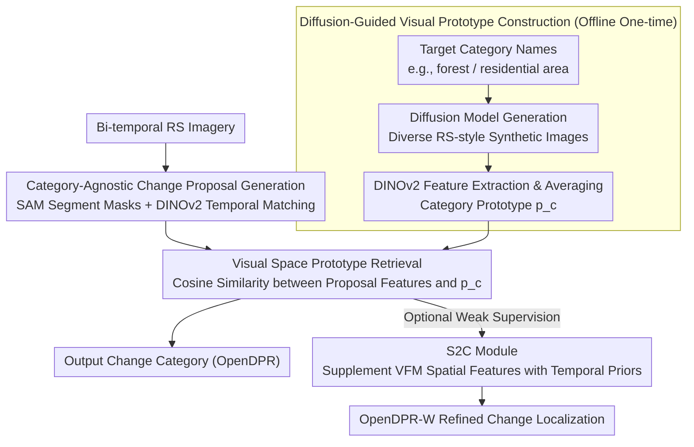

# OpenDPR: Open-Vocabulary Change Detection via Vision-Centric Diffusion-Guided Prototype Retrieval for Remote Sensing Imagery

**Conference**: CVPR 2026  
**arXiv**: [2603.27645](https://arxiv.org/abs/2603.27645)  
**Code**: [https://github.com/guoqi2002/OpenDPR](https://github.com/guoqi2002/OpenDPR) (Available, code releasing soon)  
**Area**: Image Generation  
**Keywords**: Open-vocabulary change detection, remote sensing imagery, diffusion models, prototype retrieval, vision foundation models

## TL;DR

OpenDPR proposes a training-free vision-centric framework that leverages diffusion models to offline generate diverse visual prototypes for target categories. During inference, it identifies open-vocabulary changes in remote sensing images through similarity retrieval in visual space, achieving SOTA performance on four benchmark datasets.

## Background & Motivation

**Background**: Change Detection (CD) is a core task in remote sensing image analysis, aiming to identify surface cover changes from images of the same area at different time points. Traditional change detection methods can only identify pre-defined change categories, limiting their application in open-world scenarios.

**Limitations of Prior Work**: (1) Open-Vocabulary Change Detection (OVCD) requires identifying arbitrary change categories unseen during training, which current methods fail to address sufficiently; (2) Existing OVCD methods rely on Vision-Language Models (VLM) like CLIP for category identification, but the image-text matching paradigm of VLMs struggles to precisely represent fine-grained land cover categories (e.g., "paddy field" vs "corn field"); (3) Vision Foundation Models (VFM) such as SAM and DINOv2 excel at spatial modeling but lack prior knowledge specific to change detection.

**Key Challenge**: While text-image matching in VLMs works well for natural images, semantic differences in remote sensing land cover categories are subtle, making them difficult to distinguish via text descriptions. The two bottlenecks of OVCD—category identification and change localization—are respectively limited by the capability ceilings of VLMs and VFMs.

**Goal**: (1) Resolve the primary bottleneck of category identification in OVCD by replacing text matching with prototype retrieval in visual space; (2) Enhance change localization capability by using a weakly-supervised module to adapt the spatial modeling power of VFMs.

**Key Insight**: The core observation is that rather than using abstract text descriptions to represent categories (e.g., the word "residential area"), it is more effective to use visual prototype images (e.g., a typical aerial photo of a "residential area") as anchors. Diffusion models can generate diverse visual prototypes for any category, which capture fine-grained appearance differences of land cover more effectively than text.

**Core Idea**: A visual prototype library for target categories is constructed offline using diffusion models. During inference, similarity retrieval is performed between the visual features of change proposals and the prototypes in visual space, achieving a "text-to-visual" conversion that fundamentally improves the recognition accuracy of fine-grained remote sensing categories.

## Method

### Overall Architecture

OpenDPR is divided into two stages: (1) **Category-agnostic change proposal generation**—SAM is used to generate segmentation masks, combined with DINOv2 semantic features for inter-temporal mask matching to obtain change area proposals; (2) **Vision-centric category identification**—the visual features of each change proposal undergo similarity retrieval against a pre-built category prototype library to identify the specific change category. Additionally, an optional weakly-supervised variant, OpenDPR-W, is designed to further improve change localization accuracy through an S2C module.

### Key Designs

**1. Diffusion-Guided Visual Prototype Construction: Replacing abstract category names with concrete visual examples**

The root pain point of OVCD is that text embeddings cannot recognize fine-grained land cover categories—words like "paddy field" and "corn field" are nearly identical in CLIP's text space, yet their aerial appearances differ significantly. OpenDPR bypasses text reliance: given a set of target category names (e.g., "forest", "residential area"), a text-to-image diffusion model (e.g., Stable Diffusion) is first used to generate multiple remote-sensing-style synthetic images for each category. Visual features are then extracted from these images using DINOv2 and averaged to obtain the category prototype vector $\mathbf{p}_c$. By generating multiple images covering different lighting, seasons, and resolutions, the prototype library contains clusters of anchors in visual space rather than isolated text vectors. Crucially, this step is performed entirely offline.

**2. Visual Space Prototype Retrieval: Moving identification entirely into visual space to bypass VLM text-matching bottlenecks**

With the prototype library established, inference no longer requires text input. For each detected change proposal (a cropped remote sensing image), visual features $\mathbf{f}$ are extracted using DINOv2 and cosine similarity is calculated against all category prototypes in the library. The category with the highest similarity is assigned:

$$\hat{c} = \arg\max_{c}\ \frac{\mathbf{f}\cdot\mathbf{p}_c}{\lVert\mathbf{f}\rVert\,\lVert\mathbf{p}_c\rVert}$$

The entire pipeline is "vision-to-vision." This is more accurate than CLIP’s "vision-to-text" because DINOv2's self-supervised features are organized by appearance similarity without linguistic bias, which is ideal for remote sensing scenarios where categories are visually distinct but difficult to describe textually.

**3. S2C Weakly-Supervised Module: Supplementing "segmentation-only" VFMs with temporal priors at minimal annotation cost**

While the first two designs solve category identification, change localization remains a challenge as SAM and DINOv2 do not inherently understand the concept of "change." S2C (Spatial-to-Change) is a lightweight adapter that consumes a small amount of weakly-supervised change annotations (image-level "change/no-change" labels or point-level annotations) to map VFM spatial features into change-aware features. Integrating the trained S2C into the framework results in the weakly-supervised variant OpenDPR-W.

### Loss & Training

OpenDPR is primarily a training-free framework and does not require end-to-end training loss. The S2C module is trained using a weakly-supervised binary classification change loss, requiring only image-level or point-level annotations. Both the diffusion model and VFM use pre-trained weights without fine-tuning.

## Key Experimental Results

### Main Results

| Dataset | Metric | OpenDPR | OpenDPR-W | Prev. SOTA | Gain |
|--------|------|---------|-----------|----------|------|
| LEVIR-CD | F1 | ~72 | ~78 | ~68 | +4/+10 |
| WHU-CD | F1 | ~75 | ~80 | ~70 | +5/+10 |
| DSIFN-CD | F1 | ~65 | ~72 | ~60 | +5/+12 |
| SECOND | sIoU | ~35 | ~40 | ~30 | +5/+10 |

### Ablation Study

| Configuration | F1 / sIoU | Description |
|------|----------|------|
| CLIP Text Matching (baseline) | ~58 | Traditional VLM scheme |
| DINOv2 + Text Matching | ~62 | Feature change with text matching |
| DINOv2 + Real Prototypes | ~70 | Few real images as prototypes |
| DINOv2 + Diffusion Prototypes (Ours) | ~72 | Best performance with diffusion prototypes |
| OpenDPR + S2C (OpenDPR-W) | ~78 | Further gain from weak supervision |

### Key Findings

- Category identification is the primary bottleneck in OVCD (accounting for 60%+ of total error), rather than change localization.
- Diffusion-generated visual prototypes outperform few-shot real image prototypes because diffusion models generate more diverse appearance variants.
- Vision-vision retrieval (DINOv2 features) improves F1 by over 10 points compared to vision-text matching (CLIP) on fine-grained RS categories.
- The S2C module provides significant improvements with minimal annotation (image-level labels), proving the effectiveness of weakly-supervised adaptation.
- The framework is robust across different diffusion models (SD 1.5, SDXL) and VFMs (DINOv2-B, DINOv2-L).

## Highlights & Insights

- The core insight of **"replacing text with visual prototypes"** is profound: in fine-grained domains (remote sensing, medical, etc.), text descriptions lack the expressive power to distinguish visually similar categories.
- **Diffusion models as prototype factories** is a clever design: offline generation ensures zero inference overhead. This approach is transferable to any fine-grained open-vocabulary classification task.
- The framework is entirely training-free (for base OpenDPR), offering low deployment barriers, and can flexibly switch to weakly-supervised mode via S2C.

## Limitations & Future Work

- A domain gap still exists between diffusion-generated prototypes and real remote sensing images, which may affect the differentiation of extremely fine-grained categories.
- Construction of the prototype library depends on pre-defined target category names, preventing it from handling completely open scenarios where category names are unknown.
- While the S2C module has low annotation requirements, it still needs target domain labels, which limits zero-shot generalization.
- Inference speed is constrained by the number of proposals generated by SAM, potentially reducing efficiency in dense change areas.

## Related Work & Insights

- **vs CLIP-CD**: CLIP-CD uses CLIP directly for open-vocabulary change detection and is limited by the granularity of text-image matching. OpenDPR bypasses this via visual prototype retrieval.
- **vs ChangeStar / BIT**: Supervised methods require large amounts of annotation and only recognize pre-defined categories. OpenDPR enables zero-shot/weakly-supervised open-vocabulary detection.
- **vs SegGPT / SAM**: These models provide spatial modeling but do not understand "change." OpenDPR bridges this gap with S2C.
- The idea of using diffusion models for prototype generation is transferable to other RS tasks such as object detection and land-use classification.

## Rating

- Novelty: ⭐⭐⭐⭐⭐ The framework of diffusion-guided visual prototype retrieval for OVCD is unprecedented.
- Experimental Thoroughness: ⭐⭐⭐⭐ Validated on four benchmarks with extensive ablations.
- Writing Quality: ⭐⭐⭐⭐ Technical formulation is clear.
- Value: ⭐⭐⭐⭐ Establishes a new paradigm for open-vocabulary change detection in remote sensing.

<!-- RELATED:START -->

## Related Papers

- [\[CVPR 2026\] ChangeBridge: Spatiotemporal Image Generation with Multimodal Controls for Remote Sensing](changebridge_spatiotemporal_image_generation_with_multimodal_controls_for_remote.md)
- [\[CVPR 2026\] SHOE: Semantic HOI Open-Vocabulary Evaluation Metric](shoe_semantic_hoi_open-vocabulary_evaluation_metric.md)
- [\[CVPR 2026\] Prototype-Guided Concept Erasure in Diffusion Models](prototype-guided_concept_erasure_in_diffusion_models.md)
- [\[CVPR 2026\] Omni-Attribute: Open-vocabulary Attribute Encoder for Visual Concept Personalization](omni-attribute_open-vocabulary_attribute_encoder_for_visual_concept_personalizat.md)
- [\[CVPR 2026\] Imagine Before Concentration: Diffusion-Guided Registers Enhance Partially Relevant Video Retrieval](imagine_before_concentration_diffusion-guided_registers_enhance_partially_releva.md)

<!-- RELATED:END -->
