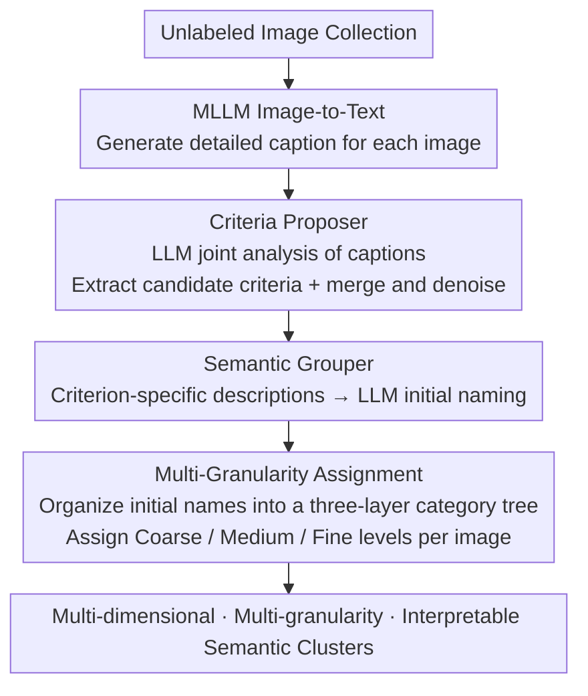

# Organizing Unstructured Image Collections using Natural Language

**Conference**: CVPR 2026 Findings  
**arXiv**: [2410.05217](https://arxiv.org/abs/2410.05217)  
**Code**: [https://oatmealliu.github.io/xcluster.html](https://oatmealliu.github.io/xcluster.html)  
**Area**: Image Generation  
**Keywords**: Open-vocabulary semantic multi-clustering, image organization, natural language, large language models, multi-granularity clustering

## TL;DR

This paper defines the new task of Open-vocabulary Semantic Multi-clustering (OpenSMC) and proposes the X-Cluster framework. It leverages MLLMs to convert images to text, then uses LLMs to automatically discover clustering criteria and semantic substructures. This organizes large-scale unlabeled image sets into multi-dimensional, multi-granular, and interpretable semantic clusters without any human prior input.

## Background & Motivation

**Background**: Image clustering is a fundamental task in machine learning. Deep Clustering (DC) methods typically generate a single partition, while Multi-Clustering (MC) methods can generate multiple partitions but require pre-defined clustering criteria and quantities. Recent Text-Conditioned Multi-Clustering (TCMC) methods utilize MLLMs for semantic clustering but still require users to pre-define the criteria.

**Limitations of Prior Work**: (1) Existing methods yield uninterpretable clustering results, providing only index labels without human-readable category names. (2) DC and MC results are often influenced by model inductive biases and hyperparameters rather than the inherent semantics of the data. (3) TCMC methods assume that users already know meaningful clustering criteria, which is often not the case for large-scale, complex datasets.

**Key Challenge**: Ideal image organization should automatically discover multiple meaningful clustering dimensions (e.g., "activity," "location," "mood") and automatically name each cluster. However, no existing vision model can reliably process a massive number of images simultaneously to perform such high-level semantic reasoning.

**Goal**: Define the OpenSMC task—given an unlabeled image collection, automatically discover multiple clustering criteria, the number and names of clusters under each criterion, and the image assignments, with all outputs expressed in natural language without human priors.

**Key Insight**: It is observed that while vision models cannot directly perform semantic reasoning on large image sets, LLMs possess powerful topic discovery and summarization capabilities in the text domain. If images are "translated" into text, LLMs can be utilized to discover clustering criteria from extensive textual descriptions.

**Core Idea**: Transform images into text proxies (captions/tags), utilize LLMs to discover clustering criteria in the text space, and then return to the visual space for image cluster assignment—text serves as the bridge connecting visual perception and semantic reasoning.

## Method

### Overall Architecture

X-Cluster aims to solve OpenSMC: given a collection of unlabeled images, the system must independently determine the classification dimensions, the number of categories per dimension, and their respective names. The difficulty lies in the fact that vision models cannot "observe" thousands of images at once for high-level semantic induction, whereas LLMs excel at discovering themes in pure text. The core mechanism of X-Cluster is a "detour via text": first, an MLLM translates each image into text, allowing the LLM to discover clustering criteria within the text space before returning to the visual space to assign categories.

The framework consists of two training-free stages. The first stage, **Criteria Proposer**, analyzes the entire image collection to output several clustering criteria (e.g., "Activity," "Location," "Mood"). The second stage, **Semantic Grouper**, organizes the images into named semantic clusters for each criterion (e.g., "Surfing," "Skateboarding" under Activity) and further provides coarse, medium, and fine granularities through a multi-granularity mechanism. Both stages offer Caption-based, Tag-based, and Image-based variants, with the Caption-based approach proving the most effective.

### Key Designs

**1. Criteria Proposer: Enabling LLMs to "see" classification dimensions in text**

The core difficulty with unlabeled image collections is the lack of "classification axes"—visual models only provide index numbers and cannot articulate why images should be grouped by "activity" versus "location." X-Cluster uses an MLLM (LLaVA-NeXT-7B) to write a detailed description $e_n = \text{MLLM}(x_n)$ for each image, transforming the visual problem into a textual one. All captions are then shuffled and fed to an LLM (Llama-3.1-8B) in batches of 400 for joint analysis to extract recurring common themes as candidate criteria $\tilde{\mathcal{R}} = \text{LLM}(\{e_n\})$. Finally, a Criteria Refinement step allows the LLM to merge semantically overlapping criteria and remove noise. The caption-based approach achieves a TPR 32.2 percentage points higher than the tag-based approach on Hard criteria sets.

**2. Semantic Grouper: Mapping criteria to named, readable clusters**

Having criteria is insufficient; images must be assigned to specific, named categories under each criterion. The Grouper first uses the MLLM to generate "criterion-specific" descriptions $e_n^l = \text{MLLM}(x_n, R_l)$, forcing the model to focus only on visual content relevant to the current criterion $R_l$. The LLM then provides an initial name $s_n^l = \text{LLM}(e_n^l, R_l)$ for each description, forming an initial name set $\mathcal{S}_{\text{init}}^l$. Since initial naming is highly divergent (e.g., yielding 203 names for "Activity"), these names must be refined and organized into a readable category system via the multi-granularity mechanism.

**3. Multi-Granularity Assignment: Capturing "unknown annotation granularity"**

In OpenSMC, the ground-truth granularity is unknown—users might want coarse categories like "Outdoor" or fine categories like "Tennis Court." X-Cluster avoids gambling on a single granularity by having the LLM organize initial names into a three-layer category tree (Multi-granularity Cluster Refinement). Each image is then assigned a category at the coarse, medium, and fine levels (Final Assignment). If a user's preferred granularity falls within these three layers, the system captures it. Experiments verify that multi-granularity refinement yields better consistency than flat refinement.

### Loss & Training

X-Cluster is entirely training-free and requires no fine-tuning. All components (LLaVA-NeXT-7B, Llama-3.1-8B, BLIP-2, CLIP ViT-L/14) use pre-trained weights. The system is driven by carefully designed structured prompts containing System Prompts, Input Explanations, Goal Explanations, Task Instructions, and Output Instructions.

## Key Experimental Results

### Main Results (Comparison with TCMC Methods)

| Method | Prior | COCO-4c CAcc/SAcc | Food-4c CAcc/SAcc | Avg CAcc/SAcc |
|------|------|----------|----------|----------|
| IC\|TC† | Criteria + #Clusters | 48.9/53.2 | 50.5/61.7 | 62.0/57.4 |
| SSD-LLM† | Criteria + #Clusters | 41.6/52.1 | 47.5/55.5 | 58.6/53.6 |
| MMaP† | Criteria + #Clusters | 33.9/- | 43.8/- | 48.2/- |
| X-Cluster (Ours) | **None** | 51.2/48.4 | 48.1/64.9 | 61.8/62.3 |

*† denotes the use of ground-truth criteria and cluster numbers.*

### Ablation Study — Multi-Granularity Refinement

| Configuration | Avg CAcc | Avg SAcc | Description |
|------|---------|---------|------|
| Initial Names | 37.1 | 49.3 | Using initial names directly |
| Flat Refinement | 46.1 | 50.5 | Single-layer refinement |
| Multi-Granularity | 61.8 | 62.3 | Multi-granularity refinement (Ours) |

### Key Findings

- Without any priors, X-Cluster's CAcc is comparable to TCMC methods that use ground-truth criteria, and its SAcc is even higher (62.3 vs 57.4), proving the feasibility of automatic criteria discovery.
- The Caption-based Proposer achieves a 75.1% TPR on the Hard criteria set, significantly outperforming Tag-based (42.9%) and Image-based (36.2%) approaches.
- The Caption-based Grouper ranked first in 10 out of 15 test criteria (by HM evaluation); its average CAcc of 59.9% is close to the CLIP zero-shot oracle's 58.1%.
- Multi-granularity refinement leads to a massive CAcc improvement (37.1 → 61.8), indicating that consistent category naming is vital for clustering.
- Sample size experiments show that complex datasets (COCO-4c) require many images to discover comprehensive criteria, while simple datasets (Card-2c) may only need one.

## Highlights & Insights

- **Defined the new OpenSMC task**, establishing clear boundaries between DC, MC, and TCMC, which is of pioneering significance.
- The core idea of **text as a reasoning proxy** is elegant: it leverages the textual reasoning capabilities of LLMs to compensate for the inability of vision models to perform global reasoning over large image sets. This "Vision → Text → Reasoning → Vision" paradigm has broad transfer value.
- Practical applications are impressive: (1) Discovering novel biases in T2I models (e.g., the association between CEOs and "dark hair"), surpassing traditional gender/race bias analysis; (2) Analyzing visual factors affecting social media image popularity.
- The framework is based entirely on open-source models (LLaVA-NeXT-7B, Llama-3.1-8B) and can be deployed locally to protect data privacy.

## Limitations & Future Work

- High computational overhead: processing COCO-4c (5,000 images) takes 7.6 hours on 4 x A100, with the primary bottleneck being per-image captioning.
- The quality of MLLM captions directly impacts performance; omissions or hallucinations may result in incomplete criteria discovery or clustering errors.
- Performance is weaker on fine-grained categories (e.g., bird species, car models), requiring integration with specialized methods like FineR.
- Semantic names of clustering results may not perfectly align with ground-truth (e.g., "Joyful" vs "Happy"), causing a systematic discount in SAcc.
- Currently supports only image data; the paper discusses extending to other modalities such as audio (Whisper), tables (TabT5), and protein structures.

## Related Work & Insights

- **vs IC|TC**: IC|TC requires user-specified criteria and counts; X-Cluster automatically discovers criteria, counts, and names.
- **vs SSD-LLM**: SSD-LLM requires the "main category" of the dataset as input; X-Cluster requires no priors.
- **vs MMaP / MSub**: Learning-based multi-clustering methods require training and produce uninterpretable results. X-Cluster is training-free and outputs natural language labels.
- **vs Topic Discovery (NLP)**: Similar to topic models in NLP but harder in vision since image semantics are implicit. X-Cluster's paradigm bridges this gap.
- The multi-granularity clustering approach may inspire other unsupervised tasks, such as hierarchical image retrieval and dataset auditing.

## Rating

- Novelty: ⭐⭐⭐⭐⭐ Defines the new OpenSMC task with an elegant, novel framework.
- Experimental Thoroughness: ⭐⭐⭐⭐⭐ Includes six benchmarks plus two new ones, three applications, and extensive ablation and appendix analyses.
- Writing Quality: ⭐⭐⭐⭐⭐ Clear task definition, rigorous logic, and exceptionally comprehensive supplementary material (60+ pages).
- Value: ⭐⭐⭐⭐⭐ Directly valuable for dataset auditing, bias discovery, and social media analysis.

<!-- RELATED:START -->

## Related Papers

- [\[CVPR 2026\] Say Cheese! Detail-Preserving Portrait Collection Generation via Natural Language Edits](say_cheese_detail-preserving_portrait_collection_generation_via_natural_language.md)
- [\[CVPR 2026\] Match-and-Fuse: Consistent Generation from Unstructured Image Sets](match-and-fuse_consistent_generation_from_unstructured_image_sets.md)
- [\[ICCV 2025\] Describe, Don't Dictate: Semantic Image Editing with Natural Language Intent](../../ICCV2025/image_generation/describe_dont_dictate_semantic_image_editing_with_natural_language_intent.md)
- [\[NeurIPS 2025\] SAO-Instruct: Free-form Audio Editing using Natural Language Instructions](../../NeurIPS2025/image_generation/sao-instruct_free-form_audio_editing_using_natural_language_instructions.md)
- [\[ECCV 2024\] NL2Contact: Natural Language Guided 3D Hand-Object Contact Modeling with Diffusion Model](../../ECCV2024/image_generation/nl2contact_natural_language_guided_3d_hand-object_contact_modeling_with_diffusio.md)

<!-- RELATED:END -->
