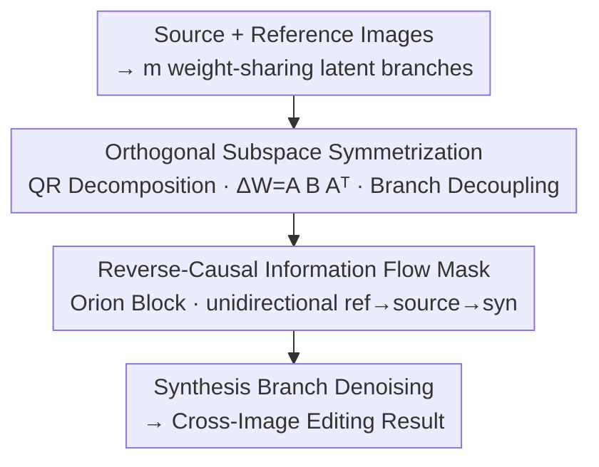

# OrionEdit: Bridging Reference and Source Images for Generalized Cross-Image Editing

**Conference**: CVPR 2026  
**Paper**: [CVF Open Access](https://openaccess.thecvf.com/content/CVPR2026/html/Jiang_OrionEdit_Bridging_Reference_and_Source_Images_for_Generalized_Cross-Image_Editing_CVPR_2026_paper.html)  
**Code**: https://github.com/cityuhkai/OrionEdit  
**Area**: Image Generation / Diffusion Models / Cross-Image Editing  
**Keywords**: Cross-image editing, orthogonal subspace decoupling, reverse-causal attention, multi-reference editing, zero-shot

## TL;DR
OrionEdit reformulates the task of "editing an image using another image" as a unified **Cross-Image Editing** paradigm. Given a source image and one or more reference images, it selectively transfers the reference visual attributes (identity, texture, style) to the source image while preserving the layout and structure of the source. It introduces **symmetric orthogonal subspace decoupling** to allocate different branches (source, reference, synthesis) into mutually non-interfering low-rank "rooms," and utilizes a **reverse-causal information flow mask** to force information to flow unidirectionally (Reference → Source → Synthesis). This enables zero-shot multi-reference editing on standard diffusion backbones, achieving open-source metrics that closely challenge closed-source models like GPT-4o.

## Background & Motivation

**Background**: Image synthesis has achieved significant progress in text-to-image (T2I) and text-guided image editing (TI2I) in recent years. However, most editing methods are still driven by **text instructions**. Describing precise attributes with words (e.g., "change to the texture of that dress" or "align with this drawing style") is often much more difficult than directly showing a reference image to the model. Thus, "editing one image using another"—guided by visual exemplars—has emerged as a more intuitive paradigm.

**Limitations of Prior Work**: Early reference-guided generation/editing was mostly limited to **single-image settings**, working on a single input image using text or spatial masks, which naturally restricts the available information. Later, multi-reference generation/editing methods emerged to align the appearance of multiple reference images, but they focus on **freely fusing** multiple reference features into a single output without explicitly addressing the task of "selectively transferring attributes from reference images to the source image." Consequently, this line of research is highly **fragmented** into isolated sub-tasks (e.g., local appearance transfer, subject replacement, style alignment) lacking a unified framework.

**Key Challenge**: Cross-image editing is more challenging than multi-image generation because different inputs emphasize **different semantics/attributes**—the source image must preserve its structure, reference images only contribute target attributes, and the synthesis branch is responsible for generation. If all branches contribute **equally** in attention (as in multi-image generation), mutual interference occurs: the source structure gets disrupted, and reference attributes contaminate each other (cross-concept interference). Therefore, a mechanism is required to both **differentiate the functional roles of branches** and **control the direction of information flow**.

**Goal**: To unify scattered sub-tasks (subject replacement, reference-guided stylization, multi-subject composition, etc.) into a single, unified "one source, multiple references" framework, enabling stable, controllable, and zero-shot attribute transfer.

**Key Insight**: The authors build upon two key observations: (1) Orthogonality is a classic approach in machine learning to promote feature decoupling. By constraining the incremental updates of different branches to **mutually orthogonal subspaces**, branches can handle their respective high-level semantics without mutual interference. (2) Cross-image editing inherently possesses a natural dependency chain (reference provides attributes → source provides structure → synthesis generates output), which can be **unidirectionally locked** using an attention mask.

**Core Idea**: By combining "symmetric orthogonal subspace decoupling" and "reverse-causal information flow masking", the **crosstalk** issue in multi-branch diffusion editing is decoupled into two controllable knobs: "which branch occupies which subspace" and "which direction does the information flow."

## Method

### Overall Architecture

OrionEdit is built upon standard diffusion editing backbones (e.g., Qwen-Image-Edit-2509, Flux-Kontext). The input consists of a source image $z_{\text{src}}$ and one or more reference images $z_{\text{ref}}^{(1)},\dots,z_{\text{ref}}^{(m-2)}$, along with a synthesis branch $z_{\text{syn}}$ for denoising generation. The objective is:

$$z_{\text{syn}} = \mathcal{F}\!\left(z_{\text{src}}, \{z_{\text{ref}}^{(i)}\}_{i=1}^{m-2}\right),$$

which represents editing the source image under the visual guidance of the reference images. Under weight-sharing $W\in\mathbb{R}^{d\times k}$, these visual inputs naturally form $m$ **latent branches** in the feature space. While allowing all branches to participate equally in attention would suffice for simple fusion, cross-image editing requires them to have **divergent functional roles**. The repository pipeline introduces two key modifications: first, allocating a **mutually orthogonal low-rank subspace** to each branch for decoupled updates, and then concatenating all branch tokens to feed into the **Orion Transformer block** with a **reverse-causal (upper-block triangular) attention mask** to enforce unidirectional information flow. Finally, the synthesis branch undergoes denoising to generate the edited output.

### Key Designs

**1. Orthogonal Subspace Symmetrization: Allocating non-interfering "rooms" for each branch**

This design addresses the issue of mutual crosstalk and gradient interference when multiple branches share weights. The authors upgrade the orthogonal mechanism—previously used in multi-concept customization—from "tuning weights for specific concepts" to an **arbitrary-task-agnostic** framework that "learns subspaces for specific branches," thereby supporting zero-shot editing. Specifically, they first sample a Gaussian matrix $M\in\mathbb{R}^{d\times mr},\ M\sim\mathcal{N}(0,1)$, and perform QR decomposition $M=QR$ to obtain a set of mutually orthogonal bases $Q=\{A^{(1)},\dots,A^{(m)}\}$, satisfying:

$$(A^{(i)})^\top A^{(j)} = 0,\quad \forall\, i\neq j.$$

Then, each branch $z^{(i)}$ is assigned a pair of $A^{(i)}$ and its transpose $(A^{(i)})^\top$, along with a **zero-initialized** low-rank matrix $B^{(i)}\in\mathbb{R}^{r\times r}$. The incremental weight update for each branch is formulated as a **symmetric projection**:

$$\Delta W^{(i)} = A^{(i)} B^{(i)} (A^{(i)})^\top,\quad A^{(i)}\in\mathbb{R}^{d\times r},\ B^{(i)}\in\mathbb{R}^{r\times r}.$$

where $A^{(i)}$ and $(A^{(i)})^\top$ act as projection and reconstruction matrices that project features into a low-dimensional space and reconstruct them back, respectively, which are **frozen throughout training**. Only the intermediate matrix $B^{(i)}$ is trainable. The authors use a vivid analogy: $A^{(i)},(A^{(i)})^\top$ act as a unique **lock** for each branch, determining access to its corresponding **room** $B^{(i)}$. Each branch captures its own incremental update $\Delta W^{(i)}$ in its own room, while the shared weight $W$ acts as a common public space for cross-branch interactions of low-level information (e.g., texture, composition, structure).

Why this is effective: Orthogonality theoretically ensures that the updates of different branches are **pairwise orthogonal**. Taking the Frobenius inner product of any two subspace increments $\Delta W_u,\Delta W_v$ expands to contain the term $A_u^\top A_v$. Since Equation (2) guarantees $A_u^\top A_v=0$, we have:

$$\langle \Delta W_u, \Delta W_v\rangle_F = \mathrm{Tr}\!\left(A_u B_u^\top (A_u^\top A_v) B_v A_v^\top\right) = 0.$$

This means that the high-level editing semantics of each branch ($z_{\text{syn}}$, $z_{\text{src}}$, and $z_{\text{ref}}$) are **processed independently** and without interference, fundamentally mitigating gradient interference and concept contamination across branches. Meanwhile, the shared weight $W$ continues to facilitate the coordination of low-level information. In ablation studies, this constraint alone increases DPG by +22.54 and Aesthetic by +0.58, serving as a primary driver for performance improvements.

**2. Reverse-Causal Information Flow Mask: Ensuring unidirectional flow of information (Reference → Source → Synthesis)**

Decoupling branches is not enough—cross-image editing must also **control the direction of information flow** to ensure that attributes from the reference and source flow into the synthesis branch in an orderly, uncontaminated manner. In standard self-attention, all tokens look at each other bidirectionally, which easily corrupts the source structure with feedback from the synthesis branch and causes mutual interference among referents. To prevent this, OrionEdit concatenates all branch tokens and feeds them into the Orion block, applying a **strict upper-block triangular** reverse-causal mask. The branches are grouped into three categories and sorted: $\mathcal{G}_1=\{\text{text \& syn}\}$, $\mathcal{G}_2=\{\text{source}\}$, and $\mathcal{G}_{3:m}=\{\text{reference}^{(1:m-2)}\}$. The mask is defined as:

$$\mathcal{M}(p,q)=\begin{cases}-\infty, & g(q)<g(p),\\ 0, & \text{otherwise},\end{cases}$$

where $g(\cdot)$ represents the group index. It permits **queries in earlier groups to attend only to keys in the same or later groups**, establishing a dependency chain $\mathcal{G}_1\!\to\!\mathcal{G}_2\!\to\!\mathcal{G}_{3:m}$, which corresponds to a **reverse information flow**: reference → source → synthesis. At the token level, this implies that: synthesis tokens can **read** (but not write back to) source and reference tokens; source tokens can read reference tokens but cannot access synthesis and text tokens; and reference branches remain **read-only** to other branches.

Specifically, a **fully hard-blocked** information flow mask is applied in shallow Transformer layers, while deep layers use a soft constraint soft-beta (default 6) to modulate the attention computation—thus establishing strict directionality in shallow layers while relaxing it in deeper layers to preserve representation capacity. Why this is effective: The ablation study shows that replacing the mask with a **random** version leads to a severe performance drop (DPG −4.44, DINO −0.045), indicating that arbitrary constraints are harmful. Conversely, the reverse-causal version yields significant gains (+18.93 DPG, +0.63 Aesthetic). Attention visualizations (Fig. 7/8) corroborate this: as diffusion progresses, the synthesis branch focuses on the **unedited regions** of the source image while only attending to the **replaceable/transferable regions** of the reference image, confirming clear directionality and preserved structural integrity.

### Loss & Training

The model is trained on 8 A100 (80GB) GPUs for 2 epochs, with a gradient accumulation of 4 steps, a batch size of 4 per GPU, and a total batch size of 128. The Orion Transformer contains two parts: standard LoRA blocks (rank 256) + Orion blocks (where $B\in\mathbb{R}^{r\times r}$ in Eq. (3) has a rank of 256). A **single-stage** training strategy is adopted to jointly optimize single-subject and multi-subject generation/editing tasks. The training dataset consists of a custom-curated 50K "reference-source-synthesis" triplets (sourced from public datasets and Nano-banana/GPT-4o synthesized pairs), with an additional 100K single-image pairs from ShareGPT-4o-Image incorporated to preserve single-image generation capabilities.

## Key Experimental Results

### Main Results

Evaluation is conducted on the self-built benchmark, **OrionEditBench**, which covers three major task families: cross-image attribute transfer, style alignment, and composition. Evaluation metrics include Aesthetic (APv2.5), DPG (semantic/instruction alignment), DINOv3 (structural/subject self-similarity), SigLip-I (image-to-image alignment), CLIP-T (image-to-text alignment), as well as Content-Pre = 0.5×(DINO+CLIP) and Style-Pre (CSD-score). The table below lists the **average** results across the three tasks (selecting representative models):

| Model | Aesthetic↑ | DPG↑ | DINOv3↑ | SigLip-I↑ | CLIP-T↑ |
|------|-----------|------|---------|-----------|---------|
| UNO | 4.83 | 39.58 | 0.596 | 0.590 | 0.199 |
| OmniGen2 | 5.59 | 59.73 | 0.770 | 0.712 | 0.216 |
| Qwen-Image-Edit (Base) | 5.39 | 66.08 | 0.746 | 0.699 | **0.294** |
| DreamOmni2 | 5.79 | 78.61 | 0.782 | 0.723 | 0.277 |
| GPT-4o (Closed-source) | 5.95 | 87.32 | 0.773 | 0.752 | 0.274 |
| **OrionEdit-qwen (Ours)** | **5.97** | 87.02 | **0.775** | **0.757** | 0.293 |
| OrionEdit-flux (Ours) | 5.85 | 81.27 | 0.756 | 0.732 | 0.282 |

OrionEdit-qwen achieves the best average performance in Aesthetic (5.97), DINOv3 (0.775), and SigLip-I (0.757). Its DPG (87.02) almost matches GPT-4o (87.32), representing a significant improvement over its base model Qwen-Image-Edit (e.g., DPG 66.08 → 87.02), validating the claim of "approaching closed-source performance on open-source backbones." Looking at sub-tasks, OrionEdit-qwen achieves top metrics in the attribute transfer sub-task (SigLip-I=0.791, CLIP-T=0.285) and matches the SOTA in the composition task (DPG=90.60, SigLip-I=0.791). Qualitative comparisons (Fig. 5 subject replacement) demonstrate that OrionEdit is more stable in maintaining identity and structural consistency, whereas Qwen-Edit often suffers from feature entanglement/identity leakage, and GPT-4o, though highly realistic, tends to alter spatial layouts.

### Ablation Study

The table below dissects the contributions of the two key components and the rank (based on OrionEdit-qwen, with $\Delta$ relative to Baseline):

| Configuration | Orthogonal Constraint $\Delta W_u^\top\Delta W_v=0$ | Attn Mask | rank(B) | Aesthetic | DPG | DINO |
|------|:---:|:---:|:---:|------|------|------|
| Baseline | ✗ | ✗ | – | 5.14 | 53.81 | 0.738 |
| + Orthogonal Constraint | ✓ | ✗ | 128 | 5.72 (+0.58) | 76.35 (+22.54) | 0.752 (+0.014) |
| + Random mask | ✗ | ✓ (random) | – | 5.27 (+0.13) | 49.37 (−4.44) | 0.693 (−0.045) |
| + Reverse-causal mask | ✗ | ✓ (rev.-causal) | – | 5.77 (+0.63) | 72.74 (+18.93) | 0.768 (+0.030) |
| Full (rank 128) | ✓ | ✓ (rev.-causal) | 128 | 5.95 (+0.81) | 83.83 (+30.02) | 0.775 (+0.037) |
| Full (rank 256) | ✓ | ✓ (rev.-causal) | 256 | **6.00 (+0.86)** | **85.24 (+31.43)** | **0.781 (+0.043)** |

### Key Findings

- **Both components are effective independently and yield additive gains**: Adding only the orthogonal constraint improves DPG by +22.54; adding only the reverse-causal mask improves DPG by +18.93. Combining them (Full rank 256) boosts DPG to 85.24 (+31.43), indicating that "decoupling branches" and "controlling flow direction" address two orthogonal issues.
- **The directionality of the mask is crucial; simply having a mask is insufficient**: The random mask degrades performance across all metrics (DPG −4.44, DINO −0.045). Only the **reverse-causal** constraint, aligned with the "reference → source → synthesis" logic, improves performance—which is the core argument of the paper.
- **Higher rank yields stable improvements**: Increasing rank(B) from 128 to 256 slightly boosts all three metrics (Aesthetic 5.95→6.00, DPG 83.83→85.24, DINO 0.775→0.781). Thus, 256 is used as the default.
- **Structure preservation relies on attention distribution**: Visualizations show that as diffusion progresses, the synthesis branch focuses on unedited regions of the source image while only attending to transferable regions of reference images, explaining the mechanism behind the improvements in DINO (structural self-similarity).

## Highlights & Insights

- **Formulating "multi-branch crosstalk" into two orthogonal knobs**: One manages "which branch occupies which subspace" (orthogonal decoupling), and the other manages "which direction information flows" (reverse-causal mask). Splitting entanglement into two independently controllable dimensions is elegant, and the ablation study shows that their contributions barely overlap.
- **Clever design of symmetric orthogonal low-rank update $\Delta W=A B A^\top$**: Freezing the orthogonal basis while training only the intermediate small matrix $B$ ensures Frobenius orthogonality between branches (with mathematical proof) while minimizing trainable parameters. This design naturally adapts to zero-shot, task-agnostic multi-reference settings and can be generalized to any LoRA-style fine-tuning scenario requiring non-interfering multi-path inputs.
- **The "locks and rooms" analogy** makes an abstract subspace mechanism highly intuitive: each branch must possess a unique lock ($A^{(i)}$) to enter its respective room ($B^{(i)}$), while the shared weight $W$ acts as a common public space. This mental model is exceptionally helpful for understanding the decoupling process.
- **Unified paradigm and a matching benchmark**: This work unifies fragmented tasks like subject replacement, style alignment, and multi-subject composition into a single "one source, multiple references" formulation, while establishing the OrionEditBench benchmark as reusable infrastructure for future cross-image editing research.

## Limitations & Future Work

- **Reliance on synthetic data for triplet construction**: A significant portion of the 50K "reference-source-synthesis" triplets is synthesized using Nano-banana/GPT-4o. The quality and distribution bias of these synthetic pairs could affect real-world generalization (this effect is not fully quantified; ⚠️ refer to the original text for exact details).
- **Evaluation relies heavily on a self-built benchmark**: OrionEditBench is custom-built by the authors; caution is advised regarding metric self-consistency when making horizontal comparisons. Additionally, some comparison models are closed-source (GPT-4o), meaning replication conditions are not fully controllable.
- **The layered mask's soft constraint is empirically set**: Applying hard blocking in shallow layers and a soft-beta of 6 in deeper layers are default hyperparameters. The paper lacks comprehensive sensitivity analysis on the optimal value of soft-beta and the transition layer for hard/soft masking.
- **Future Directions**: Exploring the expansion of the orthogonal subspace mechanism to cross-domain video/3D editing, or making the direction of information flow **learnable** rather than fixed upper-triangular to handle more complex multi-reference dependencies.

## Related Work & Insights

- **vs. Multi-image Generation (UNO / OmniGen2 / Xverse)**: These methods allow multiple reference branches to contribute **equally** in shared weight attention, freely fusing features which is suitable for "generating a novel image from scratch." In contrast, OrionEdit emphasizes **directional attribute transfer** (reference → source → synthesis) + structure preservation, making it more stable in DINO/structural consistency. This represents a fundamental difference between "fusion" and "conditional transfer."
- **vs. Text-guided Editing / Exemplar-based Editing (Paint-by-Example / Cross-Image Attention / MimicBrush)**: Prior works were mostly restricted to single-image settings or addressed only isolated sub-tasks (local appearance transfer, subject replacement, style alignment). OrionEdit unifies these three task families under a single framework and achieves zero-shot performance without per-concept weight tuning.
- **vs. Orthogonality / LoRA-style Methods**: Orthogonal constraints were previously used for multi-concept customization or preventing forgetting in PEFT. This work upgrades it from "concept-specific weight tuning" to "branch-specific subspace learning," incorporating the symmetric low-rank formulation $A B A^\top$ and Frobenius orthogonality proof. This is a highly effective transfer of an existing tool to a new scenario (multi-branch diffusion editing).

## Rating
- Novelty: ⭐⭐⭐⭐ It unifies cross-image editing into a "one source, multiple references" paradigm. The combination of orthogonal subspaces and a reverse-causal mask is elegant and theoretically grounded, though individual components are adaptions of existing techniques.
- Experimental Thoroughness: ⭐⭐⭐⭐ Relatively complete evaluation across three tasks, average performance, dual backbones, and step-by-step ablation. However, the benchmark is self-built, and some comparisons involve closed-source models, which requires a caveat for horizontal comparisons.
- Writing Quality: ⭐⭐⭐⭐ The problem analysis (Fig. 3) and the "lock/foot" analogy explain the abstract mechanisms clearly, with equations well-integrated with diagrams.
- Value: ⭐⭐⭐⭐ The unified paradigm and OrionEditBench offer infrastructural value for cross-image editing, and the method approaches closed-source performance on open-source backbones, making it highly deployment-friendly.

<!-- RELATED:START -->

## Related Papers

- [\[CVPR 2026\] The Consistency Critic: Correcting Inconsistencies in Generated Images via Reference-Guided Attentive Alignment](the_consistency_critic_correcting_inconsistencies_in_generated_images_via_refere.md)
- [\[CVPR 2026\] Refaçade: Editing Object with Given Reference Texture](refacade_editing_object_with_given_reference_texture.md)
- [\[CVPR 2026\] HiFi-Inpaint: Towards High-Fidelity Reference-Based Inpainting for Generating Detail-Preserving Human-Product Images](hifi-inpaint_towards_high-fidelity_reference-based_inpainting_for_generating_det.md)
- [\[CVPR 2026\] Group Editing: Edit Multiple Images in One Go](group_editing_edit_multiple_images_in_one_go.md)
- [\[CVPR 2026\] Cross-Modal Emotion Transfer for Emotion Editing in Talking Face Video](cross-modal_emotion_transfer_for_emotion_editing_in_talking_face_video.md)

<!-- RELATED:END -->
