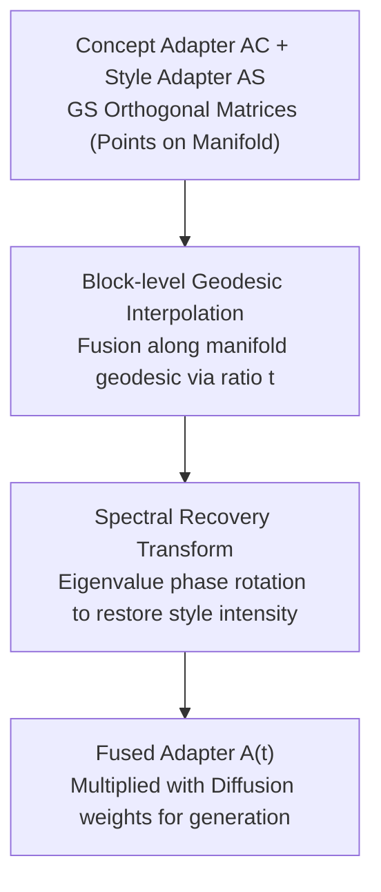

# OrthoFuse: Training-free Riemannian Fusion of Orthogonal Style-Concept Adapters for Diffusion Models

**Conference**: CVPR 2026  
**Paper**: [CVF Open Access](https://openaccess.thecvf.com/content/CVPR2026/html/Aliev_OrthoFuse_Training-free_Riemannian_Fusion_of_Orthogonal_Style-Concept_Adapters_for_Diffusion_CVPR_2026_paper.html)  
**Code**: https://github.com/ControlGenAI/OrthoFuse (Available)  
**Area**: Image Generation / Diffusion Models / Parameter-Efficient Fine-Tuning  
**Keywords**: Orthogonal Fine-Tuning, Adapter Fusion, Riemannian Manifold, Geodesics, Style-Concept Generation  

## TL;DR
The first training-free fusion method for **multiplicative orthogonal adapters** (OFT): it treats Group-and-Shuffle (GS) orthogonal matrices as points on a Riemannian manifold, synthesizes a "concept adapter" and a "style adapter" into one via block-level geodesic interpolation, and applies a spectral recovery transform to restore eigenvalues flattened by interpolation. This allows merging a specified subject with a specific artistic style into a single image without retraining.

## Background & Motivation
**Background**: Subject-driven generation and stylization in diffusion models typically involve fine-tuning separate adapters (LoRA or orthogonal adapters) using a small set of images. LoRA merging has been extensively studied (ZipLoRA, K-LoRA, MoLe, B-LoRA, etc.), with methods ranging from simple weighted averaging to learnable gating.

**Limitations of Prior Work**: (1) A real and unresolved need is "achieving both a user-specified **subject** and a user-specified **artistic style**" by merging two independently trained adapters; (2) LoRA's additive low-rank updates distort neuron relationships and disrupt generative semantics, and scale inconsistencies between different LoRAs require extra handling of magnitude differences; (3) Recently proposed multiplicative orthogonal adapters (OFT) are more stable to train and less prone to overfitting, naturally preserving the spectral and Frobenius norms of layers—making them inherently suitable for fusion without magnitude concerns. However, **no work has yet investigated how to merge orthogonal adapters**.

**Key Challenge**: The natural advantages of orthogonal adapters (norm preservation, seamless integration) remain unutilized. Naively performing "merging" via block-wise linear interpolation of diagonal blocks fails due to the complex structure of the GS orthogonal manifold and harms generation quality.

**Goal**: (1) Establish a geometric structure for GS orthogonal matrices and derive an efficient approximate geodesic formula for closed-form, training-free adapter fusion; (2) Resolve the issue where fused eigenvalues are "pushed toward 1," causing weakened style.

**Key Insight**: Ours notes that the set of GS orthogonal matrices constitutes a **Riemannian manifold**. Thus, "merging two adapters" is equivalent to "moving along a geodesic on the manifold from one point to another," where the fusion ratio is the geodesic parameter $t$.

**Core Idea**: Replace "linear averaging in parameter space/gated learning" with "block-level geodesic interpolation on the manifold + spectral recovery," resulting in the first training-free merging method for multiplicative orthogonal adapters.

## Method

### Overall Architecture
The input to OrthoFuse consists of two independently trained GS orthogonal adapters—a concept adapter $A_C$ and a style adapter $A_S$ (both in the form $A = P^\top L P R$, where $L, R$ are block-diagonal orthogonal blocks). The output is a fused adapter $A(t)$ that remains within the same GS orthogonal class, mixing features at ratio $t \in [0, 1]$. This is directly multiplied by the diffusion model weights ($W' = A(t)W$) for generation. The theoretical foundation is **Theorem 2**, proved by Ours, which states that **the set of GS orthogonal matrices forms a smooth manifold**, enabling paths along geodesics. The pipeline involves two purely linear algebraic steps with zero training: first, **block-level geodesic interpolation** yields an intermediate adapter, followed by a **spectral recovery transform** to rotate eigenvalues back towards their original phases, restoring style intensity.

### Key Designs

**1. Riemannian Manifold Structure of GS Adapters: Turning "Merging" into "Walking the Geodesic"**

This serves as the theoretical pivot, addressing the failure of naive linear interpolation. Ours proves (Theorem 2) that the set of GS$(P_L, P, P_R)$ orthogonal matrices forms a smooth manifold. Merging $A_C$ and $A_S$ is thus equivalent to finding an interpretable curve connecting them on the manifold, with $t$ directly controlling the mix. While exact local shortest geodesics are expensive, a key empirical observation is that orthogonal diagonal blocks are **close to the identity** (also reported in [21]). Consequently, **block-level geodesic interpolation accurately approximates the true local shortest geodesic**. This simplifies a Riemannian optimization problem into independent, closed-form operations on small orthogonal blocks—ensuring both correctness and efficiency.

**2. Block-level Geodesic Interpolation: Closed-form Fusion of Orthogonal Blocks**

Given that GS orthogonal matrices are composed of independent orthogonal blocks, fusion is performed block-wise. For a pair of corresponding blocks $B_C, B_S \in SO(n)$, the geodesic fusion is:

$$B(t) = B_C \exp\!\big(t \cdot \log(B_S^\top B_C)\big).$$

In practice, since orthogonal matrices are always diagonalizable, eigen-decomposition of $B_S^\top B_C = U\Lambda U^\top$ allows $B(t) = B_C U \exp(t\log\Lambda)U^\top$. This reduces to scalar functions on eigenvalues and GPU-friendly matrix multiplications. $t=0$ returns the pure concept adapter, $t=1$ returns the pure style adapter, and intermediate values provide a continuous transition. Block-wise operations avoid the cubic time bottleneck of full eigen-decomposition, making the algorithm highly efficient (completing in seconds).

**3. Spectral Recovery Transform: Restoring Style Intensity by Rotating Eigenvalues**

Ours empirically finds that fusion pulls the eigenvalues of the resulting matrix **closer to 1** (see Fig. 2 in the paper). Since the eigenvalues of an orthogonal adapter control "rotation strength," approaching the identity means the layer acts as an identity transform, weakening the style. To counter this, spectral recovery rotates eigenvalue phases on the complex unit circle by a scalar factor. Formally, $B_{rotated}(t) = \exp(\varphi(t)\log(B(t)))$, where the phase multiplier $\varphi(t)$ satisfies $\varphi(0)=\varphi(1)=1$ (preserving boundaries) and $\varphi(1/2)=\varphi_0$. A second-order polynomial $\varphi(t) = 1 + 4t(1-t)$ is used ($\varphi_0=2$). Avoiding repeated diagonalization, Ours uses approximations (Proposition 1: $\log(B)\approx (B-B^\top)/2$; Proposition 2: 1st-order Padé approximation) to derive a hardware-friendly closed-form Cayley form:

$$B_{OrthoFuse}(t) = \Big(I - \tfrac{\varphi(t)}{4}(B(t)-B(t)^\top)\Big)^{-1}\Big(I + \tfrac{\varphi(t)}{4}(B(t)-B(t)^\top)\Big),$$

which approximates $B_{rotated}(t)$ with $O(\|B(t)-I\|_2^2)$ error as $B(t)\to I$. This step specifically targets the "style fading" after interpolation and is the primary reason OrthoFuse achieves superior style fidelity.

### Mechanism
Consider a DreamBooth concept (e.g., "sks dog") and a style reference image. After training adapters $A_C$ and $A_S$ (32 blocks, SDXL base), fusion proceeds as follows: for each pair of blocks $(B_C^{(i)}, B_S^{(i)})$, perform block-level geodesic interpolation $\tilde B^{(i)}(t)$, followed by eigenvalue rotation $B^{(i)}(t)$. At $t=0.6$, the generated image preserves the dog's identity while stably presenting the target style. The entire process takes under 1 second and requires no training.

## Key Experimental Results

### Main Results
Using SDXL, 6 DreamBooth concepts × 12 style references = 72 sets (10 images per set). Metrics: Style Sim (CLIP similarity to style reference), CLIP/DINO (semantic consistency with concept), and Geometric Mean (style-concept trade-off).

| Method | Type | Style Sim↑ | CLIP↑ | DINO↑ | Geo.Mean(Style,CLIP)↑ | Fusion Time |
|------|------|-----------|-------|-------|------|------|
| Joint training | Training-based | 0.48 | **0.79** | **0.67** | 0.62 | 1.5 hours |
| ZipLoRA r=64 | Training-based | 0.49 | 0.76 | 0.64 | 0.61 | 4 mins |
| K-LoRA r=64 | Training-free | 0.49 | 0.76 | 0.56 | 0.61 | < 1 sec |
| **OrthoFuse** | Training-free | **0.61** | 0.68 | 0.51 | **0.64** | **< 1 sec** |

OrthoFuse achieves the highest Style Sim (0.61) and Geo.Mean (0.64). While concept retention (CLIP/DINO) is slightly lower than baselines, this is expected as strong stylization naturally deviates from the original concept maps. Joint training preserves concepts best but often ignores style (Style Sim 0.48) and requires retraining for every pair.

### Key Findings
- **Spectral recovery is critical for style fidelity**: Geodesic interpolation alone pulls eigenvalues toward 1; phase rotation is necessary to restore style intensity.
- **Style-concept trade-off exists**: OrthoFuse dominates in style transfer (77%–83% preference in user studies) while maintaining competitive concept retention.
- **Efficient and Training-free**: Unlike Joint training (1.5 hours) or ZipLoRA (4 minutes), OrthoFuse matches K-LoRA’s sub-second speed with better style fidelity.

## Highlights & Insights
- **Reframing "adapter merging" as "moving on a manifold"** is an elegant perspective. Proving the manifold structure of GS orthogonal matrices allows for a closed-form, interpretable solution.
- **Leveraging the norm-preserving nature of orthogonal adapters** avoids the scale inconsistency issues prevalent in LoRA fusion.
- **Spectral recovery via Cayley/Padé approximations** transforms expensive eigen-operations into hardware-friendly closed forms, a practical engineering choice.
- **Insight**: Fusion inadvertently pushes eigenvalues toward 1 (identity). Ours identifies this phenomenon at the spectral level and counteracts it with phase rotation to prevent style fading.

## Limitations & Future Work
- There remains a trade-off between concept retention and style fidelity; Ours leans toward stronger stylization.
- The method relies on the empirical assumption that diagonal blocks are near the identity; if adapters deviate significantly, the approximation and error bounds for spectral recovery may fail.
- Future work: Exploring layer-wise or region-adaptive fusion parameters $t$ instead of a global constant, and extending the geometric framework to multi-adapter fusion (Fréchet means).

## Related Work & Insights
- **vs. ZipLoRA/K-LoRA**: These target additive LoRA and rely on learned gated or statistical weights. OrthoFuse uses a multiplicative closed-form manifold approach, avoiding LoRA's scaling issues and achieving superior style transfer.
- **vs. Joint Orthogonal Training**: Joint training is slow (1.5h per pair) and often neglects style; OrthoFuse reuses existing adapters for second-level fusion.
- **vs. StyleAligned/StyleDrop**: These operate on internal representations during inference. OrthoFuse performs fusion directly in the parameter space, with no changes needed to the generation process.

## Rating
- Novelty: ⭐⭐⭐⭐⭐ 
- Experimental Thoroughness: ⭐⭐⭐⭐ 
- Writing Quality: ⭐⭐⭐⭐ 
- Value: ⭐⭐⭐⭐ 

<!-- RELATED:START -->

## Related Papers

- [\[CVPR 2026\] CRAFT-LoRA: Content-Style Personalization via Rank-Constrained Adaptation and Training-Free Fusion](craft-lora_content-style_personalization_via_rank-constrained_adaptation_and_tra.md)
- [\[ICML 2026\] Orthogonal Concept Erasure for Diffusion Models](../../ICML2026/image_generation/orthogonal_concept_erasure_for_diffusion_models.md)
- [\[CVPR 2026\] A Training-Free Style-Personalization via SVD-Based Feature Decomposition](a_training-free_style-personalization_via_svd-based_feature_decomposition.md)
- [\[CVPR 2026\] Efficient and Training-Free Single-Image Diffusion Models](efficient_and_training-free_single-image_diffusion_models.md)
- [\[CVPR 2026\] HAM: A Training-Free Style Transfer Approach via Heterogeneous Attention Modulation for Diffusion Models](ham_a_training-free_style_transfer_approach_via_heterogeneous_attention_modulati.md)

<!-- RELATED:END -->
