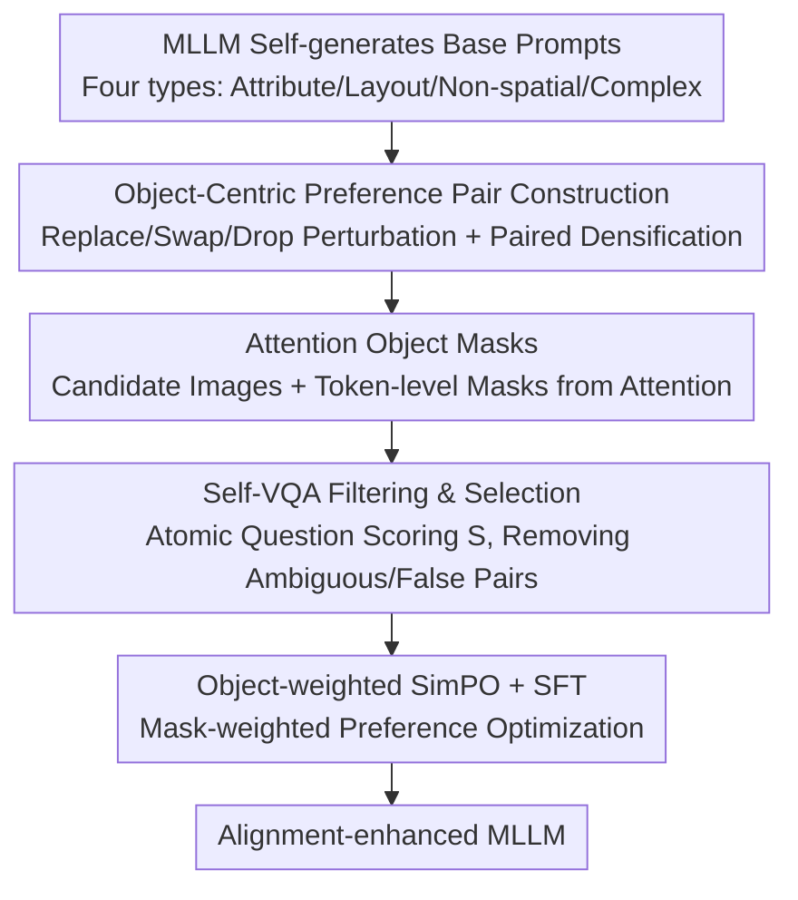

# OSPO: Object-Centric Self-Improving Preference Optimization for Text-to-Image Generation

**Conference**: CVPR 2026  
**Paper**: [CVF Open Access](https://openaccess.thecvf.com/content/CVPR2026/html/Oh_OSPO_Object-Centric_Self-Improving_Preference_Optimization_for_Text-to-Image_Generation_CVPR_2026_paper.html)  
**Code**: https://ku-agi.github.io/OSPO/ (Project Page)  
**Area**: Image Generation / Diffusion Models / Preference Optimization  
**Keywords**: Text-to-Image, Self-Improving Preference Optimization, Object-level Alignment, MLLM, Object Hallucination

## TL;DR
OSPO enables a unified Multimodal Large Language Model (Unified MLLM) to self-generate preference image pairs that share global semantics but differ in object details. By utilizing object masks derived from attention to weight the SimPO loss, it significantly enhances fine-grained object-level alignment and suppresses object hallucinations in T2I generation without relying on external data or models.

## Background & Motivation
**Background**: Unified MLLMs integrate image understanding and generation within a single set of parameters, theoretically enabling "self-evaluation and self-improvement." To improve T2I alignment, mainstream approaches utilize feedback-based post-training such as DPO, PPO, or GRPO.

**Limitations of Prior Work**: These methods suffer from two primary issues. First, **High Cost**: DPO requires extensive preference pairs annotated by humans or superior models, which is far more expensive for images than for text. PPO/GRPO avoids pre-collected pairs but requires running multiple models simultaneously during training, leading to heavy overhead. Second, **Off-policy Bias**: The distribution of preference pairs in DPO differs from the model's own output; PPO/GRPO relies on reward models trained on external data, where distribution mismatch leads to training instability.

**Key Challenge**: To bypass external dependencies, recent "self-improvement" frameworks (e.g., SILMM) allow models to generate their own training data and reward signals. However, they generally employ **Best-of-N sampling**: generating multiple candidates for the same prompt and selecting the highest and lowest scores as a preference pair. Diagnostics on 16,000 Janus-Pro-7B self-generated samples reveal systematic failure modes: **Preference-Ambiguous Pairs**, where prompt fidelity is indistinguishable between images yet they are forcibly labeled "better/worse"; and worse, **Preference-False Pairs**, where both images are either entirely correct or incorrect across all semantic units, yet Best-of-N still imposes a contradictory supervisory signal. This noise is prevalent across all prompt categories.

**Goal**: Within the constraints of pure self-improvement (no external data/models), integrate "object-centric" alignment throughout data generation, preference determination, and optimization loss to specifically address object hallucinations.

**Key Insight**: Treat each object as an **independent alignment unit** (object-centric) rather than providing a holistic score for the entire image. This allows preference signals to precisely locate "which object's color, shape, or spatial relationship is incorrect."

**Core Idea**: Use "paired perturbation + densification" to actively create preference pairs that differ only in object details (replacing Best-of-N), then focus the preference optimization gradient on object-related visual tokens using attention-based object masks.

## Method

### Overall Architecture
OSPO is a five-stage, fully self-sufficient self-improvement preference optimization framework where the only input is the model itself, and the output is an MLLM with stronger fine-grained alignment. The process is: the model first uses In-Context Learning (ICL) to generate a batch of base prompts, then performs **paired perturbation + joint densification** for each prompt to obtain two prompts with "consistent backgrounds but different object details"; candidate image pairs are generated accordingly while capturing **object masks** from internal attention; next, **Self-VQA** decomposes the image into atomic semantic questions for scoring, filtering out ambiguous/false pairs to select the cleanest set; finally, preference optimization is performed using a joint **Object-weighted SimPO + SFT** loss. The first four stages serve to "create a pair of clean, object-localized preference data," while the fifth stage is the actual optimization.

### Key Designs

**1. Object-Centric Preference Pair Construction: Replacing Best-of-N with Paired Perturbation + Densification**

This step directly addresses the issue of "preference-ambiguous/false pairs." Instead of sampling $N$ images to pick the best/worst, OSPO **proactively constructs** a perturbed version $\tilde{x}$ for each base prompt $x$, ensuring the "better/worse" difference is precisely defined within the prompts from the start. Perturbation strategies (inspired by SugarCrepe/WinoGround) include: **Replace** (substituting an object/attribute with one not originally present), **Swap** (exchanging object or attribute positions to change relationship binding), and **Drop** (removing an object/attribute to induce semantic ambiguity). By default, $N=3$ perturbed prompts are generated per original prompt, forming $(x,\tilde{x}_1),\dots,(x,\tilde{x}_N)$. Subsequently, **Joint Densification** is applied to both prompts simultaneously—adding contextual details so the generated images share a global background and differ only in object-level semantics. This ensures preference signals are clear and eliminates the ambiguity noise inherent in Best-of-N.

**2. Attention Object Masks: Localizing Object Tokens without Segmentation Models**

To implement "object weighting," the model must identify which visual tokens belong to objects. OSPO avoids external segmentation models by repurposing MLLM internal attention: it extracts the attention distribution of text tokens representing objects over all visual tokens. These are taken from intermediate layers (excluding the first and last $k=5$ layers to avoid unstable activations and over-smoothing), averaged across heads and layers, and reshaped into a 2D spatial attention map aligned with the image grid. An OTSU adaptive threshold is then applied to create a binary mask $m$. This process is repeated for each object in the prompt to form a union mask $M$. This approach incurs near-zero additional cost by leveraging existing internal interactions without external modules like SAM.

**3. Self-VQA Filtering & Selection: Removing Noise via Atomic Question Scoring**

Preference optimization is highly sensitive to data quality, necessitating further filtering even for localized pairs. OSPO decomposes each base prompt $x$ into a set of binary Yes/No atomic questions $Q(x)=\{q_1,\dots,q_K\}$. The MLLM answers these for each candidate, defining an alignment score as the average marginal probability: $s_k(y)=p(\text{yes}\mid y,q_k)-p(\text{no}\mid y,q_k)$ and $S(y)=\frac{1}{K}\sum_{k=1}^{K}s_k(y)$. Two filtering rules are applied: if the winning image $y_w$ has a total score below a threshold $S(y_w)<\tau$ (default $\tau=0.6$), the pair is discarded; if the losing image $y_\ell$ scores $s_k(y_\ell)>0$ on **every** question (indicating it is also correct), the pair is discarded. These ensure the "winner is good enough" and specifically eliminate preference-false pairs. The pair with the highest $S$ is selected for the final training triplet $(x,\hat{y}_w,\hat{y}_\ell)$.

**4. Object-weighted SimPO + SFT: Focusing Gradients on Object-Related Tokens**

Standard SimPO averages rewards across all tokens, which for images dilutes the training signal with numerous tokens irrelevant to the target objects. OSPO applies spatial weights $w_t=1+\alpha\,m_t$ (where $m_t\in[0,1]$ and $\alpha$ controls emphasis, default $\alpha=1$) to token-level rewards, resulting in an object-weighted SimPO loss:

$$\mathcal{L}_{\text{Obj-SimPO}}=-\mathbb{E}_{(x,y_w,y_\ell)}\Big[\log\sigma\big(\tfrac{\beta}{|y_w|}\textstyle\sum_t (w_w)_t\log\pi_\theta((y_w)_t)-\tfrac{\beta}{|y_\ell|}\textstyle\sum_t (w_\ell)_t\log\pi_\theta((y_\ell)_t)-\gamma\Big)\Big]$$

Default values are $\beta=5,\gamma=2.5$. Since token-level preference rewards alone may not maintain structural consistency (shape, geometry, layout), an SFT loss is added using the winning image as the anchor: $\mathcal{L}_{\text{SFT}}=-\mathbb{E}_{(x,y_w)}[\frac{1}{|y_w|}\sum_t\log\pi_\theta((y_w)_t)]$. This provides consistent supervision over the entire sequence. The final objective is $\mathcal{L}_{\text{OSPO}}=\mathcal{L}_{\text{Obj-SimPO}}+\lambda\mathcal{L}_{\text{SFT}}$ (default $\lambda=2$). Ablations show these terms specifically improve spatial alignment.

### Loss & Training
The final loss is $\mathcal{L}_{\text{OSPO}}=\mathcal{L}_{\text{Obj-SimPO}}+\lambda\mathcal{L}_{\text{SFT}}$. The backbone uses Janus-Pro-1B/7B. Training data consists of approximately 20,000 filtered samples covering attributes, layout, non-spatial relationships, and complex combinations. Training is conducted on 8x A100 (80GB).

## Key Experimental Results

### Main Results
On T2I-CompBench++, OSPO outperforms self-improvement baselines SILMM and SUDER at both 1B and 7B scales, and even surpasses specialized diffusion models. The most significant gains are seen in attribute categories.

| Model (7B) | Color↑ | Shape↑ | Texture↑ | Spatial-2D↑ | Complex↑ |
|----------|--------|--------|----------|-------------|----------|
| Janus-Pro | 0.5215 | 0.3272 | 0.4050 | 0.1654 | 0.3868 |
| + SILMM | 0.7394 | 0.4325 | 0.5796 | 0.2105 | 0.3725 |
| + SUDER | 0.7824 | 0.5786 | 0.7292 | 0.2524 | 0.3858 |
| **+ OSPO** | **0.8567** | **0.6386** | **0.7727** | **0.3562** | **0.4147** |

On DPGBench and GenEval, OSPO-7B achieves the highest overall scores among Janus-Pro-based self-improvement methods. In GenEval, the only notable lag is in the "Count" category—a known weakness of MLLMs. SUDER leads in this category primarily due to external supervision from COCO image-text pairs, which falls outside the scope of pure self-improvement.

### Ablation Study
Ablation of loss components (T2I-CompBench++ Attribute/Layout, GenEval Total/Position, Janus-Pro-7B):

| Configuration | Attribute↑ | Layout↑ | GenEval Total↑ | Position↑ |
|------|-------|-------|--------------|-------|
| Janus-Pro-7B | 0.418 | 0.292 | 0.796 | 0.570 |
| SimPO only | 0.779 | 0.416 | 0.785 | 0.778 |
| Obj-SimPO only | 0.776 | 0.428 | 0.794 | 0.795 |
| Obj-SimPO + SFT (**OSPO**) | 0.756 | **0.447** | **0.831** | **0.828** |

Ablation of data construction (Effect of Densification, Filtering, and Selection):

| Configuration | Filtering | Selection | T2I++↑ | GenEval↑ |
|------|------|------|--------|----------|
| OSPO w/ Densification | ✗ | ✗ | 0.716 | 0.813 |
| OSPO w/ Densification | ✓ | ✓ | **0.756** | **0.831** |
| OSPO w/o Densification | ✗ | ✗ | 0.618 | 0.816 |
| OSPO w/o Densification | ✓ | ✓ | 0.641 | 0.823 |

### Key Findings
- **Object Weighting is Critical**: Transitioning from "SimPO only" to "Obj-SimPO only" significantly improves layout and position (spatial alignment), proving that focusing gradients on object tokens is effective. Adding SFT further stabilizes global structure, raising the position score from 0.778 to 0.828.
- **Densification is the Foundation**: With densification, filtering and selection can raise attribute scores from 0.716 to 0.756. Without densification, the role of filtering and selection is even more pronounced (0.618 to 0.641), indicating their importance in noise resistance when image fidelity is low.
- **High Data Efficiency**: OSPO achieves substantial gains over baselines even with small datasets. Performance saturates as the number of candidate pairs $N$ increases beyond a moderate point.
- **Compute Efficiency**: By decoupling source prompts and generating smaller, targeted candidate sets, OSPO is more performant and time-efficient than SILMM. It reaches comparable performance to T2I-R1/FocusDiff (which rely on multiple reward models like GRPO) at a much lower computational cost.

## Highlights & Insights
- **"Proactive Differentiation" vs. "Passive Selection"**: Best-of-N attempts to find differences post hoc among random samples; OSPO writes differences into prompts via Replace/Swap/Drop, ensuring clear preference signals from the start. This paradigm is transferable to any self-improving generation task.
- **Utilizing Attention for Masks**: Extracting masks directly from MLLM internal attention provides token-level spatial supervision at near-zero cost, demonstrating how "understanding capability can benefit generation" in unified models.
- **Object-Weighted SimPO Perspective**: Standard image tokens unrelated to target objects dilute preference rewards. Using mask weighting to concentrate gradients highlights that "token-level rewards should be weighted by semantic importance," a concept applicable to other preference optimization modalities.

## Limitations & Future Work
- **Counting remains a Weakness**: Pure self-improvement lacks external counting supervision; OSPO lags behind SUDER (which uses COCO) in the GenEval count category. Improving counting without external dependencies remains an open problem.
- **Dependency on MLLM Self-Evaluation Reliability**: Self-VQA and attention masks assume the model's visual understanding is accurate. If the backbone's understanding is weak, filtering and masks will be distorted.
- **Perturbation Coverage**: Replace/Swap/Drop primarily covers attributes, relationships, and existence, with limited coverage for complex numerical or texture perturbations.

## Related Work & Insights
- **vs. SILMM**: SILMM is the first T2I self-improvement framework, but object-level alignment is only reflected in preference determination, and it uses Best-of-N. OSPO integrates object-centricity throughout the whole pipeline and replaces Best-of-N with paired perturbation for higher accuracy and efficiency.
- **vs. SUDER**: SUDER jointly trains generation and captioning but lacks explicit fine-grained alignment goals and relies on COCO for GenEval counting. OSPO adheres to zero external dependencies and outperforms it in most categories.
- **vs. DPO / GRPO**: Traditional methods require either large external balanced sets (DPO) or multiple online reward models (GRPO), both suffering from off-policy bias. OSPO is entirely on-policy, avoiding distribution mismatch and high costs.

## Rating
- Novelty: ⭐⭐⭐⭐ The "Paired Perturbation + Attention Mask + Object Weighting" triplet is solid, though built on existing concepts.
- Experimental Thoroughness: ⭐⭐⭐⭐ Comprehensive evaluation across three benchmarks, two scales, and multiple dimensions (loss/data/compute).
- Writing Quality: ⭐⭐⭐⭐ Motivation (diagnosing ambiguous pairs) is clear, and the five-stage structure is well-defined.
- Value: ⭐⭐⭐⭐ Provides a reusable, low-cost solution for fine-grained T2I alignment with zero external dependencies.

<!-- RELATED:START -->

## Related Papers

- [\[CVPR 2026\] SOLACE: Improving Text-to-Image Generation with Intrinsic Self-Confidence Rewards](solace_self_confidence_rewards_t2i.md)
- [\[CVPR 2026\] Compositional Text-to-Image Generation Via Region-aware Bimodal Direct Preference Optimization](compositional_text-to-image_generation_via_region-aware_bimodal_direct_preferenc.md)
- [\[CVPR 2026\] Self-Evaluation Unlocks Any-Step Text-to-Image Generation](self-evaluation_unlocks_any-step_text-to-image_generation.md)
- [\[CVPR 2026\] OctoT2I: A Self-Evolving Agentic Text-to-Image Router](octot2i_a_self-evolving_agentic_text-to-image_router.md)
- [\[CVPR 2026\] Seeing What Matters: Visual Preference Policy Optimization for Visual Generation](seeing_what_matters_visual_preference_policy_optimization_for_visual_generation.md)

<!-- RELATED:END -->
