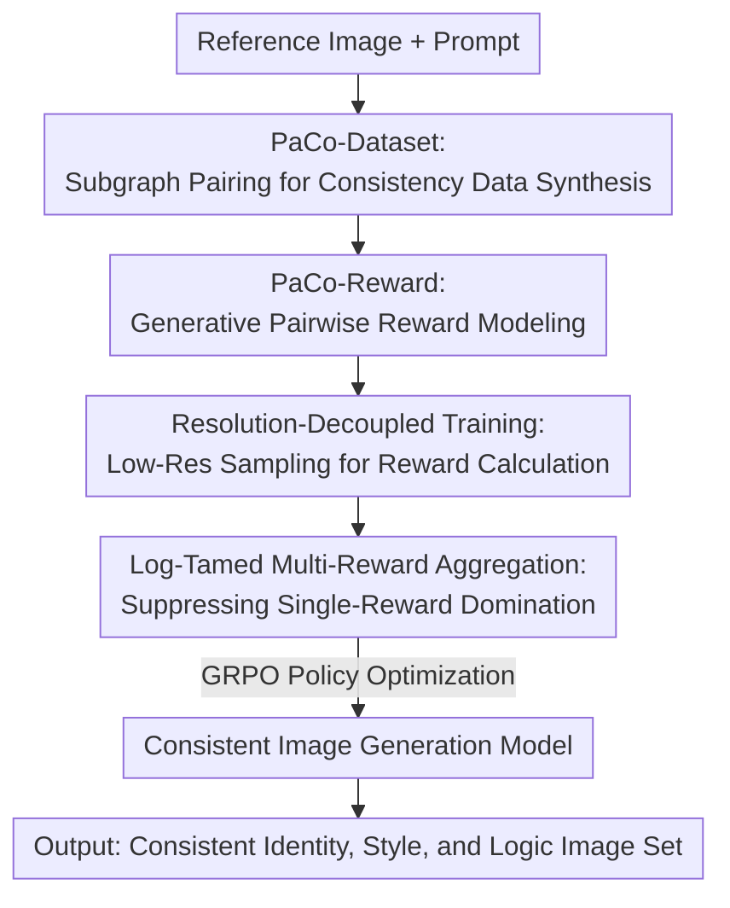

# PaCo-RL: Advancing Reinforcement Learning for Consistent Image Generation with Pairwise Reward Modeling

**Conference**: CVPR 2026  
**Paper**: [CVF Open Access](https://openaccess.thecvf.com/content/CVPR2026/html/Ping_PaCo-RL_Advancing_Reinforcement_Learning_for_Consistent_Image_Generation_with_Pairwise_CVPR_2026_paper.html)  
**Code**: To be confirmed (Project page provided in the paper)  
**Area**: Image Generation / Consistent Generation / Reinforcement Learning / Reward Modeling  
**Keywords**: Consistent Image Generation, Pairwise Reward Model, GRPO, Resolution Decoupling, Multi-Reward Aggregation

## TL;DR
PaCo-RL formulates consistent image generation (image editing + text-to-imageset) as an RL problem: first, a large-scale consistency ranking dataset is constructed using automatic subgraph pairing to train PaCo-Reward, a pairwise reward model specifically designed to assess whether two images are consistent; then, an efficient RL algorithm, PaCo-GRPO, featuring low-resolution training and log-tamed multi-reward aggregation, is employed to optimize the generative model. This approach improves consistency metrics by 10.3%–11.7% across two major tasks, while nearly doubling training efficiency and enhancing stability.

## Background & Motivation
**Background**: Text-to-image models have achieved remarkable performance in single-image quality and diversity. However, many real-world applications—such as storytelling, character design, advertising, and comic generation—demand **consistency**: the identity of the same character, the overall style, and the logical relationships across multiple generated images must align. This paper focuses on two representative tasks: image editing (modifying a specific attribute while preserving the remaining appearance) and Text-to-ImageSet (generating a set of coordinated images from a single prompt).

**Limitations of Prior Work**: Supervised training struggles with consistent generation due to two major factors: first, the lack of large-scale annotated data that captures "visual consistency"; second, human perception of "consistency" is highly subjective and difficult to model using explicit labels. This naturally leads to reinforcement learning (RL), which bypasses curated datasets and relies on reward feedback to allow models to learn these complex, subjective visual criteria in a data-free manner.

**Key Challenge**: Applying RL to consistent generation, however, is hindered by two main gaps. **On the reward side**: existing reward models primarily assess aesthetic quality and text-to-image alignment rather than explicit consistency. Since consistency inherently requires the **pairwise comparison of multiple images**, it cannot be fully addressed by single-image scoring or text-image alignment models. Even similarity models like CLIP and DreamSim fail to capture human multi-dimensional perception of consistency. **On the optimization side**: consistent generation requires simultaneously processing multiple high-resolution images, leading to computational costs far exceeding those of single-image synthesis, with sampling being the primary bottleneck. Furthermore, optimizing multiple rewards (e.g., consistency and text fidelity) simultaneously using naive weighting often causes one reward to dominate, leading to unstable training.

**Goal**: To address these two gaps by introducing a state-of-the-art consistency reward model accompanied by an efficient and stable online RL algorithm.

**Key Insight / Core Idea**: On the reward side, consistency is modeled in a **pairwise, generative** manner (translating "are these two images consistent" into the token probability of next-token prediction "Yes", which naturally aligns with the autoregressive nature of VLMs without requiring extra regression heads). On the optimization side, computational costs are minimized through **resolution decoupling**, and multi-reward domination is mitigated using a **log-tamed** aggregation strategy.

## Method

### Overall Architecture
PaCo-RL is a two-stage framework: **PaCo-Reward** (reward model) + **PaCo-GRPO** (RL algorithm). In the first stage, automatic subgraph pairing is used to construct a large-scale consistency ranking dataset, PaCo-Dataset, from image grids generated by FLUX, followed by training the pairwise consistency evaluator, PaCo-Reward, on Qwen2.5-VL-7B. In the second stage, PaCo-Reward is integrated into the GRPO online optimization process as a reward signal, incorporating two engineering strategies to ensure both speed and stability: low-resolution sampling during training (with full-resolution generation maintained at inference) and log-tamed multi-reward aggregation. The overall input consists of a Reference Image + Prompt (or a collective prompt), and the output is a set of images with mutually consistent identity, style, and logic.

### Key Designs

**1. PaCo-Dataset: Leveraging Subgraph Combinatorics and Pairing to Construct Large-Scale Ranking Data Cheaply**

Data for consistent generation is inherently difficult to collect: multiple images must share certain elements while varying in others, making manual collection and annotation extremely costly. The authors generate 2,000 text-to-imageset prompts using DeepSeek-V3.1, apply text embedding-based diversity filtering to select 708 prompts, and generate a highly internally consistent $m\times n$ image grid (where $2\times2$ is empirically optimal for quality and efficiency) for each prompt using FLUX.1-dev. Four grids are generated per prompt using different seeds, and **subgraph combinatorial pairing** is applied: each grid is cropped into $m\times n$ subgraphs, and pairwise comparisons are formed across different grids of the same prompt. This scales 708 prompts (2,832 images) into 33,984 ranking instances (each containing 1 reference image and 4 candidates ranked by consistency). Six annotators labeled approximately 5,664 instances each, with 3,136 instances reserved as the ConsistencyRank evaluation benchmark. To facilitate training, the rankings are converted into **pairwise comparisons** (clear positive/negative pairs) and supplemented with 5,695 manually verified consistent pairs from ShareGPT4o-Image, resulting in a final dataset of 54,624 annotated pairs (27,599 consistent and 27,025 inconsistent). Each pair is annotated with CoT (Chain-of-Thought) reasoning generated by GPT-5 to enhance explainability and alleviate overfitting. This "grid synthesis followed by combinatorial pairing" design is the key to scaling the data, driving diversity and volume with virtually zero extra cost.

**2. PaCo-Reward: Reformulating Consistency Assessment as "VLM Next-Token 'Yes' Probability" with Weighted Likelihood Loss to Balance Decision and Reasoning**

The main limitation of reward modeling with VLMs is either adding an extra regression head to output a scalar reward—which conflicts with the VLM's next-token autoregressive nature—or relying on long CoT reasoning to output scores, which incurs prohibitive computational overhead during RL training. PaCo-Reward addresses this by translating "are images $I_A$ and $I_B$ consistent under prompt $P$" directly into a **generative decision**: the model is prompted to output "Yes" or "No", and the **probability of the "Yes" token** during inference is used as the consistency score. Human rankings are then derived from these scores relative to the reference image. This approach fits the autoregressive paradigm while optionally supporting CoT to boost explainability and robustness. The training objective is a **weighted likelihood loss**: given $I=(I_A,I_B,P)$, the model first predicts a binary decision token, followed by $n-1$ CoT tokens:

$$\mathcal{L}_{\text{PaCo}} = -\left[\alpha \log p(y_0\mid I) + \frac{1-\alpha}{n-1}\sum_{i=1}^{n-1}\log p(y_i\mid I)\right]$$

where $y_0$ is the initial decision token (Yes/No), $y_i$ is the $i$-th reasoning token, and $\alpha\in[0,1]$ balances "decision supervision" and "reasoning supervision". When $\alpha=\frac{1}{n}$, this simplifies to standard MLE. Hyperparameter search shows that $\alpha=0.1$ yields the best generalization. Intuitively, this design avoids two extremes: relying solely on binary decisions leads to overfitting and poor generalization, while learning the entire CoT sequence dilutes the primary supervision signal. Weighting ensures the decision signal dominates while utilizing reasoning as an auxiliary guide.

**3. Resolution-Decoupled Training: Low-Res Sampling in Training and Full-Res in Inference to Cut RL's Primary Computational Bottleneck**

Consistent generation outputs (especially for Text-to-ImageSets) often comprise large, high-resolution canvas layouts with multiple sub-images, each matching standard single-image resolutions. Since the computational cost of Transformers scales **quadratically** with resolution, RL becomes extremely expensive. Inspired by FlowGRPO's finding that low-quality images generated with fewer denoising steps can still provide effective reward signals, the authors propose training the model by sampling only lower-resolution $\frac{h}{2}\times\frac{w}{2}$ images to compute rewards and update parameters, while maintaining full-resolution $h\times w$ generation during inference and evaluation. This significantly slashes sampling and optimization overhead and can be seamlessly combined with other optimization methods such as MixGRPO and FlowGRPO-Fast. Experimentally, training at $512\times512$ starts with lower rewards but catches up with $1024\times1024$ around epoch 50, reducing training time from 12.0h to 6.0h. Low-resolution training also introduces higher reward variance, which aids exploration and output diversity; however, training at $256\times256$ fails due to insufficient detail rendering reward evaluation unreliable, indicating a sweet spot in resolution reduction.

**4. Log-Tamed Multi-Reward Aggregation: Using Coefficient of Variation to Identify and Compress Highly Volatile Rewards to Prevent Domination**

Naive reward aggregation $\hat r_i^j=\sum_k w_k R^k$ for multiple rewards (consistency + text alignment) is prone to reward domination. A reward with high variance can dominate the optimization process, leading to sub-optimal results or training instability. Manual weight tuning is tedious and lacks generalizability. The authors introduce an adaptive approach by calculating the **coefficient of variation** $h^k=\frac{\text{std}_{i,j}(R^k)}{\text{mean}_{i,j}(R^k)}$ for each reward. A large $h^k$ indicates high volatility, making the reward prone to generating extreme values that suppress others. A logarithmic transformation is thus applied to compress such rewards:

$$\overline{R}^k(\bm{x}_i^j,\bm{c}_i)=\begin{cases}\log(1+R^k), & h^k>\delta,\\ R^k, & \text{otherwise},\end{cases}$$

where the threshold $\delta$ can be set dynamically as the mean of all $h^k$ or as a fixed apriori value (e.g., 0.2). This log compression compresses large reward values while **preserving the relative ranking of samples**, thereby suppressing domination without distorting the underlying preferences. In experiments, this method constrains the ratio of consistency to text-alignment rewards below 1.8, whereas naive aggregation pushes this ratio past 2.5 after 50 epochs.

### Loss & Training
The reward model is trained using the weighted likelihood loss $\mathcal{L}_{\text{PaCo}}$ ($\alpha=0.1$). RL is optimized via GRPO. For flow-matching models, the ODE is converted into an SDE to introduce stochasticity and facilitate exploration. The SDE update formula is:

$$\bm{x}_{t+\Delta t}=\bm{x}_t+\left[\bm{v}_\theta+\frac{\sigma_t^2}{2t}(\bm{x}_t+(1-t)\bm{v}_\theta)\right]\Delta t+\sigma_t\sqrt{\Delta t}\,\epsilon$$

The objective is $J_\theta=J_{\text{clip}}-\beta D_{\text{KL}}(\pi_\theta\|\pi_{\text{ref}})$, with the reward replaced by the log-tamed aggregated multi-rewards. Two variants are evaluated: PaCo-Reward-7B-Fast (trained only with binary labels for fast convergence) and PaCo-Reward-7B (trained on the full dataset with reasoning-enhanced labels).

## Key Experimental Results

### Main Results

The reward model was evaluated against state-of-the-art baselines on two benchmarks. EditReward-Bench (metrics: PF / Consistency / Overall, higher is better):

| Method | Prompt Following | Consistency | Overall |
|------|------|------|------|
| GPT-5 | 0.777 | 0.669 | 0.755 |
| Gemini2.5-Pro | 0.703 | 0.560 | 0.722 |
| EditScore-72B | 0.635 | 0.586 | 0.703 |
| Qwen2.5-VL-7B | 0.458 | 0.325 | 0.432 |
| PaCo-Reward-7B-Fast | 0.748 | 0.697 | 0.728 |
| **PaCo-Reward-7B** | **0.777** | **0.709** | **0.751** |

ConsistencyRank (Accuracy / Kendall $\tau$ / Spearman $\rho$ / Top1-Bottom1, higher is better):

| Method | Accuracy ↑ | $\tau$ ↑ | $\rho$ ↑ | T1-B1 ↑ |
|------|------|------|------|------|
| CLIP-I | 0.394 | 0.178 | 0.206 | 0.475 |
| DreamSim | 0.403 | 0.184 | 0.214 | 0.493 |
| Qwen2.5-VL-7B | 0.344 | 0.118 | 0.138 | 0.401 |
| PaCo-Reward-7B-Fast | 0.441 | 0.240 | 0.278 | 0.544 |
| **PaCo-Reward-7B** | **0.449** | **0.250** | **0.288** | **0.557** |

Notably, advanced MLLMs like InternVL3.5-8B (0.359) and Qwen2.5-VL-7B (0.344) perform worse on ConsistencyRank than traditional similarity metrics such as CLIP-I (0.394) and DreamSim (0.403). This highlights that general-purpose MLLMs are misaligned with human consistency perception, demonstrating the necessity of dedicated consistency reward modeling. PaCo-Reward-7B improves accuracy by 10.5% (0.449 vs 0.344) and Spearman's $\rho$ by 0.150 (0.288 vs 0.138) over the base Qwen2.5-VL-7B. On EditReward-Bench, it outperforms all open-source baselines and approaches GPT-5 performance (Overall 0.751 vs 0.755). Over the entire study, the authors report an 8.2%–15.0% performance lead over prior reward models regarding correlation with human preferences.

Generation results after incorporating RL:
T2IS-Bench Text-to-ImageSet (Visual Consistency evaluated using Qwen2.5-VL-7B and Gemma-3-4B; scores listed as Qwen/Gemma):

| Method | Aesthetics | Avg. (Qwen / Gemma) |
|------|------|------|
| AutoT2IS (Strongest Open-Source Baseline) | 0.520 | 0.515 / 0.686 |
| Seedream 4.0 (Closed-Source) | 0.551 | 0.589 / 0.758 |
| **FLUX.1-dev + PaCo-Reward-7B** | **0.555** | **0.576 / 0.757** |

Compared to the strongest open-source baseline, AutoT2IS, the proposed method achieves absolute improvements of 0.117 (Qwen evaluator) and 0.103 (Gemma evaluator), closely matching closed-source performance.
Image Editing GEdit-Bench (SC/PQ/Overall, EN indicates English instructions):

| Method | EN Overall |
|------|------|
| FLUX.1-Kontext | 5.956 |
| FLUX.1-Kontext + PaCo-Reward-7B | 6.469 |
| Qwen-Image-Edit | 7.223 |
| Qwen-Image-Edit + PaCo-Reward-7B | 7.325 |

Unlike EditReward on Step1X-Edit, which sacrifices perceptual quality to enhance consistency, PaCo-Reward simultaneously improves both SC and PQ, achieving a balanced enhancement.

### Ablation Study

Ablation study of the two core strategies of PaCo-GRPO (based on the more challenging Text-to-ImageSet task):

| Configuration | Key Phenomenon | Explanation |
|------|---------|------|
| Training at 1024×1024 | Training time of 12.0h | Full resolution baseline |
| Training at 512×512 (Resolution Decoupling) | 6.0h, matches 1024 baseline at ≈50 epochs | Efficiency nearly doubles without sacrificing final performance |
| Training at 256×256 | Training fails | Lack of detail leads to unreliable reward evaluation |
| Naive Weighted Aggregation | Reward ratio >2.5 after 50 epochs | Consistency reward dominates; requires manual weight tuning |
| Log-Tamed Aggregation | Reward ratio remains <1.8 throughout | Adaptive suppression of domination; balances multiple objectives |

### Key Findings
- **Resolution decoupling offers the most direct benefit**: $512\times512$ training cuts time from 12 hours to 6 hours (nearly doubling efficiency) without compromising final performance. The higher reward variance in low resolution also encourages exploration. However, $256\times256$ training fails due to missing details, indicating a task-dependent lower-bound threshold.
- **Log-tamed aggregation stabilizes training**: By compressing highly volatile rewards based on their coefficient of variation, the ratio of consistency to alignment rewards remains under 1.8 (vs. 2.5+ in naive aggregation) while preserving relative preference rankings.
- **General MLLMs struggle with consistency**: Advanced general MLLMs perform worse on ConsistencyRank than CLIP-I/DreamSim, emphasizing the need for targeted, pairwise consistency modeling.
- **Case study insights**: As RL training progresses under a fixed seed, dentist faces/hairstyles converge to consistent identities, menu blackboard fonts in café scenes align in style, and pencil sketch sequences learn logical continuous expansion rather than redrawing.

## Highlights & Insights
- **Formulating reward assessment as a next-token probability**: Utilizing $P(\text{"Yes"})$ as the consistency score bypasses the mismatch between auxiliary regression heads and the autoregressive nature of VLMs, while requiring less compute than full CoT scoring. This represents a transferability paradigm for VLM-as-reward setups.
- **Subgraph combinatorial pairing as a data amplifier**: Scaling 708 prompts $\times$ 4 grids into 33,984 ranking instances with virtually zero extra cost offers a highly scalable and cost-effective method for tasks where pairwise/ranking annotations are hard to collect.
- **Resolution decoupling challenges prior assumptions**: RL training rewards are shown to be robust to moderate resolution reduction, allowing quadratic computational savings during the sampling phase without degrading final full-resolution performance.
- **Log-tamed aggregation enables adaptive multi-reward balancing**: Rather than manual hyperparameter tuning, compressing only high-volatility rewards based on the coefficient of variation serves as a lightweight, generic solution to reward domination.

## Limitations & Future Work
- Since the reward model is based on Qwen2.5-VL-7B, evaluating on T2IS-Bench required introducing Gemma-3-4B as a secondary evaluator to prevent self-evaluation bias. This highlights a risk of circular validation and emphasizes the importance of cross-model reliability.
- The consistency dataset relies on FLUX.1-dev generated grids. Thus, "ground-truth consistency" is model-derived rather than real-world, which might inject baseline model bias into the reward model. Furthermore, absolute scores on ConsistencyRank (Accuracy 0.449, $\tau$ 0.250) show that consistency ranking remains far from saturated.
- The method has only been validated on image editing and Text-to-ImageSet tasks with $2\times2$ grid configurations. Its applicability to larger grids, or video/3D consistency, remains to be verified.
- The failure at $256\times256$ demonstrates that resolution decoupling is bounded, demanding a mechanism to automatically determine the resolution sweet spot for different architectures or tasks.

## Related Work & Insights
- **vs CLIP-I / DreamSim**: While they measure single-dimension image similarity, PaCo-Reward addresses multi-dimensional pairwise preferences via VLM generative judgments to capture identity, style, and logic, outperforming both on ConsistencyRank (Accuracy 0.449 vs. 0.394/0.403).
- **vs EditScore / EditReward [40,77]**: While these MLLM reward models focus on text-alignment or compromise semantic quality to boost consistency (e.g., on Step1X-Edit), PaCo-Reward specifically targets consistency while simultaneously improving both SC and PQ, outperforming all open-source baselines on EditReward-Bench.
- **vs FlowGRPO / DanceGRPO / MixGRPO [37,84,31]**: These approaches focus on SDE conversion or mixed sampling to optimize GRPO. PaCo-RL's resolution decoupling offers an orthogonal contribution that can be stacked with these techniques for further efficiency, while log-tamed aggregation addresses the distinct challenge of multi-reward domination.

## Rating
- Novelty: ⭐⭐⭐⭐ Reformulating rewards as next-token probabilities, subgraph pairing, and resolution decoupling/log suppression form a highly pragmatic though engineering-leaning contribution.
- Experimental Thoroughness: ⭐⭐⭐⭐⭐ Rigorous reward benchmarks, dual-evaluator generative tasks, ablations for two core strategies, and extensive case studies represent a highly complete evaluation.
- Writing Quality: ⭐⭐⭐⭐ Clear problem decomposition and RQ-driven structure, with self-consistent formulas and charts.
- Value: ⭐⭐⭐⭐ Successfully addresses the critical gaps of reward modeling and optimization efficiency in consistent image generation via RL, offering reusable and practical tricks.

<!-- RELATED:START -->

## Related Papers

- [\[CVPR 2026\] The Image as Its Own Reward: Reinforcement Learning with Adversarial Reward for Image Generation](the_image_as_its_own_reward_reinforcement_learning_with_adversarial_reward_for_i.md)
- [\[CVPR 2026\] UniGen-1.5: Enhancing Image Generation and Editing through Reward Unification in RL](unigen-15_enhancing_image_generation_and_editing_through_reward_unification_in_r.md)
- [\[CVPR 2026\] Enhancing Spatial Understanding in Image Generation via Reward Modeling](enhancing_spatial_understanding_in_image_generation_via_reward_modeling.md)
- [\[CVPR 2026\] Leveraging Verifier-Based Reinforcement Learning in Image Editing](leveraging_verifier-based_reinforcement_learning_in_image_editing.md)
- [\[CVPR 2026\] HiCoGen: Hierarchical Compositional Text-to-Image Generation in Diffusion Models via Reinforcement Learning](hicogen_hierarchical_compositional_text-to-image_generation_in_diffusion_models_.md)

<!-- RELATED:END -->
