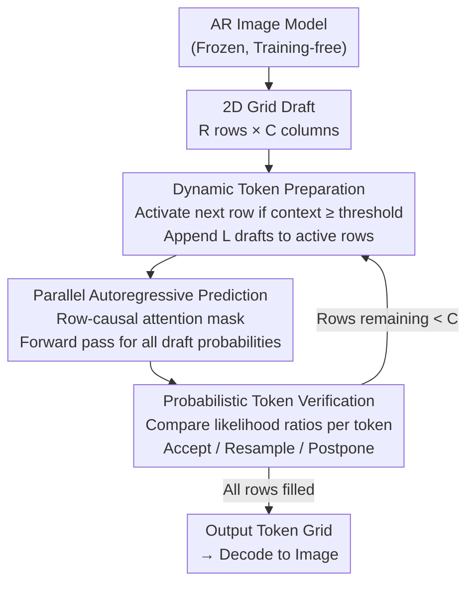

# Parallel Jacobi Decoding for Fast Autoregressive Image Generation

**Conference**: CVPR 2026  
**arXiv**: [2606.05703](https://arxiv.org/abs/2606.05703)  
**Code**: https://boyaliao.github.io/PJD/ (Project Page)  
**Area**: Autoregressive Image Generation / Inference Acceleration  
**Keywords**: Jacobi Decoding, Parallel Decoding, Training-free Acceleration, Spatial Locality, Autoregressive Image Generation

## TL;DR
Addressing the "token-by-token serial, extremely slow inference" bottleneck in autoregressive (AR) image generation, this paper proposes a training-free **Parallel Jacobi Decoding (PJD)**. It transforms the 1D Jacobi draft into a 2D "row-parallel" expansion along the image grid, utilizing a row-causal attention mask to suppress error accumulation. It achieves 4.8×–6.4× speedup on Lumina-mGPT / LlamaGen with negligible impact on image quality.

## Background & Motivation
**Background**: Autoregressive image generation (e.g., LlamaGen, Lumina-mGPT, Chameleon) first encodes images into discrete token grids using VQ tokenizers, flattens them into 1D sequences $\mathbf{x}=(x_1,\dots,x_L)$ in raster order, and predicts $p_\theta(\mathbf{x})=\prod_i p_\theta(x_i\mid x_{1:i-1})$ via transformers. Their image quality is comparable to diffusion models and naturally unifies language and vision modeling frameworks.

**Limitations of Prior Work**: Generating one token per forward pass requires hundreds or thousands of serial iterations (e.g., Lumina-mGPT takes ~197 seconds for 2,357 steps to generate 768×768 images), which is unacceptably slow for real-time applications. Typical diffusion acceleration techniques (distillation, solvers) cannot be directly applied due to fundamental differences in generation mechanisms.

**Key Challenge**: Among acceleration methods borrowed from LLMs, speculative decoding requires training an additional draft model. While Jacobi decoding is training-free and refines candidate tokens through fixed-point iteration, its **acceleration saturates quickly**. Extending the candidate window inevitably forces later tokens to attend to "uncertain candidates that have not converged," leading to harder refinement and slower convergence. The authors argue the root cause of this saturation is that Jacobi decoding **only expands in a 1D sequence**.

**Key Insight**: Visualizing the attention maps of Lumina-mGPT / LlamaGen (Figure 2) reveals that unlike text, where tokens have global long-range dependencies, image token attention is highly concentrated on the **diagonal and its adjacent bands**. Each token primarily attends to its own row and neighboring regions of previous rows, exhibiting strong spatial locality. Since dependencies are local, 1D expansion wastes the 2D structure of the image.

**Core Idea**: Extend the Jacobi draft from a 1D sequence to a **2D space**. Once a row accumulates sufficient context, draft tokens in the next row are initialized, allowing multiple rows to be refined in parallel during a single iteration. Because each token only attends to its generated neighbors, this localized refinement preserves the AR dependency structure and suppresses long-range error propagation. This allows more tokens to be accepted per round, ensuring faster and more stable convergence **without any additional training**.

## Method

### Overall Architecture
PJD is a training-free decoder wrapper for existing AR image models. It does not modify weights but changes how drafts are laid out, how attention is masked, and how tokens are verified. It treats the tokens to be generated as an $R\times C$ 2D grid ($R$ rows, $C$ tokens per row) and replaces raster scanning with an "advancing diagonal front": when the number of generated tokens in row $i$ reaches a threshold, row $i+1$ is activated. Consequently, multiple rows are often in active "refine" states simultaneously.

Each PJD iteration consists of three phases: **① Dynamic Token Preparation** decides which rows to activate and the length of draft tokens to append based on the generated context; **② Parallel Autoregressive Prediction** calculates the conditional probabilities of all draft tokens in a single forward pass using a row-causal attention mask; **③ Probabilistic Token Verification** determines if draft tokens have "converged" by comparing likelihood ratios across iterations, accepting stable tokens and rescheduling or resampling rejected ones. This loop continues until all $C$ tokens in every row are completed.

### Key Designs

**1. From 1D to 2D: Row-Parallel Draft Expansion**

This is the cornerstone of PJD, directly addressing the bottleneck of 1D Jacobi saturation. Traditional Jacobi lays out a long 1D draft $\mathbf{y}^{(0)}=(y^{(0)}_{t+1},\dots,y^{(0)}_{t+W})$, where later tokens attend to a long string of non-converged predecessors, amplifying errors. PJD implements **incremental 2D drafting**. Instead of blindly lengthening one row, it uses an "advancing diagonal front" to keep multiple rows active, with each row only appending a short draft segment. Due to the local nature of image attention, each draft token primarily attends to **committed neighboring tokens**, significantly reducing refinement difficulty. This results in more accepted tokens per round and more stable convergence, with speedups increasing at higher resolutions.

**2. Dynamic Token Preparation: Context-Controlled Row Activation**

To maintain coordination in 2D parallelism, PJD uses the **number of tokens generated in the previous row** (Context Token Count $c_i^{(k-1)}$) to measure if the spatial context is sufficient. Row $i+1$ is activated for Jacobi decoding only when row $i$ reaches a predefined threshold $T_{\mathrm{ctx}}$:

$$O_k=\{\,i+1 \mid c_i^{(k-1)}\ge T_{\mathrm{ctx}},\; i+1\notin O_{<k}\,\}.$$

For each newly activated row $i+1$, the draft length $L_{i+1}^{(k)}$ is the minimum of the window limit $W$ and the gap between rows: $L_{i+1}^{(k)}=\min\!\big(W,\,c_i^{(k-1)}-c_{i+1}^{(k-1)}\big)$. This ensures row $i+1$ never exceeds row $i$. This rule causes the decoding front to **push diagonally**, preventing premature activation while maximizing parallelism. The threshold can be normalized as a **Context Coverage Ratio** (e.g., 0.25).

**3. Row-Causal Attention Mask: Isolating Concurrent Drafts**

If drafts from different active rows are visible to each other, non-converged tokens could pollute one another. PJD introduces a **Row-Causal Attention Mask** (Figure 4): draft tokens in the current row **cannot attend to draft tokens in other rows**, but they retain visibility of all **committed tokens** from previous rows and preceding positions in their own row. This allows conditional probabilities for all drafts to be calculated in one forward pass, maintaining AR causal order and preserving inter-row context without mutual interference.

**4. Probabilistic Token Verification: Likelihood Ratios for Stability**

Image generation relies on top-k sampling for diversity, meaning the deterministic "exact token match" criterion from LLMs fails here. PJD adopts a **probabilistic convergence criterion**: for each token $x_{ij}$, it compares the conditional likelihood $p_\theta^{(k)}(x_{ij})$ with $p_\theta^{(k-1)}(x_{ij})$ from the previous iteration. Drawing $u\sim U[0,1]$, the token is accepted if:

$$u\le\min\!\Big(1,\;\frac{p_\theta^{(k)}(x_{ij})}{p_\theta^{(k-1)}(x_{ij})}\Big)$$

This stochastic rule favors tokens with stable likelihoods across rounds while tolerating sampling noise. Verification proceeds row-by-row and left-to-right. If the first token of the top-most active row is rejected, it is resampled from a **calibrated distribution** emphasizing new probability mass:

$$x_{ij}^{(k)}\sim\frac{\max\!\big(0,\,p_\theta^{(k)}(x_{ij})-p_\theta^{(k-1)}(x_{ij})\big)}{\sum_{x'}\max\!\big(0,\,p_\theta^{(k)}(x')-p_\theta^{(k-1)}(x')\big)},$$

guaranteeing at least one new token is committed per round. Subsequent rejected tokens and their successors in the row are postponed to the next round, with drafts updated using current predictions to avoid stale data.

### Loss & Training
**Ours is training-free**. PJD is a pure inference-time decoding algorithm that introduces no learnable parameters and requires no fine-tuning. It can be directly applied to models like Lumina-mGPT / LlamaGen. The only hyperparameters are the Context Token Count $c$ and draft window $W$.

## Key Experimental Results

### Main Results
Evaluated on MS-COCO (5,000 random captions) and PartiPrompt (1,632 prompts) using Lumina-mGPT 7B@768×768 and LlamaGen-XL 7B@512×512. Efficiency is measured by Latency/Step; quality by FID/CLIP-Score/IS. Compared with Vanilla AR, SJD, and GSD.

Main results on MS-COCO (Excerpt from Table 1, speedup relative to Vanilla AR):

| Model | Method | Latency↓ | Step↓ | Gain (Latency/Step) | FID↓ | CLIP↑ | IS↑ |
|------|------|----------|-------|------|------|-------|-----|
| Lumina-mGPT | Vanilla AR | 197.16s | 2357 | 1.00× / 1.00× | 30.79 | 31.31 | 32.81 |
| Lumina-mGPT | SJD | 52.97s | 1056 | 3.72× / 2.23× | 30.87 | 31.65 | 32.94 |
| Lumina-mGPT | GSD | 34.36s | 698 | 5.74× / 3.38× | 33.41 | 31.46 | 31.48 |
| Lumina-mGPT | **Ours (c=16)** | 32.91s | 476 | **5.99× / 4.95×** | 31.94 | 31.55 | 31.54 |
| Lumina-mGPT | **Ours (c=11)** | 24.78s | 371 | **7.96× / 6.35×** | 32.38 | 31.53 | 31.23 |
| LlamaGen-XL | Vanilla AR | 49.58s | 1024 | 1.00× / 1.00× | 45.02 | 28.59 | 22.11 |
| LlamaGen-XL | GSD | 19.31s | 383 | 2.57× / 2.67× | 47.13 | 28.12 | 20.89 |
| LlamaGen-XL | **Ours (c=6)** | 11.84s | 213 | **4.19× / 4.81×** | 45.12 | 28.67 | 22.07 |

Key takeaway: PJD achieves significantly better step compression than SJD and GSD with comparable or better quality. Smaller $c$ values provide higher speedups with slight quality drops.

### Ablation Study

| Configuration | Key Metric | Description |
|------|---------|------|
| Context Token Count $c\in\{4,6,9,11,16,32\}$ | $c$↑ → FID↓ but step compression↓ | Trade-off between context-driven fidelity and parallel efficiency. |
| top-k $\in$ {…, 1000, 2000} | ~6× speedup across all k; FID=30.28 best at k=1000 | Acceleration is robust to sampling budgets. |
| CFG scale scan | >6× step compression throughout; CFG↑ → FID↓ | High CFG improves quality without sacrificing efficiency. |
| Resolution 512/768/1024 | Step compression at 1024×1024 reaches 6.9× | Higher resolutions yield higher PJD gains (2D parallel dividend). |

### Key Findings
- **Context Token Count is the core control**: It determines when the next row begins, directly managing the speed-fidelity trade-off.
- **Speedup ratio increases with resolution**: From 512 to 1024, step compression increases from ~4.8× to 6.9×, as larger images allow more concurrently active rows—unlike 1D Jacobi, which saturates.
- **Robustness to sampling**: Maintains stable ~6× acceleration across various top-k and CFG settings, proving the probabilistic verification criterion isn't compromised by sampling randomness.

## Highlights & Insights
- **Attributing saturation to dimension mismatch**: The authors use attention visualization to diagnose 1D Jacobi as "expanding in the wrong direction" relative to image spatial locality, elegantly providing 2D expansion as the solution.
- **Training-free, plug-and-play**: Without modifying weights or training draft models, PJD can be applied to any raster-order AR image model, ensuring extremely low deployment costs.
- **Row-causal mask as a "safety valve"**: By restricting each token to a legal AR condition via the mask while allowing parallel calculation, it maintains causal integrity during structural parallelism.
- **Tolerance for sampling randomness**: Using likelihood ratios instead of exact token matching allows Jacobi to function with top-k sampling while guaranteeing stable progress every round.

## Limitations & Future Work
- **Dependency on raster order + spatial locality**: The method assumes local row-based attention. For models using random generation orders (e.g., ARPG) or weak locality, 2D row-wise expansion may not be effective.
- **Quality is not strictly lossless**: At small $c$ values, FID increases slightly (e.g., FID 32.98 for $c=9$ vs. 30.79 for Vanilla). Extreme acceleration comes at a perceptible fidelity cost.
- **Hyperparameter tuning requirements**: $c$, $W$, and initialization token choices require per-model/per-resolution tuning; an adaptive mechanism for selecting $c$ is lacking.
- **Orthogonality with KV-cache compression**: PJD focuses on reducing serial steps but does not explore combined gains with KV-cache compression or quantization.

## Related Work & Insights
- **vs SJD (Speculative Jacobi Decoding)**: SJD uses probabilistic verification for 1D Jacobi. PJD inherits this but shifts to 2D expansion, achieving much higher step compression (6.35× vs. 2.23×) at similar quality.
- **vs GSD (Grouped Speculative Decoding)**: GSD relies on grouped verification in 1D; PJD uses spatial parallelism for higher speedups and more stable FID.
- **vs ZipAR / PAR / LPD**: These also leverage spatial locality for parallel generation. PJD adopts the "context count" activation from ZipAR but integrates it into a convergent Jacobi refinement framework with probabilistic verification.
- **vs Speculative Decoding (Medusa/Speculative Sampling)**: These require training draft models, whereas PJD is entirely training-free and model-less, making it much lighter to deploy.

## Rating
- Novelty: ⭐⭐⭐⭐ Translating "image attention locality" into a "2D Jacobi expansion" diagnosis is convincing and clean, despite borrowing some components (probabilistic acceptance).
- Experimental Thoroughness: ⭐⭐⭐⭐ Extensive ablations across models, datasets, resolutions, and sampling settings, though missing joint experiments with orthogonal methods like KV-cache compression.
- Writing Quality: ⭐⭐⭐⭐ Logical flow from motivation to observation to method; pseudocode and diagrams are comprehensive.
- Value: ⭐⭐⭐⭐ Training-free, plug-and-play, 4.8×–6.4× speedup with minimal quality loss; high practical value for deploying AR image generation.

<!-- RELATED:START -->

## Related Papers

- [\[ICLR 2026\] Autoregressive Image Generation with Randomized Parallel Decoding](../../ICLR2026/image_generation/autoregressive_image_generation_with_randomized_parallel_decoding.md)
- [\[CVPR 2026\] SJD-PAC: Accelerating Speculative Jacobi Decoding via Proactive Drafting and Adaptive Continuation](sjd-pac_accelerating_speculative_jacobi_decoding_via_proactive_drafting_and_adap.md)
- [\[ICLR 2026\] Locality-aware Parallel Decoding for Efficient Autoregressive Image Generation](../../ICLR2026/image_generation/locality-aware_parallel_decoding_for_efficient_autoregressive_image_generation.md)
- [\[CVPR 2026\] Multi-Scale Local Speculative Decoding for Image Generation](multi-scale_local_speculative_decoding_for_image_generation.md)
- [\[CVPR 2026\] FastHybrid: Accelerating Hybrid Autoregressive Image Generation with Lookahead and Guided Decoding](fasthybrid_accelerating_hybrid_autoregressive_image_generation_with_lookahead_an.md)

<!-- RELATED:END -->
