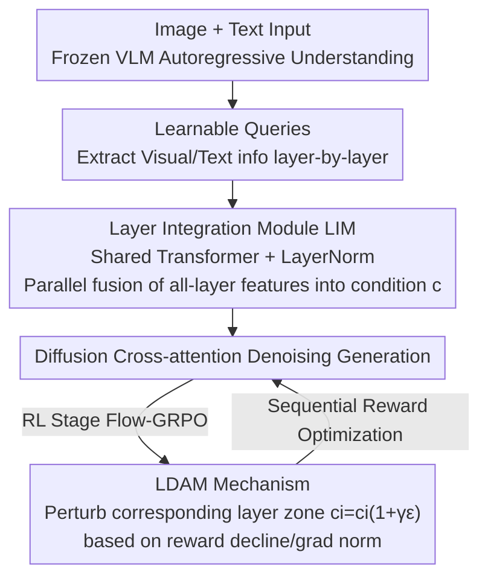

# ParaUni: Enhance Generation in Unified Multimodal Model with Reinforcement-driven Hierarchical Parallel Information Interaction

**Conference**: CVPR 2026  
**Paper**: [CVF Open Access](https://openaccess.thecvf.com/content/CVPR2026/html/Tan_ParaUni_Enhance_Generation_in_Unified_Multimodal_Model_with_Reinforcement-driven_Hierarchical_CVPR_2026_paper.html)  
**Code**: https://github.com/JosephTiTan/ParaUni  
**Area**: Image Generation / Multimodal VLM  
**Keywords**: Unified Multimodal Model, Text-to-Image, Diffusion Model, VLM Hierarchical Features, Reinforcement Learning

## TL;DR
In "understanding-generation unified" multimodal models, ParaUni shifts from using only the final layer of VLM as the diffusion condition to a parallel integration of all VLM layer visual features through a Layer Integration Module (LIM). During the RL stage, a Layer-wise Dynamic Adjustment Mechanism (LDAM) is employed to specifically perturb different layers based on distinct rewards, thereby enhancing both fine details and semantic alignment. It achieves a GenEval of 0.87 and a DPG-Bench score of 83.45.

## Background & Motivation

**Background**: Unified multimodal models, which combine autoregressive VLMs for understanding with diffusion models for generation, represent a significant trend in image generation. A common approach involves feeding VLM features as conditions into a diffusion decoder.

**Limitations of Prior Work**: The authors categorize existing VLM↔Diffusion interaction methods into three types, each with inherent flaws:
- (a) **Last-layer Interaction** (e.g., Janus): Only uses the last VLM layer feature as a condition. This results in insufficient information interaction, providing only abstract semantics while losing fine-grained textures, which limits generation fidelity.
- (b) **Integrated Architecture** (e.g., Show-o): Embeds the diffusion denoising process into the autoregressive flow of the same transformer. However, the optimization objectives of the two are vastly different, making training difficult and preventing the direct reuse of pre-trained models.
- (c) **Separated Parameters** (e.g., Bagel): Uses separate sets of parameters for understanding and generation, interacting via shared self-attention within blocks. While interaction is richer, the tight coupling leads to poor flexibility/scalability and high inference latency.

**Key Challenge**: A trade-off exists between interaction thoroughness (information completeness) and flexible implementation (decoupled architecture, reusability, scalability). The root cause is the massive discrepancy between VLM and diffusion representations; single-layer conditioning lacks information, while deep coupling is overly heavy.

**Goal**: To find a conditioning method that enables thorough interaction while maintaining the flexible separation of understanding and generation modules, further enhancing generation quality during the RL stage.

**Key Insight**: The authors make two critical observations. First, different VLM layers encode varying information from low-level details to high-level semantics. By extracting visual tokens layer-by-layer as conditions for generation and measuring CLIP scores, they found that shallow layers focus on texture while deep layers exhibit stronger semantics; CLIP scores increase with layer depth (Fig. 2), and using all layers provides richer detail than using only the last layer (Fig. 3). Second, inter-layer cosine similarity analysis reveals that adjacent layers are similar and naturally cluster into regions that **respond differently to various rewards**: middle regions align with Aesthetic and Pickscore, while deep regions align with CLIP scores.

**Core Idea**: Replace "last-layer only" with "parallel integration of all VLM layer features" to complete conditional information (LIM), and use "targeted perturbation of corresponding layer zones based on rewards" to improve multiple rewards during the RL stage (LDAM), all while maintaining the loose coupling between VLM and diffusion modules.

## Method

### Overall Architecture
ParaUni follows the design of MetaQuery/OpenUni: a frozen VLM (InternVL3-2B) + a set of learnable queries + a diffusion model (SANA-1.5). During generation, learnable queries extract contextual information (visual/textual) from **every layer** during the VLM forward pass. Queries from all layers are fed in parallel into the **Layer Integration Module (LIM)** (a shared Transformer + LayerNorm) to fuse into a single condition $c$, which is then fed into the diffusion cross-attention for denoising. Training occurs in three stages: Stage I trains only the LIM and learnable queries to align VLM with diffusion; Stage II fine-tunes queries, LIM, and the diffusion model using high-quality data; Stage III performs multi-reward RL using Flow-GRPO, introducing the **Layer-wise Dynamic Adjustment Mechanism (LDAM)**. This mechanism monitors training signals for each reward in real-time; when a reward consistently declines or gradient norms fluctuate violently, Gaussian noise is injected into the corresponding layer zone to encourage exploration and stabilize training. Multiple rewards are trained sequentially, preserving perturbations for each.

### Key Designs

**1. All-layer Parallel Conditioning: Feeding All VLM Layers to Diffusion**

This design directly addresses the "insufficient info in last-layer interaction" pain point. The authors empirically demonstrate VLM hierarchical properties: generating images using tokens from the $i$-th layer as conditions shows that CLIP scores rise monotonically with depth, with shallow layers producing textures and deep layers producing semantics (Fig. 2), proving each layer carries unique info. ParaUni extracts learnable queries $q_i$ from all layers in parallel for fusion. The LIM is formalized as: each layer $c_i = \text{LN}(f_\theta(q_i)), \ i \in [0, L]$, then the mean is taken $c = \frac{1}{n}\sum_{i=1}^n c_i$ as the condition for DiT cross-attention. Here $f_\theta$ is a **shared** Transformer module (parameter-efficient), and LN aligns the scales across different layers. Ablations show significant performance drops without the Transformer module or LayerNorm.

**2. Layer-wise Dynamic Adjustment Mechanism (LDAM): Targeted Perturbations for Multi-Reward Gains**

This design responds to the observation that "different layers respond differently to different rewards." Authors experimentally removed specific layer zones and measured impacts on rewards (Fig. 5): CLIP score is sensitive to all zones (especially deep), while Aesthetic and Pickscore are most sensitive to middle zones and nearly unaffected by shallow ones. Thus, when optimizing a specific reward, the most sensitive layers are perturbed (CLIP uses $i \in [24, 28]$, Pickscore/Aesthetic use $i \in [12, 23]$). The perturbation mechanism injects Gaussian noise $c_i = c_i(1 + \gamma \epsilon), \ \epsilon \sim \mathcal{N}(0, I)$, where $\gamma$ is a scale factor. This is triggered by a dual-gate (Algorithm 1): when a reward consistently drops (reward guidance, $r_s \ge 5$ consecutive rounds) **and** the gradient norm spikes (GradNorm guidance). A cooling period follows to maintain stability. Multi-reward optimization is **sequential/curriculum-based**: Aesthetic and Pickscore are trained first, followed by CLIP score.

**3. Three-stage Training Recipe: Alignment, Fine-tuning, then RL**

Stage I aligns the frozen VLM and diffusion using LIM and learnable queries on datasets like text-to-image-2M and LAION-Aesthetic-6M. Stage II uses BLIP3-o-60k high-quality data to tune queries, LIM, and the diffusion model, already surpassing models using only the last layer. Stage III uses the Flow-GRPO framework for multi-reward RL. Flow-GRPO reformulates deterministic ODE sampling into SDE by injecting randomness $dx_t = [v_t + \frac{\sigma_t^2}{2t}(x_t + (1-t)v_t)]dt + \sigma_t dw_t$, enabling diverse sample generation for GRPO on flow-matching models.

### Main Results

Base VLM = InternVL3-2B (Frozen), Diffusion = SANA-1.5-1.6B. 28 layers, 256 learnable queries. Trained on NVIDIA A800.

**GenEval Text-to-Image (Higher is better):**

| Type | Method | Two Obj. | Counting | Position | Color Attri. | Overall↑ |
|------|------|----------|----------|----------|--------------|----------|
| Gen-only | SDXL | 0.74 | 0.39 | 0.15 | 0.23 | 0.55 |
| Gen-only | SD3-Medium | 0.94 | 0.72 | 0.33 | 0.60 | 0.74 |
| Unified | Janus | 0.68 | 0.30 | 0.46 | 0.42 | 0.61 |
| Unified | BAGEL | 0.94 | 0.81 | 0.64 | 0.63 | 0.82 |
| Unified | OpenUni | 0.92 | 0.76 | **0.82** | 0.77 | 0.86 |
| Unified | **Ours** | 0.94 | 0.78 | **0.83** | 0.76 | **0.87** |

**DPG-Bench (Dense prompt semantic alignment, higher is better):**

| Method | Global | Entity | Relation | Overall↑ |
|------|--------|--------|----------|----------|
| Janus-Pro-1B | 87.58 | 88.63 | 88.98 | 82.63 |
| OpenUni | 87.01 | 90.02 | 90.28 | 83.08 |
| **ParaUni** | **90.01** | 89.31 | **91.85** | **83.45** |

ParaUni's GenEval score of 0.87 and DPG-Bench score of 83.45 outperform unified model baselines and significantly lead pure generation models.

### Ablation Study

**GenEval (Selected categories + Overall):**

| Configuration | Single Obj. | Colors | Position | Overall↑ |
|------|-------------|--------|----------|----------|
| (1) Remove Shallow Subset | 0.98 | 0.88 | 0.75 | 0.82 |
| (2) Remove Middle Subset | 0.99 | 0.90 | 0.81 | 0.85 |
| (3) Remove Deep Subset | 0.99 | 0.90 | 0.82 | 0.84 |
| (4) Interval Sampling | 1.00 | 0.90 | 0.81 | 0.86 |
| (5) LIM w/o LayerNorm | 0.98 | 0.61 | 0.75 | 0.73 |
| (6) LDAM w/o GradNorm Gate | 0.98 | 0.90 | 0.82 | 0.86 |
| (7) LDAM w/o Reward Drop Gate | 0.98 | 0.90 | 0.81 | 0.86 |
| **Ours (All-layer + full LIM/LDAM)** | 0.99 | 0.91 | **0.83** | **0.87** |

**Plug-and-play on weaker bases:**

| Method | GenEval↑ | DPG-Bench↑ |
|------|----------|-----------|
| Janus-Pro (1B) | 0.73 | 82.63 |
| Janus-Pro (1B) + ParaUni | **0.80** | **83.65** |
| BLIP-3o (4B) | 0.81 | 79.36 |
| BLIP-3o (4B) + ParaUni | **0.84** | **81.97** |

### Key Findings
- **No layer subset is redundant**: Removing shallow/middle/deep zones or using interval sampling reduces performance, confirming all-layer conditioning is necessary.
- **LayerNorm is critical**: Its removal causes the "Colors" score to plummet from 0.91 to 0.61, highlighting the importance of alignment across layer scales.
- **Dual-gate in LDAM**: Both GradNorm and reward-drop triggers are essential; removing either impairs RL results.
- **Strong Generalizability**: ParaUni serves as a plug-and-play module that improves weaker bases like Janus-Pro and BLIP-3o.

## Highlights & Insights
- **"Layers as Reward Knobs"**: Demonstrating "different VLM layers correspond to different reward sensitivities" and using LDAM to perturb accordingly is an elegant solution to the multi-reward RL trade-off.
- **Efficiency via Parallel + Shared Transformer**: A shared module processes all layers in parallel, avoiding tight coupling (maintaining flexibility) while providing much richer info than the last layer (ensuring quality).
- **Practical RL Stability**: The dual-gate trigger for perturbations, combined with cooling periods, provides a robust engineering solution for stabilizing GRPO training.

## Limitations & Future Work
- The VLM remains frozen; ParaUni improves generation but does not enhance the VLM's understanding capabilities.
- LDAM zone definitions and thresholds are empirical; their optimality across different bases or rewards requires more discussion.
- Multi-reward optimization is sequential; whether parallel joint optimization or a different sequence is better remains unexplored.
- Evidence for tasks beyond T2I (e.g., I2I, editing) is mostly relegated to the supplementary material.

## Related Work & Insights
- **vs. Last-layer Interaction (Janus)**: ParaUni uses all-layer parallel conditioning to recover missing details.
- **vs. Integrated Architecture (Show-o)**: ParaUni maintains loose coupling, allowing for model reuse and easier training.
- **vs. Separated Parameters (Bagel)**: ParaUni uses a lightweight LIM for fusion, ensuring flexibility and lower overhead compared to tight parameter coupling.
- **Differentiator**: Unlike previous work that either uses one-to-one coupling or ignores layer-specific properties, ParaUni explicitly leverages hierarchical characteristics to drive RL perturbations.

## Rating
- Novelty: ⭐⭐⭐⭐ (Insights on layer-reward mapping + LDAM are genuinely novel).
- Experimental Thoroughness: ⭐⭐⭐⭐ (Main benchmarks + thorough ablations + plug-and-play tests).
- Writing Quality: ⭐⭐⭐⭐ (Strong empirical motivation using CLIP scores and layer analysis).
- Value: ⭐⭐⭐⭐ (Practical plug-and-play module for improving unified models).

<!-- RELATED:START -->

## Related Papers

- [\[CVPR 2026\] Goal-Driven Reward by Video Diffusion Models for Reinforcement Learning](goal-driven_reward_by_video_diffusion_models_for_reinforcement_learning.md)
- [\[NeurIPS 2025\] Co-Reinforcement Learning for Unified Multimodal Understanding and Generation](../../NeurIPS2025/image_generation/coreinforcement_learning_for_unified_multimodal_understandin.md)
- [\[CVPR 2026\] Learning to Generate via Understanding: Understanding-Driven Intrinsic Rewarding for Unified Multimodal Models](learning_to_generate_via_understanding_understanding-driven_intrinsic_rewarding_.md)
- [\[CVPR 2026\] HiCoGen: Hierarchical Compositional Text-to-Image Generation in Diffusion Models via Reinforcement Learning](hicogen_hierarchical_compositional_text-to-image_generation_in_diffusion_models_.md)
- [\[CVPR 2026\] Proxy-Tuning: Tailoring Multimodal Autoregressive Models for Subject-Driven Image Generation](proxy-tuning_tailoring_multimodal_autoregressive_models_for_subject-driven_image.md)

<!-- RELATED:END -->
