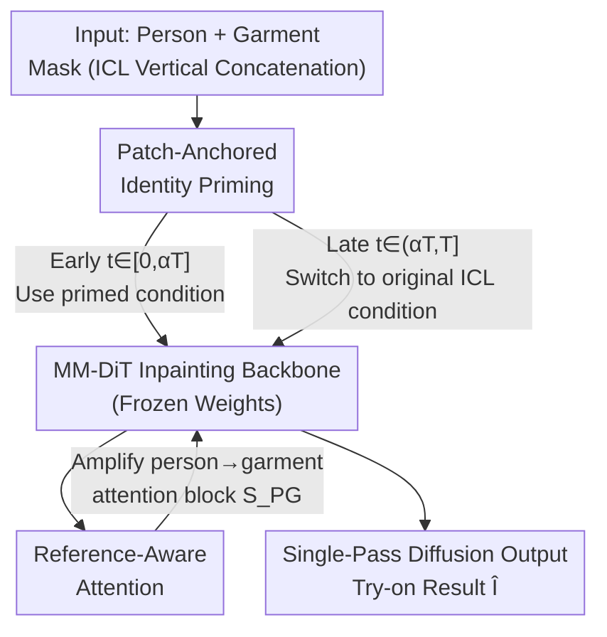

# PG-VTON: Single-Pass Training-Free Virtual Try-On via Patch-Guided Reference Alignment

**Conference**: CVPR 2026  
**Paper**: [CVF Open Access](https://openaccess.thecvf.com/content/CVPR2026/html/Zhao_PG-VTON_Single-Pass_Training-Free_Virtual_Try-On_via_Patch-Guided_Reference_Alignment_CVPR_2026_paper.html)  
**Code**: https://github.com/PKU-ICST-MIPL/PG-VTON  
**Area**: Diffusion Models / Image Generation / Virtual Try-On  
**Keywords**: Virtual Try-On, training-free, single-pass inference, diffusion inpainting models, attention modulation

## TL;DR
Without training, pose estimation, or explicit warping, PG-VTON achieves high-fidelity virtual try-on in a **single-pass diffusion** process simply by inserting two lightweight controllers into a frozen MM-DiT inpainting model during inference (injecting small garment patches early on to anchor identity + amplifying "person-to-garment" attention). It achieves state-of-the-art (SOTA) performance among training-free methods on DressCode / VITON-HD and can be directly transferred to subject insertion tasks.

## Background & Motivation

**Background**: Virtual try-on (VTON) aims to transfer a target garment onto a target person while preserving the person's identity and pose, and faithfully restoring the color, texture, and logo of the garment. Mainstream methods are divided into two camps: one utilizes the warp-and-fuse pipeline of appearance flow (VITON, CP-VTON, GP-VTON, D4-VTON) to first warp the garment to the person's body and then fuse them; the other utilizes single-stage generative models (IDM-VTON, CatVTON, Leffa) to directly synthesize the try-on result using a diffusion model. Both camps heavily rely on paired supervision data.

**Limitations of Prior Work**: Paired datasets (VITON-HD, DressCode) almost exclusively consist of indoor catalog images—characterized by restricted viewpoints, low diversity of people and garments, and a uniform studio style, making models highly prone to overfitting. When faced with real-world photos (complex poses, variable lighting, unseen garments), these models generate overly smooth textures, color shifts, and geometric distortions, resulting in poor cross-domain generalization. To escape paired supervision, recent works like OmniVTON take a training-free path by assembling human parsing, semantic matching, and multi-stage diffusion/synthesis to implicitly construct appearance flows. Although more robust, the trade-off is running multiple diffusion passes along with a series of auxiliary stages, which leads to high latency, high engineering complexity, and failures if pose or correspondence estimation is inaccurate.

**Key Challenge**: While prior training-free pipelines have proven that "strong supervision is not essential," this robustness comes at the cost of "multi-stage, multi-pass diffusion"—a **simple, efficient, single-pass inference** paradigm is still missing. Robustness and deployment efficiency are tightly locked in a tension.

**Key Insight**: The authors leverage an empirical observation about MM-DiT inpainting diffusion models—these inpainting models, pre-trained on large-scale heterogeneous images, inherently possess strong **contextual completion capabilities**. When provided with a masked garment region and a proper visual cue, they can synthesize content that is semantically consistent, structurally reasonable, and aligned with the surrounding context, **completely without any VTON-specific fine-tuning**. More specifically: if a small patch is cropped from the garment image and pasted onto the target area of the person, the frozen inpainting model often fills the remaining masked region to match the appearance of this patch while aligning with the person's pose (Fig. 3b of the paper).

**Core Idea**: Instead of fine-tuning on narrow-domain try-on data (which risks overfitting), it is better to design **inference-time** control mechanisms to unlock and guide the native capabilities of the pre-trained inpainting model. However, the naive trick of "hard-pasting patches" must be transformed into a principled soft guidance, as hard-pasting introduces positional misalignment (the pasted location does not align with the true deformation of the garment on the body) and photometric mismatch (discrepancies in pose, shadow, and camera statistics), leaving obvious seams and unrealistic geometry. This motivates PG-VTON: Patch-Guided Reference Alignment.

## Method

### Overall Architecture

PG-VTON is built upon a **frozen MM-DiT-based latent inpainting model** (specifically utilizing FLUX.1-fill), requiring no weight updates or external pose estimators/correspondence modules during the entire process. It adopts the in-context learning (ICL) input construction from CatVTON: the masked person image $I_m=(1-M_p)\odot I_p$ and the garment reference image $I_g$ are vertically concatenated as $I_{in}=\text{Concat}_{vert}(I_m, I_g)$. The corresponding masks are also concatenated into $M_{in}=\text{Concat}_{vert}(M_p, M_{blank})$ (where $M_{blank}$ is an all-zero mask of the same size as $I_g$). The inpainting model $f_\theta$ receives $(I_{in}, M_{in})$ and a fixed text prompt to predict the completion in the masked region of the person branch. The entire generation process is executed in the VAE latent space.

However, simply feeding this ICL input is insufficient: directly passing $(I_{in}, M_{in})$ often fails to reliably reconstruct the target clothing, as the model might partially ignore $I_g$ or hallucinate plausible but incorrect garments (Fig. 3a). PG-VTON inserts two **strictly inference-time** lightweight controllers into this frozen backbone to "control" it, operating at different phases of the denoising trajectory: **PIP (Patch-Anchored Identity Priming)** injects several garment patches during the early stage of denoising to "anchor" the generation trajectory toward the correct garment identity (color, pattern, local structure); **RAA (Reference-Aware Attention)** scales up the intensity of "person tokens attending to garment tokens" in the self-attention layer to faithfully transfer fine details such as textures, logos, and edges. They work in tandem, allowing the model to complete the try-on in a **single-pass diffusion** process.

### Key Designs

**1. Patch-Anchored Identity Priming (PIP): Injecting patches early to anchor garment identity, then relinquishing control**

This design targets the following limitation: while naively "hard-pasting" garment patches onto the person allows the frozen model to capture the garment identity, it introduces two fatal flaws—the pasted positions do not match the unknown deformation of the garment on the body, and the photometric statistics of the patches (pose, shadows, camera) do not match the person, resulting in visible seams and unrealistic geometry (bottom of Fig. 3b). PIP modifies this hard-pasting trick into a **transient, latent-space soft guidance**: it only provides patch-level identity priors during the **very beginning** of the generation trajectory to push the trajectory toward the correct appearance, and then smoothly hands over control to the original masked input to fit the person's geometry in the later stages.

Specifically, the tight bounding boxes $Rec_p$ and $Rec_g$ of the person mask $M_p$ and garment mask $M_g$ are first calculated, assuming an approximate one-to-one correspondence between the two rectangles. Formally, $K$ square patches are randomly sampled within $Rec_g$. For each garment patch $P_g^k$ with normalized center coordinates $(P_x, P_y)$, the coordinates are mapped to the target location $(p_x, p_y)$ within $Rec_p$ to determine where it should be pasted on the person, yielding a composite patch mask $M_c=\bigcup_{k=1}^K M_p^k \subseteq M_p$. These $K$ patches are then pasted into the masked person image, producing the primed masked image:

$$I_c = (1-M_c)\odot I_m + \sum_{k=1}^{K}(M_p^k \odot P_g^k)$$

According to the ICL paradigm, these are concatenated to form the primed input $\tilde I_{in}=\text{Concat}_{vert}(I_c, I_g)$, which is encoded via VAE into the primed latent condition $c_{prime}$ (in contrast to the original condition $c_{orig}$ constructed with the original masked image). The key lies in a **piecewise condition scheduler**: in the early steps $t\in[0,\alpha T]$, $c_{prime}$ is concatenated with the current latent $z_t$ along the feature dimension and fed into the MM-DiT to predict the velocity $\hat v_t$; in the later steps $t\in(\alpha T, T]$, the model switches back to $c_{orig}$. That is:

$$\hat v_t = f_\theta(z_t, t, c_t),\quad c_t=\begin{cases} c_{prime} & t\in[0,\alpha T] \\ c_{orig} & t\in(\alpha T, T] \end{cases}$$

In this way, the model first establishes the correct garment identity (color, texture, logo) from the patches. Once the identity is anchored, it refines the geometry, shadows, and wrinkles to naturally fit the pose in the subsequent steps—retaining the patch-level identity information while avoiding geometric misalignment and seams, all while maintaining single-pass inference latency and keeping model weights frozen. By default, $\alpha=0.1$, meaning priming is only applied for the first 10% of the denoising steps.

**2. Reference-Aware Attention (RAA): Amplifying the "person → garment" attention block to enforce detail transfer**

Although PIP biases the global identity in the early trajectory, fine-grained textures might still be underrepresented if person tokens primarily attend to themselves. To address this limitation, RAA introduces a **training-free** modification to the self-attention in the DiT block, explicitly routing detailed cues from the garment image to the generated garment region. Under the ICL format, the token sequence naturally splits into three segments: $Z_{full}=[\mathcal{T}, Z_g, Z_p]$ (text tokens, garment branch visual tokens, person branch visual tokens). Consequently, the attention score matrix $S=\frac{QK^\top}{\sqrt{d_k}}$ can be viewed as a $3\times3$ block matrix, where $S_{PG}$ corresponds to the logits of "person query → garment key".

The execution of RAA is extremely simple: define a $3\times3$ block scaling matrix $M_\gamma$ that only multiplies the block corresponding to $S_{PG}$ by a scaling factor $\gamma>1$ (with other blocks multiplied by $1$). Through a Hadamard element-wise product, we get $\tilde S = S\odot M_\gamma$, followed by $\tilde A=\text{Softmax}(\tilde S)$ and $\tilde Z=\tilde A V$. This step **selectively amplifies the entire $S_{PG}$ block** before the softmax operation, compelling the masked person tokens to "look at" the garment branch more intensely. This results in: (i) enhanced alignment between the generated garment and the reference appearance; (ii) improved robustness in transferring logos, prints, and edge structures; (iii) complete bypass of explicit correspondence estimation or auxiliary networks. By default, $\gamma=3$. Note that ablation studies show that using RAA alone yields consistently smaller gains than PIP alone—it acts more like a local refinement "after the identity is established" rather than the primary driver.

### Loss & Training
There is no training. PG-VTON freezes all weights of FLUX.1-fill throughout the entire process; both PIP and RAA are strictly inference-time operations with zero parameter updates. Hyperparameters are fixed: $\alpha=0.1$ (ratio of priming steps), $\gamma=3$ (attention scaling factor), and the text prompt is fixed to "a model wearing clothes". For VITON-HD / DressCode, the resolution is set to 1024×768. For StreetTryOn, 512×320 is used following its original protocol.

## Key Experimental Results

### Main Results

Cross-domain evaluation is conducted on VITON-HD and DressCode (evaluating on VITON-HD using the official weights trained on DressCode, and vice versa). Metrics include FID (paired/unpaired), SSIM, and LPIPS. PG-VTON achieves the best overall performance under both datasets and settings, requiring only a **single-pass diffusion** instead of multi-stage pipelines.

| Dataset | Metric | PG-VTON (Ours) | OmniVTON (Training-Free) | Any2AnyTryon | CatVTON |
|--------|------|------|------|------|------|
| VITON-HD | FIDu ↓ | **9.873** | 13.167 | 10.971 | 15.228 |
| VITON-HD | FIDp ↓ | **6.749** | 10.168 | 8.188 | 12.754 |
| VITON-HD | SSIMp ↑ | **0.877** | 0.874 | 0.867 | 0.816 |
| VITON-HD | LPIPSp ↓ | 0.086 | 0.112 | **0.085** | 0.154 |
| DressCode | FIDu ↓ | **6.693** | 13.415 | 8.182 | 10.161 |
| DressCode | FIDp ↓ | **4.195** | 12.394 | 5.478 | 8.775 |
| DressCode | SSIMp ↑ | **0.907** | 0.896 | 0.891 | 0.875 |
| DressCode | LPIPSp ↓ | **0.055** | 0.086 | 0.060 | 0.081 |

Importantly, PG-VTON outperforms Any2AnyTryon—which uses the **same DiT inpainting backbone** but is trained on broader datasets (VITON-HD + DressCode + DeepFashion2 + LRVS-Fashion + custom collected/synthesized try-on data, noted in grey in the paper for its superior training regime). Outperforming it under identical backbone but weaker (zero) supervision demonstrates that carefully designed training-free inference-time controllers can match or even exceed heavily trained pipelines.

On StreetTryOn, real-world cross-domain robustness is measured across four settings: Shop-to-Street, Model-to-Model, Model-to-Street, and Street-to-Street. Since FID is generally >30 and hard to differentiate, CMMD is also reported:

| Metric | Setting | PG-VTON | OmniVTON |
|------|------|------|------|
| FID ↓ | Street-to-Street | **21.028** | 23.470 |
| FID ↓ | Shop-to-Street | 34.158 | **33.919** |
| CMMD ↓ | Shop-to-Street | **0.263** | 0.599 |
| CMMD ↓ | Model-to-Model | **0.358** | 1.215 |
| CMMD ↓ | Model-to-Street | **0.459** | 0.764 |
| CMMD ↓ | Street-to-Street | **0.301** | 0.688 |

On the most challenging Street-to-Street setting, the FID of PG-VTON significantly outperforms all baselines. For CMMD, it substantially outperforms OmniVTON across all four settings, indicating that the generated distribution aligns much better with the real distribution under real-world conditions. Although the FID is slightly worse than OmniVTON in certain setting combinations (e.g., Shop-to-Street), the authors supplement this with the more discriminative CMMD metric to justify the overall advantage.

### Ablation Study

Ablation of PIP and RAA on VITON-HD:

| Configuration | FIDu ↓ | FIDp ↓ | SSIMp ↑ | LPIPSp ↓ | Description |
|------|--------|--------|---------|----------|------|
| ICL only (Both removed) | 13.393 | 8.954 | 0.842 | 0.112 | Pure inpainting backbone; fails to track clothing in single-pass |
| + PIP only | 10.829 | 7.382 | 0.852 | 0.100 | Primary source of improvement |
| + RAA only | 11.543 | 8.099 | 0.849 | 0.106 | Improvement is consistently smaller than PIP |
| Full (PIP+RAA) | **9.873** | **6.749** | **0.877** | **0.086** | Best across all metrics |

### Key Findings
- **PIP is the primary driver**: Adding PIP alone yields most of the performance gain (FIDu 13.393 → 10.829, FIDp 8.954 → 7.382), demonstrating that early patch-level identity priors can stabilize the denoising trajectory and anchor garment identity even without modifying attention.
- **RAA acts as a local refinement after identity establishment**: Adding RAA alone also improves upon the baseline, but the gains in each metric are smaller than those of PIP. Attention re-weighting is most effective only when the identity context has already been established; the synergy of PIP+RAA achieves the best overall performance.
- **ICL-only is the worst**: This validates the motivation that "a vanilla inpainting backbone fails to track the garment reference in a single pass," which is precisely the problem PIP and RAA aim to solve.
- More comprehensive ablations on $\alpha$ and $\gamma$ are provided in the supplementary material (specific values are not in the main text; ⚠️ please refer to the original paper for details).

## Highlights & Insights
- **Refining the naive "hard-paste patch" trick into a principled soft guidance**: The authors transparently present the failure of hard-pasting (positional misalignment + photometric mismatch → seams), and then transform it into a transient identity prior via "early-stage injection + piecewise scheduling + later-stage hand-over." This two-stage logic of "anchoring identity first, then refining geometry" is highly instructive.
- **RAA achieves cross-image detail routing with a simple 3x3 block scaling matrix**: Free of explicit correspondence estimation or auxiliary networks, it merely multiplies the "person → garment" logits block by $\gamma$ before the softmax. This is extremely lightweight and plug-and-play in terms of engineering.
- **Single-pass inference + zero training + outperforming retrained same-backbone methods**: This is the most eye-opening point—it proves that the contextual completion prior of large-scale pre-trained inpainting models has been heavily underestimated. Correct inference-time guidance can be more cost-effective than narrow-domain fine-tuning.
- **Strong transferability**: The same patch-guided and attention-enhanced mechanism can perform subject insertion without any extra training, turning a general inpainting model into an "exemplar-driven" editor. This paradigm can be generalized to other reference-conditioned generation tasks.

## Limitations & Future Work
- The authors acknowledge that the study only focuses on a single FLUX backbone and only evaluates virtual try-on and subject insertion. The generalization ability of the patch-guided controller to other editing tasks or different architectures remains unexplored.
- Self-observed limitation: PIP relies on the assumption of an "approximate one-to-one correspondence" between the person bounding box and garment bounding box to map patch pasting locations. In cases of extreme poses, heavy occlusions, or severe mismatch between the person and garment boxes, the patch anchoring might be inaccurate (although later steps refine details, a biased early prior can still lead the trajectory astray).
- $\alpha=0.1$ and $\gamma=3$ are fixed hyperparameters. Whether they require adaptive adjustment or exhibit sensitivity across different clothing types/resolutions is not thoroughly analyzed in the main text (details are in the supplementary material).
- Potential improvements: Utilizing more robust coarse correspondences for patch sampling/mapping (instead of random sampling + box ratio mapping), adaptively adjusting $\alpha/\gamma$ based on denoising steps or garment complexity, and validating the universality of the approach on more diffusion backbones.

## Related Work & Insights
- **vs warp-based (GP-VTON / D4-VTON / flow part of OmniVTON)**: These methods rely on explicit warping + parsing/pose estimation (e.g., OpenPose) to deform garments onto the person, which fails under extreme poses or cluttered backgrounds if the geometric prior is incorrect. In contrast, this paper bypasses explicit warping, allowing the pre-trained inpainting backbone to implicitly encode human and scene structures, resulting in higher robustness.
- **vs supervised diffusion VTON (IDM-VTON / CatVTON / Leffa / Any2AnyTryon)**: These methods fine-tune or train text-to-image/inpainting backbones using the garment as a strong condition. While they achieve high in-domain quality, they depend heavily on large-scale paired or curated datasets and are sensitive to domain shifts. This paper performs no VTON fine-tuning, utilizing pure inference-time guidance to preserve the broad generative prior and cross-domain generalization—subsequently outperforming a same-backbone retrained method (Any2AnyTryon) under zero-training conditions.
- **vs OmniVTON (training-free multi-stage)**: While both are training-free, OmniVTON requires human parsing, semantic matching, and multiple diffusion/synthesis passes, which entails high latency and susceptibility to failure from inaccurate correspondence estimation. This paper collapses the pipeline into a single-pass diffusion using PIP+RAA, dramatically reducing system complexity while matching or exceeding its robustness.

## Rating
- **Novelty**: ⭐⭐⭐⭐⭐ Elevating hard-pasted patches to soft guidance combined with attention block scaling to outperform retrained methods in a single, training-free pass is a fresh and elegant approach.
- **Experimental Thoroughness**: ⭐⭐⭐⭐ Solid evaluations on three benchmarks + cross-domain protocols + clear ablations, but the sensitivity of α/γ and user studies are left to the supplementary material.
- **Writing Quality**: ⭐⭐⭐⭐⭐ Solid motivational derivation, complete mathematical formulations, and honest presentations of failure cases.
- **Value**: ⭐⭐⭐⭐⭐ Training-free, single-pass inference, highly transferable, and deployment-friendly. It provides powerful evidence that pre-trained inpainting priors have been underestimated.

<!-- RELATED:START -->

## Related Papers

- [\[CVPR 2026\] Garments2Look: A Multi-Reference Dataset for High-Fidelity Outfit-Level Virtual Try-On with Clothing and Accessories](garments2look_a_multi-reference_dataset_for_high-fidelity_outfit-level_virtual_t.md)
- [\[ICCV 2025\] OmniVTON: Training-Free Universal Virtual Try-On](../../ICCV2025/image_generation/omnivton_training-free_universal_virtual_try-on.md)
- [\[CVPR 2025\] BooW-VTON: Boosting In-the-Wild Virtual Try-On via Mask-Free Pseudo Data Training](../../CVPR2025/image_generation/boow-vton_boosting_in-the-wild_virtual_try-on_via_mask-free_pseudo_data_training.md)
- [\[CVPR 2026\] PROMO: Promptable Outfitting for Efficient High-Fidelity Virtual Try-On](promo_promptable_virtual_tryon_efficient.md)
- [\[CVPR 2026\] FEAT: Fashion Editing and Try-On from Any Design](feat_fashion_editing_and_try-on_from_any_design.md)

<!-- RELATED:END -->
