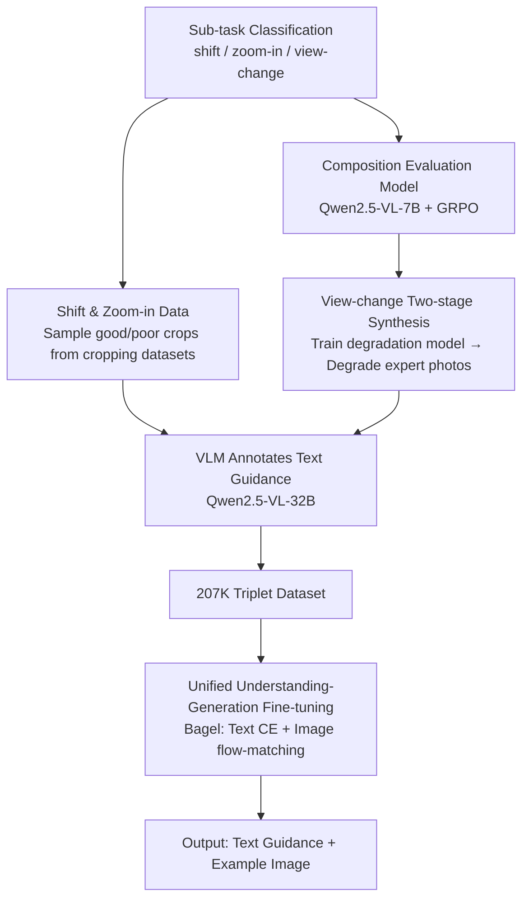

# PhotoFramer: Multi-modal Image Composition Instruction

**Conference**: CVPR 2026  
**arXiv**: [2512.00993](https://arxiv.org/abs/2512.00993)  
**Code**: https://zhiyuanyou.github.io/photoframer (Project Page)  
**Area**: Image Generation / Unified Understanding-Generation Model / Composition Assistance  
**Keywords**: Composition Guidance, Photography Assistance, Unified Multi-modal Model, Joint Text-Image Generation, Data Synthesis

## TL;DR
PhotoFramer formulates "how to take better-composed photos" as a unified understanding-generation model: given a poorly composed image, it first clearly explains how to improve using natural language (e.g., "remove the fence, center the subject"), and then generates an example image of the same scene with good composition, allowing amateur photographers to re-shoot by following both the text and the example.

## Background & Motivation
**Background**: While smartphone camera hardware has become powerful (high resolution, low noise, accurate exposure), many ordinary users still take poor photos, mainly due to **composition**—tilted horizons, misplaced subjects, or distracting elements at the edges. Existing mainstream approaches to improve composition fall into two categories: image cropping (finding a better-composed sub-frame in a captured image) and retrieval-based guidance (searching a database for similar high-quality images as references).

**Limitations of Prior Work**: Cropping is a **post-processing step after shooting**, unable to guide the user to change angles during the capture moment. Retrieval-based guidance provides images taken by others; since the scenes and subjects do not match, users find it difficult to replicate. The recent CPAM provides camera pose (yaw/pitch) adjustment suggestions, but it only outputs numeric angles, does not support zooming or large viewpoint changes, and uses two separate models for understanding and adjustment.

**Key Challenge**: Effective composition guidance requires **providing both the "textual rationale for changes" and the "visual example of the result"**. Text is actionable and interpretable, while example images are intuitive and easy to follow; both are indispensable. However, pure VLMs can only output text, and pure editing/generation models can only output images. No single model exists that can produce both text and image guidance within a shooting scenario.

**Goal**: To develop a shooting-phase composition assistant $f$ that takes a poorly composed image $I_{poor}$ and a task type $T_{task}$ as input, and simultaneously outputs textual guidance $T_{guide}$ and a well-composed example image $I_{good}$, such that $I_{good}, T_{guide} = f(I_{poor}, T_{task})$.

**Key Insight**: Starting from "how humans take photos," the authors decompose shooting into three steps: first choosing the **vantage point/viewpoint**, then choosing the **focal length/zoom**, and finally finetuning the **subject position and alignment**. This decomposition naturally corresponds to three types of learnable sub-tasks and determines how the training data is synthesized.

**Core Idea**: Use a unified understanding-generation model (Bagel) to handle both "textual guidance (understanding side)" and "example image generation (generation side)," and construct a 207K triplet dataset covering three sub-tasks—shift, zoom-in, and view-change—to finetune it, enabling the textual guidance to truly drive the generation of the example images.

## Method

### Overall Architecture
The core of PhotoFramer consists of two main parts: **how to synthesize data** and **the model architecture used for learning**. The task is defined as "given $I_{poor}$ + task prompt, produce $T_{guide}$ + $I_{good}$." The difficulty lies not in the model structure (using the existing unified model Bagel) but in the **lack of existing "poor image—good image—text" triplet data**.

The authors decompose the photography process into three sub-tasks and design different data sources for each: **shift (adjusting the frame, straightening, removing edge distractions)** and **zoom-in (tighter cropping, simulating longer focal length)** are sampled directly from existing cropping datasets (which already have composition score annotations; good crops serve as good, poor crops as poor). **View-change (re-framing by changing the vantage point/camera pose)** is the most difficult and lacks paired data; the authors synthesize this via a two-stage pipeline: "first train a composition degradation model, then degrade expert photos into poor ones." Once the three types of image pairs are gathered, a VLM (Qwen2.5-VL-32B) is used to generate textual guidance for each pair. Finally, 45K original images and 207K image pairs are used to finetune Bagel: the text side uses cross-entropy next-token prediction, the image side uses flow-matching, and **the generated image tokens attend to the textual guidance** via attention to achieve "text-driven generation."

To synthesize data for view-change, the authors also **separately trained a composition evaluation model** (Qwen2.5-VL-7B + GRPO reinforcement learning) to select good/poor images from multi-view datasets and to assign composition scores to in-the-wild images for data filtering.

### Key Designs

**1. Hierarchical Task Paradigm: Decomposing "how to shoot" into shift, zoom-in, and view-change**

Learning "change poor images to good images" is too vague; the model would not know whether to shift or change the vantage point. Mirroring the photography workflow, the authors split composition operations into three progressive sub-tasks: shift handles subject placement and edge distractions, zoom-in handles focal length/cropping tightness, and view-change handles vantage points and camera poses. This hierarchy provides clear data sources and supervision signals for each operation and makes the learned capabilities interpretable. Critically, the authors added **auto prompts** (static auto allows shift/zoom-in; full auto allows all three): during training, task-specific prompts are randomly replaced with auto prompts, allowing the model to **adaptively fuse multiple operations** when the user does not specify a task. Experiments show that auto mode provides better comprehensive results when a single task fails (e.g., shift misidentifying a distraction as the subject).

**2. Two-stage data synthesis for view-change: "Train degradation model + Degrade expert photos"**

There is no paired data for view-change: while multi-view 3D datasets (DL3DV-10K) provide image pairs from different perspectives, even the "best" frames often lack expert-level composition. Conversely, expert photos (e.g., Unsplash) have excellent composition but lack corresponding "poor perspective" versions. The authors' solution is to **synthesize poor images in reverse**: In the first stage, $\langle poor, good\rangle$ pairs from 3D datasets are used to train a **composition degradation model** (with the same structure as the final model). Given a good image and the instruction "change perspective to make composition worse," it learns to generate poor-composition images using reconstruction loss. In the second stage, this degradation model is applied to expert photos (25K Unsplash + 10K self-collected) to synthesize pseudo-poor images, which are paired with the original expert photos for the final view-change dataset. This approach secures expert-level good images while providing semantically consistent poor images, bypassing the issue of multi-view datasets not being "good enough."

**3. Composition Evaluation Model (GRPO Training) as a Data Engine**

Shift/zoom-in can reuse human labels from cropping libraries, but the in-the-wild/multi-view images used for view-change lack labels and require a reliable "composition scorer" for selection and filtering. The authors used Qwen2.5-VL-7B as a base and trained a composition evaluation model using GRPO reinforcement learning, which outputs reasoning text + composition scores. It achieved SRCC/PLCC of 0.763/0.777 and 0.795/0.805 on CADB/GAIC task respectively, and a classification accuracy of 0.583, outperforming Q-Align, AutoPhoto, and even the larger Qwen2.5-VL-32B. This evaluation model is used throughout data construction: from selecting the best 3 and worst 10 frames in multi-view scenes to quality filtering synthesized data for "composition score > 3.0."

**4. Unified Understanding-Generation model for joint text-image modeling, enabling text-driven generation**

Since the goal is to output both text (understanding) and an example image (generation), pure VLMs or pure editing models are insufficient. The authors chose Bagel as the base. Visual inputs use two sets of tokens: FLUX VAE tokens provide pixel-level information for generation, and SigLIP2 ViT tokens provide semantic information for understanding. The VAE/decoder is frozen, while the ViT and backbone are trainable. Training uses cross-entropy $\mathcal{L}_{text}$ for next-token prediction and flow-matching $\mathcal{L}_{img}$ for images, with equal weights. Crucially, the **generated image tokens attend to the textual guidance tokens via attention**, making the text functional—ablations show that changing keywords (removing "upper," adding "including lower body") significantly alters the generated image. Inference is two-stage: first understanding (producing text guidance), then concatenating the text guidance to the input for 30-step flow-matching denoising from pure noise, and finally VAE decoding the example image.

### Loss & Training
Final model fine-tuning: Text $\mathcal{L}_{text}$ (cross-entropy next-token) + Image $\mathcal{L}_{img}$ (flow-matching), equal weights. 8× A100, AdamW, batch=8, lr=2e-5, 50K steps, EMA decay 0.9999; images resized to 512 on the short side, 30-step denoising for inference. The view-change degradation model is trained using image reconstruction loss between generated and real poor images.

## Key Experimental Results

### Main Results
Example images are evaluated using **win rate**: comparing the model's generated images against "original images / ground truth good images," as judged by both GPT-5 and humans (format: `vs Original / vs GT`, in %). A benchmark was built using 200~300 manually curated samples per task.

| Method | Shift (GPT-5) | Shift (Human) | View-change (GPT-5) | View-change (Human) | Quality (DeQA) | Aesthetic (Q-Align) |
|------|------|------|------|------|------|------|
| Kontext | 39.88 / 12.27 | 49.69 / 4.94 | 46.74 / 15.76 | 48.37 / 5.98 | 3.88 | 3.13 |
| Qwen-Image-Edit | 46.01 / 16.56 | 48.43 / 10.49 | 70.65 / 36.96 | 61.96 / 20.65 | 4.03 | 3.29 |
| Bagel (Original) | 27.61 / 14.73 | 38.36 / 8.02 | 47.28 / 14.13 | 64.13 / 15.22 | 3.87 | 3.08 |
| gpt-image-1 | 69.93 / 33.99 | 68.46 / 22.37 | **84.61 / 51.65** | 81.52 / 41.30 | 3.97 | 3.26 |
| **PhotoFramer** | **80.37 / 35.58** | **88.05 / 43.83** | 82.07 / 50.54 | **85.87 / 47.28** | **4.07** | 3.17 |

For the zoom-in task, only the `vs GT` win rate is reported (PhotoFramer 67.24 GPT-5 / 48.28 Human), as "crop vs original" provides obvious scale cues that inflate win rates. Open-source editing models barely improve composition; gpt-image-1 is effective but frequently **alters semantic details of the original image, lacking fidelity**. PhotoFramer significantly outperforms open-source models and matches or exceeds gpt-image-1 while maintaining image quality and aesthetics.

Textual guidance consistency (GPT-5 rating "whether text accurately describes the $Original \to Example$ change"):

| Task | Shift | Zoom-in | View-change | Average |
|------|------|------|------|------|
| Bagel (Original) | 77.01 | 84.82 | 87.47 | 83.10 |
| **PhotoFramer** | **91.96** | **92.59** | **91.52** | **92.02** |

### Ablation Study
| Configuration | Phenomenon | Explanation |
|------|------|------|
| Feed text guidance to Qwen-Image-Edit | Cannot utilize, even reduces fidelity | Even with an LLM text encoder, it cannot follow this guidance |
| Feed text guidance to gpt-image-1 | Can follow (e.g., "include whole bird") | But fidelity remains suboptimal |
| Bagel trained on image pairs only (No text) | Fails: cannot remove foreground fence | Learns "remove the fence" only after text is included in training |
| Finetune Kontext (Image data only) | Only partially shifts cabin; cannot include fully | Bagel (text-image) can "include the whole wooden structure" |
| Manually change text keywords | Generated image changes significantly | Proves image generation indeed attends to text |

### Key Findings
- **Text and Image are both essential**: Text alone fed to external editing models fails (cannot follow instructions, loses fidelity); images alone without text training fail (cannot learn specific operations like "remove the fence"). Joint text-image modeling in a unified model allows text to truly drive generation.
- **Auto Prompt is more robust than single-task**: Single shift/zoom-in can error in tricky scenes (misjudging subject, over-cropping), whereas auto mode adaptively fuses operations for more stable results.
- **Data is the bottleneck, not the model**: The "train degradation model then degrade expert photos" pipeline for view-change is the cleverest part of the method, overcoming the dual data shortage of multi-view photos not being good enough and expert photos lacking poor-view counterparts.

## Highlights & Insights
- **Clever "reverse degradation" strategy**: When short on $\langle poor, good\rangle$ pairs, rather than searching for poor images, the authors train a degradation model to actively turn good images into poor ones. This converts the asymmetry of "expert photos are abundant, poor photos are scarce" into controllable data synthesis, a concept transferable to any paired learning task where good samples are easier to obtain than bad ones.
- **Structuring photography knowledge into task hierarchies**: Shift/zoom-in/view-change map to vantage point-focal length-alignment steps, turning vague "composition improvement" into sub-tasks with clear data sources and supervision. Using auto prompts allows the model to combine these effectively—an excellent example of injecting domain priors into data design.
- **"Killer App" for unified understanding-generation models**: Composition guidance naturally requires dual outputs: text for actionable reasons and images for intuitive examples. This justifies the value of unified models over pure VLMs or pure generation models, rather than being unified for the sake of it.
- **Evaluator as a data engine**: The GRPO-trained composition evaluator acts as both a product and a filter/selector for data construction, creating a closed-loop utilization of the same capability.

## Limitations & Future Work
- **No change to aspect ratio**: The method strictly performs composition guidance without changing the aspect ratio, discretizing ratios into 11 bins and pairing only within the same bin, which limits some degrees of compositional freedom.
- **Synthesis relies on degradation model quality**: Pseudo-poor images for view-change are generated by the degradation model; biases in that model propagate to the final training pairs. The composition evaluation model is used for data construction, and the paper admits it cannot be used directly to evaluate results (due to bias), necessitating expensive GPT-5/human win rate assessments.
- **Win rates against GT are not yet high**: Human win rates vs GT are mostly in the 35~50% range, indicating a gap to expert-level examples; the trade-off between fidelity and the performance of gpt-image-1 is not entirely resolved.
- **Executability of generative suggestions**: The model provides a "change perspective" example image, but that vantage point might not be physically accessible to the user in the real world; reaching the suggested position is not discussed.

## Related Work & Insights
- **vs Image Cropping (GAIC/CPC/GenCrop/ProCrop)**: Cropping is post-processing and can only find sub-frames within existing pixels. PhotoFramer provides guidance **during capture** and supports major restructuring like vantage point changes, which cropping cannot do. However, the authors reused cropping library labels for shift/zoom-in data.
- **vs CPAM (Camera Pose Suggestion)**: CPAM only outputs numeric yaw/pitch angles and uses separate models for understanding/adjustment. PhotoFramer is more intuitive with **text + example images**, supports zoom and large perspective changes, and uses a unified model for mutual enhancement.
- **vs Pure Editing/Generation (Kontext / Qwen-Image-Edit / gpt-image-1)**: These models only output images and cannot handle actionable text reasons; gpt-image-1 is strong but alters semantics with low fidelity. PhotoFramer maintains fidelity and produces interpretable text via a unified model.
- **vs Retrieval-based Composition Guidance**: Retrieval provides images from other people's scenes, which often miss-match. This work generates example images for the same scene directly, avoiding scene/subject mismatches.

## Rating
- Novelty: ⭐⭐⭐⭐⭐ First composition guidance framework for the shooting phase with dual text-image output; the reverse degradation data synthesis pipeline is highly inspiring.
- Experimental Thoroughness: ⭐⭐⭐⭐ Solid win rates across three tasks + text consistency + multiple ablations, though lacks automated composition metrics and relies on GPT-5/human evaluation.
- Writing Quality: ⭐⭐⭐⭐ Clear explanation of task decomposition and data construction with rich illustrations.
- Value: ⭐⭐⭐⭐ Brings expert composition priors to ordinary users with a clear application scenario; aspect ratio and vantage point accessibility remain practical constraints.

<!-- RELATED:START -->

## Related Papers

- [\[CVPR 2026\] MICo-150K: A Comprehensive Dataset Advancing Multi-Image Composition](mico-150k_a_comprehensive_dataset_advancing_multi-image_composition.md)
- [\[CVPR 2025\] UNIC-Adapter: Unified Image-Instruction Adapter with Multi-modal Transformer for Image Generation](../../CVPR2025/image_generation/unic-adapter_unified_image-instruction_adapter_with_multi-modal_transformer_for_.md)
- [\[CVPR 2026\] ConsistCompose: Unified Multimodal Layout Control for Image Composition](consistcompose_multimodal_layout_control.md)
- [\[CVPR 2026\] CompBench: Benchmarking Complex Instruction-guided Image Editing](compbench_benchmarking_complex_instruction-guided_image_editing.md)
- [\[CVPR 2026\] MICON-Bench: Benchmarking and Enhancing Multi-Image Context Image Generation in Unified Multimodal Models](micon-bench_benchmarking_and_enhancing_multi-image_context_image_generation_in_u.md)

<!-- RELATED:END -->
