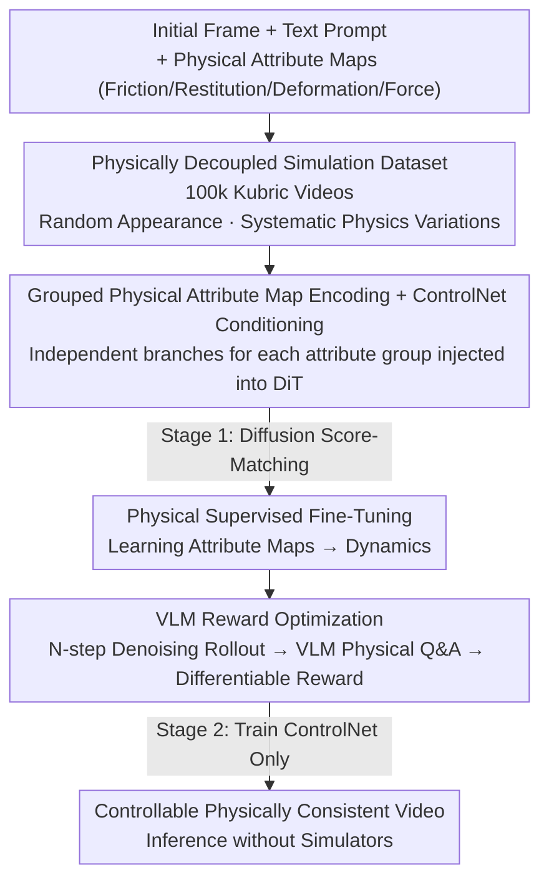

# PhyCo: Learning Controllable Physical Priors for Generative Motion

**Conference**: CVPR 2026  
**arXiv**: [2604.28169](https://arxiv.org/abs/2604.28169)  
**Code**: https://phyco-video.github.io (Project Page)  
**Area**: Diffusion Models / Controllable Video Generation  
**Keywords**: Physical Consistency, Video Diffusion, ControlNet, Physical Attribute Conditioning, VLM Reward Optimization

## TL;DR
PhyCo enables video diffusion models to generate motion consistent with physics (friction, restitution, deformation, external forces) in a continuous and controllable manner **without relying on any simulators or geometric reconstruction** during inference. This is achieved through a triad: a 100k physical simulation dataset, supervised fine-tuning using ControlNet with pixel-aligned physical attribute maps, and differentiable reward optimization using a fine-tuned VLM for physical Q&A scoring. It improves the IQ Score on the Physics-IQ benchmark from a baseline of ~28 to 43.6.

## Background & Motivation
**Background**: Modern video diffusion models (SVD, CogVideoX, Cosmos, etc.) are highly capable of synthesizing photorealistic frames with strong texture, lighting, and motion continuity.

**Limitations of Prior Work**: However, they frequently violate basic physical laws—objects may float, fall too slowly, fail to bounce upon collision, or lack realistic soft-body deformation. Critically, even with massive training data, they **cannot controllably generate "changes in physical properties"**: one cannot prompt the model to "increase the coefficient of restitution for this ball."

**Key Challenge**: Existing solutions fall into two camps, each with fatal flaws. One camp (PhysGen, PhysDreamer, WonderPlay) couples explicit physical solvers (Rigid body dynamics, MPM) into the generation process; while precise, they **require 3D geometry reconstruction or predefined materials** during inference, severely limiting scalability and generalization. The other camp (PhysCtrl, VLIPP, ForcePrompting) uses learned or language-driven implicit priors (trajectory generation, VLM reasoning, force-conditioned prompts) to bypass solvers; however, these **only provide coarse-grained kinematic guidance and lack continuous control over multiple underlying physical attributes**. The closest work, Force-Prompting, only controls a single attribute (force) and uses simplistic dataset scenarios.

**Goal**: To enable diffusion models with **continuous and interpretable** control over four physical attributes—friction, restitution, deformation, and external force—without requiring any simulator or geometric reconstruction during inference.

**Key Insight**: The authors argue that the root cause is that "models have never learned from data where visual appearance is decoupled from underlying physics." If a model is exposed to large-scale simulation videos where physical properties change systematically while appearances are randomized, it can bind each physical attribute to its "standard visual signature."

**Core Idea**: Construct pixel-aligned spatial condition maps of physical attributes to feed into a ControlNet for supervised fine-tuning (allowing the model to "learn to represent physics"), followed by VLM-based reward fine-tuning using physical Q&A scores (making the "control more precise").

## Method

### Overall Architecture
The input to PhyCo consists of an "initial frame + text prompt + a set of pixel-aligned physical attribute maps (friction/restitution/deformation/force)," and the output is a video consistent with these attributes. The pipeline is built on the pretrained Cosmos-Predict2-2B DiT diffusion backbone and trained in two stages. **Stage 1 is Physical Supervised Fine-Tuning (SFT)**: 100k simulation videos decoupling appearance and physics are constructed; ControlNet injects these attribute maps into the denoising process, and the model learns to generate corresponding dynamics via diffusion score-matching loss. **Stage 2 is VLM Reward Optimization**: Since SFT alone provides insufficient control fidelity, a fine-tuned VLM acts as a "physics judge" to perform targeted physical Q&A on generated videos. The answer logits are converted into differentiable rewards for backpropagation, further forcing the model to generate physically credible and precisely controlled results. Both stages **only train the ControlNet layers**, freezing the diffusion backbone and tokenizer to preserve pretrained representations.

### Key Designs

**1. Large-Scale Physically Decoupled Simulation Dataset: Binding Attributes to Visual Signatures**

**Design Motivation**: The authors found that while generating data with engines is easy, creating data useful for controllable generation is hard. The challenge lies in quality rather than quantity. They propose two requirements: (1) target physical attributes must **manifest clearly and unambiguously** in visual motion; (2) scenarios must fall within the "capability range" of the pretrained backbone—overly complex multi-object clutter causes current models to collapse, introducing noise that hinders learning. Consequently, they used Kubric (PyBullet for physics, Blender for rendering) to create 6 controlled scenarios (block sliding, ball-wall collision, vertical bouncing ball, soft-body gravitational fall, deformable collision, multi-ball billiards). They systematically varied four parameters—friction, restitution, deformation, and force—while randomizing object colors, materials, camera positions, HDRI lighting (50 environments), and Polyhaven high-quality textures. This "physically controlled + visually diverse" combination is key to allowing the diffusion model to **decouple** visual changes from underlying dynamics. This resulted in 100k+ videos with photo-realistic quality and multi-view annotations.

**2. Grouped Physical Attribute Maps + Multi-Branch ControlNet: Feeding Continuous Quantities into Frozen Backbones**

**Mechanism**: The generator $G_\theta$ models the conditional distribution $p_\theta(\mathbf{x}_{1:T}\mid \mathbf{t}, \mathbf{x}_0^0, \mathbf{p})$, where $\mathbf{p}\in\mathbb{R}^{K\times H\times W}$ represents spatially aligned physical attribute maps. For compactness and generalization, objects are represented as **spatially aligned circular blobs**, with each attribute normalized to $[-1,1]$. Crucially, $\mathbf{p}$ is **grouped** by semantics $\{\mathbf{p}^{(g)}\}_{g=1}^{G}$: (1) Friction $\mu_f$ + Restitution $e$ (plus a constant channel); (2) Neo-Hookean deformation parameters $d_\mu, d_\lambda, d_\gamma$; (3) Force magnitude $F$ + Direction $(\cos\phi, \sin\phi)$. Each group is encoded by the Cosmos tokenizer $\tau(\cdot)$ as $\mathbf{z}^{(g)}=\tau(\mathbf{p}^{(g)})$, projected via an adapter $A(\cdot)$, and **injected into the DiT through an independent ControlNet branch**. This enables faster training and supports **compositionality**, such as controlling "force + friction" or "restitution + deformation" simultaneously. Only the ControlNet layers are updated.

**3. VLM-Guided Reward Optimization: Turning "Control Precision" into Differentiable Signals**

**Novelty**: SFT provides visually coherent results but does **not guarantee control fidelity**. The authors introduce a VLM as an "Universal Physics Judge." The challenge is that standard score-matching (single-step denoising on noisy GT) is unsuitable for VLM evaluation because: (i) object boundaries are blurry; (ii) the model encodes the global trajectory from the ground-truth signal, **masking its actual inference behavior** (the motion direction is visible in noisy GT even if the model cannot reproduce it). Therefore, they perform **N-step (specifically 10-step) denoising rollouts** to generate predicted latent variables $\hat{\mathbf{z}}_0$, decode them into video $\hat{\mathbf{x}}_0$, and feed them to a VLM with structured physical questions. The VLM is a version of Qwen2.5-VL-3B fine-tuned on synthetic data (e.g., "Does the object move in the direction of the force?"). The reward is binary (Yes/No); dense feedback is obtained by thresholding attributes against $\{\text{min\_val}, \text{max\_val}\}$. The VLM alignment loss is the binary cross-entropy of the logit difference between correct and incorrect answer tokens:

$$\mathcal{L}_{\text{VLM}} = -\sum_i \log \sigma\big(\zeta_+^{(i)} - \zeta_-^{(i)}\big)$$

In this stage, **only $\mathcal{L}_{\text{VLM}}$ is used, omitting the score-matching objective**. Gradients are backpropagated end-to-end through the VLM, tokenizer, and DiT backbone.

### Loss & Training
- **Stage 1**: Diffusion score-matching loss (following Cosmos World Foundation Model's noise schedule and temporal supervision). Only ControlNet branches are trained; backbone and tokenizer are frozen.
- **Stage 2**: Only $\mathcal{L}_{\text{VLM}}$ (Eq. 1) is used without score-matching. Rewards are calculated after a 10-step denoising rollout and decoding, followed by end-to-end backpropagation.
- **VLM Judge**: Qwen2.5-VL-3B fine-tuned on 200 steps of synthetic simulation data, achieving ~85% physical Q&A accuracy.

## Key Experimental Results

### Main Results
The Physics-IQ benchmark measures physical realism across five domains (Solid Mechanics, Fluid, Optics, Magnetism, Thermodynamics) by calculating the spatial-temporal alignment of key actions against a reference sequence. Below are the results (57 frames @24FPS + last frame padding to match benchmark length):

| Method | Solids↑ | Fluid↑ | Optics↑ | Magnetism↑ | Thermo↑ | IQ Score↑ |
|------|----------|------|------|------|--------|-----------|
| SVD-XT | 21.9 | 20.5 | 6.8 | 8.4 | 17.1 | 19.1 |
| Cosmos-Predict2-2B (Backbone) | 31.7 | 25.2 | 26.2 | 9.1 | 16.9 | 27.7 |
| SG-I2V | 34.6 | 31.2 | 15.9 | 13.1 | 8.4 | 29.7 |
| VLIPP | 42.3 | 34.1 | 16.9 | 13.4 | 8.8 | 34.6 |
| **Ours (Text only)** | 43.9 | 38.5 | 17.5 | 21.7 | 26.8 | 36.5 |
| **Ours (ControlNet)** | 49.7 | 37.8 | 16.3 | 19.9 | 18.2 | 38.9 |
| **Ours (ControlNet + VLM)** | **53.1** | **44.3** | 20.3 | 20.8 | 35.9 | **43.6** |

Despite a mismatch between training duration (57 frames) and test duration (120 frames/5s), the full PhyCo stack improves the IQ Score from 27.7 to 43.6. Even the "Text only" variant (fine-tuning on PhyCo data without ControlNet) reaches 36.5, highlighting the value of the physical supervision in the dataset.

**Force Direction Control**: On 25 real-world videos with random force directions, PhyCo achieved a mean angular error of **15.2°**, significantly lower than Force-Prompting’s **40.5°**.

### Ablation Study
On 100 in-domain simulation test samples, a fine-tuned Qwen2.5-VL-3B was used to predict physical attributes from generated videos. Errors are shown below (FD is force direction error in degrees):

| Configuration | Force Error | Friction Error | Force FD(°) | Restitution Error | Deformation Error | Note |
|------|-----------|---------|-------------|---------|---------|------|
| Base Zero-shot | 0.38 | 0.33 | 91.87 | 0.40 | 0.45 | Generic generation |
| Text-only Tuning | 0.31 | 0.30 | 40.35 | 0.31 | 0.14 | No attribute maps |
| ControlNet (−VLM) | 0.33 | 0.24 | 38.05 | 0.28 | 0.14 | With spatial maps |
| **ControlNet (+VLM)** | **0.28** | **0.20** | **22.53** | **0.16** | **0.10** | Full model |

### Key Findings
- **VLM Reward drives Control Fidelity**: Moving from ControlNet(−VLM) to (+VLM), restitution error dropped (0.28→0.16), force direction error improved (38.05°→22.53°), and deformation error decreased (0.14→0.10). This proves reward optimization reinforces "faithful following" of input conditions.
- **Explicit Condition vs. Text-only**: Text-only tuning reduces errors (especially deformation 0.45→0.14), but force direction control remains weak (40.35°). Pixel-aligned maps further improve directional and friction control.
- **Strong Generalization**: Trained only on simulations, the model generalizes to new objects and motion types—e.g., a model trained on bouncing balls generalizes to "a person jumping on a trampoline" (correctly avoiding bouncing under low-restitution settings). 
- **User Study**: In 2AFC tests with 16 participants, PhyCo's generations were preferred over baselines in physical realism in the majority of cases (e.g., 100% preference vs. Cosmos-Predict2 for friction).

## Highlights & Insights
- **"Zero-Simulator Inference" is the core selling point**: Shifting physical consistency from "test-time solvers/geometry reconstruction" to "training-time learned priors" decouples physical controllability from scalability. This is a fundamental advantage over hybrid pipelines like PhysGen/WonderPlay.
- **N-step Rollout vs. Single-step Denoising for VLM Evaluation**: Single-step denoising on noisy GT "leaks" the answer to the judge; only N-step rollouts serve as a faithful proxy for inference behavior. This insight is applicable to any work using discriminators/VLMs to score diffusion models.
- **Multi-Branch ControlNet for Compositionality**: Encoding attributes independently allows for flexible combinations (force + friction, etc.), providing a clean paradigm for injecting continuous physical quantities into diffusion conditions.
- **"Simple & Clean > Complex & Photorealistic" Dataset Philosophy**: Intentionally avoiding complex scenes that exceed the backbone's capacity ensures attributes have clear visual signatures. This "curriculum" approach is valuable for teaching models specific priors.

## Limitations & Future Work
- **Training/Test Length Mismatch**: The model is trained on 57 frames but tested on 120 frames/5s using "last-frame padding." Long-term physical consistency for extended durations is not fully verified.
- **Restricted Scenarios**: While appearances are randomized, the 6-8 simulation scenarios involve simple, few-object interactions. Complex multi-object dynamics and real-world fluids/cloth remain largely unexplored.
- **Dependence on VLM Judge Quality**: The reward signal is capped by the ~85% accuracy of the fine-tuned Qwen2.5-VL-3B. VLM reasoning for implicit physics is naturally weak, and errors in judgment can pollute the reward.
- **Attribute Scope**: Only four categories (friction, restitution, deformation, force) are covered. Mass, gravity, and rheology are missing. The use of circular blobs for attribute maps may lack precision for complex irregular or articulated objects.

## Related Work & Insights
- **vs. Force-Prompting**: Both use physical SFT, but Force-Prompting controls a **single implicit force** attribute in simple scenes. PhyCo controls four attributes via pixel-aligned maps with significantly lower direction error (15.2° vs 40.5°).
- **vs. PhysGen / WonderPlay (Explicit Solver Branch)**: Those require running solvers or reconstructing 3D geometry during inference. PhyCo learns physics into the generative model, enabling simulation-free inference with better generalization.
- **vs. VLIPP / PhysCtrl (Implicit Guidance Branch)**: These use VLM-planned trajectories for kinematic guidance. PhyCo provides finer-grained, interpretable control over underlying physical properties (Physics-IQ 43.6 vs. 34.6 for VLIPP).
- **vs. ImageReward / VADER (Reward Optimization)**: While those align with human preference/aesthetics, PhyCo adapts differentiable VLM rewards specifically for **physical controllability** using thresholded Q&A.

## Rating
- **Novelty**: ⭐⭐⭐⭐ The combination of simulation-free inference, multi-attribute conditioning, and VLM physical rewards is robust. The N-step rollout insight is widely applicable.
- **Experimental Thoroughness**: ⭐⭐⭐⭐ Strong evidence across Physics-IQ, attribute re-prediction, and user studies; however, long-term consistency and complex scene tests are limited.
- **Writing Quality**: ⭐⭐⭐⭐ Clear explanation of the two-stage pipeline; implementation details for attribute maps are well-documented.
- **Value**: ⭐⭐⭐⭐ Provides a scalable, solver-free path for physically controllable video generation. The dataset design and reward paradigm are highly reusable.

<!-- RELATED:START -->

[Force-Prompting: Controlling Video Diffusion with Forces](https://arxiv.org/abs/2309.xxxx)  
[PhysGen: Rigid-Body Physics-Grounded Video Generation](https://arxiv.org/abs/2304.xxxx)  
[VLIPP: Video Language Image Physical Prior](https://arxiv.org/abs/2401.xxxx)

<!-- RELATED:END -->

## Related Papers

- [\[CVPR 2026\] MoCoDiff: A Controllable Autoregressive Diffusion Model for Expressive Motion Generation](mocodiff_a_controllable_autoregressive_diffusion_model_for_expressive_motion_gen.md)
- [\[CVPR 2026\] Learning Latent Proxies for Controllable Single-Image Relighting](learning_latent_proxies_for_controllable_single-image_relighting.md)
- [\[CVPR 2026\] SPREAD: Spatial-Physical REasoning via geometry Aware Diffusion](spread_spatial-physical_reasoning_via_geometry_aware_diffusion.md)
- [\[CVPR 2025\] Learning Visual Generative Priors without Text](../../CVPR2025/image_generation/learning_visual_generative_priors_without_text.md)
- [\[ECCV 2024\] Learning Semantic Latent Directions for Accurate and Controllable Human Motion Prediction](../../ECCV2024/image_generation/learning_semantic_latent_directions_for_accurate_and_controllable_human_motion_p.md)

<!-- RELATED:END -->
