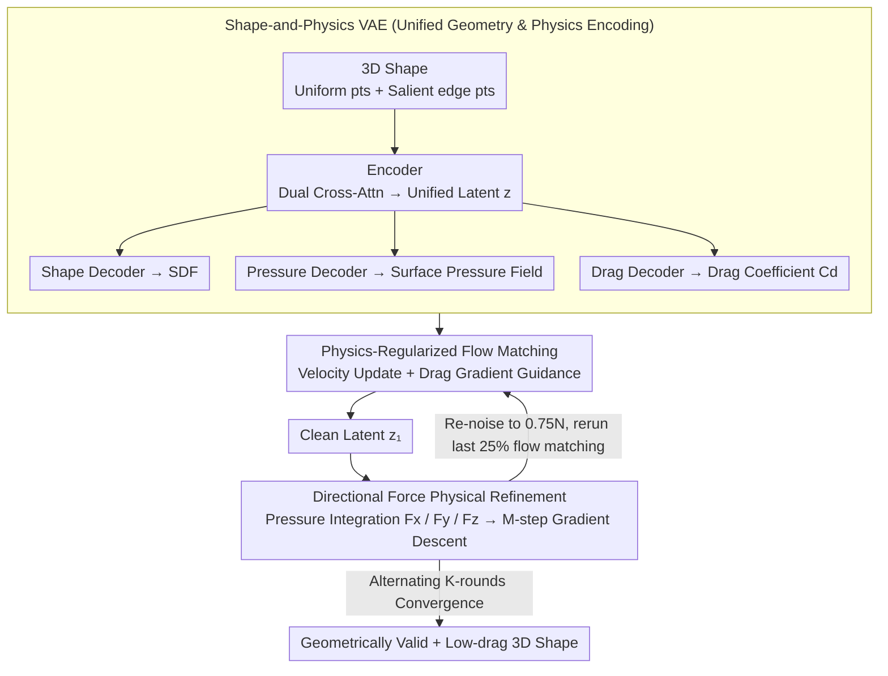

# PhysGen: Physically Grounded 3D Shape Generation for Industrial Design

**Conference**: CVPR 2026  
**arXiv**: [2512.00422](https://arxiv.org/abs/2512.00422)  
**Code**: [https://github.com/kasvii/PhysGen](https://github.com/kasvii/PhysGen)  
**Area**: Diffusion Models / 3D Generation  
**Keywords**: Physical Guidance, 3D Shape Generation, Flow Matching, Aerodynamic Optimization, Industrial Design

## TL;DR

PhysGen is proposed as a unified framework that integrates physical constraints (aerodynamic efficiency) into 3D shape generation. By jointly encoding geometric and physical information into a unified latent space via a Shape-and-Physics VAE, the model iteratively alternates between velocity updates and physical refinement within a Flow Matching framework. This process generates 3D shapes, such as low-drag vehicles, that are both visually realistic and physically efficient.

## Background & Motivation

1. **Background**: 3D generative models (3DShape2VecSet, Dora, Hunyuan3D, etc.) are capable of producing visually high-quality 3D objects. However, this "realism" is limited to the visual appearance level.
2. **Limitations of Prior Work**: Objects in engineering design—such as cars and aircraft—are strongly influenced by physical constraints like aerodynamic efficiency. Existing methods lack physical awareness: generated cars may have wheels embedded in the body, or chairs may have topologically incorrect legs incapable of bearing weight.
3. **Key Challenge**: (a) Existing 3D VAEs only encode geometric information, making it impossible to recover physical properties from the latent space; (b) Post-processing optimization (e.g., TripOptimizer) lacks shape manifold awareness during physical gradient optimization in latent space, often leading to unrecoverable geometric distortions; (c) Physical estimation on noisy samples during the early steps of injecting physical gradients into the diffusion process is unreliable.
4. **Goal**: To effectively integrate physical guidance into the 3D shape generation pipeline so that the generated results satisfy both geometric plausibility and physical efficiency.
5. **Key Insight**: Physical guidance and shape generation are unified into an alternating update framework where flow matching maintains the geometric manifold and physical refinement drives physical objectives, executing the two processes iteratively rather than sequentially.
6. **Core Idea**: A joint Geometry-Physics VAE latent space combined with alternating physical-regularized flow matching and directional force physical refinement is utilized to generate engineering-ready 3D shapes.

## Method

### Overall Architecture

The framework consists of two stages: (1) **SP-VAE** encodes 3D shapes and physical information (surface pressure fields, drag coefficients) into a unified latent space, equipped with a shape decoder (SDF), a pressure decoder, and a drag coefficient decoder; (2) **Physics-Guided Flow Matching** alternates between velocity updates (rectified flow sampling with physical regularization) and physical refinement (gradient updates based on directional forces) during inference to converge on geometrically sound and physically efficient shapes.

### Key Designs

**1. Shape-and-Physics VAE: Embedding Appearance and Physical Forces in Latent Space**

Existing 3D VAEs (e.g., Dora) only store geometry in latent space, losing physical quantities like pressure fields and drag coefficients. SP-VAE addresses this by providing four outputs for the same latent code $\mathbf{z}$: the encoder follows the Dora architecture, extracting features from uniform surface points $\mathbf{P}_u$ and salient edge points $\mathbf{P}_s$ via dual cross-attention and self-attention to produce $\mathbf{z}$; the shape decoder $\mathcal{D}_s$ outputs SDF values $s = \mathcal{D}_s(\mathbf{x}, \mathbf{z})$ for query points $\mathbf{x}$; the pressure decoder $\mathcal{D}_p$ outputs pressure $p = \mathcal{D}_p(\mathbf{x}, \mathbf{z})$ for any 3D point; and the drag decoder $\mathcal{D}_d$ outputs the global drag coefficient $C_d$.

The pressure decoder uses three parallel branches to process $\mathbf{z}$: a self-attention branch for global surface dependencies, a squeeze-excitation channel branch for re-weighting, and an MLP branch for local details. The drag decoder uses a similar structure. This ensures that the latent code captures both geometric and physical information, providing a differentiable physical proxy for gradient guidance.

**2. Physics-Regularized Flow Matching: Guiding Drag Towards Targets Along Trajectories**

To ensure trajectories move toward physical plausibility, rectified flow is used to perform linear interpolation between noise $\epsilon$ and data $\mathbf{z}_1$. The velocity field $\mathbf{u}_{t_n} = \mathbf{z}_1 - \epsilon$ is learned. During inference, a single reverse step is defined as:

$$\mathbf{z}'_{t_{n+1}} = \mathbf{z}_{t_n} - (t_{n+1} - t_n)\,\hat{\mathbf{u}}(\mathbf{z}_{t_n}, t_n, \mathbf{c})$$

After the velocity update, a gradient guidance term from the drag decoder is added to push the trajectory toward the target drag coefficient $d_{tar}$:

$$\mathbf{z}_{t_{n+1}} = \mathbf{z}'_{t_{n+1}} - \lambda_d \nabla_{\mathbf{z}_{t_n}} \|\mathcal{D}_d(\mathbf{z}_{t_n}) - d_{tar}\|_2^2$$

This acts as a classifier guidance but remains on the learned shape manifold, making it more stable than offline post-processing optimization.

**3. Directional Force Physical Refinement + Alternating Update: Balancing Manifold and Physical Goals**

While soft guidance provides coarse adjustments, fine-grained aerodynamic optimization requires dense pressure fields. Given a clean latent code $\mathbf{z}_1^k$, the pressure decoder predicts surface pressure, which is integrated across three directions to obtain forces $F_s = \sum_{i=1}^V p_i \mathbf{n}_{s,i} A_i$ ($s \in \{x, y, z\}$). The physical loss is defined as:

$$\mathcal{L} = \lambda_x \|F_x\|_2 + \lambda_y \|F_y\|_2 + \lambda_z \,\text{ReLU}(F_z)$$

These terms minimize longitudinal drag, suppress lateral force asymmetry, and use $\text{ReLU}(F_z)$ to ensure negative lift (downforce) for grip. Gradient backpropagation performs $M$ refinement steps on $\mathbf{z}_1^k$ to obtain $\hat{\mathbf{z}}_1^k$. To prevent geometric distortion, $\hat{\mathbf{z}}_1^k$ is re-noised to $t_{n_s} = 0.75N$ and the last 25% of the flow matching steps are rerun to pull the code back to the manifold. This cycle repeats for $K$ rounds.

### An Illustration: From Noise to a Low-Drag Vehicle

Starting from noise $\epsilon$ under a sketch condition, flow matching performs reverse sampling with drag gradient guidance to nudge the trajectory toward $d_{tar}$, resulting in an initial clean latent $\mathbf{z}_1^1$. While it looks like a car, its lateral forces might be asymmetric and the drag suboptimal.

During physical refinement, the pressure decoder predicts the pressure field on the surface of $\mathbf{z}_1^1$ and calculates $F_x, F_y, F_z$. Gradient descent on $\mathcal{L}$ adjusts the car's contour for lower drag and symmetry, yielding $\hat{\mathbf{z}}_1^1$. To smooth out any non-natural surface artifacts, $\hat{\mathbf{z}}_1^1$ is re-noised to $0.75N$ and refined through the final 25% of flow matching steps. After $K$ iterations, the process converges to a low-drag vehicle verified by CFD. Compared to post-processing (SP-VAE + TripOptimizer 500 steps), which drops F-score from 74.03 to 67.70 due to manifold deviation, PhysGen improves it to 89.65.

### Loss & Training

**Two-Stage SP-VAE Training**: Stage 1 involves independent training where the encoder and shape decoder are initialized with Dora pre-trained weights and fine-tuned using $\mathcal{L}_{shape} = \lambda_{sdf}\|s - \hat{s}\|_2^2 + \lambda_{KL}\mathcal{L}_{KL}$. After freezing the encoder, the pressure and drag decoders are trained (MAE+MSE). Stage 2 involves joint fine-tuning of all components: $\mathcal{L}_{total} = \lambda_{shape}\mathcal{L}_{shape} + \lambda_{press}\mathcal{L}_{press} + \lambda_{drag}\mathcal{L}_{drag}$. The DrivAerNet++ dataset (high-fidelity CFD car simulations) is used.

## Key Experimental Results

### Main Results

**Physics-Guided Generation vs. Post-Optimization**

| Method | F-score(0.01)×100↑ | CD×1000↓ | Overall Accuracy |
|------|-------------------|----------|---------|
| Generation w/o Physics | 74.03 | 27.14 | 60.86 |
| SP-VAE+TripOptimizer (100 steps) | 73.93 | 27.13 | 60.89 |
| SP-VAE+TripOptimizer (500 steps) | 67.70 | 32.78 | 58.75 |
| **PhysGen** | **89.65** | **20.99** | **66.48** |

**Shape Accuracy Gains under Target Drag**

| Configuration | F-score(0.01)×100↑ | CD×1000↓ |
|------|-------------------|----------|
| No Target Drag | 74.03 | 27.14 |
| With Target Drag | **89.65** (+21.09%) | **20.99** (+22.68%) |

**Shape Reconstruction Comparison**

| Method | Overall Accuracy | Overall IoU |
|------|---------|---------|
| 3DShape2VecSet | 73.58 | 51.28 |
| Hunyuan3D 2.1 | 89.43 | 76.55 |
| Hi3DGen | 91.47 | 81.52 |
| Dora (Fine-tuned) | 95.31 | 88.61 |
| **PhysGen SP-VAE** | **96.73** | **91.89** |

### Ablation Study

| Configuration | Drag MSE(×10⁻⁵)↓ | Overall Accuracy | Overall IoU |
|------|-------------------|------------|-----------|
| Independent Training | 4.6 | 95.31 | 88.61 |
| Joint Fine-tuning | **4.0** | **96.73** | **91.89** |

| Pressure Decoder Branch | MSE↓ | MAE↓ | Rel L2↓ | Rel L1↓ |
|--------------|------|------|---------|---------|
| Attn Only | 8.26 | 1.52 | 27.44 | 24.68 |
| Channel Only | 5.43 | 1.23 | 22.09 | 20.07 |
| Full Three-Branch | **4.55** | **1.09** | **20.02** | **17.78** |

### Key Findings
- **Defect of Post-Optimization**: TripOptimizer under conservative settings fails to change geometry, while aggressive settings cause severe distortion. PhysGen's alternating strategy resolves this dilemma.
- **Physics Alleviates Depth Ambiguity**: In single-view image-to-3D generation, the target drag coefficient provides additional constraints on dimensions like width, improving F-score by 21%.
- **Mutual Benefit of Joint Training**: Joint fine-tuning improves both shape reconstruction and physical estimation, as geometric and physical representations enhance each other in the unified latent space.
- Drag coefficient prediction MSE of 4.0×10⁻⁵ significantly outperforms baselines (TripNet 9.1×10⁻⁵).
- Physical performance of generated shapes is verified via OpenFOAM CFD simulations.

## Highlights & Insights
- The insight that **"Physical Guidance = Depth Ambiguity Mitigation"** is elegant: drag coefficients implicitly constrain the car's width, height, and rear morphology, compensating for 2D-to-3D projection ambiguities.
- The **alternating update strategy** is more robust than standard classifier guidance, which suffers from unreliable physical estimation on noisy samples. Performing refinement on clean latents followed by re-noising allows each operation to work in its optimal domain.
- The three-branch pressure decoder (Global Attn + Channel Re-weighting + Local MLP) is a practical architecture for multi-level physical field prediction, applicable to other PDE-related neural operator tasks.
- The use of $\text{ReLU}(F_z)$ in the directional force loss reflects engineering common sense: vehicles require downforce for grip rather than just minimizing the absolute value of lift.

## Limitations & Future Work
- The current focus is limited to aerodynamics (cars/aircraft); other constraints like crash safety and structural strength have not been explored.
- Physical refinement relies on a differentiable proxy; if the proxy is inaccurate, guidance may fail.
- SP-VAE joint training requires paired geometry and CFD data, which is expensive to acquire.
- Hyperparameters for alternating updates (re-noising ratio 0.75, refinement steps $M$, iterations $K$) require manual tuning.

## Related Work & Insights
- **vs. TripOptimizer**: TripOptimizer separates generation and optimization into two stages without manifold awareness. PhysGen unifies them via an alternating strategy.
- **vs. Physical Gradient Injection (DiffPhys/PhysReaction)**: These methods struggle with unreliable physical estimates in early noisy diffusion steps. PhysGen ensures physical refinement is always performed on clean latent codes.
- **vs. Dora VAE**: While Dora only encodes geometry (occupancy), SP-VAE switches to SDF and jointly encodes physics, improving reconstruction accuracy from 95.31 to 96.73.

## Rating
- Novelty: ⭐⭐⭐⭐⭐ First framework to systematically integrate engineering physical constraints into 3D generation with a clever alternating strategy.
- Experimental Thoroughness: ⭐⭐⭐⭐ Covers unconditional, sketch-based, and image-based generation with CFD verification, though limited to automotive applications.
- Writing Quality: ⭐⭐⭐⭐⭐ Clear motivation, structured methodology, and complete algorithmic pseudo-code.
- Value: ⭐⭐⭐⭐ Directly applicable to industrial design; the alternating update strategy can be generalized to other physically constrained tasks.

<!-- RELATED:START -->

## Related Papers

- [\[CVPR 2026\] ShapeAR: Generating Editable Shape Layers via Autoregressive Diffusion](shapear_generating_editable_shape_layers_via_autoregressive_diffusion.md)
- [\[CVPR 2026\] PosterIQ: A Design Perspective Benchmark for Poster Understanding and Generation](posteriq_a_design_perspective_benchmark_for_poster_understanding_and_generation.md)
- [\[ICML 2026\] PhysForge: Generating Physics-Grounded 3D Assets for Interactive Virtual World](../../ICML2026/image_generation/physforge_generating_physics-grounded_3d_assets_for_interactive_virtual_world.md)
- [\[ECCV 2024\] NeuSDFusion: A Spatial-Aware Generative Model for 3D Shape Completion, Reconstruction, and Generation](../../ECCV2024/image_generation/neusdfusion_a_spatial-aware_generative_model_for_3d_shape_completion_reconstruct.md)
- [\[CVPR 2026\] PosterReward: Unlocking Accurate Evaluation for High-Quality Graphic Design Generation](posterreward_unlocking_accurate_evaluation_for_high-quality_graphic_design_gener.md)

<!-- RELATED:END -->
