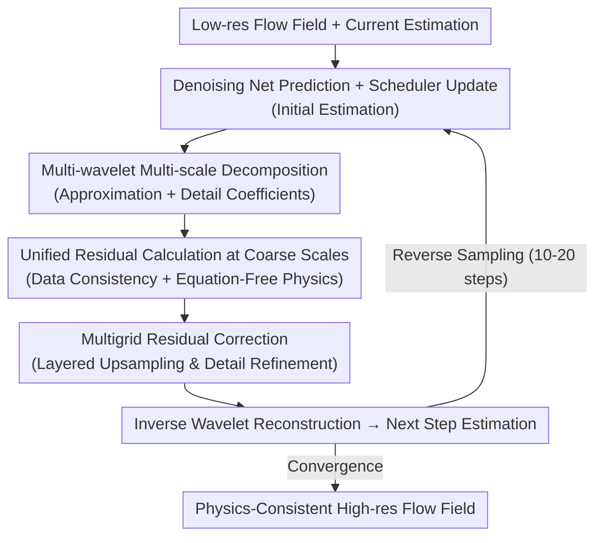

# Physics-Consistent Diffusion for Efficient Fluid Super-Resolution via Multiscale Residual Correction

**Conference**: CVPR2026  
**arXiv**: [2603.00149](https://arxiv.org/abs/2603.00149)  
**Code**: [lizhihao2022/ReMD](https://github.com/lizhihao2022/ReMD)  
**Authors**: Zhihao Li, Shengwei Dong, Chuang Yi, Junxuan Gao, Zhilu Lai, Zhiqiang Liu, Wei Wang, Guangtao Zhang  
**Area**: Image Generation  
**Keywords**: Fluid Super-Resolution, Diffusion Models, Multigrid Residual Correction, Multi-wavelet Basis, Physics Consistency, Equation-free

## TL;DR

The paper proposes ReMD (Residual-Multigrid Diffusion), which embeds multigrid residual correction into each reverse sampling step of the diffusion model. By utilizing multi-wavelet bases to construct a cross-scale hierarchical structure, it achieves physics-consistent and efficient fluid super-resolution without requiring explicit PDEs.

## Background & Motivation

Fluid Super-Resolution (Fluid SR) is of significant value in meteorological forecasting, ocean simulation, and engineering CFD: high-resolution simulations are computationally expensive, necessitating efficient reconstruction of fine flow fields from low-resolution fields. However, existing methods have distinct shortcomings:

**General Image SR methods** (EDSR, SwinIR, etc.) lack physical constraints—generated flow fields may violate continuity equations, exhibit non-physical divergence, and show poor fidelity in high-frequency spectral bands.

**Standard Diffusion Models** (DDPM/DDIM) can generate high-quality samples but require a large number of sampling steps (typically $> 100$), leading to low inference efficiency; furthermore, they are not physics-aware, easily producing spectral mismatch and spurious divergence.

**Physics-Informed methods** (PINN-style or explicit PDE constraints) require knowledge of the specific form of the governing equations, which limits their generalization.

**Key Challenge**: How to inject physics consistency into the diffusion process and accelerate sampling convergence simultaneously without relying on explicit PDEs? ReMD proposes fusing the residual correction idea from multigrid solvers with the reverse process of diffusion models.

## Method

### Overall Architecture

The core question ReMD addresses is how to inject physics consistency into the diffusion process and accelerate convergence without relying on explicit PDEs. The approach modifies each reverse update step: whereas standard diffusion reverse steps only predict noise or $x_0$ using a denoising network and update via a scheduler, ReMD inserts a **multigrid residual correction** stage. It first downsamples the current estimation to multiple coarse scales, calculates data consistency and physics constraint residuals at a lower cost on coarse grids to obtain global correction directions, and then upsamples these corrections layer-by-layer to refine local details on fine grids. Data consistency terms and lightweight physics constraint terms are coupled into a unified residual at each scale. This coarse-to-fine correction leverages the classic experience of multigrid methods in numerical computation: coarse grids efficiently eliminate low-frequency errors while fine grids refine high-frequency details, leading to faster overall convergence.

### Key Designs

**1. Multi-scale hierarchy via multi-wavelet basis: Matching cross-scale fluid structures with frequency separation**

Traditional multigrid methods use simple linear interpolation/restriction operators, which are insufficient for fluid features spanning multiple orders of magnitude. ReMD adopts the Multi-Wavelet Basis: wavelet transforms naturally decompose signals into different frequency sub-bands, capturing both large-scale structures (atmospheric circulation, ocean currents) and small vortices (high-frequency turbulence). The orthogonal completeness ensures non-redundant information and numerical stability. Specifically, each reverse step decomposes the estimate into coefficients, corrects them across levels, and reconstructs—providing a more fluid-aligned multi-resolution decomposition than fixed $2\times$ downsampling.

**2. Equation-free lightweight physics constraints: Constraining physical validity with general statistical priors**

PINN methods require predefined PDE forms, limiting generalization. ReMD's physics constraints are equation-free, applying three general priors: **Divergence Constraint** ($\nabla \cdot \mathbf{u} \approx 0$ for incompressible fluids) integrated into the residual; **Spectral Constraint** utilizing statistical laws of turbulence (e.g., Kolmogorov $-5/3$ law) for soft-matching power spectra in the frequency domain; and **Data Consistency** ensuring the downsampled SR result matches the low-res input. These avoid Navier-Stokes formulations, using frequency and spatial statistics to implicitly constrain physics.

**3. Multigrid residual correction for accelerated sampling: Resolving slow low-frequency convergence**

Multigrid correction resolves the high sampling step count of diffusion models. Similar to multigrid acceleration in numerical PDEs where reverse diffusion is analogous to Jacobi/Gauss-Seidel iterations (slow for low-frequency components), coarse grid corrections efficiently eliminate low-frequency residuals. Experiments show ReMD achieves the quality of standard diffusion ($100+$ steps) in just $10-20$ steps.

## Key Experimental Results

### Main Results: Atmospheric Benchmarks (ERA5, etc.)

| Method | RMSE ↓ | Spec. Corr. ↑ | Div. Error ↓ | NFE (Steps) |
| :--- | :---: | :---: | :---: | :---: |
| Bicubic | High | Low | High | 1 |
| EDSR | Medium | Medium | High | 1 |
| SwinIR | Medium | Medium | High | 1 |
| DDPM (100) | Medium | High | Medium | 100 |
| DDIM (50) | Medium | High | Medium | 50 |
| **ReMD (20)** | **Lowest** | **Highest** | **Lowest** | **20** |

ReMD surpasses 100-step standard DDPM in RMSE and spectral fidelity with only 20 steps, while significantly reducing divergence violations.

### Main Results: Oceanic Benchmarks

| Method | RMSE ↓ | Spectral Error ↓ | Div. Error ↓ | Inference Speedup |
| :--- | :---: | :---: | :---: | :---: |
| EDSR | Baseline | Baseline | Baseline | $1\times$ |
| FNO | Lower | Lower | Medium | $\sim 1\times$ |
| DDPM (100) | Lower | Lower | Medium | $0.2\times$ |
| **ReMD (15)** | **Sig. Lower** | **Lowest** | **Lowest** | **$\sim 5\times$ vs DDPM** |

On ocean data, ReMD achieves optimal accuracy with substantially fewer steps, being $\sim 5\times$ faster than DDPM-100 with superior results.

### Ablation Study

- **Without Multigrid Correction**: Degrades to standard reverse sampling, requiring $>5\times$ steps to achieve comparable accuracy.
- **Without Physics Constraints**: RMSE increases slightly, but divergence and spectral mismatch worsen significantly.
- **Standard Downsampling vs. Multi-wavelet**: Significant drop in high-frequency detail (vortex) recovery and increased error in high-frequency spectral bands.
- **NFE-Quality Curve**: ReMD plateaus at $10-20$ steps, whereas DDPM/DDIM require $50-100$ steps for stability.

## Key Findings

1. **Embedding multigrid residual correction into the reverse process effectively accelerates convergence**, establishing a link between numerical methods and generative models.
2. **Multi-wavelet bases outperform simple interpolation for multi-scale fluid modeling**, naturally matching structures from circulation to turbulence.
3. **Equation-free physics constraints are sufficient to improve flow field quality** without specific PDEs, relying instead on divergence and spectral priors.
4. **Coupling physics constraints within the diffusion process** is more efficient than post-processing projection.

## Highlights & Insights

- **Cross-domain Thinking**: Elegantly combining 40-year-old multigrid techniques from numerical PDEs with deep generative models.
- **Efficiency-Quality Win-win**: Acceleration is achieved through better correction strategies rather than quality trade-offs.
- **Generalization**: The equation-free design allows application across diverse scenarios like atmospheric and oceanic fields.
- **Spectral Fidelity**: Emphasizes spectral fidelity, which is more critical than pixel-level RMSE for downstream physical analysis.

## Limitations & Future Work

1. **Verification on 2D only**: Atmospheric/oceanic benchmarks are 2D; performance on 3D turbulence and the computational cost of 3D multi-wavelets are unknown.
2. **Constraint Generality**: Divergence constraints assume incompressibility, potentially failing for high-Mach compressible flows.
3. **SR Ratio**: Experiments focused on $4\times$ or $8\times$; performance on extreme SR ($16\times+$) is uncertain.
4. **Code Availability**: The GitHub repository currently only contains a LICENSE file.
5. **Comparison with Recent Samplers**: Needs comparison against new paradigms like Consistency Models or Flow Matching.

## Related Work & Insights

- **Fluid SR**: FNO and U-Net based deterministic methods are primary baselines; diffusion is a new trend.
- **Physics-Informed Generative Models**: PhysDiff and PDE-Refiner typically require explicit PDEs; ReMD's equation-free path is more flexible.
- **Diffusion Acceleration**: While DDIM or DPM-Solver focus on ODE solving, ReMD utilizes multigrid acceleration, which may be orthogonal.
- **Wavelets in DL**: Adapting multi-wavelets for restriction/prolongation operators in a multigrid diffusion context is a novel application.

## Rating
- Novelty: ⭐⭐⭐⭐ — Innovative cross-pollination of multigrid and diffusion models.
- Experimental Thoroughness: ⭐⭐⭐⭐ — Dual benchmarks and ablations provided, though lacks 3D/extreme SR tests.
- Writing Quality: ⭐⭐⭐⭐ — Clear motivation and intuitive explanations.
- Value: ⭐⭐⭐⭐ — Practical for fluid SR in scientific computing with strong cross-domain insights.

<!-- RELATED:START -->

## Related Papers

- [\[CVPR 2026\] AlignVAR: Towards Globally Consistent Visual Autoregression for Image Super-Resolution](alignvar_towards_globally_consistent_visual_autoregression_for_image_super-resol.md)
- [\[ICLR 2026\] Step-Aware Residual-Guided Diffusion for EEG Spatial Super-Resolution](../../ICLR2026/image_generation/step-aware_residual-guided_diffusion_for_eeg_spatial_super-resolution.md)
- [\[CVPR 2026\] Training-free, Perceptually Consistent Low-Resolution Previews with High-Resolution Image for Efficient Workflows of Diffusion Models](training-free_perceptually_consistent_low-resolution_previews.md)
- [\[ICCV 2025\] 3DSR: Bridging Diffusion Models and 3D Representations for 3D Consistent Super-Resolution](../../ICCV2025/image_generation/bridging_diffusion_models_and_3d_representations_a_3d_consis.md)
- [\[CVPR 2026\] VOSR: A Vision-Only Generative Model for Image Super-Resolution](vosr_a_vision_only_generative_model_for_image_super_resolution.md)

<!-- RELATED:END -->
