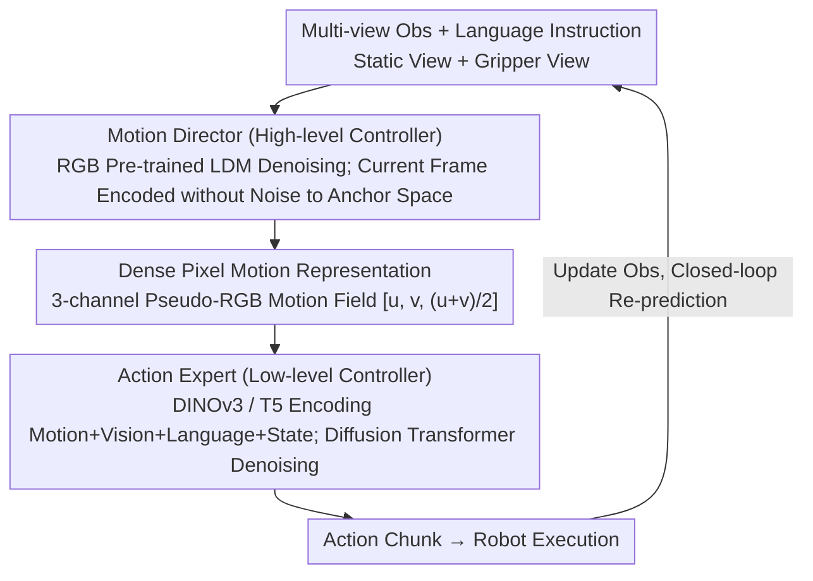

# Pixel Motion Diffusion Is What We Need for Robot Control

**Conference**: CVPR 2026  
**arXiv**: [2509.22652](https://arxiv.org/abs/2509.22652)  
**Code**: [Available](https://eronguyen.github.io/DAWN)  
**Area**: Image Generation  
**Keywords**: Pixel motion diffusion, robot control, Vision-Language-Action, optical flow representation, hierarchical diffusion policy

## TL;DR

DAWN proposes a two-stage full diffusion framework: the Motion Director generates dense pixel motion fields as an interpretable intermediate representation, and the Action Expert transforms these into executable robot action sequences. It achieves SOTA on CALVIN (Avg Len 4.00), MetaWorld (Overall 65.4%), and real-world tasks, with model capacity and training data requirements significantly lower than competing methods.

## Background & Motivation

**Background**: Vision-Language-Action (VLA) models achieve broad generalization through training on large-scale web data but remain limited in motion perception and spatial reasoning. Current motion-guided schemes follow two paths: (1) Sparse pixel trajectories (General Flow, FLIP, Track2Act, etc.) obtain motion cues from keypoint or sparse point tracking; (2) Future RGB frame prediction (SuSIE, UniPi, VPP, etc.) utilizes video diffusion models to generate future observations and then derive actions.

**Core Problem**:
- **Insufficient Sparse Trajectory Information**: Tracking only a few keypoints fails to provide a full-scene motion description, losing critical spatial information during complex manipulations.
- **High Computational Overhead for RGB Frame Prediction**: Generating complete video frames in high-dimensional RGB space is computationally expensive and lacks explicit motion structure.
- **Complexity in Indirect Extraction**: Gen2Act generates video first and then tracks pixels to extract motion, introducing unnecessary indirect layers and error accumulation.

**Key Insight**: Instead of generating full frames in RGB space and indirectly extracting motion, it is more effective to directly predict dense pixel motion. This preserves full-scene motion information while significantly reducing generation complexity, as pixel motion fields have simpler structures than RGB frames and are more suitable for learning.

**Goal**: DAWN (Diffusion is All We Need) — both stages employ diffusion models: the Motion Director predicts dense pixel motion fields in latent space, and the Action Expert converts the motion fields into action sequences, forming a fully trainable, end-to-end, and interpretable control pipeline.

## Method

### Overall Architecture

DAWN addresses the long-standing issue of VLA models being able to "see and speak but having poor motion perception." It does not jump directly from language to action but inserts a visible "motion intent" layer between them, then translates this intent into robot commands. The pipeline consists of two concatenated diffusion models. The first half is the Motion Director (high-level controller), based on a pre-trained Latent Diffusion Model (LDM). It takes multi-view images (static view + gripper view) and language instructions to output a dense pixel motion field $\mathbf{F}'_{t,k} = [u, v, (u+v)/2]$, essentially illustrating where every pixel in the scene should move next. The second half is the Action Expert (low-level controller), a Diffusion Transformer that encodes this motion field alongside visual observations, language instructions, and robot states to denoise and generate an executable action sequence. Both stages only learn diffusion denoising and interact through the structured pixel motion field; this intermediate representation allows modules to be upgraded independently and provides natural interpretability through visualization.

### Key Designs

**1. Dense Pixel Motion Representation: Replacing Sparse Trajectories and RGB Frame Prediction with a "Motion Map"**

Existing motion guidance either tracks a few keypoints (too sparse, losing spatial detail in complex tasks) or generates full RGB future frames (expensive and lacking explicit motion structure in high-dimensional space). DAWN's trade-off is direct dense pixel motion prediction: defining the displacement from frame $\mathbf{I}_t$ to $\mathbf{I}_{t+k}$ as $\mathbf{F}_{t,k} = [u, v]$, where $u, v \in \mathbb{R}^{H \times W}$ are horizontal and vertical displacements for every pixel, covering the entire scene. Crucially, to reuse diffusion models pre-trained on massive RGB datasets, the two-channel motion field is padded into a three-channel "pseudo-RGB image" $\mathbf{F}'_{t,k} = [u, v, (u+v)/2]$. This allows RGB diffusion weights to be migrated directly. This preserves full-scene dynamic information while being easier to learn due to the lower dimensionality and regular structure of motion fields compared to RGB frames. Training labels are extracted directly from adjacent frame pairs $(\mathbf{I}_t, \mathbf{I}_{t+k})$ using the RAFT optical flow model.

**2. Motion Director: Adapting RGB Pre-trained Diffusion Models for Motion Generation**

This stage is responsible for "seeing the image, hearing the instruction, and drawing the motion." It modifies a pre-trained LDM: the VAE encoding of the current frame (kept noise-free as a clean conditional signal) is concatenated with Gaussian noise and fed into a U-Net. The denoising target is the latent representation of the motion field. Language instructions (via CLIP text encoder), gripper views (via CLIP vision encoder), and time offset $k$ are injected via cross-attention. Keeping the current frame encoding noise-free anchors the spatial structure and prevents object position drifting. The gripper view condition is introduced with zero-initialized weights to ensure that the pre-trained behaviors are not disrupted at the start of training. During training, only the U-Net denoiser is updated while VAE and CLIP are frozen using standard MSE noise estimation loss.

**3. Action Expert: Translating Motion Maps into Robot Action Chunks**

Once the motion field is obtained, it must be mapped to joint/gripper commands, which is the role of the Action Expert. It performs multimodal encoding—using DINOv3 ConvNeXt-S for the motion field and visual observations, T5-small for language, and a 2-layer MLP for robot proprioceptive states—before feeding these conditions into a denoising Transformer to iteratively generate an action chunk. A Diffusion Transformer is used instead of a simple MLP head to better handle dependencies between motion, vision, language, and state conditions. Similar to the previous stage, vision and text encoders are frozen, and only the denoiser and state encoder are trained to minimize data requirements. The loss is MSE noise estimation in the action space.

### A Complete Example

Taking "lift the apple on the table and put it in the box" as a closed-loop example: At time $t$, the system encodes observations from both static and gripper cameras and sends them with the instruction to the Motion Director. It runs 25 diffusion steps to generate a dense motion field—where pixels in the apple region are predicted to displace towards the box, while background displacement is near zero. This map visually "points out" where to move next. The Action Expert takes this motion field along with real-time observations and state to denoise an action chunk. The robot executes several steps accordingly. Observations are then updated, and the system returns to the Motion Director to predict the next motion segment, continuing this loop until the task completes. Throughout this chain, the visualized motion field serves as a human-readable "intent" of the model.

### Training and Inference Flow

The two modules can be **trained in parallel**: the Motion Director uses RAFT optical flow as GT, while the Action Expert uses corresponding GT flow and action supervision independently. Optionally, the Action Expert can be fine-tuned on actual Motion Director outputs to reduce training-inference distribution shifts. **Inference** is a serial closed-loop: Obs Encoding → Motion Director (25 diffusion steps) → Pixel Motion Field → Action Expert Denoising → Action Sequence → Execution → Obs Update → Return to start. Because the interface is a unified motion field, both modules can be independently replaced or upgraded.

## Key Experimental Results

### Main Results

**CALVIN ABC→D (No external robot data, Table 1)**:

| Method | Task 1 | Task 2 | Task 3 | Task 4 | Task 5 | Avg Len ↑ |
|------|--------|--------|--------|--------|--------|-----------|
| Diffusion Policy | 0.40 | 0.12 | 0.03 | 0.01 | 0.00 | 0.56 |
| Robo-Flamingo | 0.82 | 0.62 | 0.47 | 0.33 | 0.24 | 2.47 |
| MoDE | 0.92 | 0.79 | 0.67 | 0.56 | 0.45 | 3.39 |
| RoboUniview | 0.94 | 0.84 | 0.73 | 0.62 | 0.51 | 3.65 |
| Seer-Large | 0.93 | 0.85 | 0.76 | 0.69 | 0.60 | 3.83 |
| VPP | 0.96 | 0.88 | 0.78 | 0.71 | 0.60 | 3.93 |
| Enhanced DP (ours) | 0.82 | 0.67 | 0.53 | 0.41 | 0.35 | 2.78 |
| **DAWN (ours)** | **0.98** | **0.91** | **0.79** | **0.71** | **0.61** | **4.00** |

**CALVIN ABC→D (With external data, Table 2)**:

| Method | Extra Data | Task 1 | Task 2 | Task 3 | Task 4 | Task 5 | Avg Len ↑ |
|------|----------|--------|--------|--------|--------|--------|-----------|
| GR-1 | Ego4D | 0.85 | 0.71 | 0.60 | 0.50 | 0.40 | 3.06 |
| LTM | OpenX | 0.97 | 0.82 | 0.73 | 0.67 | 0.61 | 3.81 |
| MoDE | Multiple | 0.96 | 0.89 | 0.81 | 0.72 | 0.65 | 4.01 |
| VPP | Multiple | 0.97 | 0.91 | 0.87 | 0.82 | 0.77 | 4.33 |
| DreamVLA | DROID | 0.98 | 0.95 | 0.90 | 0.83 | 0.78 | 4.44 |
| **DAWN (ours)** | DROID | 0.98 | 0.92 | 0.81 | 0.75 | 0.64 | 4.10 |

**MetaWorld 11-Task Success Rate (Table 3)**:

| Method | door-open | door-close | basketball | shelf-place | btn-press | faucet-close | hammer | assembly | Overall |
|------|-----------|------------|------------|-------------|-----------|--------------|--------|----------|---------|
| Diffusion Policy | 45.3 | 45.3 | 8.0 | 0.0 | 40.0 | 22.7 | 4.0 | 1.3 | 24.1 |
| ATM | 75.3 | 90.7 | 24.0 | 16.3 | 77.3 | 50.0 | 4.3 | 2.0 | 52.0 |
| LTM | 77.3 | 95.0 | 39.0 | 20.3 | 82.7 | 52.3 | 10.3 | 7.7 | 57.7 |
| **DAWN (ours)** | **94.7** | **97.3** | **42.0** | **24.7** | **92.0** | **76.3** | **12.7** | **10.7** | **65.4** |

**Real-world lift-and-place Experiment (Table 4, 20 random initializations per task)**:

| Method | Apple Succ | Avocado Succ | Banana Succ | Grape Succ | Kiwi Succ | Orange Succ | Latency (ms) |
|------|-----------|-------------|-------------|-----------|-----------|-------------|-------------|
| Enhanced DP | 5→4 | 6→6 | 5→4 | 4→3 | 5→5 | 4→4 | 112.77 |
| π₀ | 10→9 | 6→6 | 5→3 | 8→5 | 5→3 | 8→7 | 571.89 |
| VPP | 16→14 | 15→15 | 15→14 | 17→17 | 15→15 | 16→14 | 190.55 |
| **DAWN** | **19→19** | **20→19** | **17→16** | **19→19** | **17→16** | **18→16** | 319.82 |

(→ Left denotes lifting success, right denotes placement success)

### Ablation Study (CALVIN ABC→D, Table 6)

**(a) Pixel Motion vs. Other Intermediate Representations**:

| Setting | Avg Len |
|------|---------|
| No Intermediate (Action Expert only) | 2.78 |
| RGB Target Image | 3.21 |
| Pixel Motion (U-Net Trained from Scratch) | 3.42 |
| **Pixel Motion (Pre-trained LDM)** | **4.00** |

**(b) Gripper View Conditioning**:

| Setting | Avg Len |
|------|---------|
| VPP without Gripper View | 3.58 |
| DAWN without Gripper View | 3.74 |
| **DAWN with Gripper View** | **4.00** |

**(c) Motion Director Diffusion Steps**:

| Steps | 2 | 10 | 25 | 40 |
|------|---|----|----|-----|
| Avg Len | 3.88 | 3.96 | **4.00** | 3.95 |

**Bimanual Manipulation (Table 5)**: DAWN achieves an action prediction MSE of 0.117 on the Galaxea R1-Lite bimanual setup, outperforming Enhanced DP's 0.128.

### Key Findings

- Achieves SOTA without external data (4.00 > VPP 3.93), demonstrating extreme data efficiency.
- Pixel motion significantly outperforms RGB target images (4.00 vs 3.21), and pre-trained LDM transfer to motion generation provides additional gains (4.00 vs 3.42).
- Strong semantic understanding: high performance across semantically similar but distinct tasks (door-open 94.7% vs door-close 97.3%).
- Motion Director reaches 3.88 with only 2 diffusion steps, indicating motion information is highly concentrated in initial denoising steps.
- Reliable real-world transfer with only 1000 episodes and 100k fine-tuning steps, with near-zero false grasp rates.
- Validity for bimanual scenarios confirms framework generalizability.

## Highlights & Insights

1. **Dense Motion Field as a Universal Intermediate Language**: Compared to sparse trajectories and RGB frames, dense pixel motion retains full spatial information while reducing generation complexity. The three-channel encoding cleverly reuses RGB pre-trained weights.
2. **Surprises in Pre-training Transfer**: LDMs trained on RGB images can efficiently transfer to pixel motion generation (3.42 from scratch vs 4.00 pre-trained), suggesting motion fields and RGB images share meaningful structures in latent space.
3. **Modular Design and Data Efficiency**: By freezing pre-trained encoders and training only denoisers, DAWN matches or exceeds SOTA with smaller model capacity and less data than VLA methods.
4. **Interpretable Intermediate Representations**: The pixel motion field can be directly visualized, allowing users to understand the model's intended motion, which provides practical value for the safety of robot deployment.

## Limitations & Future Work

1. Two-stage serial inference introduces additional latency (319ms vs. Enhanced DP's 113ms), limiting real-time performance.
2. RAFT optical flow training labels may introduce noise in occlusion or large deformation scenarios.
3. Performance with massive external data is lower than VPP/DreamVLA (4.10 vs 4.33/4.44), suggesting room for improvement in large-scale data utilization.
4. Real-world experiments only cover lift-and-place and bimanual categories; complex long-horizon operations are not yet verified.
5. Single-step motion prediction (predicting offset $k$) lacks multi-step planning capabilities.

## Related Work & Insights

- **Gen2Act / FLIP**: Extract motion trajectories indirectly from generated videos → DAWN skips video generation to predict motion directly, improving efficiency.
- **Diffusion Policy**: End-to-end diffusion action generation lacks motion abstraction → DAWN’s Action Expert achieves massive gains (2.78→4.00) by adding motion conditions.
- **VPP**: Extracts video diffusion features as implicit motion representations in RGB space → DAWN replaces this with explicit pixel motion, performing better without external data.
- **π₀**: Large-scale VLA Flow Matching model → DAWN significantly outperforms it in the real world with a smaller model and less data.
- **Insight**: Pre-trained image diffusion models can be viewed as general vision prediction engines; their capabilities exceed RGB image generation and can transfer to structured output tasks like motion prediction.

## Rating

| Dimension | Score (1-5) | Description |
|------|-----------|------|
| Novelty | 4 | Dense pixel motion + dual diffusion pipeline; clever reuse of RGB pre-trained weights. |
| Technical Depth | 3.5 | Solid systems engineering, but the core principle is straightforward (LDM + Optical Flow GT). |
| Experimental Thoroughness | 4.5 | Three major benchmarks (CALVIN/MetaWorld/Real-world) + Bimanual + Detailed Ablations. |
| Writing Quality | 4 | Clear structure with sufficient motivation and comparative analysis. |
| Practical Value | 4 | High data efficiency, interpretable, and modular for deployment. |
| **Total Score** | **4.0** | A practical framework achieving SOTA with small models and limited data. |

<!-- RELATED:START -->

## Related Papers

- [\[CVPR 2026\] PixelDiT: Pixel Diffusion Transformers for Image Generation](pixeldit_pixel_diffusion_transformers_for_image_generation.md)
- [\[CVPR 2026\] DiP: Taming Diffusion Models in Pixel Space](dip_taming_diffusion_models_in_pixel_space.md)
- [\[CVPR 2026\] ProjFlow: Projection Sampling with Flow Matching for Zero-Shot Exact Spatial Motion Control](projflow_projection_sampling_with_flow_matching_for_zero-shot_exact_spatial_moti.md)
- [\[CVPR 2026\] Beyond Pixel Simulation: Pathology Image Generation via Diagnostic Semantic Tokens and Prototype Control](beyond_pixel_simulation_pathology_image_generation_via_diagnostic_semantic_token.md)
- [\[CVPR 2026\] What Is It Like to Be a Noise? An Entropy-based Gaussian Noise Regularization for Diffusion Models](what_is_it_like_to_be_a_noise_an_entropy-based_gaussian_noise_regularization_for.md)

<!-- RELATED:END -->
