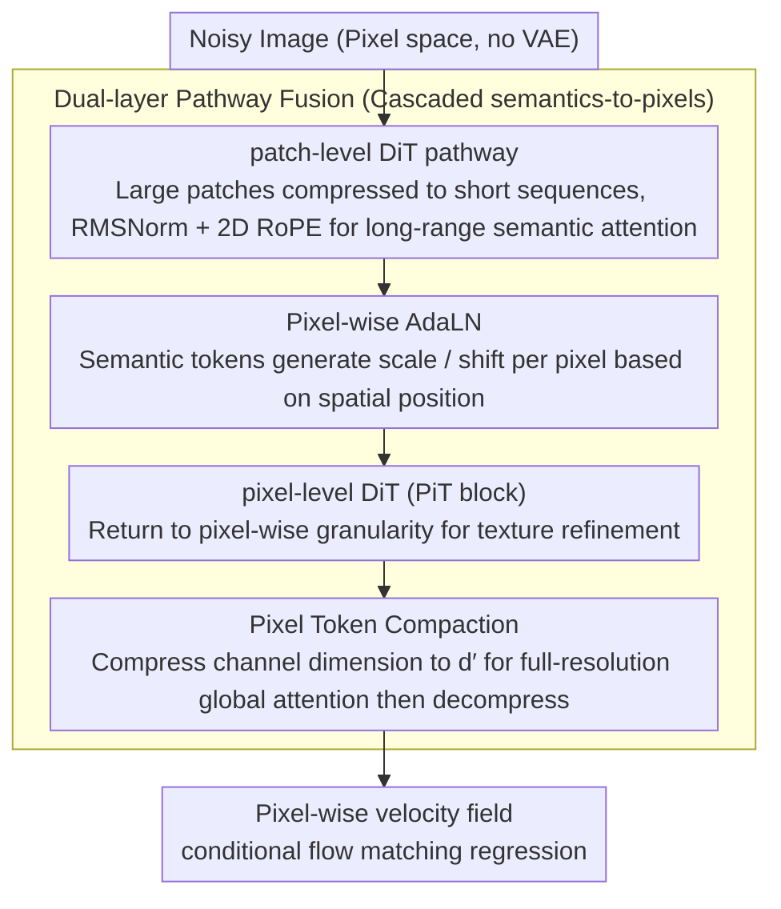

# PixelDiT: Pixel Diffusion Transformers for Image Generation

**Conference**: CVPR 2026  
**arXiv**: [2511.20645](https://arxiv.org/abs/2511.20645)  
**Code**: [https://github.com/](https://github.com/)  
**Area**: Image Generation  
**Keywords**: Pixel Diffusion, Dual-layer Transformer, End-to-end Generation, Pixel Modeling, Text-to-Image

## TL;DR
PixelDiT proposes a dual-layer pixel-space diffusion model based entirely on Transformers: a patch-level DiT captures global semantics and a pixel-level DiT refines texture details. Without a VAE, it achieves 1.61 FID on ImageNet and allows direct training of text-to-image models in 1024 resolution pixel space.

## Background & Motivation
1. **Background**: Latent diffusion is the standard paradigm for DiTs, but it relies on pre-trained autoencoders which introduce lossy reconstruction, limiting sampling fidelity and hindering joint optimization.
2. **Limitations of Prior Work**: Pixel-space diffusion faces the core challenge of pixel modeling—the need to simultaneously handle global semantics and high-frequency details. Aggressive patchification loses details, while small patches or long sequences lead to computational explosion.
3. **Key Challenge**: Lack of an efficient pixel modeling mechanism capable of capturing both global semantics and pixel-wise updates.
4. **Goal**: Design a pure Transformer pixel-space diffusion model with explicit structured pixel modeling.
5. **Key Insight**: Decouple semantic learning and pixel-level updates into two levels, processed by Transformers of different granularities.
6. **Core Idea**: A patch-level pathway performs long-range semantic attention (coarse-grained), while a pixel-level pathway performs dense pixel-wise modeling (fine-grained), connected via pixel-wise AdaLN and token compaction.

## Method

### Overall Architecture
PixelDiT aims to perform diffusion directly in pixel space without the aid of a VAE. The difficulty lies in requiring a single Transformer to both perceive global semantics and characterize pixel-wise high-frequency textures, two tasks with opposing requirements for token granularity. The solution decouples these tasks into two independent pathways: first, a patch-level DiT pathway segments the image into large patches and compresses them into short sequences to perform long-range attention on a low-resolution grid, specializing in global layout and semantics; second, a pixel-level DiT (referred to as a PiT block) returns to pixel-wise granularity, using the semantic output from the first pathway as a condition to refine textures and predict the final pixel-wise velocity field. The two pathways are linked through pixel-wise AdaLN (allowing semantics to modulate each pixel by spatial position) and token compaction (making pixel-level global attention computationally feasible).

### Key Designs

**1. Pixel-wise AdaLN: Spatially adaptive semantic modulation per pixel**

Standard DiT AdaLN uses a global condition (e.g., timestep) to generate a uniform scale/shift for the entire image. However, in pixel space, different locations require entirely different semantic guidance—modulation for sky regions should differ from that of a face. PixelDiT generates modulation parameters from the semantic tokens output by the patch-level pathway: each pixel token receives a unique scale and shift based on its corresponding spatial semantic token, followed by a LayerNorm affine transformation. Consequently, semantic information is injected adaptively by space rather than broadcast as a global bias, allowing the patch-level layout to "land" accurately on corresponding pixels.

**2. Pixel Token Compaction: Dimensional compression instead of quantity reduction for feasible pixel-wise attention**

The challenge of pixel-wise modeling is the sheer volume of tokens—a $256 \times 256$ resolution results in 65,536 pixel tokens. Applying global attention directly causes complexity to explode quadratically with sequence length. Common practices use downsampling to reduce token count, but this loses spatial resolution, contradicting the purpose of pixel modeling. PixelDiT compromises by compressing the dimension rather than the count: before entering global attention, a linear projection compresses the channel dimension of each pixel token to a lower $d'$. After computing attention on low-dimensional tokens, another linear layer restores them to the original dimension. The number of tokens (spatial resolution) remains intact, saving computation by reducing feature width and making full-resolution global attention feasible for the first time.

**3. Dual-layer pathway fusion: Concentrating semantic reasoning at low resolution to reduce pixel-level load**

The two pathways are not parallel but cascaded (semantics first, pixels second). The patch-level pathway consists of $N$ enhanced DiT blocks using RMSNorm and 2D RoPE to complete most semantic reasoning on short sequences. The PiT blocks in the pixel-level pathway take its output as a semantic condition, utilizing the two mechanisms above (pixel-wise AdaLN for semantic injection + compaction attention for global interaction) to generate pixel-wise velocity predictions. This design ensures expensive global semantic reasoning runs only once on a low-resolution grid, while the pixel-level pathway merely supplements texture onto the existing semantic skeleton, leading to better overall overhead and convergence speed compared to a single pathway handling both tasks.

### Loss & Training
The training objective is the standard conditional flow matching loss, regressing the velocity field directly in pixel space without any latent space. The text-to-image version replaces the patch-level pathway with multi-modal DiT blocks to incorporate text conditions; the rest of the architecture remains unchanged, enabling end-to-end training of T2I models directly at 1024 resolution pixels.

## Key Experimental Results

### Main Results

| Method | Type | FID↓ (256) | FID↓ (512) | Notes |
|------|------|-----------|-----------|------|
| PixelDiT | Pixel | 1.61 | 1.81 | Pixel space SOTA |
| DeCo | Pixel | 1.62 | 2.22 | Frequency decoupling method |
| DiT-XL/2 | Latent | 2.27 | - | Requires VAE |
| PixelFlow | Pixel | - | - | Hierarchical method |

### Ablation Study

| Config | Key Metric | Notes |
|------|---------|------|
| Pixel-wise AdaLN | Better than global AdaLN | Spatially adaptive modulation is effective |
| Token Compaction | Better than no compression | Makes global attention feasible |
| Dual-layer vs Single-layer | Dual-layer significantly better | Decoupled design is crucial |

### Key Findings
- PixelDiT achieves the lowest FID among pixel-space models, proving that pure Transformer architectures work efficiently in pixel space.
- Pixel-space models naturally avoid VAE reconstruction artifacts in image editing tasks, maintaining backgrounds more effectively.
- T2I models can be trained directly at 1024 resolution in pixel space, achieving 0.74 on GenEval and 83.5 on DPG-Bench.

## Highlights & Insights
- **Complete End-to-End**: A pure Transformer architecture without VAE is the most concise generation pipeline.
- **Token Compaction** is a practical engineering innovation: dimensional compression rather than spatial downsampling preserves full spatial resolution.
- Proved that pixel-space diffusion can approach or even surpass latent-space diffusion across all metrics.

## Limitations & Future Work
- Training costs remain higher compared to LDMs.
- Text-to-image benchmark scores are slightly lower than those of the best LDMs (e.g., FLUX).
- Future work could incorporate more advanced training techniques to further close the gap.

## Related Work & Insights
- **vs DeCo**: DeCo uses an attention-free linear decoder, while PixelDiT uses PiT blocks with attention. The logic is similar, but implementation differs.
- **vs PixNerd**: Uses Neural Field layers to predict pixel velocity; PixelDiT follows a more standard pure Transformer approach.

## Rating
- Novelty: ⭐⭐⭐⭐ Dual-layer pixel Transformer design is novel but parallel to DeCo.
- Experimental Thoroughness: ⭐⭐⭐⭐⭐ Validated across ImageNet, T2I, and editing tasks.
- Writing Quality: ⭐⭐⭐⭐ Detailed and clear architectural descriptions.
- Value: ⭐⭐⭐⭐ Promotes pixel diffusion as a viable paradigm again.

<!-- RELATED:START -->

## Related Papers

- [\[CVPR 2026\] DeCo: Frequency-Decoupled Pixel Diffusion for End-to-End Image Generation](deco_frequency-decoupled_pixel_diffusion_for_end-to-end_image_generation.md)
- [\[CVPR 2026\] FlashDecoder: Real-Time Latent-to-Pixel Streaming Decoder with Transformers](flashdecoder_real-time_latent-to-pixel_streaming_decoder_with_transformers.md)
- [\[CVPR 2026\] Circuit Mechanisms for Spatial Relation Generation in Diffusion Transformers](circuit_mechanisms_for_spatial_relation_generation_in_diffusion_models.md)
- [\[CVPR 2026\] DiP: Taming Diffusion Models in Pixel Space](dip_taming_diffusion_models_in_pixel_space.md)
- [\[CVPR 2026\] Region-Adaptive Sampling for Diffusion Transformers](region-adaptive_sampling_for_diffusion_transformers.md)

<!-- RELATED:END -->
