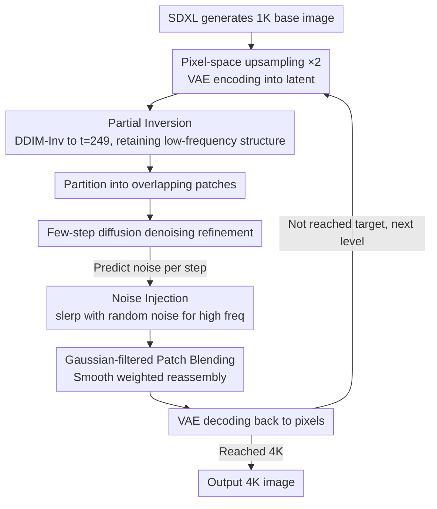

# PixelRush: Ultra-Fast, Training-Free High-Resolution Image Generation via One-step Diffusion

**Conference**: CVPR 2026  
**arXiv**: [2602.12769](https://arxiv.org/abs/2602.12769)  
**Code**: None  
**Area**: Image Generation / Diffusion Model Acceleration  
**Keywords**: Training-free high-resolution generation, patch-based inference, partial inversion, few-step diffusion, Gaussian mixture  

## TL;DR

The first method to bring training-free high-resolution generation into the practical stage—by employing a partial inversion strategy to make few-step diffusion models viable for patch refinement, it generates 4K images in 20 seconds, representing a $10 \times$ to $35 \times$ speedup over existing methods with superior quality.

## Background & Motivation

**Background**: Pre-trained diffusion models (e.g., SDXL) can only generate high-quality images at their native resolution; super-resolution inference leads to severe object repetition and texture artifacts. Training-free high-resolution methods (DemoFusion, FreeScale, etc.) address this via patch-based or frequency-domain interventions.

**Limitations of Prior Work**: Existing solutions rely on complete 50-step reverse diffusion—making the generation of a 4K image take 5–10 minutes, which is entirely impractical.

**Key Challenge**: The root of the speed bottleneck is the redundant "full-noise to full-reverse" design. The authors observed that the reverse process of high-resolution refinement also follows frequency-hierarchical reconstruction: low-frequency global structures form early, while high-frequency details are synthesized late. Since a coarse upsampled image already contains complete low-frequency structures, starting reconstruction from pure noise is computationally redundant.

**Key Insight**: Directly truncating steps introduces new problems: the massive updates of few-step models lead to severe patch boundary artifacts and over-smoothing. Therefore, a complete suite of solutions is needed to overcome these side effects.

## Method

### Overall Architecture

PixelRush addresses the pain point that training-free high-resolution generation is too slow. Its overall workflow consists of two stages—first generating a base image at native resolution using SDXL, then performing cascaded upsampling, doubling the resolution at each level. Each level involves a fixed cycle: upsampling the image in pixel space, encoding it into latent space via VAE, refining it with PixelRush, and decoding it back to pixels as input for the next level.

The innovation is focused on the "refinement" stage, utilizing few-step (or even 1-step) diffusion models. The following three designs are coupled sequentially to suppress boundary artifacts and over-smoothing.

### Key Designs

**1. Partial Inversion: The Prerequisite for Few-step Refinement**

To eliminate redundancy in the 50 steps, the authors utilize the observation that low-frequency structures are already present in the upsampled latent. PixelRush uses DDIM inversion to perturb the coarse latent only to an intermediate timestep $t=249$, preserving existing structures, before starting denoising:

$$z_t = \text{DDIM-Inv}(z_0,\, t=249), \quad t \ll 999$$

This truncation reduces computation by approximately 75%. Crucially, the "large update" characteristic of few-step models, normally a disadvantage, becomes suitable for this short trajectory where only high-frequency details remain to be filled.

**2. Gaussian-filtered Patch Blending: Eliminating Few-step Seams**

High-resolution images must be processed as overlapping patches. In many-step refinement, discrepancies in overlap regions are minimal; however, with few-step models, large updates cause irreconcilable differences, leading to checkerboard artifacts. PixelRush applies Gaussian blurring to the binary masks of overlapping regions to create a continuous weight map that decays from the center. Patches are blended using these soft weights in latent space, smoothing hard boundaries into gradients.

**3. Noise Injection: Compensating for Over-smoothing**

Few-step models inherently tend to output over-smoothed results. PixelRush counteracts this by injecting random noise into each predicted noise component using spherical linear interpolation (slerp):

$$\epsilon' = \text{slerp}(\epsilon_\theta,\, \epsilon_{rand},\, 0.95)$$

This random component "flattens" the data distribution, forcing the model to synthesize more high-frequency details and resulting in sharper textures. This technique is specifically effective for few-step models, as noise accumulation would degrade multi-step models.

### Loss & Training

Ours is entirely training-free. It uses pre-trained SDXL for base generation and distilled SDXL-Turbo for few-step refinement during inference.

## Key Experimental Results

### Main Results

| Method | 2K FID↓ | 2K Time | 4K FID↓ | 4K Time |
|------|---------|--------|---------|--------|
| SDXL-DI | 73.34 | 28s | 153.53 | 247s |
| DemoFusion | 68.46 | 75s | 74.75 | 507s |
| FreeScale | 52.87 | 53s | 58.28 | 323s |
| **PixelRush** | **50.13** | **4s** | **54.67** | **20s** |

### Ablation Study

| Configuration | FID | Time | Description |
|------|-----|------|------|
| Full noise + 50 steps | 54.70 | 49s | Baseline |
| Partial Inversion + 15 steps | 52.90 | 13s | $3.7\times$ speedup, quality improves |
| + Few-step model (1 step) | 57.23 | 4s | Ultra-fast but introduces artifacts |
| + Gaussian Blending | 56.16 | 4s | Eliminates checkerboard artifacts |
| + Noise Injection | 50.13 | 4s | Eliminates smoothing, optimal quality |

### Key Findings

- The four techniques sequentially address artifacts introduced by the step before, achieving optimal speed and quality simultaneously.
- An inversion depth of $K=249$ is optimal; larger $K$ values degrade FID.
- 25% versus 50% overlap shows negligible quality difference but allows for a reduction in patch count for further acceleration.

## Highlights & Insights

- The core insight is remarkably clear: coarse images already possess low-frequency structures $\rightarrow$ no need for full-noise reconstruction $\rightarrow$ partial inversion naturally adapts to few-step models. The logic chain of the four components is complete, with each serving as a necessary fix for the former to create a closed loop.

## Limitations & Future Work

- Dependency on the distillation quality of SDXL-Turbo.
- Lack of temporal consistency guarantees for frame-by-frame video application.
- Compatibility with Transformer-based diffusion architectures is not yet verified.
- Fixed noise injection coefficients; different content might benefit from adaptive values.

## Related Work & Insights

- **vs DemoFusion**: DemoFusion uses full noise and 50 steps, often leading to object repetition. PixelRush uses DDIM inversion and 1-step refinement, being faster and higher quality.
- **vs FreeScale**: Frequency-domain operations often introduce unnatural textures; PixelRush operates purely in the spatial/latent domain.

## Rating

- Novelty: ⭐⭐⭐⭐ The combination of partial inversion and few-step models is novel; components are simple but combined elegantly.
- Experimental Thoroughness: ⭐⭐⭐⭐⭐ Dual resolutions, multiple metrics, and extensive ablations.
- Writing Quality: ⭐⭐⭐⭐⭐ Fluent narrative that guides the reader through the necessity of each component.
- Value: ⭐⭐⭐⭐⭐ $10 \times$ to $35 \times$ acceleration, achieving practical usability for the first time.

<!-- RELATED:START -->

## Related Papers

- [\[CVPR 2026\] Training-free, Perceptually Consistent Low-Resolution Previews with High-Resolution Image for Efficient Workflows of Diffusion Models](training-free_perceptually_consistent_low-resolution_previews.md)
- [\[CVPR 2026\] DBMSolver: A Training-free Diffusion Bridge Sampler for High-Quality Image-to-Image Translation](dbmsolver_a_training-free_diffusion_bridge_sampler_for_high-quality_image-to-ima.md)
- [\[CVPR 2026\] DUO-VSR: Dual-Stream Distillation for One-Step Video Super-Resolution](duo-vsr_dual-stream_distillation_for_one-step_video_super-resolution.md)
- [\[CVPR 2026\] Training-free Mixed-Resolution Latent Upsampling for Spatially Accelerated Diffusion Transformers](training-free_mixed-resolution_latent_upsampling_for_spatially_accelerated_diffu.md)
- [\[CVPR 2026\] DiT360: High-Fidelity Panoramic Image Generation via Hybrid Training](dit360_high-fidelity_panoramic_image_generation_via_hybrid_training.md)

<!-- RELATED:END -->
