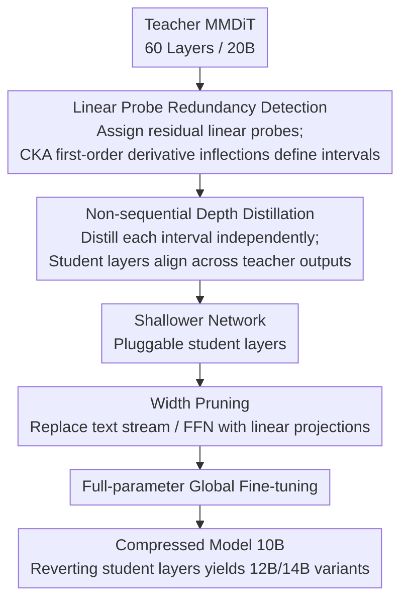

# Pluggable Pruning with Contiguous Layer Distillation for Diffusion Transformers

**Conference**: CVPR 2026  
**arXiv**: [2511.16156](https://arxiv.org/abs/2511.16156)  
**Code**: [https://github.com/OPPO-Mente-Lab/Qwen-Image-Pruning](https://github.com/OPPO-Mente-Lab/Qwen-Image-Pruning)  
**Area**: Diffusion Models / Model Compression  
**Keywords**: Diffusion Transformer Pruning, MMDiT Compression, Contiguous Layer Distillation, Pluggable Inference, Structured Pruning

## TL;DR

This work proposes the PPCL framework, which detects contiguous redundant layer intervals in MMDiT using linear probes and implements depth pruning (pluggable) and width pruning (replacing text streams/FFNs with linear projections) via non-sequential distillation. It compresses Qwen-Image from 20B to 10B with only a 3.29% performance drop.

## Background & Motivation

**Background**: Diffusion Transformers (DiT) have become the mainstream architecture for text-to-image generation. Models like SD3.5, FLUX.1, and Qwen-Image significantly outperform previous U-Net methods in image quality and text alignment. However, parameter counts have surged from SDXL's 2.6B to Qwen-Image's 20B, leading to high inference costs.

**Limitations of Prior Work**: Existing structured pruning methods face three key limitations: (a) incompatibility with MMDiT (Multi-Modal DiT) architectures; (b) poor flexibility in layer pruning, lacking support for pluggable configurations; (c) insufficient understanding of inter-layer dependencies in deep diffusion models.

**Key Challenge**: Extensive experiments on Qwen-Image (60-layer MMDiT) revealed two phenomena—randomly removing 1-3 layers has minimal impact on generation quality (high redundancy), and **contiguous removal** consistently outperforms **non-contiguous removal**. This suggests redundancy is characterized by depth-wise continuity, yet efficiently detecting these contiguous redundant intervals remains an open problem.

**Goal**: (a) Maximize the identification of contiguous redundant layer subsets; (b) avoid layer-wise error propagation during post-pruning distillation; (c) achieve pluggable, training-free deployment under varying compression rates.

**Key Insight**: Representation evolution in teacher models does not proceed uniformly but in stages—layer activations within the same stage transition smoothly and can be approximated by linear functions. When a layer's input-output mapping can be fitted by a linear probe, it is functionally redundant relative to adjacent layers.

**Core Idea**: Use linear probes combined with the convexity/concavity changes of CKA first-order derivatives to detect contiguous redundant intervals. Non-sequential distillation breaks the error propagation chain, followed by lightweight linear projections for width pruning to achieve pluggable DiT compression.

## Method

### Overall Architecture

PPCL aims to compress large MMDiTs (e.g., 60-layer Qwen-Image 20B) while maintaining generation quality and allowing weights to scale flexibly according to computational budgets. The process is decoupled into two orthogonal steps: cutting contiguous redundant layers along the **depth** and replacing over-parameterized parts of the text stream or FFN with lightweight linear projections along the **width**.

Depth pruning involves three phases: "Detection," "Pruning," and "Global Fine-tuning." Each teacher layer is assigned a linear probe to determine which contiguous intervals can be replaced by linear mappings (identifying the set of contiguous redundant intervals $\mathcal{I}$). Independent distillation is then performed for each interval, where a single student layer replicates the functionality of the entire segment. Width pruning is applied to the resulting shallower network, followed by a brief full-parameter fine-tuning to smooth the overall architecture. Key designs focus on the continuous nature of redundancy and the use of independent distillation to prevent cumulative depth-wise errors.

### Key Designs

**1. Linear Probe Redundancy Detection: Identifying intervals replaceable by a single linear mapping**

Directly deleting layers to observe quality drops is slow and fails to identify "blocks" of redundancy. PPCL assigns a linear probe $l_i$ with a residual structure to each teacher layer $T_i$. Initial values $W_i^*$ are obtained via closed-form least squares, followed by training to fit the layer's actual input-output mapping:

$$\mathcal{L}_{fit}(i) = \|l_i(T_{i-1}^D) + T_{i-1}^D - T_i(T_{i-1}^D)\|_2^2 .$$

Crucially, probes are trained using the actual inputs $T_{i-1}^D$ received by that layer in the original network, ensuring independent modeling. Inference is performed on a calibration set by replacing layers $u{+}1$ to $k$ with linear probes to create a surrogate model $T^{[u\to k]}$, monitoring the CKA similarity between the surrogate and original representations. Boundaries are determined by the first-order derivative of CKA:

$$\Delta(u,k) = -\big(\text{cka}(u,k) - \text{cka}(u,k-1)\big),$$

When $\Delta$ decreases and then rises (inflection point), the "linear substitution" benefit is exhausted, marking the interval's end. This identifies contiguous blocks because stacked linear transformations remain linear; if individual layers are linear-fit, the replaceability propagates through the depth.

**2. Non-sequential Depth Distillation: Independent training to cut off error propagation**

Traditional distillation proceeds layer-by-layer, which amplifies errors. PPCL initializes a student layer $S^u_{init}$ using teacher weights $T_u$ and uses the **actual output of teacher layer $u{-}1$** as the student input. The student is optimized to bridge the entire segment and align with the output of teacher layer $v$:

$$\mathcal{L}_{depth}^{[u,v]} = \|\text{Norm}(S^u_{init}(T_{u-1}^D)) - \text{Norm}(T_v^D)\|_2^2 ,$$

where Norm denotes L2 normalization to emphasize directional alignment. Since segments are independent of prior student outputs, the error chain is broken. This also enables "pluggable" inference: replacing student segments with original teacher layers yields 12B or 14B variants from a single 10B model without retraining.

**3. Width Pruning: Replacing width redundancy with linear projections**

After depth pruning, internal over-parameterization remains, particularly in the text stream of MMDiT. CKA heatmaps show high similarity and minimal change in text stream representations across layers. PPCL replaces the redundant text stream (keeping QKV projections) with lightweight linear projections $l_p^z, l_p^h$. For FFN redundancy, image and text stream FFNs are replaced by linear projections $l_q^{img}, l_q^{txt}$. Distillation constrains both the final layer output ($\mathcal{L}_{width}^j$) and the output of the substituted module ($\mathcal{L}_{linear}^j$).

### Loss & Training

- **Three-stage Training**: Depth distillation for 6k steps (8×H20 GPU, micro-batch=2) → Width distillation for 2k steps → Full fine-tuning for 1k steps (micro-batch=4).
- **Training Data**: 100k images sampled from LAION-2B-en, captions generated by Qwen2.5-VL, training pairs generated by Qwen-Image.
- **Optimizer**: AdamW ($\beta_1$=0.9, $\beta_2$=0.95, weight decay=0.02), BF16 mixed precision + gradient checkpointing.

## Key Experimental Results

### Main Results

Comparison against multiple compression methods on FLUX.1-dev and Qwen-Image:

| Model | Method | Params(B) | Latency(ms) | Avg Performance Drop(%) |
|------|------|-----------|----------|----------------|
| FLUX.1-dev | Original | 12 | 715 | 0 |
| FLUX.1-dev | TinyFusion | 8 | 534 | 13.80 |
| FLUX.1-dev | HierarchicalPrune | 8 | 543 | 13.38 |
| FLUX.1-dev | **PPCL(8B)** | 8 | 535 | **4.03** |
| FLUX.1 Lite | **PPCL(6.5B)** | 6.5 | 428 | **0.07** |
| Qwen-Image | Original | 20 | 2625 | 0 |
| Qwen-Image | TinyFusion | 14 | 1789 | 8.75 |
| Qwen-Image | HierarchicalPrune | 14 | 1786 | 6.49 |
| Qwen-Image | **PPCL(14B)** | 14 | 1792 | **0.42** |
| Qwen-Image | **PPCL(10B+FT)** | 10 | 1462 | **3.29** |

### Ablation Study

Incremental evaluation on Qwen-Image (removing 25 layers):

| Configuration | LongText | DPG | GenEval | Avg | Params(B) | Drop(%) |
|------|----------|-----|---------|------|---------|---------|
| Original | 0.942 | 0.885 | 0.854 | 0.894 | 20 | 0 |
| Baseline (CKA Sensitivity + Seq Distill) | 0.625 | 0.763 | 0.728 | 0.706 | 12 | 18.2 |
| +LP (Linear Probe Detection) | 0.712 | 0.795 | 0.776 | 0.761 | 12 | 14.5 |
| +DP (Non-sequential Distill) | 0.905 | 0.836 | 0.801 | 0.848 | 12 | 5.22 |
| +WP-text (Text Stream → Linear) | 0.915 | 0.846 | 0.819 | 0.860 | 11 | 3.79 |
| +WP-ffn (FFN → Linear) | 0.906 | 0.835 | 0.809 | 0.850 | 10 | 4.91 |
| +Fine-tuning | 0.916 | 0.867 | 0.828 | 0.870 | 10 | **2.61** |

### Key Findings

- **Contiguous vs. Non-contiguous**: Experiments on Qwen-Image removing 1-3 layers prove contiguous removal is superior, supporting the contiguous redundancy hypothesis.
- **Non-sequential Distillation Contribution**: The average score jumped from 0.706 to 0.848 (+14.2 points) when adding DP, identifying the error chain break as the core factor.
- **Pluggable Flexibility**: A single 10B model can be converted to 12B or 14B variants by swapping segments without further training.
- **Effectiveness on Compressed Models**: Pruning an additional 1.5B from the already compressed FLUX.1 Lite (8B) resulted in only a 0.07% drop.
- **50% Compression Performance**: Qwen-Image 20B→10B achieved a 2x speedup and a 33% reduction in GPU VRAM usage.

## Highlights & Insights

- The **discovery of contiguous redundancy** is the pivotal observation—redundancy is not randomly distributed but exists in functional units that can be replaced as blocks.
- The **Linear Probe + CKA Derivative** strategy is lightweight: probes are single linear layers, training is independent/parallelizable, and detection requires only one calibration pass.
- **Non-sequential Distillation** elegantly supports pluggable deployment and multi-rate compression, enhancing practical industrial utility.
- **Dual-axis Compression** leverages MMDiT architectural traits (higher text stream redundancy) for architecture-aware pruning.
- The total training cost is low (9k total steps on 8 GPUs), making it an efficient alternative to full retraining.

## Limitations & Future Work

- **Heuristic Inflection Detection**: The CKA first-order derivative approach is an empirical engineering success but lacks rigorous theoretical grounding.
- **INT4 Incompatibility**: Pruning reduces architectural redundancy, narrowing the tolerance for quantization; INT4 quantization currently yields suboptimal results.
- **Scope**: Evaluation was limited to T2I tasks; effectiveness on video DiT models remains unexplored.
- **Calibration Dependency**: Detection depends on the calibration set; robustness across different sets requires verification.

## Related Work & Insights

- **TinyFusion** (CVPR 2025): Uses differentiable gates for layer selection but offers limited compression ratios.
- **HierarchicalPrune**: Prunes based on hierarchical positions but uses coarser importance metrics.
- **Dense2MoE**: Replaces FFNs with MoE to lower activation costs without reducing total parameters.
- Core Insight: **Structured pruning must align with architecture**—MMDiT's dual-stream design and inter-layer similarity provide specific compression opportunities.

## Rating

| Dimension | Score (1-10) | Explanation |
|------|-------------|------|
| Novelty | 7 | Original contiguous redundancy detection and pluggable distillation. |
| Technical Depth | 7 | Strong CKA analysis, though some heuristics lack theoretical proofs. |
| Experimental Thoroughness | 8 | Validated on multiple large-scale models across various benchmarks. |
| Practical Value | 9 | Low training cost, high compression ratio, and pluggable deployment. |
| Writing Quality | 7 | Clear structure, though notation density is high. |
| **Total Score** | **7.6** | An efficient, practically-focused compression scheme for MMDiT. |

<!-- RELATED:START -->

## Related Papers

- [\[CVPR 2026\] Region-Adaptive Sampling for Diffusion Transformers](region-adaptive_sampling_for_diffusion_transformers.md)
- [\[CVPR 2026\] ResCa: Residual Caching for Diffusion Transformers Acceleration](resca_residual_caching_for_diffusion_transformers_acceleration.md)
- [\[CVPR 2026\] SpotEdit: Selective Region Editing in Diffusion Transformers](spotedit_selective_region_editing_in_diffusion_transformers.md)
- [\[CVPR 2026\] PixelDiT: Pixel Diffusion Transformers for Image Generation](pixeldit_pixel_diffusion_transformers_for_image_generation.md)
- [\[CVPR 2026\] From Inpainting to Layer Decomposition: Repurposing Generative Inpainting Models for Image Layer Decomposition](from_inpainting_to_layer_decomposition_repurposing_generative_inpainting_models_.md)

<!-- RELATED:END -->
