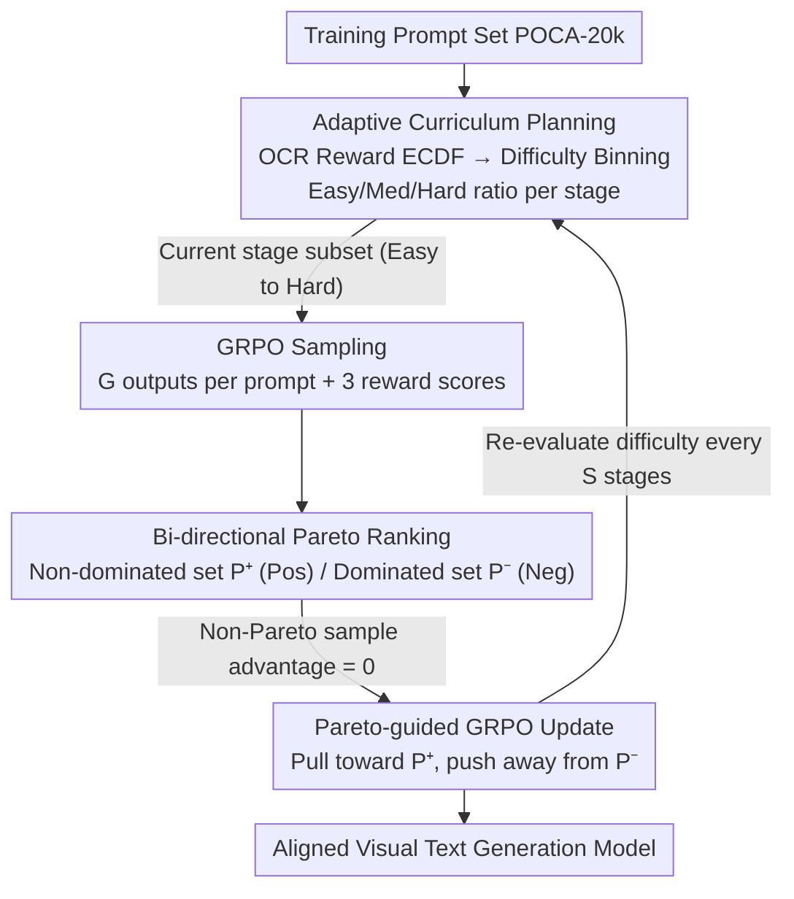

# POCA: Pareto-Optimal Curriculum Alignment for Visual Text Generation

**Conference**: CVPR 2026  
**arXiv**: [2604.24171](https://arxiv.org/abs/2604.24171)  
**Code**: None  
**Area**: Image Generation / Visual Text Generation / Reinforcement Learning Alignment  
**Keywords**: Visual Text Generation, GRPO, Pareto Optimality, Multi-Reward Alignment, Curriculum Learning

## TL;DR
Addressing the conflict between "text accuracy" and "overall image harmony/aesthetics" in visual text generation, POCA reformulates GRPO multi-reward alignment as a multi-objective optimization problem. It utilizes bi-directional Pareto ranking in the joint reward space to select non-dominated (good) and dominated (poor) samples as positive and negative signals. Combined with an adaptive curriculum based on the ECDF of OCR rewards to arrange training data from "easy to difficult," it simultaneously improves Sen.ACC, CLIP, and HPS on the AnyText-benchmark.

## Background & Motivation
**Background**: Visual text generation aims to render clear and correct text within images. Controllable generation methods (e.g., GlyphControl, AnyText, FLUX-Text) improve rendering precision by injecting auxiliary conditions like glyphs and positions. Meanwhile, reinforcement learning post-training (especially group-relative methods like GRPO) is used to further align base models using multiple rewards such as prompt alignment, aesthetics, and OCR accuracy.

**Limitations of Prior Work**: Satisfying both "text auxiliary conditions" and "overall image quality" instructions in a single generation involves an inherent trade-off—improving text rendering accuracy often degrades aesthetics and instruction-following capability. Empirical analysis by the authors shows that reward signals like OCR and CLIP often **conflict** in visual text generation (occurring in approximately 50 out of 100 training samples). Existing RL methods aggregate multiple rewards into a scalar via **weighted-sum**, which mixes these conflicting signals, blurs the optimization objective, and causes GRPO training to be unstable or converge to sub-optimal solutions.

**Key Challenge**: ① Conflicts between multiple rewards mean that scalarization loses information about which samples represents a truly good compromise, and reward weights are extremely difficult to tune. ② RL requires selecting a training prompt set—too much data makes training slow and expensive, while too little leads to poor learning. Furthermore, multi-reward optimization requires mixtures of prompts with different domain biases, which complicates the optimization landscape and slows convergence. Determining which prompts to select and in what order to present them remains an open problem.

**Goal**: To find the best compromise state under multiple conflicting rewards without weight tuning, while efficiently selecting and organizing training prompts to enable stable and rapid RL convergence even with limited data.

**Key Insight**: Treat multi-reward alignment as **multi-objective optimization** rather than scalarization. The solution to conflicting objectives is Pareto optimality (where one objective cannot be improved without harming another). Each generated text image represents a specific trade-off in the reward space; samples that are both text-accurate and aesthetically pleasing are Pareto-optimal (non-dominated) samples toward which the model should be pushed. Furthermore, inspired by human learning paths, curriculum learning is used to arrange data from easy to difficult.

**Core Idea**: Replace "weighted-sum + static dataset" with "bi-directional Pareto ranking for sample selection + adaptive curriculum based on OCR difficulty." This directly identifies optimal trade-off samples in a unified reward space to serve as positive/negative signals for GRPO, training on an easy-to-difficult optimization landscape.

## Method

### Overall Architecture
POCA is a two-stage synergistic framework built upon GRPO. It aligns visual text generation models using multiple rewards (CLIP for prompt alignment, HPS for aesthetics, and OCR for text accuracy) while avoiding the instability of weighted-sum and the inefficiency of static data. The framework consists of two interlocking stages: **Curriculum Planning** assesses the difficulty of each prompt and organizes data into an "easy-to-difficult" learning sequence; this sequence is then fed into the **Training** stage, which performs **bi-directional Pareto ranking** on each group of sampled outputs. Only the Pareto sets (non-dominated set for positive signals and dominated set for negative signals) are used to update the policy, while the advantage of other samples is set to zero and excluded from gradients.

In a specific round: Given the same original prompt and text conditions, a group of $G$ outputs is sampled. Three reward models score each image to produce a $K$-dimensional reward vector. Bi-directional Pareto ranking identifies the non-dominated set $\mathcal{P}^+$ (optimal trade-offs) and the dominated set $\mathcal{P}^-$ (clearly inferior trade-offs) within this joint reward space. GRPO increases the generation probability for the former and decreases it for the latter. The entire process is wrapped in an adaptive curriculum: the difficulty of the full dataset is re-evaluated using the current policy at intervals to dynamically determine the prompt batch for the current stage.

### Key Designs

**1. Bi-directional Pareto Ranking: Eliminating Conflicting Signals**

To address the instability caused by mixing conflicting rewards (OCR, CLIP, etc.) via weighted-sum, POCA performs ranking based on dominance relationships within each GRPO group ($G$ sampled outputs). For an output $\mathbf{o}$ with a $K$-dimensional reward vector $R(\mathbf{o})=(R_1(\mathbf{o}),\dots,R_K(\mathbf{o}))$, the dominance relationship is defined as: $\mathbf{o}_1 \succeq \mathbf{o}_2$ if and only if $R_i(\mathbf{o}_1)\ge R_i(\mathbf{o}_2)$ for all $i$, and there exists at least one $j$ such that $R_j(\mathbf{o}_1)>R_j(\mathbf{o}_2)$. A sample is **non-dominated (Pareto optimal)** if no other point in the group dominates it, forming the positive set $\mathcal{P}^+$.

The "bi-directional" key: In addition to the positive set, POCA runs non-dominated ranking again using negated rewards $\{-r_i^k\}$ to obtain the **fully dominated set** $\mathcal{P}^-$—these represent clearly poor trade-off samples. By providing both the "best" and "worst" simultaneously, the model is pulled toward optimal trade-offs and pushed away from the worst ones, leading to cleaner credit assignment. This step directly removes ambiguous samples that are neither typically good nor typically bad, filtering out conflicting signals from the optimization.

**2. Pareto-guided GRPO Objective: Zeroing Non-Pareto Samples**

Once the Pareto sets are selected, POCA sets the advantage of samples not in $\mathcal{P}$ to zero, ensuring they do not contribute to gradients. Only points in $\mathcal{P}$ enter the objective function:

$$\mathcal{J}_{\mathcal{P}}(\theta)=\mathbb{E}\Bigg[\frac{1}{n(\mathcal{P})}\sum_{i\in\mathcal{P}}\frac{1}{T}\sum_{t=1}^{T}\min\Big(\rho_{t,i}A_i,\;\mathrm{clip}(\rho_{t,i},1-\epsilon,1+\epsilon)A_i\Big)\Bigg]$$

The advantage $A_i$ still follows the group-relative normalized form $A_i=\frac{r_i-\mathrm{mean}(\{r\})}{\mathrm{std}(\{r\})}$ of GRPO, but the normalization denominator is changed from $G$ to the Pareto set size $n(\mathcal{P})$. This maintains the stability of GRPO while restricting updates to "clear good trade-offs / clear bad trade-offs."

**3. Adaptive Curriculum Planning: ECDF-based Difficulty Assessment**

To improve data efficiency, POCA uses a "difficulty measurer + training scheduler." The **difficulty measurer** reuses the OCR reward model as a difficulty signal, as empirical findings show OCR rewards have the highest variance and best distinguish difficulty levels. For each prompt $\mathbf{c}$, the average OCR reward is estimated via $N$ samples from the current policy: $\mu_c=\frac{1}{N}\sum_{j=1}^{N}R_{\text{ocr}}(\mathbf{o}_{c,j})$. This is normalized into a percentile rank using the Empirical Cumulative Distribution Function (ECDF):

$$ECDF(x)=\frac{1}{|\mathcal{D}|}\sum_{\mathbf{c}'\in\mathcal{D}}\mathbf{1}(\mu_{c'}\le x)$$

$ECDF(\mu_c)\in[0,1]$ represents the relative difficulty rank (higher values are "easier"). The **training scheduler** removes the easiest and hardest outliers and sorts the data into three bins: $\mathcal{D}_{easy}$ ($ECDF\ge0.7$), $\mathcal{D}_{medium}$ ($0.3<ECDF<0.7$), and $\mathcal{D}_{hard}$ ($ECDF\le0.3$). Training is divided into $S$ stages with different mixing ratios $\mathbf{w}_s$. Typically $S=3$, with $\mathbf{w}_1=(0.6,0.3,0.1)$, $\mathbf{w}_2=(0.4,0.5,0.1)$, and $\mathbf{w}_3=(0.1,0.6,0.3)$ (Easy/Med/Hard), gradually exposing the model to harder environments. The difficulty is re-evaluated using the **current policy** at the start of each stage (self-paced).

### Loss & Training
The base model is AnyText, configured following DanceGRPO: batch size 4, 50 denoising steps, 16 samples per prompt without classifier-free guidance. LoRA with rank=128 is used. Training runs for 300 steps on POCA-20k. Three reward models are used: CLIP (ViT-B/32), EasyOCR (measuring text accuracy via NED), and HPS-v2.1 (aesthetics). POCA-20k includes 5k SynthText images for generalization, 10k AnyWord-3M images for text signals, and 5k LeX-Art posters for aesthetics, with descriptive prompts generated by Gemini 2.5.

## Key Experimental Results

### Main Results
Comparison with mainstream visual text generation methods on AnyText-benchmark († denotes author reproduction):

| Method | Lang | Sen.ACC | NED | CLIP | HPS |
|------|------|---------|-----|------|-----|
| AnyText† | EN | 0.7041 | 0.8827 | 0.8827 | 0.2624 |
| AnyText2† (Prev. SOTA) | EN | 0.8122 | 0.9194 | 0.8941 | 0.2497 |
| GRPO baseline (Weighted) | EN | 0.7246 | 0.8935 | 0.8970 | 0.2708 |
| **Ours (POCA)** | EN | **0.7651** | **0.8983** | **0.8985** | 0.2694 |
| AnyText† | ZH | 0.6452 | 0.8181 | 0.8022 | 0.2588 |
| AnyText2† (Prev. SOTA) | ZH | 0.7171 | 0.8488 | 0.8102 | 0.2486 |
| GRPO baseline | ZH | 0.6782 | 0.8663 | 0.8138 | 0.2668 |
| **Ours (POCA)** | ZH | 0.6942 | **0.8696** | **0.8170** | 0.2653 |

Key takeaways: POCA improves all metrics relative to the AnyText base. It outperforms the previous SOTA (AnyText2) in CLIP and HPS, noting that AnyText2 has a significantly lower HPS (0.2497), suggesting it sacrifices aesthetics for text accuracy. Compared to the GRPO weighted-sum baseline, POCA achieves better text accuracy and CLIP scores, indicating that Pareto selection finds superior trade-offs.

### Ablation Study
Ablation of curriculum planning strategies (AnyText-benchmark EN, 300 steps):

| Config | Sen.ACC | NED | CLIP | HPS | Note |
|------|---------|-----|------|-----|------|
| Pareto-guided (No CL, 10k) | 0.7378 | 0.8923 | 0.8996 | 0.2700 | Pareto selection only |
| POCA-1k | 0.7374 | 0.8941 | 0.8966 | 0.2678 | 1k data, high efficiency |
| POCA-5k | 0.7530 | 0.8968 | 0.8980 | 0.2682 | 5k data |
| POCA-10k (Full) | **0.7651** | **0.8983** | 0.8985 | 0.2694 | Proposed |
| POCA-one stage | 0.7572 | 0.8980 | 0.8973 | 0.2688 | No multi-stage scheduling |

### Key Findings
- **Weighted-sum is the root of instability**: Reward curves show GRPO weighted-sum converges to sub-optimal values, while Pareto-guided methods are significantly higher in OCR and CLIP. Pareto selection provides a cleaner optimization path with monotonic increases.
- **Strong data efficiency**: POCA-1k performs close to the Pareto-guided method trained on 10k, demonstrating that curriculum planning allows for effective learning even with small datasets.
- **Multi-stage is superior**: The multi-stage POCA-10k outperforms its single-stage variant, validating the value of adaptive scheduling.
- **OCR reward is an effective difficulty signal**: Its high variance across the dataset makes it ideal for distinguishing prompt difficulty.

## Highlights & Insights
- **Reformulating multi-reward alignment as multi-objective optimization**: Instead of tuning weights for OCR/CLIP/HPS, POCA selects non-dominated samples, effectively bypassing weight hyperparameter tuning.
- **Clever "bi-directional" Pareto approach**: Using negated rewards for a second Pareto ranking provides "worst-case" samples for negative signals with zero extra cost, filtering out ambiguous samples.
- **Reusing rewards for curriculum difficulty**: OCR rewards serve as both optimization targets and difficulty signals via ECDF normalization, creating a lightweight, self-paced learning environment.
- **Quantitative evidence of trade-offs**: The paper quantifies reward conflicts (50% in 100 samples), providing solid justification for why weighted-sum fails.

## Limitations & Future Work
- **Empirical curriculum hyperparameters**: Binning thresholds and mixing ratios $w_s$ are determined empirically; an automated search method is lacking.
- **Single difficulty signal**: Using only OCR rewards may not represent true difficulty for prompts where aesthetics or alignment are the primary challenges.
- **Dependence on reward models**: Biases in the underlying reward models (e.g., OCR errors on artistic fonts) directly affect Pareto selection.
- **Future directions**: Adapting binning thresholds during training and exploring more diverse joint difficulty metrics.

## Related Work & Insights
- **vs. GRPO Weighted-sum (DanceGRPO)**: POCA maintains the multi-objective structure of rewards rather than scalarizing them, avoiding sub-optimal convergence caused by conflicting signals at the cost of $O(G^2K)$ dominance comparisons.
- **vs. One-way Pareto methods**: POCA uses both positive and negative Pareto sets for more complete credit assignment.
- **vs. Traditional Curriculum Learning**: POCA is model-driven and self-paced, re-evaluating difficulty as the model evolves rather than using a static sequence.
- **vs. AnyText/AnyText2**: While those focus on condition injection, POCA manages the alignment trade-offs during post-training and is orthogonal to condition injection improvements.

## Rating
- Novelty: ⭐⭐⭐⭐ Reformulating GRPO as Pareto multi-objective optimization is well-motivated and novel.
- Experimental Thoroughness: ⭐⭐⭐⭐ Comprehensive bilingual results, ablations, and human studies.
- Writing Quality: ⭐⭐⭐⭐ Clear motivation and convincing quantification of reward conflicts.
- Value: ⭐⭐⭐⭐ The Pareto approach is applicable to general multi-reward RLHF scenarios; high data efficiency is practical for resource-constrained settings.

<!-- RELATED:START -->

## Related Papers

- [\[CVPR 2026\] Synthetic Curriculum Reinforces Compositional Text-to-Image Generation](synthetic_curriculum_reinforces_compositional_text-to-image_generation.md)
- [\[CVPR 2026\] Curriculum Group Policy Optimization: Adaptive Sampling for Unleashing the Potential of Text-to-Image Generation](curriculum_group_policy_optimization_adaptive_sampling_for_unleashing_the_potent.md)
- [\[ICML 2026\] Pareto-Guided Optimal Transport for Multi-Reward Alignment](../../ICML2026/image_generation/pareto-guided_optimal_transport_for_multi-reward_alignment.md)
- [\[CVPR 2026\] Seeing What Matters: Visual Preference Policy Optimization for Visual Generation](seeing_what_matters_visual_preference_policy_optimization_for_visual_generation.md)
- [\[CVPR 2026\] ThinkGen: Generalized Thinking for Visual Generation](thinkgen_generalized_thinking_for_visual_generation.md)

<!-- RELATED:END -->
